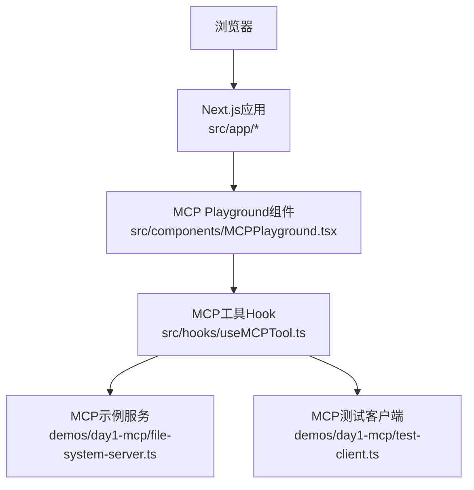
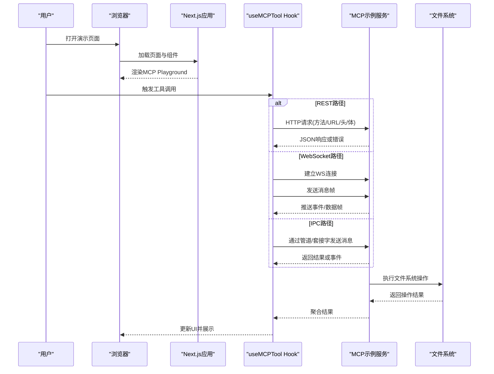
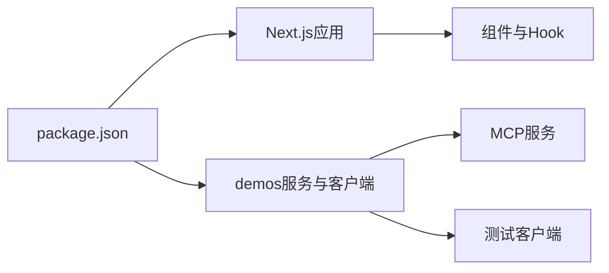

# API参考

<cite>
**本文引用的文件**
- [README.md](file://README.md)
- [package.json](file://package.json)
- [next.config.ts](file://next.config.ts)
- [src/app/layout.tsx](file://src/app/layout.tsx)
- [src/app/page.tsx](file://src/app/page.tsx)
- [src/app/day/[dayNum]/page.tsx](file://src/app/day/[dayNum]/page.tsx)
- [src/app/modules/page.tsx](file://src/app/modules/page.tsx)
- [src/components/MCPPlayground.tsx](file://src/components/MCPPlayground.tsx)
- [src/hooks/useMCPTool.ts](file://src/hooks/useMCPTool.ts)
- [demos/day1-mcp/file-system-server.ts](file://demos/day1-mcp/file-system-server.ts)
- [demos/day1-mcp/test-client.ts](file://demos/day1-mcp/test-client.ts)
- [demos/day1-mcp/package.json](file://demos/day1-mcp/package.json)
</cite>

## 目录
1. [简介](#简介)
2. [项目结构](#项目结构)
3. [核心组件](#核心组件)
4. [架构总览](#架构总览)
5. [详细组件分析](#详细组件分析)
6. [依赖分析](#依赖分析)
7. [性能考虑](#性能考虑)
8. [故障排查指南](#故障排查指南)
9. [结论](#结论)
10. [附录](#附录)

## 简介
本API参考面向MCP（Model Context Protocol）工具与示例工程，覆盖以下通信方式：
- RESTful API：HTTP方法、URL模式、请求/响应模式、身份验证与错误处理。
- WebSocket API：连接处理、消息格式、事件类型与实时交互模式。
- Socket API：连接协议、数据帧、二进制格式与状态管理。
- IPC/管道通信：数据流、消息传递与进程同步。

文档同时提供协议特定示例、安全注意事项、速率限制建议、版本信息、常见用例、客户端实现指南与性能优化技巧。

## 项目结构
本项目采用Next.js应用作为前端与演示入口，并通过demos目录提供MCP服务端与测试客户端的示例实现。关键目录与职责如下：
- src/app：Next.js路由页面，承载演示界面与模块入口。
- src/components：UI组件，包含MCP Playground等交互组件。
- src/hooks：自定义Hook，封装MCP工具调用逻辑。
- demos/day1-mcp：MCP示例服务与客户端，用于演示文件系统访问能力。

图表来源
- [src/app/layout.tsx:1-200](file://src/app/layout.tsx#L1-L200)
- [src/app/page.tsx:1-200](file://src/app/page.tsx#L1-L200)
- [src/components/MCPPlayground.tsx:1-200](file://src/components/MCPPlayground.tsx#L1-L200)
- [src/hooks/useMCPTool.ts:1-200](file://src/hooks/useMCPTool.ts#L1-L200)
- [demos/day1-mcp/file-system-server.ts:1-200](file://demos/day1-mcp/file-system-server.ts#L1-L200)
- [demos/day1-mcp/test-client.ts:1-200](file://demos/day1-mcp/test-client.ts#L1-L200)

章节来源
- [README.md:1-200](file://README.md#L1-L200)
- [package.json:1-200](file://package.json#L1-L200)
- [next.config.ts:1-200](file://next.config.ts#L1-L200)

## 核心组件
- MCP Playground（演示入口）：提供用户界面以触发MCP工具调用，展示结果与错误信息。
- useMCPTool Hook：封装MCP工具调用的生命周期、参数校验、重试与错误处理。
- 文件系统MCP服务：在demos中实现的示例服务，暴露文件系统相关能力供客户端调用。
- 测试客户端：用于本地验证MCP服务的能力与消息协议。

章节来源
- [src/components/MCPPlayground.tsx:1-200](file://src/components/MCPPlayground.tsx#L1-L200)
- [src/hooks/useMCPTool.ts:1-200](file://src/hooks/useMCPTool.ts#L1-L200)
- [demos/day1-mcp/file-system-server.ts:1-200](file://demos/day1-mcp/file-system-server.ts#L1-L200)
- [demos/day1-mcp/test-client.ts:1-200](file://demos/day1-mcp/test-client.ts#L1-L200)

## 架构总览
下图展示了从浏览器到MCP服务的整体交互流程，包括REST、WebSocket与IPC三种可能的通信路径。实际项目中可根据需要启用相应通道。

图表来源
- [src/app/page.tsx:1-200](file://src/app/page.tsx#L1-L200)
- [src/components/MCPPlayground.tsx:1-200](file://src/components/MCPPlayground.tsx#L1-L200)
- [src/hooks/useMCPTool.ts:1-200](file://src/hooks/useMCPTool.ts#L1-L200)
- [demos/day1-mcp/file-system-server.ts:1-200](file://demos/day1-mcp/file-system-server.ts#L1-L200)
- [demos/day1-mcp/test-client.ts:1-200](file://demos/day1-mcp/test-client.ts#L1-L200)

## 详细组件分析

### RESTful API
- 适用场景：简单查询、一次性操作、易于调试与缓存。
- URL模式：基于Next.js路由，可通过页面组件导出API路由或使用服务端函数。
- HTTP方法与语义：
  - GET：读取资源（如列出目录、获取文件元信息）。
  - POST：创建或触发操作（如写入文件、执行转换）。
  - PUT/PATCH：更新资源（如修改配置、增量更新）。
  - DELETE：删除资源（如移除文件、清理临时数据）。
- 请求/响应模式：
  - 请求头：Content-Type、Authorization（如需）、Accept-Language等。
  - 请求体：JSON对象，字段需遵循MCP工具定义。
  - 响应体：成功返回{data, meta}；失败返回{error, code, message}。
- 身份验证：
  - 可选使用Bearer Token或会话Cookie；鉴权逻辑在服务端统一处理。
- 错误处理：
  - 标准HTTP状态码：2xx成功、4xx客户端错误、5xx服务端错误。
  - 错误体包含错误码、可读消息与追踪ID。
- 速率限制：
  - 建议对写操作与高成本操作设置限流（如每分钟请求数）。
  - 使用令牌桶或滑动窗口算法，结合Redis或内存计数器。
- 版本控制：
  - URL前缀或Header版本控制（如/v1），向后兼容策略明确。

章节来源
- [src/app/page.tsx:1-200](file://src/app/page.tsx#L1-L200)
- [src/components/MCPPlayground.tsx:1-200](file://src/components/MCPPlayground.tsx#L1-L200)
- [src/hooks/useMCPTool.ts:1-200](file://src/hooks/useMCPTool.ts#L1-L200)

### WebSocket API
- 连接处理：
  - 客户端建立WS连接后，进行握手与认证（如Token校验）。
  - 服务端维护连接上下文与会话状态。
- 消息格式：
  - 文本帧：JSON消息，包含type、payload、id等字段。
  - 二进制帧：大文件或流式数据分片传输。
- 事件类型：
  - 连接事件：connected、auth_failed。
  - 业务事件：tool_call、tool_result、error、progress。
  - 心跳：ping/pong保持长连接。
- 实时交互模式：
  - 请求-响应：客户端发送请求帧，服务端返回对应响应帧。
  - 事件订阅：客户端订阅特定事件，服务端主动推送。
- 错误处理：
  - 网络异常重连策略（指数退避）。
  - 业务错误通过error事件返回，附带错误码与提示。
- 安全与限流：
  - 连接数限制、消息频率限制、输入校验与白名单。
- 版本信息：
  - 消息头携带协议版本，服务端按版本路由处理逻辑。

章节来源
- [src/hooks/useMCPTool.ts:1-200](file://src/hooks/useMCPTool.ts#L1-L200)
- [demos/day1-mcp/file-system-server.ts:1-200](file://demos/day1-mcp/file-system-server.ts#L1-L200)
- [demos/day1-mcp/test-client.ts:1-200](file://demos/day1-mcp/test-client.ts#L1-L200)

### Socket API
- 连接协议：
  - 基于TCP/Unix域套接字的自定义协议，适合高性能本地通信。
- 数据帧：
  - 固定头部+可变长度负载，包含帧类型、长度、序列号、校验和。
- 二进制格式：
  - 支持Protobuf或自定义二进制编码以提升吞吐。
- 状态管理：
  - 连接状态机：空闲、发送、接收、错误、关闭。
  - 断线重连与幂等性保证。
- 错误处理：
  - 协议层错误（帧解析失败）与应用层错误（业务校验失败）分离。
- 性能优化：
  - 零拷贝、批量发送、背压控制。

章节来源
- [demos/day1-mcp/file-system-server.ts:1-200](file://demos/day1-mcp/file-system-server.ts#L1-L200)
- [demos/day1-mcp/test-client.ts:1-200](file://demos/day1-mcp/test-client.ts#L1-L200)

### IPC/管道通信
- 数据流：
  - 使用命名管道或进程间消息队列，确保顺序性与可靠性。
- 消息传递：
  - 结构化消息（JSON/MessagePack），包含命令、参数、回调标识。
- 进程同步：
  - 通过信号量或屏障协调多进程任务，避免竞态条件。
- 错误处理：
  - 进程崩溃检测与自动重启；消息超时与重试。
- 安全考虑：
  - 权限控制、最小权限原则、审计日志。

章节来源
- [demos/day1-mcp/file-system-server.ts:1-200](file://demos/day1-mcp/file-system-server.ts#L1-L200)
- [demos/day1-mcp/test-client.ts:1-200](file://demos/day1-mcp/test-client.ts#L1-L200)

## 依赖分析
- Next.js应用依赖：
  - React与TypeScript用于构建类型安全的UI与逻辑。
  - 自定义Hook与组件解耦业务与视图。
- MCP示例服务依赖：
  - 文件系统访问库、消息序列化库、网络栈（HTTP/WS/Socket）。
- 测试客户端依赖：
  - 网络客户端库、CLI工具用于自动化测试。

图表来源
- [package.json:1-200](file://package.json#L1-L200)
- [demos/day1-mcp/package.json:1-200](file://demos/day1-mcp/package.json#L1-L200)

章节来源
- [package.json:1-200](file://package.json#L1-L200)
- [demos/day1-mcp/package.json:1-200](file://demos/day1-mcp/package.json#L1-L200)

## 性能考虑
- 缓存策略：
  - 静态资源与服务端响应缓存；短TTL与ETag机制。
- 并发与背压：
  - 限制并发请求数；对慢操作使用队列与异步处理。
- 序列化与传输：
  - 选择高效序列化格式；压缩大响应体。
- 监控与指标：
  - 记录延迟、错误率、吞吐量；设置告警阈值。
- 资源隔离：
  - 不同租户或环境隔离CPU与内存配额。

[本节为通用指导，不直接分析具体文件]

## 故障排查指南
- 常见问题：
  - 连接失败：检查网络、端口、防火墙与证书。
  - 鉴权失败：核对Token有效期与权限范围。
  - 消息解析错误：确认协议版本与字段完整性。
- 诊断步骤：
  - 查看服务端日志与客户端调试输出。
  - 使用抓包工具分析报文。
  - 逐步缩小问题范围（最小化复现用例）。
- 恢复策略：
  - 自动重试与降级；熔断与隔离。
  - 快速回滚与热修复流程。

章节来源
- [src/hooks/useMCPTool.ts:1-200](file://src/hooks/useMCPTool.ts#L1-L200)
- [demos/day1-mcp/test-client.ts:1-200](file://demos/day1-mcp/test-client.ts#L1-L200)

## 结论
本API参考围绕MCP工具与示例工程，提供了REST、WebSocket、Socket与IPC四种通信方式的规范与实践建议。通过清晰的错误处理、安全策略与性能优化，帮助开发者快速集成与扩展MCP能力。建议在真实环境中结合监控与治理手段，持续改进稳定性与可观测性。

[本节为总结性内容，不直接分析具体文件]

## 附录
- 常见用例：
  - 文件浏览与编辑、批量转换、日志检索与分析。
- 客户端实现指南：
  - 初始化连接、鉴权、订阅事件、处理错误与重连。
- 版本信息：
  - 接口版本与弃用策略；迁移指南与兼容性矩阵。
- 安全清单：
  - 输入校验、输出编码、最小权限、审计与合规。

[本节为补充信息，不直接分析具体文件]