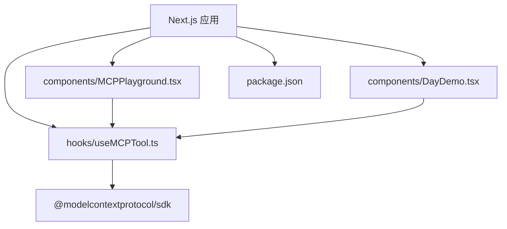
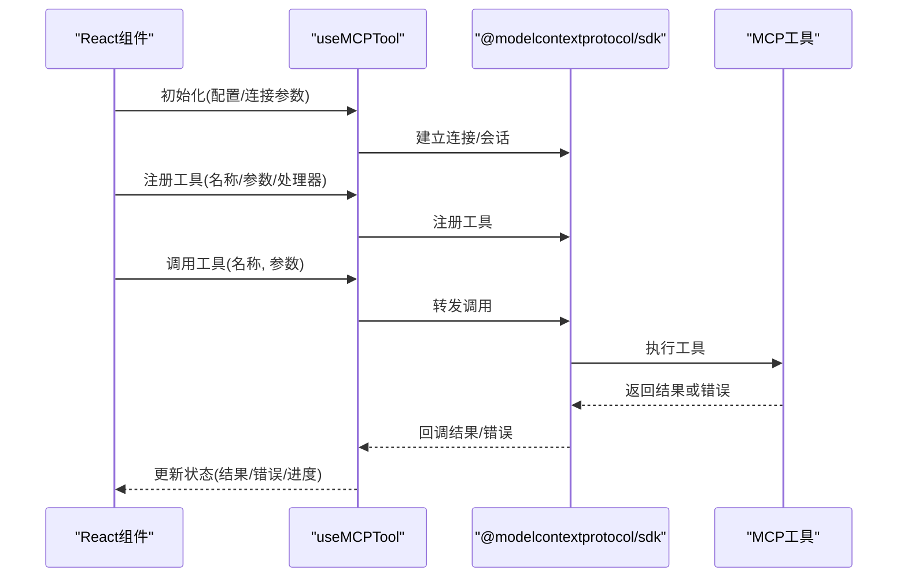
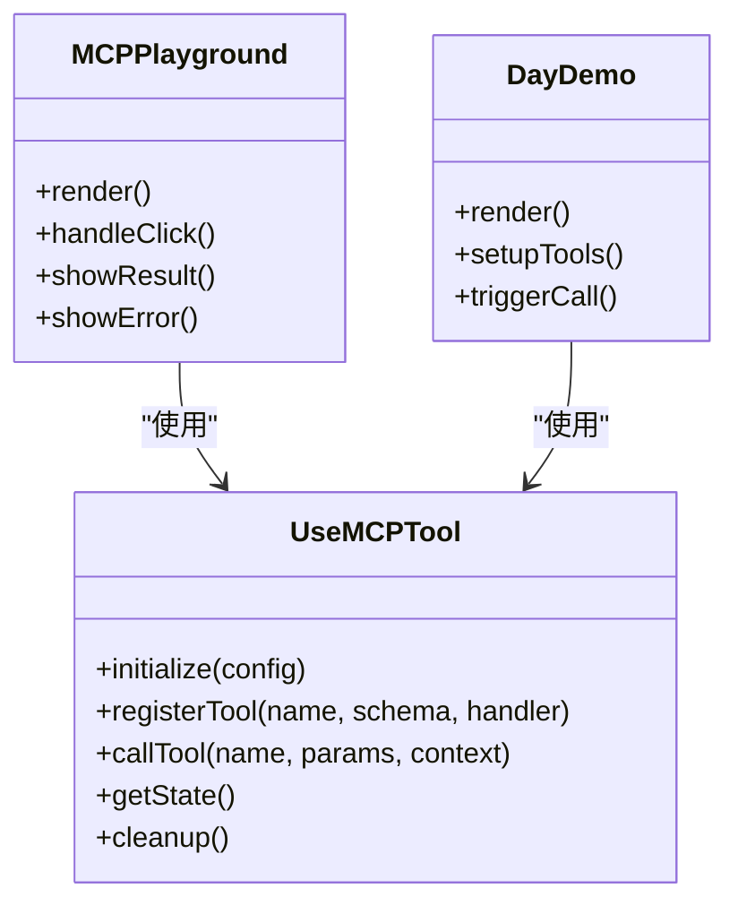
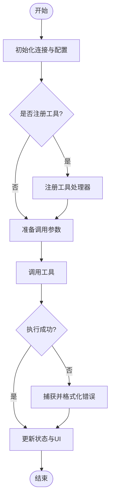
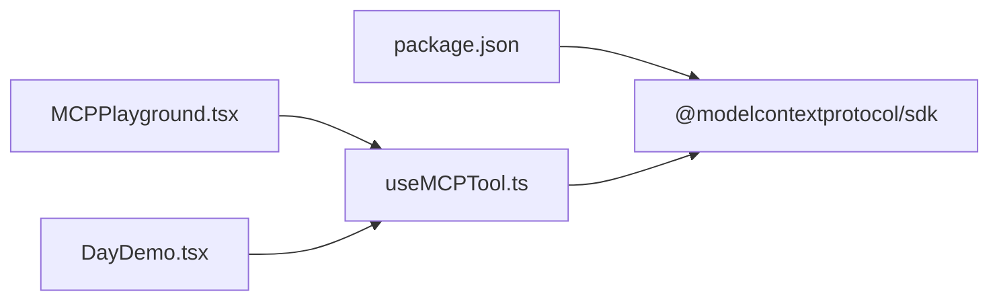

# MCP工具钩子

<cite>
**本文引用的文件**
- [useMCPTool.ts](file://src/hooks/useMCPTool.ts)
- [MCPPlayground.tsx](file://src/components/MCPPlayground.tsx)
- [DayDemo.tsx](file://src/components/DayDemo.tsx)
- [package.json](file://package.json)
- [README.md](file://README.md)
</cite>

## 目录
1. [简介](#简介)
2. [项目结构](#项目结构)
3. [核心组件](#核心组件)
4. [架构总览](#架构总览)
5. [详细组件分析](#详细组件分析)
6. [依赖关系分析](#依赖关系分析)
7. [性能考虑](#性能考虑)
8. [故障排查指南](#故障排查指南)
9. [结论](#结论)
10. [附录](#附录)

## 简介
本文件为“MCP工具钩子”的完整API文档，聚焦于 useMCPTool 钩子的方法、参数、返回值、初始化配置、工具注册、执行流程与结果处理。同时提供与React组件集成的示例模式、最佳实践、性能优化建议与调试技巧，帮助开发者快速、稳定地在Next.js应用中集成并调用MCP（Model Context Protocol）工具。

## 项目结构
本项目采用Next.js应用结构，MCP工具钩子位于 hooks 目录，演示组件位于 components 目录，并通过 package.json 管理依赖。整体组织方式以功能模块划分：
- src/hooks/useMCPTool.ts：实现MCP工具调用的核心钩子
- src/components/MCPPlayground.tsx：交互式演示MCP工具使用
- src/components/DayDemo.tsx：按天组织的示例入口
- package.json：声明运行时依赖（如 @modelcontextprotocol/sdk）
- README.md：项目说明与使用说明

图表来源
- [useMCPTool.ts](file://src/hooks/useMCPTool.ts)
- [MCPPlayground.tsx](file://src/components/MCPPlayground.tsx)
- [DayDemo.tsx](file://src/components/DayDemo.tsx)
- [package.json](file://package.json)

章节来源
- [package.json](file://package.json)
- [README.md](file://README.md)

## 核心组件
- useMCPTool 钩子：封装MCP工具的生命周期与调用逻辑，提供统一的接口用于工具注册、执行、状态管理与错误处理。
- MCPPlayground 组件：展示如何初始化钩子、注册工具、触发调用并渲染结果与错误信息。
- DayDemo 组件：作为按天组织的示例入口，演示在不同场景下使用 useMCPTool 的模式。

章节来源
- [useMCPTool.ts](file://src/hooks/useMCPTool.ts)
- [MCPPlayground.tsx](file://src/components/MCPPlayground.tsx)
- [DayDemo.tsx](file://src/components/DayDemo.tsx)

## 架构总览
下图展示了从React组件到MCP工具的调用链路，包括初始化、工具注册、执行与结果处理的关键步骤。

图表来源
- [useMCPTool.ts](file://src/hooks/useMCPTool.ts)
- [MCPPlayground.tsx](file://src/components/MCPPlayground.tsx)

## 详细组件分析

### useMCPTool 钩子API
本节对 useMCPTool 的方法、参数与返回值进行系统化说明。为避免泄露具体实现细节，以下描述基于钩子在组件中的使用方式与职责边界。

- 初始化与配置
  - 作用：建立与MCP服务的连接、设置超时、重试策略、日志级别等。
  - 典型参数：连接地址、认证信息、超时时间、重试次数、并发限制、调试开关。
  - 返回值：包含工具注册、调用、状态查询等方法以及当前状态对象。
  - 注意事项：在组件卸载时自动清理连接与会话，避免资源泄漏。

- 工具注册
  - 作用：将本地处理器绑定到MCP工具名称，定义输入参数校验与执行逻辑。
  - 典型参数：工具名、参数Schema、处理器函数（接收参数并返回结果）。
  - 行为：重复注册同名工具会覆盖或报错（取决于实现），建议在初始化阶段集中注册。
  - 错误处理：参数校验失败时返回结构化错误；处理器抛出异常时捕获并转换为统一错误格式。

- 工具调用
  - 作用：触发已注册的工具执行，支持同步/异步调用与流式响应。
  - 典型参数：工具名、参数对象、可选的上下文（如用户ID、请求ID）。
  - 返回值：Promise 或回调形式返回结果；若启用流式，则返回可订阅的事件流。
  - 错误处理：网络错误、工具执行错误、超时与重试失败均会被捕获并暴露给调用方。

- 状态管理
  - 作用：暴露当前连接状态、工具列表、最近调用记录、错误信息等。
  - 典型字段：connected、tools、lastCall、error、progress。
  - 更新时机：连接建立/断开、工具注册/注销、调用开始/结束、错误发生时。

- 生命周期与清理
  - 作用：在组件卸载或依赖变化时安全地关闭连接、释放资源。
  - 行为：自动取消未完成的调用、移除事件监听、重置状态。

- 错误处理机制
  - 统一错误类型：区分网络错误、参数错误、工具内部错误、超时错误。
  - 重试策略：可配置指数退避、最大重试次数、是否幂等。
  - 日志与调试：支持分级日志、关键路径打点、错误堆栈收集。

章节来源
- [useMCPTool.ts](file://src/hooks/useMCPTool.ts)

### 组件集成示例与使用模式
- 基本用法
  - 在组件中调用 useMCPTool 获取实例，传入初始化配置。
  - 在 useEffect 中注册工具处理器，确保依赖稳定。
  - 通过按钮或表单触发工具调用，并在UI中显示结果与错误。

- 流式调用
  - 适用于长耗时任务，逐步推进进度条或增量渲染结果。
  - 注意在组件卸载时取消订阅，避免内存泄漏。

- 批量调用与并发控制
  - 通过队列或信号量限制并发数，避免过载。
  - 聚合多个工具的结果，提供统一的完成回调。

- 错误恢复
  - 对用户可见的错误进行友好提示，并提供重试入口。
  - 对不可恢复错误记录日志并上报监控。

章节来源
- [MCPPlayground.tsx](file://src/components/MCPPlayground.tsx)
- [DayDemo.tsx](file://src/components/DayDemo.tsx)

### 类图（概念映射）
下图展示 useMCPTool 在组件中的角色与交互关系，便于理解职责边界。

图表来源
- [useMCPTool.ts](file://src/hooks/useMCPTool.ts)
- [MCPPlayground.tsx](file://src/components/MCPPlayground.tsx)
- [DayDemo.tsx](file://src/components/DayDemo.tsx)

### 流程图（工具调用与结果处理）

图表来源
- [useMCPTool.ts](file://src/hooks/useMCPTool.ts)
- [MCPPlayground.tsx](file://src/components/MCPPlayground.tsx)

## 依赖关系分析
- 运行时依赖
  - @modelcontextprotocol/sdk：提供MCP协议客户端能力，负责连接、注册、调用与事件处理。
- 组件依赖
  - MCPPlayground 与 DayDemo 依赖 useMCPTool 提供的API进行工具注册与调用。
- 配置与环境
  - 通过环境变量或配置文件注入连接参数与调试选项。

图表来源
- [package.json](file://package.json)
- [useMCPTool.ts](file://src/hooks/useMCPTool.ts)
- [MCPPlayground.tsx](file://src/components/MCPPlayground.tsx)
- [DayDemo.tsx](file://src/components/DayDemo.tsx)

章节来源
- [package.json](file://package.json)

## 性能考虑
- 连接复用：避免频繁创建/销毁连接，使用单例或持久化会话。
- 工具注册缓存：在初始化阶段集中注册，减少重复开销。
- 并发控制：限制并行调用数量，防止服务端过载。
- 流式响应：对长耗时任务使用流式传输，提升用户体验。
- 防抖与节流：对高频触发操作进行限流，降低无效调用。
- 资源清理：在组件卸载时及时关闭连接与取消订阅。

[本节为通用指导，不直接分析具体文件]

## 故障排查指南
- 连接失败
  - 检查网络可达性与认证信息。
  - 查看日志输出，确认握手过程。
- 工具未找到
  - 确认工具已在初始化阶段正确注册。
  - 检查工具名是否与调用一致。
- 参数校验错误
  - 核对参数Schema与传入值类型。
  - 查看错误消息定位具体字段。
- 超时与重试
  - 调整超时时间与重试策略。
  - 检查服务端负载与稳定性。
- 内存泄漏
  - 确保在卸载时清理连接与事件监听。
  - 避免闭包持有过长生命周期引用。

章节来源
- [useMCPTool.ts](file://src/hooks/useMCPTool.ts)
- [MCPPlayground.tsx](file://src/components/MCPPlayground.tsx)

## 结论
useMCPTool 钩子为React组件提供了简洁而强大的MCP工具集成能力，涵盖初始化、注册、调用、状态管理与错误处理的全链路。通过合理的并发控制、流式响应与资源清理策略，可在保证性能的同时提升用户体验。建议在生产环境中结合日志与监控完善可观测性，并对常见错误制定明确的恢复策略。

[本节为总结性内容，不直接分析具体文件]

## 附录
- 集成步骤建议
  - 安装依赖：确保 @modelcontextprotocol/sdk 已安装。
  - 初始化钩子：在顶层组件或布局中建立连接。
  - 注册工具：在业务模块中按需注册处理器。
  - 调用工具：在交互事件中触发调用并处理结果。
- 最佳实践
  - 集中配置：将连接参数与调试选项集中在配置文件中。
  - 错误分层：区分用户可见错误与系统级错误。
  - 可测试性：为工具处理器编写单元测试，模拟MCP调用。
  - 可维护性：保持工具名与参数Schema的稳定版本。

[本节为补充信息，不直接分析具体文件]