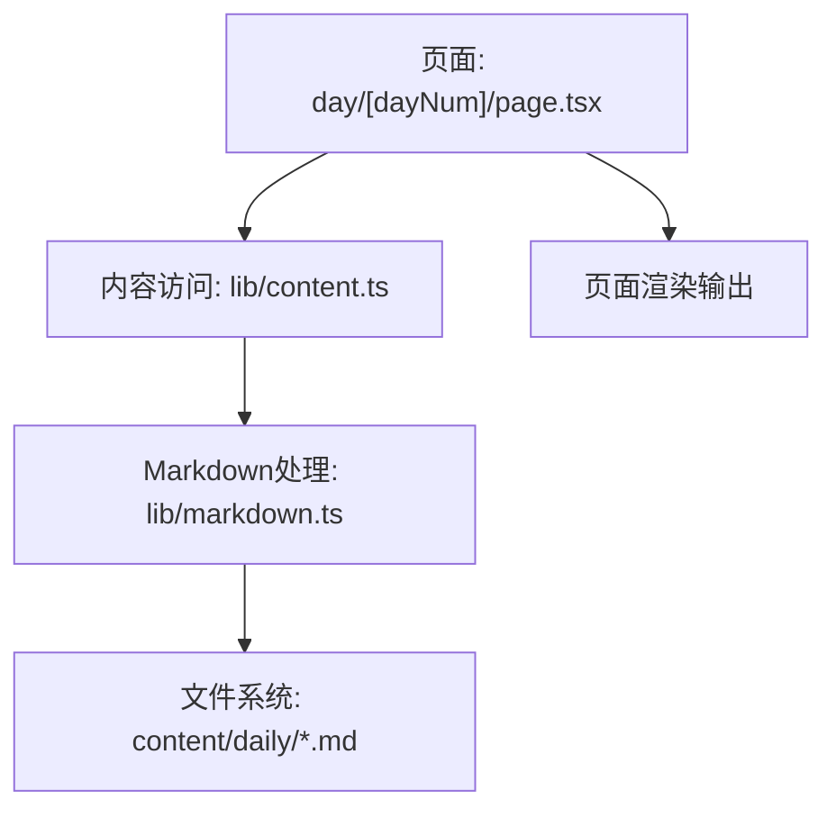
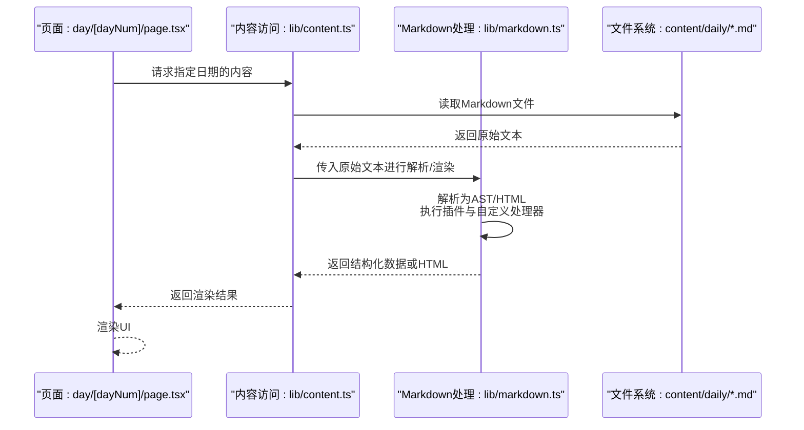
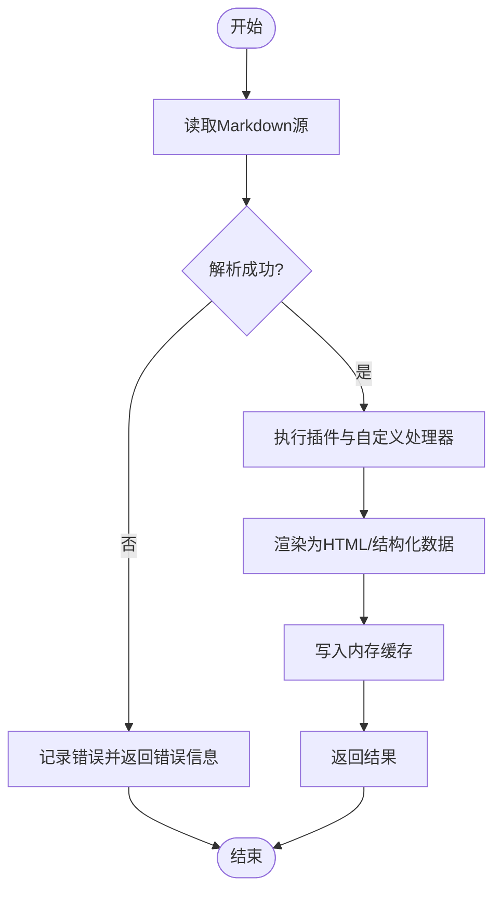
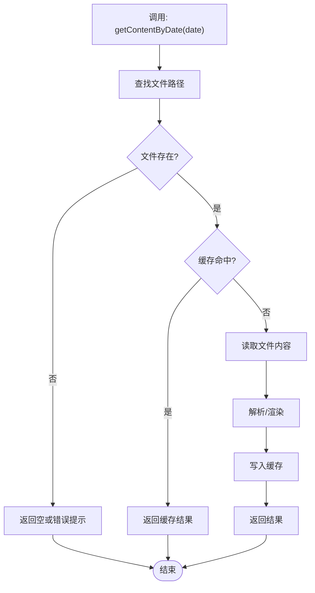
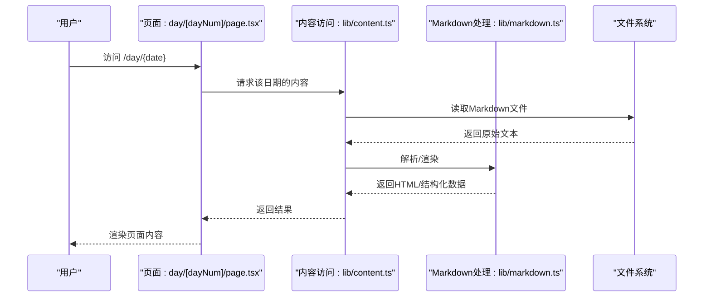
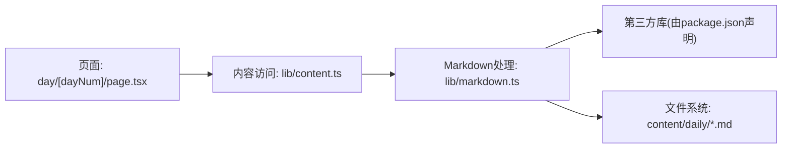

# Markdown处理API

<cite>
**本文引用的文件**
- [src/lib/markdown.ts](file://src/lib/markdown.ts)
- [src/lib/content.ts](file://src/lib/content.ts)
- [content/daily/2026-04-23.md](file://content/daily/2026-04-23.md)
- [content/daily/2026-05-15.md](file://content/daily/2026-05-15.md)
- [content/daily/2026-07-03.md](file://content/daily/2026-07-03.md)
- [src/app/day/[dayNum]/page.tsx](file://src/app/day/[dayNum]/page.tsx)
- [src/app/modules/page.tsx](file://src/app/modules/page.tsx)
- [package.json](file://package.json)
</cite>

## 目录
1. [简介](#简介)
2. [项目结构](#项目结构)
3. [核心组件](#核心组件)
4. [架构总览](#架构总览)
5. [详细组件分析](#详细组件分析)
6. [依赖关系分析](#依赖关系分析)
7. [性能考虑](#性能考虑)
8. [故障排查指南](#故障排查指南)
9. [结论](#结论)
10. [附录](#附录)

## 简介
本Markdown处理系统提供对Markdown文件的读取、解析、渲染与转换能力，面向Next.js应用中的内容展示场景。系统通过统一的接口完成：
- 从文件系统读取Markdown源文件
- 将Markdown转换为结构化数据或HTML
- 在页面中按需渲染内容
- 支持扩展语法与自定义处理器（基于所用库的能力）
- 提供缓存策略与错误处理逻辑，保障性能与稳定性

本API文档聚焦于Markdown处理的核心流程、扩展点、使用方式与最佳实践，帮助开发者快速集成并定制渲染行为。

## 项目结构
本项目采用Next.js App Router组织页面，Markdown相关内容集中在lib层与content目录：
- src/lib/markdown.ts：Markdown解析与渲染的核心实现
- src/lib/content.ts：内容聚合与访问封装
- content/daily/*.md：示例Markdown内容文件
- src/app/day/[dayNum]/page.tsx：按天展示内容的页面入口
- src/app/modules/page.tsx：模块页入口（可能用于聚合展示）
- package.json：项目依赖声明（含Markdown相关库）

图表来源
- [src/app/day/[dayNum]/page.tsx](file://src/app/day/[dayNum]/page.tsx)
- [src/lib/content.ts](file://src/lib/content.ts)
- [src/lib/markdown.ts](file://src/lib/markdown.ts)
- [content/daily/2026-04-23.md](file://content/daily/2026-04-23.md)

章节来源
- [src/lib/markdown.ts](file://src/lib/markdown.ts)
- [src/lib/content.ts](file://src/lib/content.ts)
- [src/app/day/[dayNum]/page.tsx](file://src/app/day/[dayNum]/page.tsx)
- [package.json](file://package.json)

## 核心组件
- Markdown处理器（lib/markdown.ts）
  - 负责加载Markdown文件、解析为AST或HTML、执行插件与自定义处理器
  - 暴露统一接口供上层调用，如“读取并渲染”、“仅解析为结构化数据”等
- 内容访问器（lib/content.ts）
  - 提供按日期、路径或标签获取Markdown内容的便捷方法
  - 可结合缓存策略减少重复I/O与解析开销
- 页面入口（app/day/[dayNum]/page.tsx）
  - 根据路由参数获取对应日期的Markdown内容并渲染
  - 处理加载状态与错误提示

章节来源
- [src/lib/markdown.ts](file://src/lib/markdown.ts)
- [src/lib/content.ts](file://src/lib/content.ts)
- [src/app/day/[dayNum]/page.tsx](file://src/app/day/[dayNum]/page.tsx)

## 架构总览
下图展示了从页面到Markdown处理的完整调用链，包括文件读取、解析、渲染与返回结果的过程。

图表来源
- [src/app/day/[dayNum]/page.tsx](file://src/app/day/[dayNum]/page.tsx)
- [src/lib/content.ts](file://src/lib/content.ts)
- [src/lib/markdown.ts](file://src/lib/markdown.ts)
- [content/daily/2026-04-23.md](file://content/daily/2026-04-23.md)

## 详细组件分析

### Markdown处理器（lib/markdown.ts）
- 职责
  - 读取并解析Markdown文件，生成AST或HTML
  - 支持扩展语法（通过插件机制），例如表格、数学公式、代码高亮等
  - 提供自定义处理器钩子，允许替换或增强特定节点/语法的渲染行为
- 关键流程
  - 输入：Markdown字符串或文件路径
  - 解析：将Markdown转换为AST（或中间表示）
  - 扩展：运行插件列表，注入或修改节点
  - 渲染：将AST转换为HTML或结构化对象
  - 输出：供页面渲染的HTML或数据
- 错误处理
  - 捕获解析异常、插件执行异常与渲染异常
  - 返回明确的错误信息，便于上层降级或提示
- 性能优化
  - 对已解析的AST或HTML进行内存级缓存，避免重复解析
  - 对大文件采用流式或分块处理（视库能力而定）
  - 控制插件数量与复杂度，减少不必要的计算

图表来源
- [src/lib/markdown.ts](file://src/lib/markdown.ts)

章节来源
- [src/lib/markdown.ts](file://src/lib/markdown.ts)

### 内容访问器（lib/content.ts）
- 职责
  - 提供按日期、路径或标签获取Markdown内容的统一接口
  - 管理文件读取与缓存，降低重复I/O与解析成本
- 关键流程
  - 输入：日期或路径标识
  - 查找：定位对应的Markdown文件
  - 读取：从文件系统读取内容
  - 缓存：命中则直接返回；未命中则解析并缓存
  - 输出：返回结构化数据或HTML
- 错误处理
  - 文件不存在时返回空结果或友好提示
  - 解析失败时回退为纯文本或显示错误占位

图表来源
- [src/lib/content.ts](file://src/lib/content.ts)

章节来源
- [src/lib/content.ts](file://src/lib/content.ts)

### 页面入口（app/day/[dayNum]/page.tsx）
- 职责
  - 根据路由参数dayNum获取对应Markdown内容并渲染
  - 处理加载状态与错误提示
- 关键流程
  - 接收路由参数
  - 调用内容访问器获取内容
  - 将结果传递给UI组件进行渲染
  - 捕获并展示错误信息

图表来源
- [src/app/day/[dayNum]/page.tsx](file://src/app/day/[dayNum]/page.tsx)
- [src/lib/content.ts](file://src/lib/content.ts)
- [src/lib/markdown.ts](file://src/lib/markdown.ts)
- [content/daily/2026-04-23.md](file://content/daily/2026-04-23.md)

章节来源
- [src/app/day/[dayNum]/page.tsx](file://src/app/day/[dayNum]/page.tsx)

### 支持的Markdown语法扩展与自定义处理器
- 语法扩展
  - 表格、脚注、任务列表、数学公式、代码高亮等（取决于所用库与插件配置）
- 自定义处理器
  - 通过插件机制注册自定义节点处理器，覆盖默认渲染行为
  - 可在解析阶段插入新节点或在渲染阶段替换输出
- 典型用法
  - 在Markdown处理器初始化时加载插件列表
  - 为特定语法编写处理器函数，返回期望的HTML或数据结构
  - 在页面中按需启用或禁用扩展

章节来源
- [src/lib/markdown.ts](file://src/lib/markdown.ts)

### 文件读取、缓存策略与错误处理
- 文件读取
  - 通过内容访问器统一封装，屏蔽底层文件系统差异
  - 支持按日期或路径定位文件
- 缓存策略
  - 内存级缓存：解析后的AST/HTML存入内存，避免重复解析
  - 失效策略：文件变更或配置更新时清除相应缓存
  - 容量控制：限制缓存条目数，防止内存占用过高
- 错误处理
  - 文件缺失：返回空结果或友好提示
  - 解析失败：记录错误日志并降级为纯文本或占位内容
  - 插件异常：隔离异常，确保其他功能不受影响

章节来源
- [src/lib/content.ts](file://src/lib/content.ts)
- [src/lib/markdown.ts](file://src/lib/markdown.ts)

## 依赖关系分析
- 页面依赖内容访问器，内容访问器依赖Markdown处理器，Markdown处理器依赖文件系统与第三方库
- 依赖图如下：

图表来源
- [src/app/day/[dayNum]/page.tsx](file://src/app/day/[dayNum]/page.tsx)
- [src/lib/content.ts](file://src/lib/content.ts)
- [src/lib/markdown.ts](file://src/lib/markdown.ts)
- [package.json](file://package.json)

章节来源
- [package.json](file://package.json)

## 性能考虑
- 解析与渲染
  - 优先复用AST或HTML缓存，减少重复计算
  - 合理配置插件数量与复杂度，避免过度解析
- I/O优化
  - 批量读取与懒加载：仅在需要时读取文件
  - 小文件合并：将多个小Markdown文件合并为单次读取
- 内存管理
  - 设置缓存上限，定期清理过期条目
  - 对超大Markdown文件采用分块处理或流式解析
- 并发控制
  - 限制并发解析任务数，避免阻塞主线程
  - 使用队列调度解析任务，保证响应性

[本节为通用指导，不直接分析具体文件]

## 故障排查指南
- 常见问题
  - 文件未找到：检查路径与文件名是否正确
  - 解析失败：查看Markdown语法是否合法，确认插件是否启用
  - 渲染异常：检查自定义处理器是否存在错误或冲突
- 调试建议
  - 打印解析前后的AST或HTML片段，定位问题节点
  - 逐步禁用插件，缩小异常范围
  - 增加日志级别，记录关键步骤与错误堆栈

章节来源
- [src/lib/markdown.ts](file://src/lib/markdown.ts)
- [src/lib/content.ts](file://src/lib/content.ts)

## 结论
本Markdown处理系统通过清晰的层次划分与统一的接口设计，实现了高效的文件读取、解析、渲染与扩展机制。借助缓存策略与错误处理，系统在性能与稳定性方面具备良好表现。开发者可根据业务需求灵活启用语法扩展与自定义处理器，满足多样化的内容展示场景。

[本节为总结性内容，不直接分析具体文件]

## 附录
- 示例Markdown文件
  - [content/daily/2026-04-23.md](file://content/daily/2026-04-23.md)
  - [content/daily/2026-05-15.md](file://content/daily/2026-05-15.md)
  - [content/daily/2026-07-03.md](file://content/daily/2026-07-03.md)
- 页面入口
  - [src/app/day/[dayNum]/page.tsx](file://src/app/day/[dayNum]/page.tsx)
  - [src/app/modules/page.tsx](file://src/app/modules/page.tsx)
- 依赖声明
  - [package.json](file://package.json)