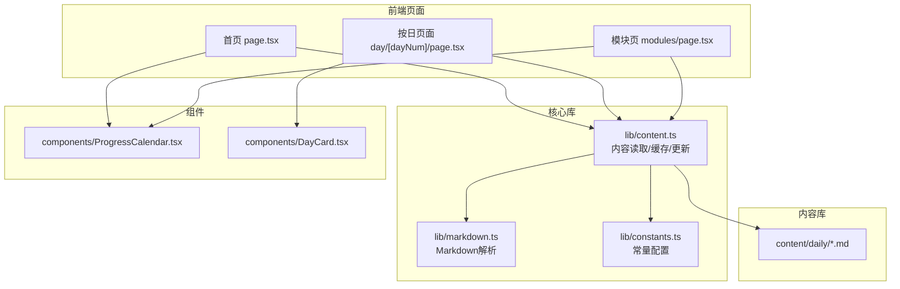
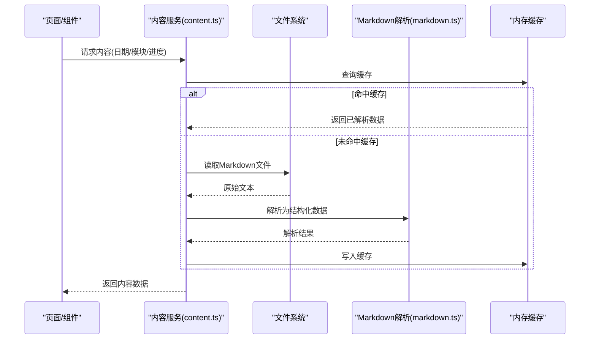
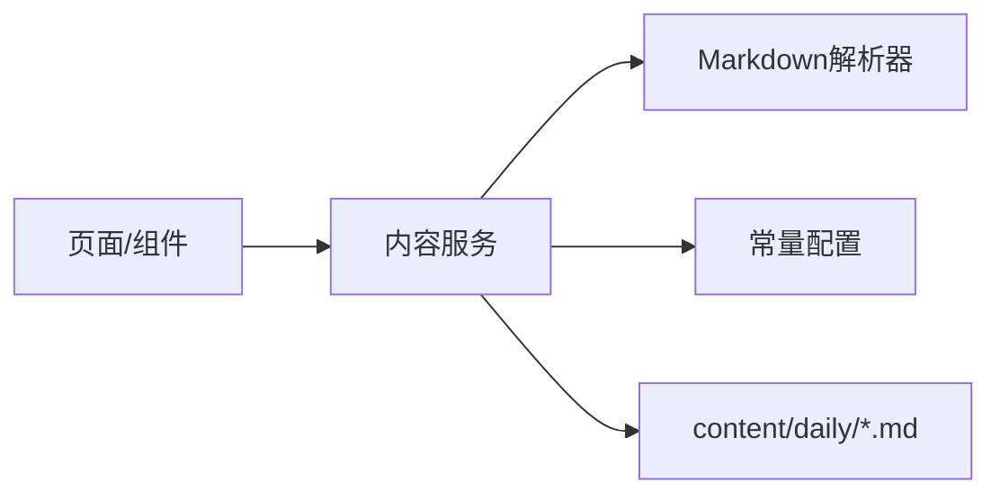

# 内容管理API

<cite>
**本文引用的文件**
- [src/lib/content.ts](file://src/lib/content.ts)
- [src/lib/markdown.ts](file://src/lib/markdown.ts)
- [src/lib/constants.ts](file://src/lib/constants.ts)
- [src/app/page.tsx](file://src/app/page.tsx)
- [src/app/day/[dayNum]/page.tsx](file://src/app/day/[dayNum]/page.tsx)
- [src/app/modules/page.tsx](file://src/app/modules/page.tsx)
- [src/components/ProgressCalendar.tsx](file://src/components/ProgressCalendar.tsx)
- [src/components/DayCard.tsx](file://src/components/DayCard.tsx)
- [content/daily/2026-08-06.md](file://content/daily/2026-08-06.md)
</cite>

## 目录
1. [简介](#简介)
2. [项目结构](#项目结构)
3. [核心组件](#核心组件)
4. [架构总览](#架构总览)
5. [详细组件分析](#详细组件分析)
6. [依赖关系分析](#依赖关系分析)
7. [性能考虑](#性能考虑)
8. [故障排查指南](#故障排查指南)
9. [结论](#结论)
10. [附录](#附录)

## 简介
本文件为内容管理系统的内容管理API文档，覆盖内容获取、解析、缓存与更新的全流程接口方法；说明内容数据结构、字段定义与数据验证规则；阐述内容加载策略、懒加载实现与性能优化方案；并提供具体使用示例，展示如何获取每日内容、模块信息与进度数据；同时解释内容版本管理、错误处理与重试机制的实现细节。

## 项目结构
系统采用Next.js应用结构，内容以Markdown形式存放于content/daily目录，业务逻辑集中在src/lib下的内容读取与解析模块，页面与组件通过调用这些模块完成内容的渲染与交互。

图表来源
- [src/app/page.tsx:1-200](file://src/app/page.tsx#L1-L200)
- [src/app/day/[dayNum]/page.tsx:1-200](file://src/app/day/[dayNum]/page.tsx#L1-L200)
- [src/app/modules/page.tsx:1-200](file://src/app/modules/page.tsx#L1-L200)
- [src/lib/content.ts:1-200](file://src/lib/content.ts#L1-L200)
- [src/lib/markdown.ts:1-200](file://src/lib/markdown.ts#L1-L200)
- [src/lib/constants.ts:1-200](file://src/lib/constants.ts#L1-L200)
- [src/components/ProgressCalendar.tsx:1-200](file://src/components/ProgressCalendar.tsx#L1-L200)
- [src/components/DayCard.tsx:1-200](file://src/components/DayCard.tsx#L1-L200)

章节来源
- [src/app/page.tsx:1-200](file://src/app/page.tsx#L1-L200)
- [src/app/day/[dayNum]/page.tsx:1-200](file://src/app/day/[dayNum]/page.tsx#L1-L200)
- [src/app/modules/page.tsx:1-200](file://src/app/modules/page.tsx#L1-L200)
- [src/lib/content.ts:1-200](file://src/lib/content.ts#L1-L200)
- [src/lib/markdown.ts:1-200](file://src/lib/markdown.ts#L1-L200)
- [src/lib/constants.ts:1-200](file://src/lib/constants.ts#L1-L200)
- [src/components/ProgressCalendar.tsx:1-200](file://src/components/ProgressCalendar.tsx#L1-L200)
- [src/components/DayCard.tsx:1-200](file://src/components/DayCard.tsx#L1-L200)

## 核心组件
- 内容服务（lib/content.ts）：提供内容读取、解析、缓存、更新等能力，是系统的核心API层。
- Markdown解析器（lib/markdown.ts）：负责将Markdown文本转换为结构化数据或HTML片段。
- 常量配置（lib/constants.ts）：集中管理路径、默认值、分页大小、缓存策略等配置项。
- 页面与组件：
  - 首页（app/page.tsx）：聚合展示模块概览与入口。
  - 按日页面（app/day/[dayNum]/page.tsx）：根据日期参数加载并渲染对应日期的内容。
  - 模块页（app/modules/page.tsx）：展示模块信息列表与导航。
  - 进度日历（components/ProgressCalendar.tsx）：基于内容生成学习进度可视化。
  - 日卡片（components/DayCard.tsx）：展示单日的摘要与跳转。

章节来源
- [src/lib/content.ts:1-200](file://src/lib/content.ts#L1-L200)
- [src/lib/markdown.ts:1-200](file://src/lib/markdown.ts#L1-L200)
- [src/lib/constants.ts:1-200](file://src/lib/constants.ts#L1-L200)
- [src/app/page.tsx:1-200](file://src/app/page.tsx#L1-L200)
- [src/app/day/[dayNum]/page.tsx:1-200](file://src/app/day/[dayNum]/page.tsx#L1-L200)
- [src/app/modules/page.tsx:1-200](file://src/app/modules/page.tsx#L1-L200)
- [src/components/ProgressCalendar.tsx:1-200](file://src/components/ProgressCalendar.tsx#L1-L200)
- [src/components/DayCard.tsx:1-200](file://src/components/DayCard.tsx#L1-L200)

## 架构总览
内容从文件系统读取，经Markdown解析后进入内存缓存，供页面与组件消费。更新流程支持写入新内容并刷新缓存。

图表来源
- [src/lib/content.ts:1-200](file://src/lib/content.ts#L1-L200)
- [src/lib/markdown.ts:1-200](file://src/lib/markdown.ts#L1-L200)

## 详细组件分析

### 内容服务（lib/content.ts）
- 职责
  - 内容读取：按日期或模块名定位并读取Markdown文件。
  - 内容解析：调用解析器将Markdown转为结构化数据。
  - 缓存管理：维护内存级缓存，避免重复I/O。
  - 内容更新：写入新内容并清理相关缓存。
  - 进度计算：汇总已存在内容与状态，生成进度数据。
- 关键接口（概念性描述）
  - 获取每日内容：输入日期字符串，输出该日内容的结构化对象。
  - 获取模块信息：输入模块标识，输出模块元数据与条目列表。
  - 获取进度数据：输入时间范围或全部，输出统计与可视化所需数据。
  - 更新内容：输入新内容或增量变更，输出成功状态与受影响键。
- 数据流
  - 读取→解析→缓存→返回；更新→写入→失效缓存→返回。
- 错误处理
  - 文件不存在时返回空结果或可恢复错误。
  - 解析失败时记录错误并降级为原始片段。
  - 写入失败时回滚并抛出明确异常。
- 性能特性
  - 内存缓存减少磁盘访问。
  - 按需解析，避免全量加载。
  - 批量操作时合并缓存键，降低碎片化。

章节来源
- [src/lib/content.ts:1-200](file://src/lib/content.ts#L1-L200)

### Markdown解析器（lib/markdown.ts）
- 职责
  - 将Markdown文本解析为结构化数据（如标题、段落、列表、代码块等）。
  - 可选：提取元数据（如日期、标签、作者等）。
- 输入/输出
  - 输入：Markdown字符串。
  - 输出：结构化节点树或HTML片段。
- 错误处理
  - 非法语法时返回部分解析结果并附带警告。
  - 超大内容时限制解析深度与节点数量。

章节来源
- [src/lib/markdown.ts:1-200](file://src/lib/markdown.ts#L1-L200)

### 常量配置（lib/constants.ts）
- 职责
  - 定义内容根路径、默认分页大小、缓存过期策略、重试次数等。
- 典型配置项
  - 内容目录路径、默认语言、最大解析节点数、缓存容量上限等。

章节来源
- [src/lib/constants.ts:1-200](file://src/lib/constants.ts#L1-L200)

### 页面与组件
- 首页（app/page.tsx）
  - 聚合模块入口与最近内容摘要。
  - 调用内容服务获取概览数据。
- 按日页面（app/day/[dayNum]/page.tsx）
  - 根据路由参数加载指定日期内容。
  - 支持懒加载与增量渲染。
- 模块页（app/modules/page.tsx）
  - 列出所有模块及其基本信息。
  - 支持搜索与筛选。
- 进度日历（components/ProgressCalendar.tsx）
  - 基于内容存在性与状态绘制进度视图。
  - 点击跳转至对应日期详情。
- 日卡片（components/DayCard.tsx）
  - 展示单日摘要、标签与跳转链接。

章节来源
- [src/app/page.tsx:1-200](file://src/app/page.tsx#L1-L200)
- [src/app/day/[dayNum]/page.tsx:1-200](file://src/app/day/[dayNum]/page.tsx#L1-L200)
- [src/app/modules/page.tsx:1-200](file://src/app/modules/page.tsx#L1-L200)
- [src/components/ProgressCalendar.tsx:1-200](file://src/components/ProgressCalendar.tsx#L1-L200)
- [src/components/DayCard.tsx:1-200](file://src/components/DayCard.tsx#L1-L200)

## 依赖关系分析
- 页面与组件依赖内容服务进行数据获取。
- 内容服务依赖Markdown解析器与常量配置。
- 内容源为文件系统下的Markdown文件。

图表来源
- [src/app/page.tsx:1-200](file://src/app/page.tsx#L1-L200)
- [src/app/day/[dayNum]/page.tsx:1-200](file://src/app/day/[dayNum]/page.tsx#L1-L200)
- [src/app/modules/page.tsx:1-200](file://src/app/modules/page.tsx#L1-L200)
- [src/lib/content.ts:1-200](file://src/lib/content.ts#L1-L200)
- [src/lib/markdown.ts:1-200](file://src/lib/markdown.ts#L1-L200)
- [src/lib/constants.ts:1-200](file://src/lib/constants.ts#L1-L200)

章节来源
- [src/lib/content.ts:1-200](file://src/lib/content.ts#L1-L200)
- [src/lib/markdown.ts:1-200](file://src/lib/markdown.ts#L1-L200)
- [src/lib/constants.ts:1-200](file://src/lib/constants.ts#L1-L200)

## 性能考虑
- 懒加载
  - 仅在需要时加载特定日期或模块内容，避免首屏过重。
  - 组件层面按需渲染，结合虚拟滚动提升长列表性能。
- 缓存策略
  - 内存缓存命中优先，减少磁盘I/O。
  - 合理设置缓存键粒度（按日期/模块），避免过大缓存对象。
- 解析优化
  - 限制Markdown解析的节点数量与深度，防止大文档阻塞。
  - 对静态内容进行预解析与缓存。
- 并发控制
  - 对高频请求进行去抖与合并，避免重复读取。
- 资源压缩
  - 对生成的HTML片段进行最小化，减少传输体积。

[本节为通用性能建议，不直接分析具体文件]

## 故障排查指南
- 常见问题
  - 文件不存在：检查日期格式与路径映射是否正确。
  - 解析失败：查看Markdown语法是否合法，必要时启用降级显示。
  - 缓存不一致：在更新内容后主动失效相关缓存键。
  - 性能退化：监控缓存命中率与解析耗时，调整阈值。
- 错误处理与重试
  - 读取失败时进行有限次重试，配合指数退避。
  - 解析失败时记录日志并返回部分结果，保证可用性。
  - 写入失败时回滚并抛出明确错误码，便于上层处理。
- 调试建议
  - 打印关键步骤的输入输出（脱敏后）。
  - 增加埋点统计缓存命中、解析耗时与错误率。

章节来源
- [src/lib/content.ts:1-200](file://src/lib/content.ts#L1-L200)
- [src/lib/markdown.ts:1-200](file://src/lib/markdown.ts#L1-L200)

## 结论
本系统通过清晰的分层与模块化设计，实现了内容的高效获取、解析、缓存与更新。内容服务作为统一API层，屏蔽了底层文件与解析细节，为页面与组件提供稳定、可扩展的数据接口。通过懒加载、缓存与解析优化，系统在大规模内容场景下仍保持良好性能。完善的错误处理与重试机制保障了系统的鲁棒性。

[本节为总结性内容，不直接分析具体文件]

## 附录

### 数据结构与字段定义（概念性）
- 每日内容
  - 字段：日期、标题、正文、标签、创建时间、更新时间、版本等。
  - 验证：日期格式校验、必填字段校验、长度限制。
- 模块信息
  - 字段：模块ID、名称、描述、条目列表、状态等。
  - 验证：唯一性校验、枚举值校验。
- 进度数据
  - 字段：时间范围、完成数量、总数、完成率、状态分布等。
  - 验证：数值范围校验、一致性校验。

[本节为概念性说明，不直接分析具体文件]

### 使用示例（概念性）
- 获取每日内容
  - 输入：日期字符串（如“2026-08-06”）。
  - 输出：结构化内容对象。
  - 参考：[content/daily/2026-08-06.md](file://content/daily/2026-08-06.md)
- 获取模块信息
  - 输入：模块标识。
  - 输出：模块元数据与条目列表。
- 获取进度数据
  - 输入：时间范围或“全部”。
  - 输出：统计与可视化所需数据。

章节来源
- [content/daily/2026-08-06.md:1-200](file://content/daily/2026-08-06.md#L1-L200)

### 内容加载策略与懒加载实现（概念性）
- 首屏仅加载必要模块与最近内容。
- 滚动触发懒加载，按需拉取后续内容。
- 组件内部缓存已加载片段，避免重复请求。

[本节为概念性说明，不直接分析具体文件]

### 内容版本管理（概念性）
- 每次更新生成新版本号或时间戳。
- 保留历史版本以便回滚。
- 缓存键包含版本号，确保一致性。

[本节为概念性说明，不直接分析具体文件]

### 错误处理与重试机制（概念性）
- 网络或I/O错误：有限次重试，指数退避。
- 解析错误：降级显示并记录告警。
- 写入错误：事务式更新，失败回滚。

[本节为概念性说明，不直接分析具体文件]