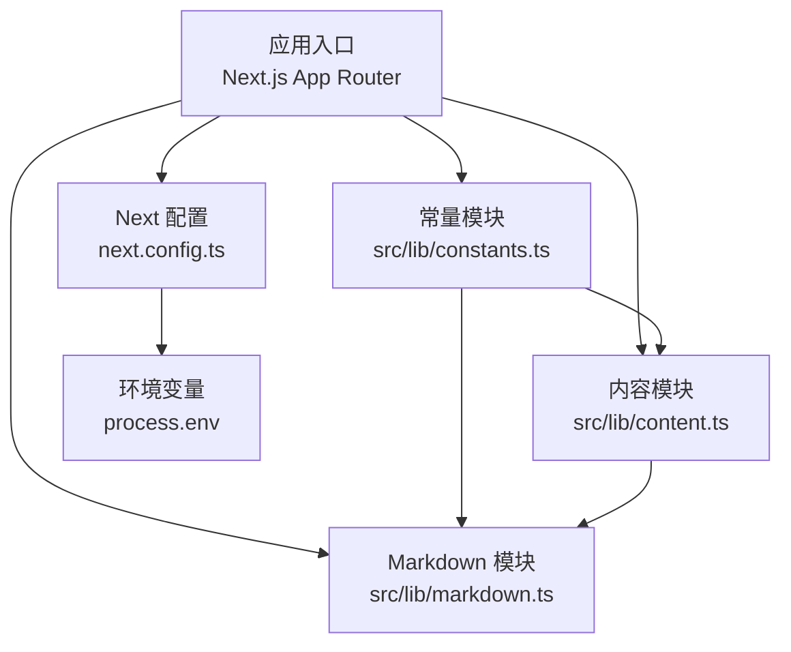
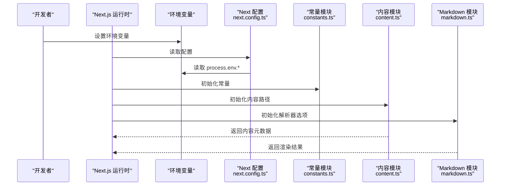
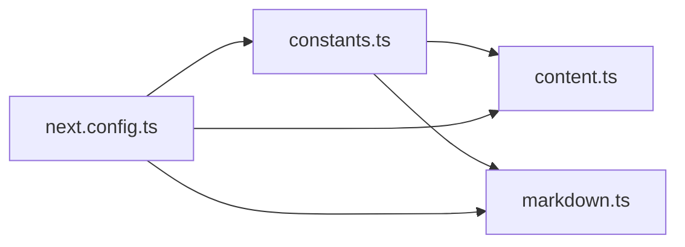

# 常量配置API

<cite>
**本文引用的文件**
- [src/lib/constants.ts](file://src/lib/constants.ts)
- [src/lib/content.ts](file://src/lib/content.ts)
- [src/lib/markdown.ts](file://src/lib/markdown.ts)
- [next.config.ts](file://next.config.ts)
- [package.json](file://package.json)
- [tsconfig.json](file://tsconfig.json)
- [README.md](file://README.md)
</cite>

## 目录
1. [简介](#简介)
2. [项目结构](#项目结构)
3. [核心组件](#核心组件)
4. [架构总览](#架构总览)
5. [详细组件分析](#详细组件分析)
6. [依赖分析](#依赖分析)
7. [性能考虑](#性能考虑)
8. [故障排查指南](#故障排查指南)
9. [结论](#结论)
10. [附录](#附录)

## 简介
本文件为项目的“常量配置API”文档，聚焦于预定义的常量、配置选项与环境变量，说明其用途、取值范围与默认值，并给出验证规则、环境适配与动态配置支持。同时提供在不同场景下的使用示例、热更新机制与调试方法，帮助开发者快速、正确地集成与扩展配置。

## 项目结构
本项目采用 Next.js 应用结构，常量与配置集中在 src/lib 目录下，并通过 Next.js 运行时与构建时能力进行加载与注入。关键位置如下：
- 常量定义：src/lib/constants.ts
- 内容路径与数据源：src/lib/content.ts
- Markdown 处理与渲染配置：src/lib/markdown.ts
- Next.js 构建/运行配置：next.config.ts
- 包管理与脚本：package.json
- TypeScript 编译与类型检查：tsconfig.json
- 项目说明与使用说明：README.md

图表来源
- [src/lib/constants.ts](file://src/lib/constants.ts)
- [src/lib/content.ts](file://src/lib/content.ts)
- [src/lib/markdown.ts](file://src/lib/markdown.ts)
- [next.config.ts](file://next.config.ts)

章节来源
- [next.config.ts](file://next.config.ts)
- [package.json](file://package.json)
- [tsconfig.json](file://tsconfig.json)
- [README.md](file://README.md)

## 核心组件
本节概述与常量配置相关的核心模块及其职责：
- 常量模块（constants）：集中管理业务常量、枚举、阈值、开关等，便于统一维护与类型约束。
- 内容模块（content）：定义内容根路径、日期目录、资源映射等，支撑页面渲染与导航。
- Markdown 模块（markdown）：定义解析器选项、插件、安全策略等，影响内容渲染行为。
- Next 配置（next.config）：注入环境变量、设置构建/运行期行为，决定常量在客户端与服务端的可见性。

章节来源
- [src/lib/constants.ts](file://src/lib/constants.ts)
- [src/lib/content.ts](file://src/lib/content.ts)
- [src/lib/markdown.ts](file://src/lib/markdown.ts)
- [next.config.ts](file://next.config.ts)

## 架构总览
下图展示了常量配置在应用中的加载与使用流程：Next.js 启动时读取 next.config.ts 与 package.json 的脚本；构建/运行期通过 process.env 注入环境变量；业务模块从 constants 与 content 中获取常量；Markdown 模块根据配置渲染内容。

图表来源
- [next.config.ts](file://next.config.ts)
- [src/lib/constants.ts](file://src/lib/constants.ts)
- [src/lib/content.ts](file://src/lib/content.ts)
- [src/lib/markdown.ts](file://src/lib/markdown.ts)

## 详细组件分析

### 常量模块（constants）
- 职责：集中定义业务常量、枚举、阈值、开关等，提供类型安全的访问方式。
- 典型类别：
  - 功能开关：控制特性启用/禁用。
  - 阈值与限制：如分页大小、最大重试次数、超时时间等。
  - 枚举与字典：用于 UI 展示与状态机流转。
- 建议：
  - 所有可配置项应提供默认值与校验逻辑。
  - 对敏感或环境相关项，优先通过环境变量注入。
  - 对外暴露只读接口，避免运行时被意外修改。

章节来源
- [src/lib/constants.ts](file://src/lib/constants.ts)

### 内容模块（content）
- 职责：定义内容根路径、日期目录、资源映射等，支撑页面渲染与导航。
- 典型配置：
  - 内容根目录：如 daily/notes 等。
  - 日期格式与排序规则。
  - 资源前缀与缓存策略。
- 建议：
  - 路径拼接使用统一工具函数，避免硬编码。
  - 对缺失内容提供降级策略与友好提示。

章节来源
- [src/lib/content.ts](file://src/lib/content.ts)

### Markdown 模块（markdown）
- 职责：定义 Markdown 解析器选项、插件、安全策略等，影响内容渲染行为。
- 典型配置：
  - 解析器选项：是否允许 HTML、是否转义脚本等。
  - 插件列表：语法高亮、表格、数学公式等。
  - 输出格式：HTML、AST、自定义节点等。
- 建议：
  - 严格的安全策略，避免 XSS。
  - 提供可选的调试模式，输出中间 AST 或日志。

章节来源
- [src/lib/markdown.ts](file://src/lib/markdown.ts)

### Next 配置（next.config）
- 职责：注入环境变量、设置构建/运行期行为，决定常量在客户端与服务端的可见性。
- 关键点：
  - 仅将必要的环境变量暴露给客户端。
  - 区分构建时与运行时的配置差异。
  - 提供开发/生产环境的差异化配置。

章节来源
- [next.config.ts](file://next.config.ts)

### 包管理与脚本（package.json）
- 职责：定义依赖、脚本命令、工程化配置入口。
- 与常量配置的关系：
  - 脚本可能读取环境变量以切换配置。
  - 依赖版本影响常量行为（如 Markdown 插件）。

章节来源
- [package.json](file://package.json)

### TypeScript 配置（tsconfig.json）
- 职责：定义编译目标、模块解析、类型检查规则。
- 与常量配置的关系：
  - 确保常量模块的类型声明正确。
  - 控制导出与导入路径别名。

章节来源
- [tsconfig.json](file://tsconfig.json)

### 项目说明（README.md）
- 职责：提供项目背景、安装与使用说明。
- 与常量配置的关系：
  - 列出必需的环境变量与默认值。
  - 提供常见配置示例与排错指引。

章节来源
- [README.md](file://README.md)

## 依赖分析
常量配置模块之间的依赖关系如下：
- constants 被 content 与 markdown 共同引用，提供统一的阈值与开关。
- content 依赖 constants 的路径与格式常量。
- markdown 依赖 constants 的安全策略与插件开关。
- next.config 负责注入环境变量，影响 constants 与 content 的运行时行为。

图表来源
- [src/lib/constants.ts](file://src/lib/constants.ts)
- [src/lib/content.ts](file://src/lib/content.ts)
- [src/lib/markdown.ts](file://src/lib/markdown.ts)
- [next.config.ts](file://next.config.ts)

章节来源
- [src/lib/constants.ts](file://src/lib/constants.ts)
- [src/lib/content.ts](file://src/lib/content.ts)
- [src/lib/markdown.ts](file://src/lib/markdown.ts)
- [next.config.ts](file://next.config.ts)

## 性能考虑
- 常量加载：尽量在模块顶层一次性计算，避免重复开销。
- 环境变量：仅在必要时暴露到客户端，减少打包体积。
- Markdown 渲染：按需启用插件，关闭不必要的转换以提升性能。
- 内容路径：使用相对路径与缓存策略，减少 I/O 次数。

[本节为通用指导，不直接分析具体文件]

## 故障排查指南
- 常见问题：
  - 环境变量未生效：检查 next.config.ts 是否正确注入，确认运行环境与构建环境一致。
  - 常量未更新：确认是否为构建时常量；如需热更新，请改为运行期读取环境变量或使用服务端 API。
  - 内容路径错误：核对 content.ts 中的根目录与日期目录是否与文件系统一致。
  - Markdown 渲染异常：检查安全策略与插件配置，开启调试模式查看中间输出。
- 调试方法：
  - 在开发模式下打印关键常量与环境变量，确认取值符合预期。
  - 使用浏览器控制台与服务端日志定位问题。
  - 逐步禁用插件或降低复杂度，缩小问题范围。

章节来源
- [next.config.ts](file://next.config.ts)
- [src/lib/content.ts](file://src/lib/content.ts)
- [src/lib/markdown.ts](file://src/lib/markdown.ts)

## 结论
本项目将常量与配置集中在 src/lib 下，结合 Next.js 的环境变量与构建/运行期能力，实现了清晰、可维护的配置体系。通过合理的默认值、校验规则与环境适配，可在不同场景下稳定运行。建议在新增配置时遵循统一规范，并提供完善的文档与测试用例。

[本节为总结，不直接分析具体文件]

## 附录

### 配置项清单与说明
- 常量类
  - 功能开关：用于启用/禁用特定功能，默认值应在 constants.ts 中定义。
  - 阈值与限制：如分页大小、超时时间等，需包含最小/最大值与单位。
  - 枚举与字典：用于 UI 展示与状态流转，需提供中文标签与键值映射。
- 内容路径
  - 根目录：daily/notes 等，需在 content.ts 中统一定义。
  - 日期格式：YYYY-MM-DD，用于文件名与排序。
  - 资源前缀：静态资源访问路径，需与部署环境匹配。
- Markdown 选项
  - 安全策略：是否允许 HTML、是否转义脚本等。
  - 插件列表：语法高亮、表格、数学公式等，按需启用。
  - 输出格式：HTML、AST、自定义节点等。
- 环境变量
  - 服务侧：数据库连接、第三方 API Key 等，不应暴露到客户端。
  - 客户端：仅暴露必要的公开配置，如站点标题、主题开关等。

章节来源
- [src/lib/constants.ts](file://src/lib/constants.ts)
- [src/lib/content.ts](file://src/lib/content.ts)
- [src/lib/markdown.ts](file://src/lib/markdown.ts)
- [next.config.ts](file://next.config.ts)
- [package.json](file://package.json)
- [README.md](file://README.md)

### 使用示例
- 场景一：切换功能开关
  - 在 constants.ts 中定义开关，并在业务逻辑中读取。
  - 通过环境变量覆盖默认值，实现多环境配置。
- 场景二：调整分页大小
  - 在 constants.ts 中定义分页阈值，并在列表页使用。
  - 结合内容模块的路径与排序规则，生成正确的分页链接。
- 场景三：启用 Markdown 插件
  - 在 markdown.ts 中添加插件配置，并在渲染时传入。
  - 通过环境变量控制插件启用，避免在生产环境引入不必要开销。

章节来源
- [src/lib/constants.ts](file://src/lib/constants.ts)
- [src/lib/content.ts](file://src/lib/content.ts)
- [src/lib/markdown.ts](file://src/lib/markdown.ts)
- [next.config.ts](file://next.config.ts)

### 热更新机制
- 构建时常量：在 next.config.ts 中注入的环境变量会在构建时固化，修改后需重新构建。
- 运行时常量：通过服务端读取环境变量或配置文件，可实现热更新。
- 建议：
  - 对频繁变更的配置，使用运行期读取方式。
  - 对性能敏感的配置，使用构建时常量以减少运行时开销。

章节来源
- [next.config.ts](file://next.config.ts)

### 调试方法
- 开发模式：
  - 打印常量与环境变量，确认取值正确。
  - 使用浏览器控制台与服务端日志定位问题。
- 生产模式：
  - 启用结构化日志，记录关键配置与错误堆栈。
  - 通过监控平台观察配置变更的影响。

章节来源
- [next.config.ts](file://next.config.ts)
- [src/lib/markdown.ts](file://src/lib/markdown.ts)