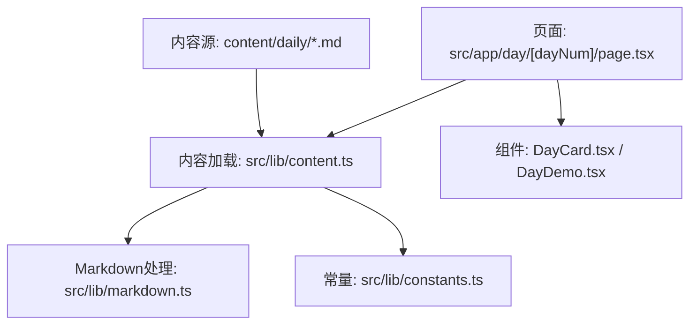
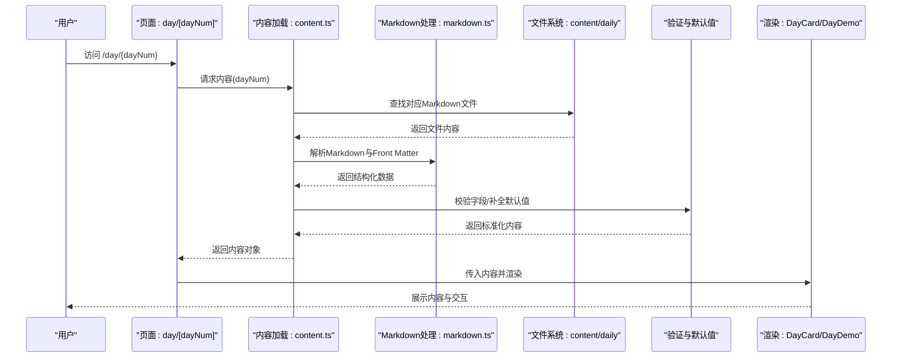
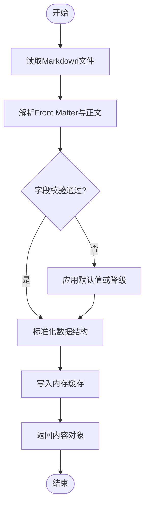
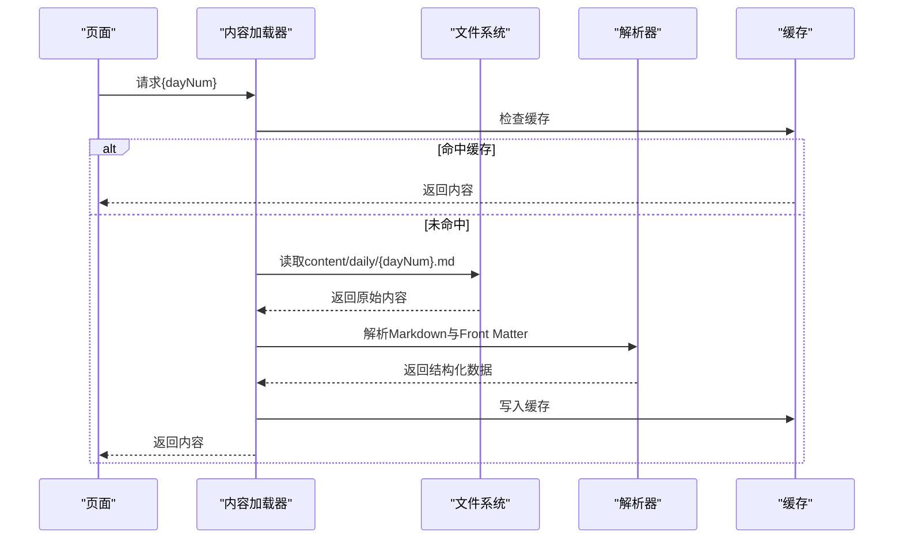
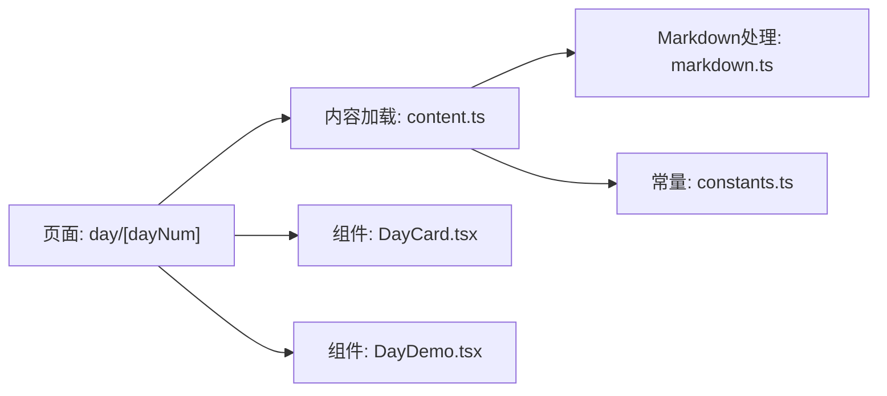

# MCP内容管理

<cite>
**本文引用的文件**
- [src/lib/constants.ts](file://src/lib/constants.ts)
- [src/lib/content.ts](file://src/lib/content.ts)
- [src/lib/markdown.ts](file://src/lib/markdown.ts)
- [src/app/day/[dayNum]/page.tsx](file://src/app/day/[dayNum]/page.tsx)
- [src/components/DayCard.tsx](file://src/components/DayCard.tsx)
- [src/components/DayDemo.tsx](file://src/components/DayDemo.tsx)
- [content/daily/2026-04-23.md](file://content/daily/2026-04-23.md)
</cite>

## 目录
1. [简介](#简介)
2. [项目结构](#项目结构)
3. [核心组件](#核心组件)
4. [架构总览](#架构总览)
5. [详细组件分析](#详细组件分析)
6. [依赖关系分析](#依赖关系分析)
7. [性能考虑](#性能考虑)
8. [故障排查指南](#故障排查指南)
9. [结论](#结论)
10. [附录](#附录)

## 简介
本文件为MCP内容管理系统的技术文档，聚焦于“内容配置的结构化设计”，涵盖常量定义、内容数据模型与加载机制；说明如何组织与管理MCP相关配置信息，内容的版本控制与动态加载策略；记录内容验证规则、默认值处理与错误恢复机制；并提供内容配置的示例与最佳实践。目标是帮助开发者快速理解并扩展该系统的“内容即配置”能力。

## 项目结构
系统采用Next.js应用结构，内容以Markdown形式存放于content目录，业务逻辑集中在src/lib下的模块中，页面与组件负责渲染与交互。关键路径如下：
- 内容存储：content/daily/*.md（按日期归档的每日内容）
- 配置与工具：src/lib/constants.ts（常量）、src/lib/content.ts（内容加载与解析）、src/lib/markdown.ts（Markdown处理）
- 页面入口：src/app/day/[dayNum]/page.tsx（按日期的路由页）
- 展示组件：src/components/DayCard.tsx、src/components/DayDemo.tsx

图表来源
- [src/app/day/[dayNum]/page.tsx](file://src/app/day/[dayNum]/page.tsx)
- [src/lib/content.ts](file://src/lib/content.ts)
- [src/lib/markdown.ts](file://src/lib/markdown.ts)
- [src/lib/constants.ts](file://src/lib/constants.ts)
- [content/daily/2026-04-23.md](file://content/daily/2026-04-23.md)

章节来源
- [src/app/day/[dayNum]/page.tsx](file://src/app/day/[dayNum]/page.tsx)
- [src/lib/content.ts](file://src/lib/content.ts)
- [src/lib/markdown.ts](file://src/lib/markdown.ts)
- [src/lib/constants.ts](file://src/lib/constants.ts)
- [content/daily/2026-04-23.md](file://content/daily/2026-04-23.md)

## 核心组件
本节从“结构化设计”的角度，梳理内容配置的关键要素：常量、数据模型、加载流程、验证与默认值、错误恢复。

- 常量定义（src/lib/constants.ts）
  - 作用：集中管理内容相关的键名、默认值、枚举、路径等，避免硬编码散落各处。
  - 典型职责：内容字段命名规范、默认值、校验规则常量、内容目录与文件名约定等。
  - 建议：将易变项抽离为常量，便于统一维护与测试。

- 内容加载与解析（src/lib/content.ts）
  - 作用：读取content目录下的Markdown文件，解析为统一的数据模型，提供查询接口。
  - 关键点：
    - 文件发现：按日期或标签扫描content/daily目录。
    - 解析：调用markdown处理模块，提取元数据与正文。
    - 缓存：对已解析内容进行内存缓存，减少重复IO。
    - 版本控制：基于文件名中的日期或显式version字段进行排序与选择。
    - 动态加载：按需加载指定日期的内容，支持增量更新。
  - 输出：标准化的内容对象集合，供页面与组件消费。

- Markdown处理（src/lib/markdown.ts）
  - 作用：将Markdown文本转换为结构化数据（如标题、段落、列表、代码块等），并提取Front Matter元数据。
  - 关键点：
    - Front Matter解析：提取title、date、tags、author、version等字段。
    - 安全过滤：对HTML/脚本进行白名单过滤或转义。
    - 扩展语法：根据需求支持表格、数学公式、Mermaid图等。
    - 错误处理：对非法Markdown或缺失字段给出降级策略。

- 页面与组件（src/app/day/[dayNum]/page.tsx, src/components/DayCard.tsx, src/components/DayDemo.tsx）
  - 作用：根据路由参数获取内容并渲染，提供交互与演示。
  - 关键点：
    - 路由参数dayNum映射到具体Markdown文件。
    - 使用content.ts提供的API获取内容。
    - 通过DayCard/DayDemo展示内容卡片与演示区域。

章节来源
- [src/lib/constants.ts](file://src/lib/constants.ts)
- [src/lib/content.ts](file://src/lib/content.ts)
- [src/lib/markdown.ts](file://src/lib/markdown.ts)
- [src/app/day/[dayNum]/page.tsx](file://src/app/day/[dayNum]/page.tsx)
- [src/components/DayCard.tsx](file://src/components/DayCard.tsx)
- [src/components/DayDemo.tsx](file://src/components/DayDemo.tsx)

## 架构总览
下图展示了从页面请求到内容渲染的整体流程，包括内容发现、解析、缓存与渲染。

图表来源
- [src/app/day/[dayNum]/page.tsx](file://src/app/day/[dayNum]/page.tsx)
- [src/lib/content.ts](file://src/lib/content.ts)
- [src/lib/markdown.ts](file://src/lib/markdown.ts)
- [content/daily/2026-04-23.md](file://content/daily/2026-04-23.md)

## 详细组件分析

### 内容数据模型与验证规则
- 数据模型
  - 字段建议：id、title、date、tags、author、version、body、meta等。
  - 类型约束：日期格式、标签数组、版本号语义化等。
  - 来源：Front Matter与Markdown正文两部分。
- 验证规则
  - 必填字段校验：如title、date、version。
  - 格式校验：日期ISO格式、版本号符合语义化规范。
  - 内容安全：过滤危险HTML/脚本。
- 默认值处理
  - 缺失字段时回退到默认值（如空标签数组、默认作者）。
  - 对可选字段提供占位文案或隐藏策略。
- 错误恢复
  - 解析失败时降级为纯文本或提示“内容不可用”。
  - 网络或IO异常时重试与超时控制。
  - 日志记录与告警，便于定位问题。

图表来源
- [src/lib/content.ts](file://src/lib/content.ts)
- [src/lib/markdown.ts](file://src/lib/markdown.ts)

章节来源
- [src/lib/content.ts](file://src/lib/content.ts)
- [src/lib/markdown.ts](file://src/lib/markdown.ts)

### 内容加载机制与动态加载策略
- 文件发现
  - 按日期扫描content/daily目录，生成可用内容清单。
  - 支持按标签、作者、版本筛选。
- 解析与缓存
  - 首次访问时解析并缓存结果，后续直接命中缓存。
  - 支持失效策略：定时刷新或监听文件变更。
- 动态加载
  - 按需加载指定日期的内容，避免一次性加载全部。
  - 支持懒加载与分页，提升首屏性能。
- 版本控制
  - 基于文件名日期或version字段进行排序与选择。
  - 支持多版本并存与切换。

图表来源
- [src/lib/content.ts](file://src/lib/content.ts)
- [src/lib/markdown.ts](file://src/lib/markdown.ts)

章节来源
- [src/lib/content.ts](file://src/lib/content.ts)
- [src/lib/markdown.ts](file://src/lib/markdown.ts)

### 常量与配置管理
- 常量职责
  - 统一管理内容字段名、默认值、枚举、路径等。
  - 降低耦合，提高可维护性与可测试性。
- 配置项建议
  - 内容目录路径、文件命名约定、缓存策略、解析选项。
  - 安全过滤规则、扩展语法开关。
- 最佳实践
  - 将易变配置外置，支持环境差异。
  - 提供配置校验与警告，防止误配。

章节来源
- [src/lib/constants.ts](file://src/lib/constants.ts)

### 页面与组件集成
- 页面路由
  - 使用[dayNum]动态路由匹配具体日期内容。
  - 根据路由参数调用内容加载器获取数据。
- 组件展示
  - DayCard：展示内容摘要与关键信息。
  - DayDemo：提供交互式演示区域。
- 错误边界
  - 在页面或组件层捕获异常，显示友好提示。
  - 提供重试与反馈入口。

章节来源
- [src/app/day/[dayNum]/page.tsx](file://src/app/day/[dayNum]/page.tsx)
- [src/components/DayCard.tsx](file://src/components/DayCard.tsx)
- [src/components/DayDemo.tsx](file://src/components/DayDemo.tsx)

## 依赖关系分析
- 模块耦合
  - 页面依赖内容加载器；内容加载器依赖Markdown处理器与常量。
  - 组件仅依赖标准化后的内容对象，保持低耦合。
- 外部依赖
  - 文件系统：读取content目录下的Markdown。
  - 解析库：用于Markdown与Front Matter解析。
- 潜在循环依赖
  - 确保内容加载器不反向依赖页面或组件。
- 接口契约
  - 内容对象结构稳定，便于前后端或组件间协作。

图表来源
- [src/app/day/[dayNum]/page.tsx](file://src/app/day/[dayNum]/page.tsx)
- [src/lib/content.ts](file://src/lib/content.ts)
- [src/lib/markdown.ts](file://src/lib/markdown.ts)
- [src/lib/constants.ts](file://src/lib/constants.ts)
- [src/components/DayCard.tsx](file://src/components/DayCard.tsx)
- [src/components/DayDemo.tsx](file://src/components/DayDemo.tsx)

章节来源
- [src/app/day/[dayNum]/page.tsx](file://src/app/day/[dayNum]/page.tsx)
- [src/lib/content.ts](file://src/lib/content.ts)
- [src/lib/markdown.ts](file://src/lib/markdown.ts)
- [src/lib/constants.ts](file://src/lib/constants.ts)
- [src/components/DayCard.tsx](file://src/components/DayCard.tsx)
- [src/components/DayDemo.tsx](file://src/components/DayDemo.tsx)

## 性能考虑
- 缓存策略
  - 内存缓存已解析内容，减少重复IO与解析开销。
  - 设置合理的过期时间与失效策略。
- 懒加载
  - 按需加载内容，避免首屏阻塞。
  - 对大图或富媒体资源进行延迟加载。
- 解析优化
  - 增量解析与流式处理，降低内存占用。
  - 对常用语法启用预编译或缓存。
- 监控与度量
  - 记录解析耗时、缓存命中率、错误率等指标。

## 故障排查指南
- 常见问题
  - 文件不存在：检查content目录结构与命名约定。
  - 解析失败：确认Markdown语法与Front Matter格式正确。
  - 字段缺失：查看常量定义的必填字段与默认值。
- 调试步骤
  - 启用详细日志，定位解析与校验阶段的问题。
  - 使用最小复现用例验证配置与解析逻辑。
- 恢复策略
  - 自动重试与超时控制。
  - 降级展示与用户提示。
  - 错误上报与告警。

章节来源
- [src/lib/content.ts](file://src/lib/content.ts)
- [src/lib/markdown.ts](file://src/lib/markdown.ts)

## 结论
本系统通过“内容即配置”的方式，将MCP相关内容以Markdown形式管理，结合常量、数据模型、加载机制与验证规则，实现了可维护、可扩展的内容管理体系。建议在团队内统一遵循字段约定与最佳实践，持续优化性能与稳定性。

## 附录
- 内容配置示例（以content/daily/2026-04-23.md为例）
  - 包含Front Matter元数据与正文内容。
  - 字段建议：title、date、tags、author、version等。
  - 正文可使用Markdown语法组织章节、列表、代码块等。
- 最佳实践
  - 统一命名与目录结构，便于自动化处理。
  - 严格校验与默认值处理，保证数据一致性。
  - 合理使用缓存与懒加载，提升用户体验。
  - 建立测试用例覆盖解析与验证逻辑。

章节来源
- [content/daily/2026-04-23.md](file://content/daily/2026-04-23.md)