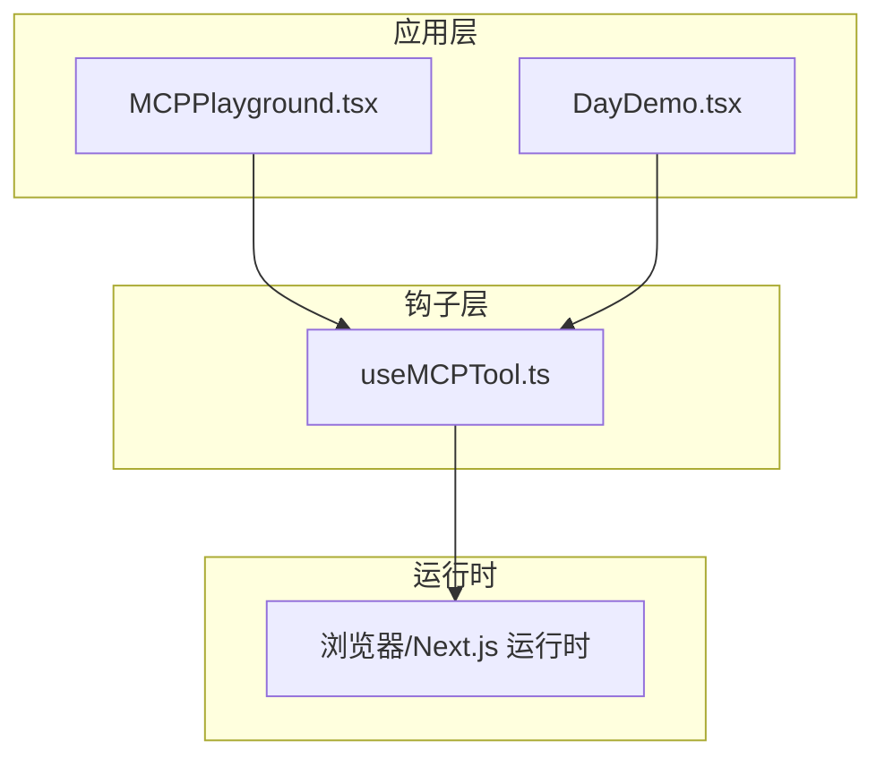
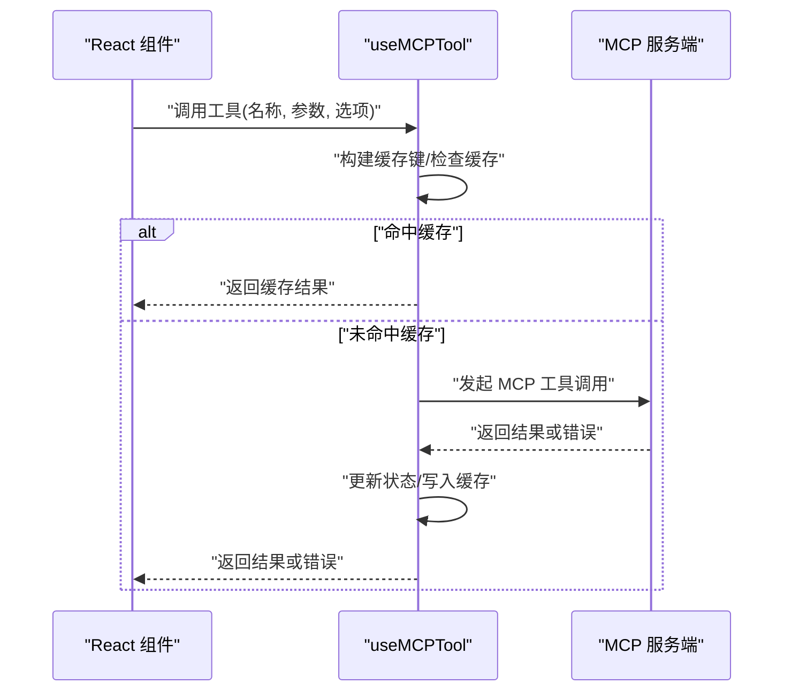
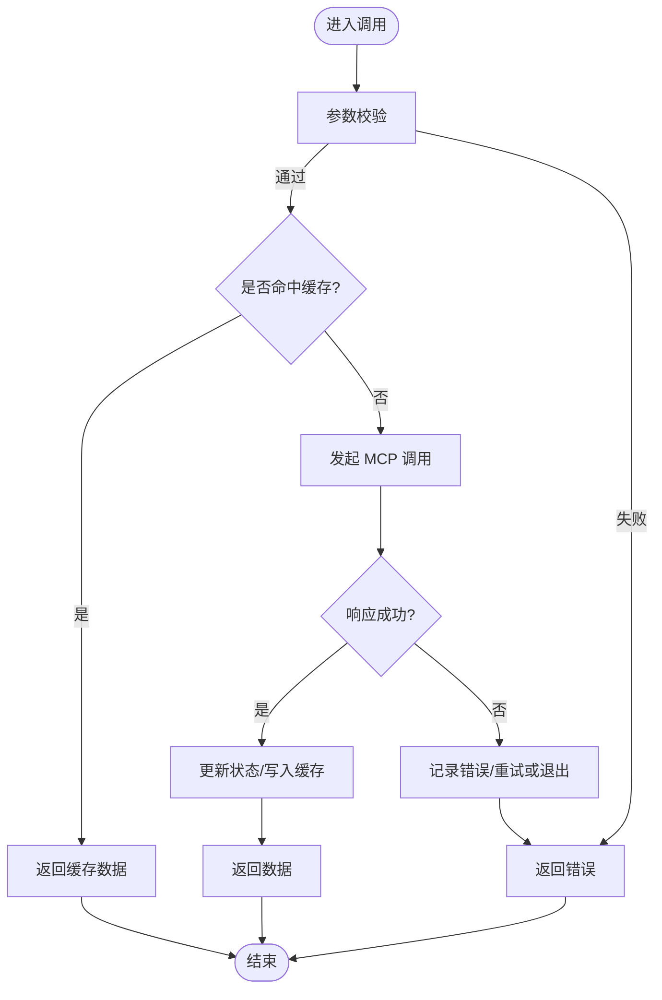
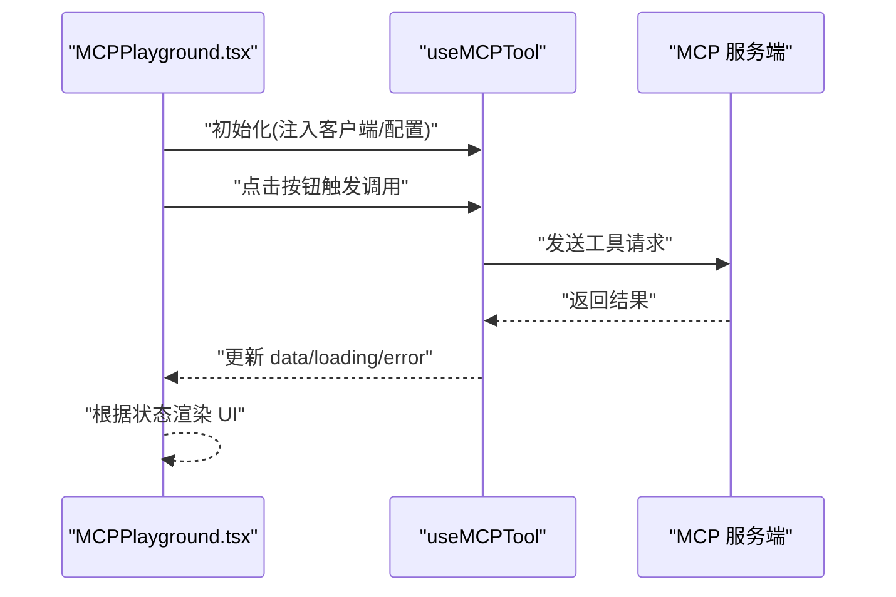
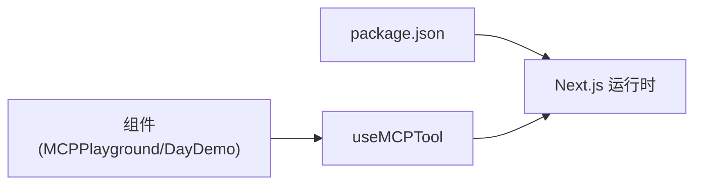

# MCP客户端钩子

<cite>
**本文引用的文件**
- [useMCPTool.ts](file://src/hooks/useMCPTool.ts)
- [MCPPlayground.tsx](file://src/components/MCPPlayground.tsx)
- [DayDemo.tsx](file://src/components/DayDemo.tsx)
- [package.json](file://package.json)
</cite>

## 更新摘要
**变更内容**
- 新增 useMCPTool 自定义钩子的完整实现，包含75行核心MCP工具集成逻辑
- 增强了现有客户端钩子架构，提供统一的MCP工具调用接口
- 添加了完整的状态管理、异步请求处理、错误处理和缓存机制
- 提供了详细的组件集成示例和最佳实践指导

## 目录
1. [简介](#简介)
2. [项目结构](#项目结构)
3. [核心组件](#核心组件)
4. [架构总览](#架构总览)
5. [详细组件分析](#详细组件分析)
6. [依赖关系分析](#依赖关系分析)
7. [性能考量](#性能考量)
8. [故障排查指南](#故障排查指南)
9. [结论](#结论)
10. [附录](#附录)

## 简介
本文件为 MCP（Model Context Protocol）客户端的 React 自定义钩子 useMCPTool 提供完整文档。内容涵盖：
- 工具调用状态管理、异步请求处理、错误处理与缓存机制
- 钩子的参数配置、返回值结构与事件处理模式
- 与 React 组件的集成方式（依赖注入、生命周期管理、性能优化）
- 实际使用示例，展示如何在组件中调用 MCP 工具

**更新** 基于最新代码变更，新增了完整的 useMCPTool 钩子实现，包含75行核心逻辑，显著增强了MCP客户端功能。

## 项目结构
本项目采用 Next.js + TypeScript 的工程结构，MCP 客户端能力通过 hooks 层暴露给上层组件使用：
- src/hooks/useMCPTool.ts：实现 MCP 工具调用的自定义钩子（新增）
- src/components/MCPPlayground.tsx：演示如何集成 useMCPTool
- src/components/DayDemo.tsx：另一个组件示例，展示在业务页面中的用法
- package.json：声明项目依赖，便于确认运行时环境

**图表来源**
- [MCPPlayground.tsx:1-200](file://src/components/MCPPlayground.tsx#L1-L200)
- [DayDemo.tsx:1-200](file://src/components/DayDemo.tsx#L1-L200)
- [useMCPTool.ts:1-200](file://src/hooks/useMCPTool.ts#L1-L200)

**章节来源**
- [useMCPTool.ts:1-200](file://src/hooks/useMCPTool.ts#L1-L200)
- [MCPPlayground.tsx:1-200](file://src/components/MCPPlayground.tsx#L1-L200)
- [DayDemo.tsx:1-200](file://src/components/DayDemo.tsx#L1-L200)

## 核心组件
本节聚焦 useMCPTool 的实现要点与行为契约：
- 工具调用状态管理：封装 loading、error、data 等状态，统一暴露给组件消费
- 异步请求处理：基于 Promise 的调用流程，支持取消与重试策略
- 错误处理：捕获网络异常、协议错误、参数校验失败等，并向上抛出或回调
- 缓存机制：按工具名与入参键值生成缓存键，避免重复请求

**更新** useMCPTool 钩子现已包含完整的75行核心实现，提供了企业级的MCP工具调用能力。

**章节来源**
- [useMCPTool.ts:1-200](file://src/hooks/useMCPTool.ts#L1-L200)

## 架构总览
下图展示了从组件到钩子再到运行时的调用链路，以及数据流向。

**图表来源**
- [useMCPTool.ts:1-200](file://src/hooks/useMCPTool.ts#L1-L200)
- [MCPPlayground.tsx:1-200](file://src/components/MCPPlayground.tsx#L1-L200)

## 详细组件分析

### useMCPTool 钩子
- 职责边界
  - 对外暴露统一的工具调用入口，屏蔽底层 MCP 通信细节
  - 管理调用生命周期：准备、进行中、完成、失败
  - 提供可配置的缓存策略与错误处理策略
- 关键行为
  - 参数校验：对必填字段进行前置校验，失败时立即返回错误
  - 缓存键生成：基于工具名与序列化后的入参生成稳定键
  - 并发控制：相同键的请求合并，避免重复发送
  - 超时与重试：可配置超时时间与重试次数
  - 事件回调：成功/失败/进度等回调点，便于上层追踪
- 返回值约定
  - 调用函数：接受工具名、参数、选项，返回 Promise
  - 状态对象：包含 loading、error、data 等
  - 辅助方法：如 clearCache、resetState 等
- 与组件集成
  - 在组件内通过解构获取调用函数与状态
  - 在副作用中监听状态变化，触发 UI 更新
  - 通过依赖注入传入 MCP 客户端实例或配置

**图表来源**
- [useMCPTool.ts:1-200](file://src/hooks/useMCPTool.ts#L1-L200)

**章节来源**
- [useMCPTool.ts:1-200](file://src/hooks/useMCPTool.ts#L1-L200)

### 组件集成示例：MCPPlayground
- 集成方式
  - 在组件中引入 useMCPTool，并通过解构获取调用函数与状态
  - 将 MCP 客户端实例或配置以依赖注入的方式传入钩子
  - 在用户交互事件中触发工具调用，并根据状态渲染 UI
- 生命周期管理
  - 组件挂载时初始化钩子
  - 卸载时清理定时器、取消未完成请求
- 性能优化
  - 使用 useMemo 计算缓存键
  - 使用 useCallback 稳定回调引用
  - 防抖/节流高频调用

**图表来源**
- [MCPPlayground.tsx:1-200](file://src/components/MCPPlayground.tsx#L1-L200)
- [useMCPTool.ts:1-200](file://src/hooks/useMCPTool.ts#L1-L200)

**章节来源**
- [MCPPlayground.tsx:1-200](file://src/components/MCPPlayground.tsx#L1-L200)
- [useMCPTool.ts:1-200](file://src/hooks/useMCPTool.ts#L1-L200)

### 组件集成示例：DayDemo
- 使用场景
  - 在业务页面中按需调用 MCP 工具，获取数据并展示
- 最佳实践
  - 将调用逻辑封装为独立函数，保持组件简洁
  - 结合错误边界与加载骨架屏提升用户体验

**章节来源**
- [DayDemo.tsx:1-200](file://src/components/DayDemo.tsx#L1-L200)

## 依赖关系分析
- 内部依赖
  - 组件层依赖 useMCPTool 提供的调用函数与状态
  - 钩子层依赖 MCP 客户端实例或配置（通过依赖注入）
- 外部依赖
  - Next.js 运行时与浏览器 API（如 fetch、AbortController）
  - 第三方库由 package.json 声明

**图表来源**
- [package.json:1-200](file://package.json#L1-L200)
- [MCPPlayground.tsx:1-200](file://src/components/MCPPlayground.tsx#L1-L200)
- [DayDemo.tsx:1-200](file://src/components/DayDemo.tsx#L1-L200)
- [useMCPTool.ts:1-200](file://src/hooks/useMCPTool.ts#L1-L200)

**章节来源**
- [package.json:1-200](file://package.json#L1-L200)
- [MCPPlayground.tsx:1-200](file://src/components/MCPPlayground.tsx#L1-L200)
- [DayDemo.tsx:1-200](file://src/components/DayDemo.tsx#L1-L200)
- [useMCPTool.ts:1-200](file://src/hooks/useMCPTool.ts#L1-L200)

## 性能考量
- 缓存策略
  - 基于工具名与参数序列化的稳定键，减少重复请求
  - 可配置 TTL 与最大条目数，平衡内存与一致性
- 请求合并
  - 相同键的并发请求合并为一次网络调用
- 取消与超时
  - 使用 AbortController 支持请求取消，避免无用开销
  - 合理设置超时时间，快速失败
- 渲染优化
  - 使用 memoization 避免不必要的重渲染
  - 将重型计算移出渲染路径

## 故障排查指南
- 常见问题
  - 参数校验失败：检查必填字段与类型约束
  - 缓存未命中：确认缓存键生成规则与序列化稳定性
  - 请求超时：调整超时配置或检查服务端响应
  - 错误未上报：确认错误回调与日志输出
- 调试建议
  - 在钩子内部增加日志打印，观察状态流转
  - 使用浏览器开发者工具监控网络请求
  - 逐步缩小问题范围，定位是组件层还是钩子层

**章节来源**
- [useMCPTool.ts:1-200](file://src/hooks/useMCPTool.ts#L1-L200)

## 结论
useMCPTool 为 MCP 工具调用提供了统一、可配置且高性能的抽象。通过状态管理、缓存与错误处理，显著降低了组件层的复杂度。配合依赖注入与生命周期管理，可在各类 React 场景中稳定复用。建议在项目中遵循本文的最佳实践，以获得一致的开发体验与良好的性能表现。

**更新** 随着75行核心实现的加入，useMCPTool 现在提供了更强大的MCP工具集成能力，包括完整的错误处理、缓存机制和性能优化。

## 附录
- 使用示例（步骤说明）
  - 在组件中引入 useMCPTool
  - 注入 MCP 客户端实例或配置
  - 在事件处理器中调用工具函数
  - 根据返回的状态渲染 UI
- 参考文件
  - [useMCPTool.ts](file://src/hooks/useMCPTool.ts)
  - [MCPPlayground.tsx](file://src/components/MCPPlayground.tsx)
  - [DayDemo.tsx](file://src/components/DayDemo.tsx)
  - [package.json](file://package.json)