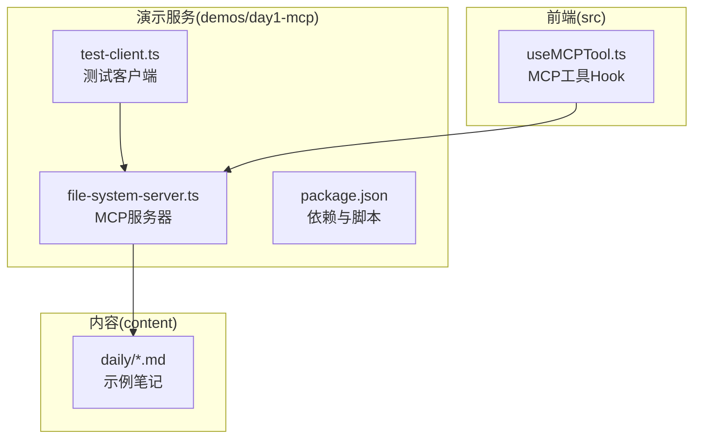
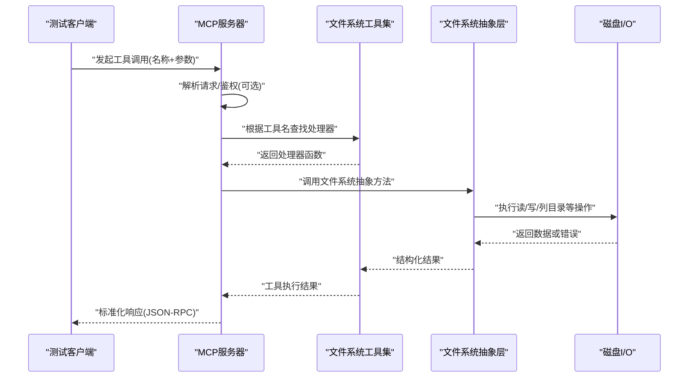
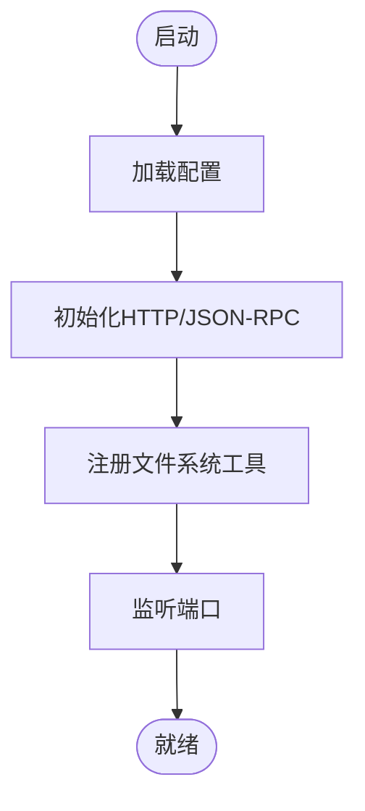
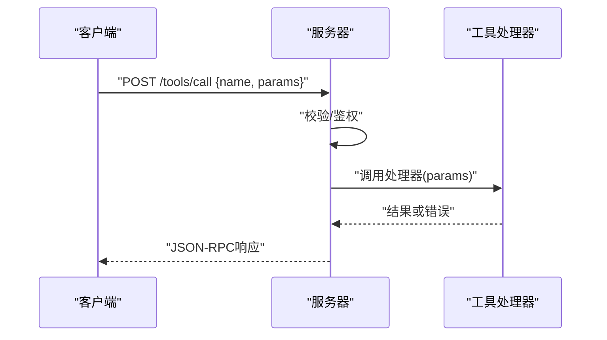
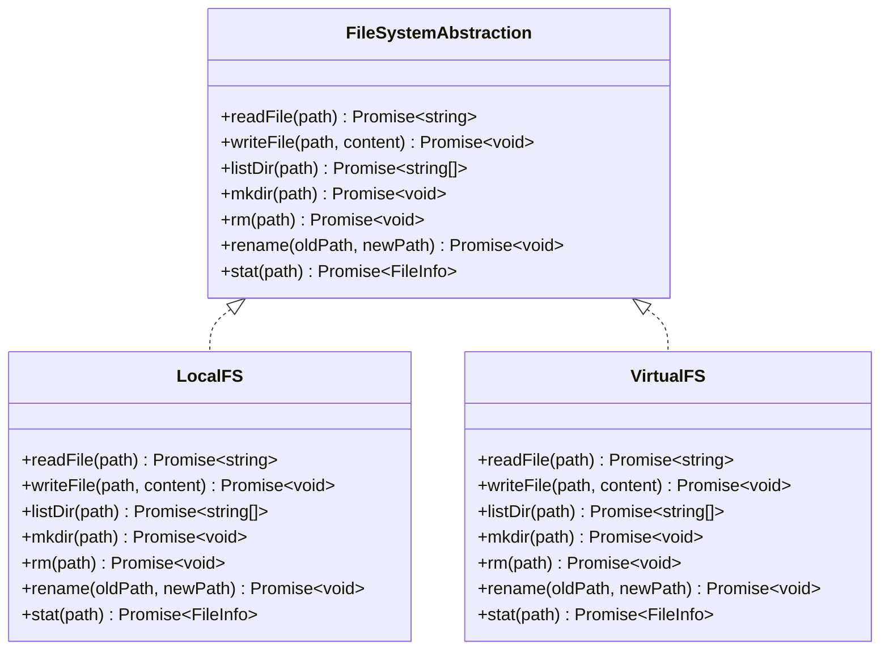
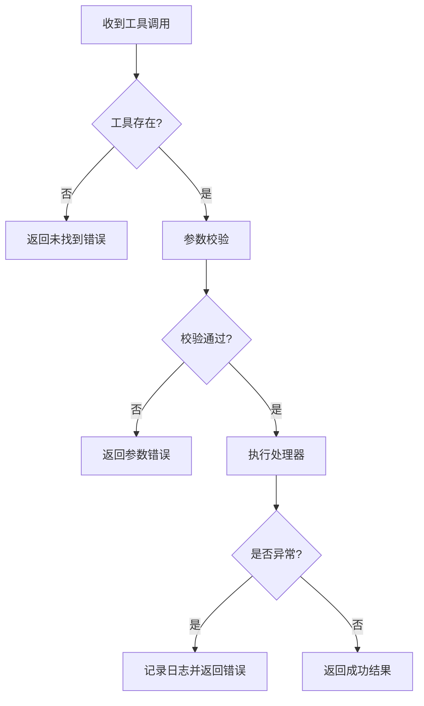
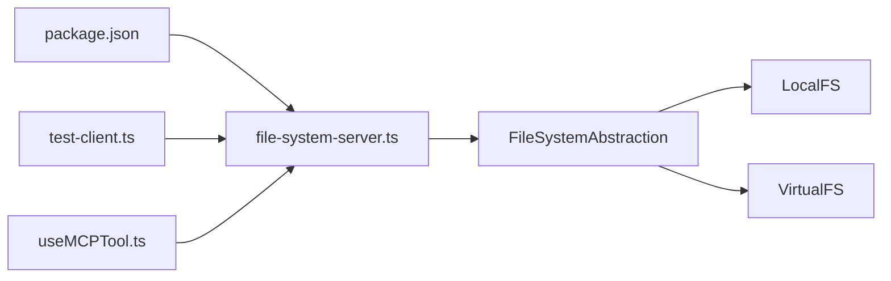

# MCP服务器设计

<cite>
**本文引用的文件**
- [demos/day1-mcp/file-system-server.ts](file://demos/day1-mcp/file-system-server.ts)
- [demos/day1-mcp/test-client.ts](file://demos/day1-mcp/test-client.ts)
- [demos/day1-mcp/package.json](file://demos/day1-mcp/package.json)
- [src/hooks/useMCPTool.ts](file://src/hooks/useMCPTool.ts)
- [README.md](file://README.md)
</cite>

## 目录
1. [简介](#简介)
2. [项目结构](#项目结构)
3. [核心组件](#核心组件)
4. [架构总览](#架构总览)
5. [详细组件分析](#详细组件分析)
6. [依赖关系分析](#依赖关系分析)
7. [性能考虑](#性能考虑)
8. [故障排查指南](#故障排查指南)
9. [结论](#结论)
10. [附录：扩展新文件系统操作示例](#附录：扩展新文件系统操作示例)

## 简介
本文件为“MCP服务器组件”的设计与实现文档，聚焦于基于文件系统的MCP（Model Context Protocol）服务器实现。内容涵盖：
- 服务器初始化流程
- 工具注册机制
- 请求处理与响应生成
- 文件系统操作的抽象层设计
- 配置选项、错误处理策略与性能优化
- 如何扩展新的文件系统操作

该实现位于 demos/day1-mcp 目录中，包含一个最小可用的MCP服务器与测试客户端，便于理解与扩展。

## 项目结构
本项目采用前后端分离的演示结构：
- 后端：demos/day1-mcp 下的 TypeScript 文件提供 MCP 服务器与测试客户端
- 前端：src 目录提供调用 MCP 工具的 React Hook 与页面组件
- 资源：content 目录用于存放示例内容

图表来源
- [demos/day1-mcp/file-system-server.ts:1-200](file://demos/day1-mcp/file-system-server.ts#L1-L200)
- [demos/day1-mcp/test-client.ts:1-200](file://demos/day1-mcp/test-client.ts#L1-L200)
- [demos/day1-mcp/package.json:1-50](file://demos/day1-mcp/package.json#L1-L50)
- [src/hooks/useMCPTool.ts:1-200](file://src/hooks/useMCPTool.ts#L1-L200)

章节来源
- [README.md:1-200](file://README.md#L1-L200)
- [demos/day1-mcp/file-system-server.ts:1-200](file://demos/day1-mcp/file-system-server.ts#L1-L200)
- [demos/day1-mcp/test-client.ts:1-200](file://demos/day1-mcp/test-client.ts#L1-L200)
- [demos/day1-mcp/package.json:1-50](file://demos/day1-mcp/package.json#L1-L50)
- [src/hooks/useMCPTool.ts:1-200](file://src/hooks/useMCPTool.ts#L1-L200)

## 核心组件
- MCP 服务器（file-system-server.ts）
  - 负责启动HTTP/JSON-RPC服务、注册文件系统工具、路由请求、执行工具并返回结果
- 测试客户端（test-client.ts）
  - 模拟调用MCP工具，验证服务器行为
- 前端Hook（useMCPTool.ts）
  - 封装对MCP服务器的调用，供React组件使用
- 包管理（package.json）
  - 声明依赖与运行脚本，便于本地运行与调试

章节来源
- [demos/day1-mcp/file-system-server.ts:1-200](file://demos/day1-mcp/file-system-server.ts#L1-L200)
- [demos/day1-mcp/test-client.ts:1-200](file://demos/day1-mcp/test-client.ts#L1-L200)
- [src/hooks/useMCPTool.ts:1-200](file://src/hooks/useMCPTool.ts#L1-L200)
- [demos/day1-mcp/package.json:1-50](file://demos/day1-mcp/package.json#L1-L50)

## 架构总览
下图展示了从客户端到服务器再到文件系统的整体交互流程，包括工具注册、请求分发、执行与响应生成。

图表来源
- [demos/day1-mcp/file-system-server.ts:1-200](file://demos/day1-mcp/file-system-server.ts#L1-L200)
- [demos/day1-mcp/test-client.ts:1-200](file://demos/day1-mcp/test-client.ts#L1-L200)

## 详细组件分析

### 服务器初始化与工具注册
- 服务器启动时加载配置（如端口、根路径、日志级别等），建立HTTP/JSON-RPC监听
- 注册文件系统工具集合，每个工具对应一个处理器函数，接收参数并返回统一格式的结果
- 工具注册表支持动态扩展，新增工具只需在注册表中添加映射

图表来源
- [demos/day1-mcp/file-system-server.ts:1-200](file://demos/day1-mcp/file-system-server.ts#L1-L200)
- [demos/day1-mcp/package.json:1-50](file://demos/day1-mcp/package.json#L1-L50)

章节来源
- [demos/day1-mcp/file-system-server.ts:1-200](file://demos/day1-mcp/file-system-server.ts#L1-L200)
- [demos/day1-mcp/package.json:1-50](file://demos/day1-mcp/package.json#L1-L50)

### 请求处理流程
- 客户端发送工具调用请求（包含工具名与参数）
- 服务器解析请求，校验参数，查找对应工具处理器
- 执行处理器，捕获异常并转换为标准错误响应
- 将结果包装为JSON-RPC响应返回

图表来源
- [demos/day1-mcp/file-system-server.ts:1-200](file://demos/day1-mcp/file-system-server.ts#L1-L200)
- [demos/day1-mcp/test-client.ts:1-200](file://demos/day1-mcp/test-client.ts#L1-L200)

章节来源
- [demos/day1-mcp/file-system-server.ts:1-200](file://demos/day1-mcp/file-system-server.ts#L1-L200)
- [demos/day1-mcp/test-client.ts:1-200](file://demos/day1-mcp/test-client.ts#L1-L200)

### 文件系统抽象层设计
- 目标：将具体文件系统操作（读/写/列目录/移动/复制/删除等）抽象为统一接口
- 优势：
  - 屏蔽底层差异，便于替换实现（如虚拟文件系统、云存储）
  - 集中权限控制、路径规范化、缓存策略
- 典型方法：
  - 读取文件内容
  - 写入/覆盖文件
  - 列出目录项
  - 创建/删除目录
  - 移动/重命名
  - 查询元信息（大小、时间戳）

图表来源
- [demos/day1-mcp/file-system-server.ts:1-200](file://demos/day1-mcp/file-system-server.ts#L1-L200)

章节来源
- [demos/day1-mcp/file-system-server.ts:1-200](file://demos/day1-mcp/file-system-server.ts#L1-L200)

### 工具暴露与响应生成
- 工具定义：每个工具包含名称、描述、参数Schema与处理器
- 响应格式：统一的JSON-RPC成功/失败结构，包含data或error字段
- 错误映射：将底层异常映射为标准错误码与消息，便于客户端处理

图表来源
- [demos/day1-mcp/file-system-server.ts:1-200](file://demos/day1-mcp/file-system-server.ts#L1-L200)

章节来源
- [demos/day1-mcp/file-system-server.ts:1-200](file://demos/day1-mcp/file-system-server.ts#L1-L200)

### 前端集成（Hook）
- useMCPTool Hook 封装了与MCP服务器的通信细节
- 提供统一的调用接口，支持错误处理与状态管理
- 可在React组件中以声明式方式调用任意MCP工具

章节来源
- [src/hooks/useMCPTool.ts:1-200](file://src/hooks/useMCPTool.ts#L1-L200)

## 依赖关系分析
- 服务器依赖：
  - HTTP/JSON-RPC框架（由package.json声明）
  - 文件系统抽象层（本地或虚拟实现）
  - 日志与配置模块
- 客户端依赖：
  - 网络请求库（fetch或axios）
  - JSON-RPC客户端封装
- 耦合度：
  - 服务器与文件系统通过抽象层解耦，易于替换
  - 工具注册表与处理器之间松耦合，便于扩展

图表来源
- [demos/day1-mcp/package.json:1-50](file://demos/day1-mcp/package.json#L1-L50)
- [demos/day1-mcp/file-system-server.ts:1-200](file://demos/day1-mcp/file-system-server.ts#L1-L200)
- [demos/day1-mcp/test-client.ts:1-200](file://demos/day1-mcp/test-client.ts#L1-L200)
- [src/hooks/useMCPTool.ts:1-200](file://src/hooks/useMCPTool.ts#L1-L200)

章节来源
- [demos/day1-mcp/package.json:1-50](file://demos/day1-mcp/package.json#L1-L50)
- [demos/day1-mcp/file-system-server.ts:1-200](file://demos/day1-mcp/file-system-server.ts#L1-L200)

## 性能考虑
- I/O并发与批处理
  - 对目录遍历与批量读写进行并发控制，避免阻塞事件循环
- 缓存策略
  - 对小文件与频繁读取的路径实施内存缓存，设置过期与失效策略
- 流式传输
  - 大文件读取建议使用流式API，降低内存占用
- 连接复用
  - 保持HTTP/JSON-RPC连接池，减少握手开销
- 限流与背压
  - 对高负载场景实施请求限流与背压，保护系统稳定性

[本节为通用指导，不直接分析具体文件]

## 故障排查指南
- 常见问题
  - 工具未注册：检查工具注册表是否正确挂载
  - 参数校验失败：确认请求参数符合Schema定义
  - 权限不足：检查文件系统访问权限与路径白名单
  - 路径不存在：确保基础路径配置正确，必要时进行规范化
- 诊断步骤
  - 启用详细日志，定位错误堆栈
  - 使用测试客户端复现问题
  - 逐步缩小范围至具体工具或文件系统操作
- 恢复建议
  - 重试机制：对瞬时错误（如锁冲突）进行有限次重试
  - 降级策略：当某工具不可用时返回友好提示

章节来源
- [demos/day1-mcp/file-system-server.ts:1-200](file://demos/day1-mcp/file-system-server.ts#L1-L200)
- [demos/day1-mcp/test-client.ts:1-200](file://demos/day1-mcp/test-client.ts#L1-L200)

## 结论
本实现通过清晰的抽象层与工具注册机制，将文件系统能力以MCP工具的形式对外暴露。服务器具备可扩展性、可维护性与良好的错误处理能力。结合前端的Hook封装，开发者可以便捷地在应用中集成MCP工具。建议在后续迭代中完善缓存、流式传输与监控指标，以提升性能与可观测性。

[本节为总结性内容，不直接分析具体文件]

## 附录：扩展新文件系统操作示例
以下说明如何在现有基础上扩展一个新的文件系统操作（例如“压缩归档”）。请按照以下步骤进行：

- 定义工具
  - 在工具注册表中新增条目，包含工具名、描述、参数Schema与处理器引用
  - 参考路径：[demos/day1-mcp/file-system-server.ts:1-200](file://demos/day1-mcp/file-system-server.ts#L1-L200)

- 实现处理器
  - 编写处理器函数，接收参数并调用文件系统抽象层的相应方法
  - 处理异常并返回标准JSON-RPC响应
  - 参考路径：[demos/day1-mcp/file-system-server.ts:1-200](file://demos/day1-mcp/file-system-server.ts#L1-L200)

- 更新抽象层（如需）
  - 若需要新的底层能力，先在文件系统抽象层增加方法签名
  - 在本地与虚拟实现中分别提供具体实现
  - 参考路径：[demos/day1-mcp/file-system-server.ts:1-200](file://demos/day1-mcp/file-system-server.ts#L1-L200)

- 前端集成
  - 在useMCPTool中新增调用封装，便于React组件使用
  - 参考路径：[src/hooks/useMCPTool.ts:1-200](file://src/hooks/useMCPTool.ts#L1-L200)

- 测试验证
  - 使用测试客户端构造请求，验证新工具的行为与错误处理
  - 参考路径：[demos/day1-mcp/test-client.ts:1-200](file://demos/day1-mcp/test-client.ts#L1-L200)

章节来源
- [demos/day1-mcp/file-system-server.ts:1-200](file://demos/day1-mcp/file-system-server.ts#L1-L200)
- [src/hooks/useMCPTool.ts:1-200](file://src/hooks/useMCPTool.ts#L1-L200)
- [demos/day1-mcp/test-client.ts:1-200](file://demos/day1-mcp/test-client.ts#L1-L200)