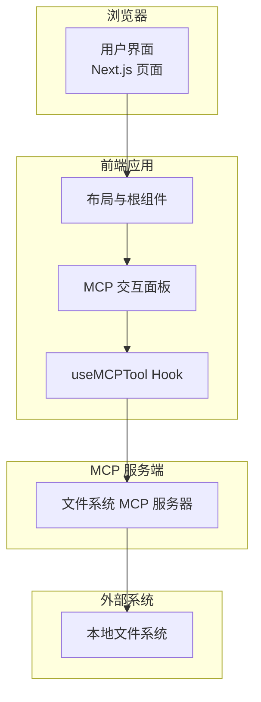
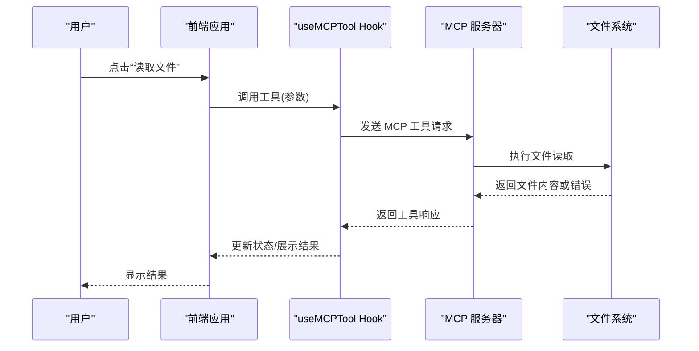
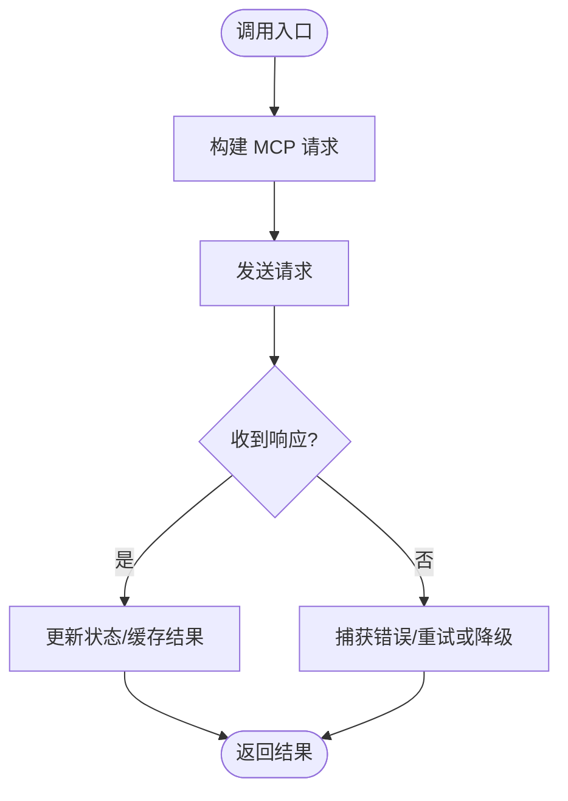
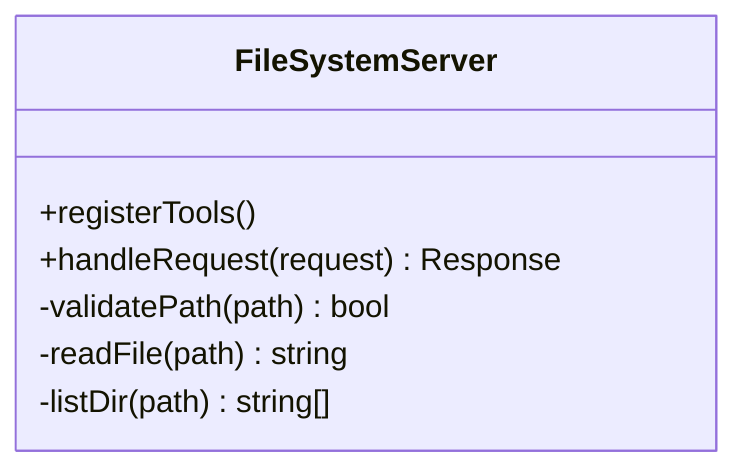
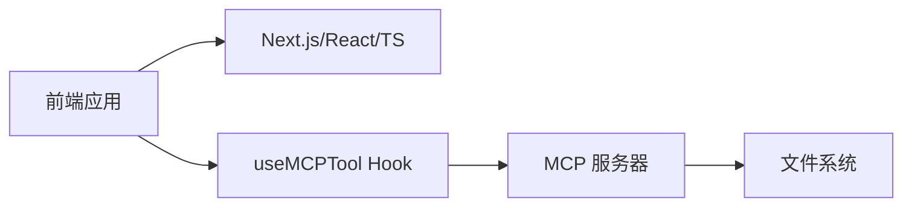
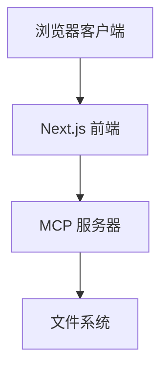
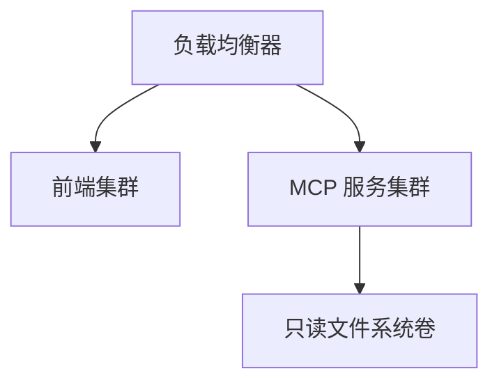

# MCP架构设计

<cite>
**本文引用的文件**
- [README.md](file://README.md)
- [package.json](file://package.json)
- [next.config.ts](file://next.config.ts)
- [tsconfig.json](file://tsconfig.json)
- [src/app/layout.tsx](file://src/app/layout.tsx)
- [src/app/page.tsx](file://src/app/page.tsx)
- [src/components/MCPPlayground.tsx](file://src/components/MCPPlayground.tsx)
- [src/hooks/useMCPTool.ts](file://src/hooks/useMCPTool.ts)
- [demos/day1-mcp/package.json](file://demos/day1-mcp/package.json)
- [demos/day1-mcp/file-system-server.ts](file://demos/day1-mcp/file-system-server.ts)
- [demos/day1-mcp/test-client.ts](file://demos/day1-mcp/test-client.ts)
</cite>

## 目录
1. [简介](#简介)
2. [项目结构](#项目结构)
3. [核心组件](#核心组件)
4. [架构总览](#架构总览)
5. [详细组件分析](#详细组件分析)
6. [依赖关系分析](#依赖关系分析)
7. [性能考虑](#性能考虑)
8. [故障排查指南](#故障排查指南)
9. [结论](#结论)
10. [附录](#附录)

## 简介
本文件为基于 Model Context Protocol（MCP）的演示型应用提供架构文档。目标包括：描述高层设计、架构模式与系统边界；记录组件交互、数据流与集成模式；解释技术决策、权衡与约束；涵盖基础设施要求、可扩展性考虑与部署拓扑；提供系统上下文图与组件分解；并覆盖安全性、监控与灾难恢复等横切关注点，同时记录技术栈、第三方依赖与版本兼容性。

该仓库包含一个 Next.js 前端应用与一个独立的 MCP 示例服务器/客户端演示，用于展示如何通过 MCP 协议与外部工具/资源进行交互。

## 项目结构
整体采用“前端演示 + 独立 MCP 服务”的分层组织方式：
- 前端（Next.js App Router）：提供交互式界面，封装对 MCP 工具的调用能力，并通过自定义 Hook 暴露统一接口。
- 演示服务（Node.js）：实现一个基于 MCP 的文件系统工具服务器，并提供测试客户端以验证端到端流程。
- 配置与工程化：使用 TypeScript、ESLint、PostCSS、Next.js 配置与包管理脚本。

图表来源
- [src/app/layout.tsx:1-200](file://src/app/layout.tsx#L1-L200)
- [src/app/page.tsx:1-200](file://src/app/page.tsx#L1-L200)
- [src/components/MCPPlayground.tsx:1-200](file://src/components/MCPPlayground.tsx#L1-L200)
- [src/hooks/useMCPTool.ts:1-200](file://src/hooks/useMCPTool.ts#L1-L200)
- [demos/day1-mcp/file-system-server.ts:1-200](file://demos/day1-mcp/file-system-server.ts#L1-L200)

章节来源
- [README.md:1-200](file://README.md#L1-L200)
- [package.json:1-200](file://package.json#L1-L200)
- [next.config.ts:1-200](file://next.config.ts#L1-L200)
- [tsconfig.json:1-200](file://tsconfig.json#L1-L200)

## 核心组件
- 页面与布局：负责渲染应用壳与路由入口，承载演示内容。
- MCP 交互面板：提供可视化操作入口，触发工具调用并展示结果。
- useMCPTool Hook：封装 MCP 工具调用的生命周期、错误处理与状态管理，对外暴露统一的调用接口。
- MCP 文件系统服务器：实现 MCP 协议的工具定义与执行逻辑，将上层请求映射到文件系统操作。
- 测试客户端：用于在 Node 环境验证 MCP 服务器的工具可用性。

章节来源
- [src/app/layout.tsx:1-200](file://src/app/layout.tsx#L1-L200)
- [src/app/page.tsx:1-200](file://src/app/page.tsx#L1-L200)
- [src/components/MCPPlayground.tsx:1-200](file://src/components/MCPPlayground.tsx#L1-L200)
- [src/hooks/useMCPTool.ts:1-200](file://src/hooks/useMCPTool.ts#L1-L200)
- [demos/day1-mcp/file-system-server.ts:1-200](file://demos/day1-mcp/file-system-server.ts#L1-L200)
- [demos/day1-mcp/test-client.ts:1-200](file://demos/day1-mcp/test-client.ts#L1-L200)

## 架构总览
本系统采用“前后端分离 + 协议解耦”的架构：
- 前端通过自定义 Hook 抽象 MCP 工具调用，屏蔽底层通信细节。
- MCP 服务器作为独立进程运行，遵循 MCP 协议暴露工具能力，便于横向扩展与替换。
- 文件系统作为受控的外部资源，由服务器进行权限与路径白名单控制。

图表来源
- [src/components/MCPPlayground.tsx:1-200](file://src/components/MCPPlayground.tsx#L1-L200)
- [src/hooks/useMCPTool.ts:1-200](file://src/hooks/useMCPTool.ts#L1-L200)
- [demos/day1-mcp/file-system-server.ts:1-200](file://demos/day1-mcp/file-system-server.ts#L1-L200)

## 详细组件分析

### 前端应用（Next.js）
- 职责：提供页面与布局，承载 MCP 交互面板，处理用户输入与结果展示。
- 关键点：
  - 使用 App Router 组织页面与布局。
  - 通过 Hook 封装工具调用，避免在组件中直接耦合通信细节。
  - 样式与构建由 Next.js 生态统一管理。

章节来源
- [src/app/layout.tsx:1-200](file://src/app/layout.tsx#L1-L200)
- [src/app/page.tsx:1-200](file://src/app/page.tsx#L1-L200)

### MCP 交互面板（MCPPlayground）
- 职责：提供可视化的工具调用入口，收集参数、发起调用、展示结果与错误。
- 关键点：
  - 将工具列表与参数表单绑定。
  - 调用 Hook 获取异步结果，并在 UI 中反馈。
  - 支持基本错误提示与加载态。

章节来源
- [src/components/MCPPlayground.tsx:1-200](file://src/components/MCPPlayground.tsx#L1-L200)

### 工具调用 Hook（useMCPTool）
- 职责：封装 MCP 工具的生命周期管理、错误处理、重试策略与缓存策略（可选）。
- 关键点：
  - 暴露统一的调用函数，接收工具名与参数。
  - 内部维护请求状态、错误信息与结果缓存。
  - 可配置超时、重试次数与退避策略。

图表来源
- [src/hooks/useMCPTool.ts:1-200](file://src/hooks/useMCPTool.ts#L1-L200)

章节来源
- [src/hooks/useMCPTool.ts:1-200](file://src/hooks/useMCPTool.ts#L1-L200)

### MCP 文件系统服务器
- 职责：实现 MCP 协议，注册文件系统相关工具，执行安全校验后访问文件系统。
- 关键点：
  - 工具定义与参数校验。
  - 路径白名单与权限控制。
  - 错误分类与标准化响应。

图表来源
- [demos/day1-mcp/file-system-server.ts:1-200](file://demos/day1-mcp/file-system-server.ts#L1-L200)

章节来源
- [demos/day1-mcp/file-system-server.ts:1-200](file://demos/day1-mcp/file-system-server.ts#L1-L200)

### 测试客户端
- 职责：在 Node 环境中连接 MCP 服务器，列举并调用工具，验证端到端流程。
- 关键点：
  - 建立连接、发现工具、构造参数、打印结果与错误。
  - 便于自动化测试与回归验证。

章节来源
- [demos/day1-mcp/test-client.ts:1-200](file://demos/day1-mcp/test-client.ts#L1-L200)

## 依赖关系分析
- 前端依赖：Next.js、React、TypeScript、ESLint、PostCSS 等。
- 演示服务依赖：Node.js、MCP SDK（或等价库）、文件系统访问能力。
- 版本兼容性：
  - 前端需与 Next.js 版本兼容的 React 与 TypeScript。
  - 演示服务需与 MCP 协议版本一致，确保工具契约稳定。

图表来源
- [package.json:1-200](file://package.json#L1-L200)
- [demos/day1-mcp/package.json:1-200](file://demos/day1-mcp/package.json#L1-L200)

章节来源
- [package.json:1-200](file://package.json#L1-L200)
- [demos/day1-mcp/package.json:1-200](file://demos/day1-mcp/package.json#L1-L200)

## 性能考虑
- 前端：
  - 使用 Hook 缓存工具结果，减少重复请求。
  - 合理设置超时与重试，避免阻塞 UI。
- 服务器：
  - 对文件系统 I/O 进行限流与并发控制。
  - 路径校验与白名单前置，降低无效请求开销。
- 网络：
  - 启用压缩与最小化传输。
  - 必要时引入 CDN 缓存静态资源。

[本节为通用指导，不直接分析具体文件]

## 故障排查指南
- 常见问题：
  - 工具未注册：检查服务器工具注册逻辑与协议版本。
  - 路径非法：确认白名单与权限配置。
  - 网络异常：检查超时、重试与降级策略。
- 建议：
  - 增加结构化日志与指标上报。
  - 在 Hook 中统一捕获并上报错误。
  - 提供健康检查端点与就绪探针。

章节来源
- [src/hooks/useMCPTool.ts:1-200](file://src/hooks/useMCPTool.ts#L1-L200)
- [demos/day1-mcp/file-system-server.ts:1-200](file://demos/day1-mcp/file-system-server.ts#L1-L200)

## 结论
本方案通过 MCP 协议将前端与后端工具解耦，利用 Hook 抽象调用细节，使前端专注于交互体验，而服务器专注工具实现与安全控制。该架构具备良好的可扩展性与可维护性，适合在多工具、多环境的场景下演进。

[本节为总结，不直接分析具体文件]

## 附录

### 系统上下文图

图表来源
- [src/app/layout.tsx:1-200](file://src/app/layout.tsx#L1-L200)
- [src/components/MCPPlayground.tsx:1-200](file://src/components/MCPPlayground.tsx#L1-L200)
- [demos/day1-mcp/file-system-server.ts:1-200](file://demos/day1-mcp/file-system-server.ts#L1-L200)

### 组件分解
- 前端：
  - 页面与布局：组织内容与导航。
  - 交互面板：提供工具调用入口。
  - Hook：封装工具调用与状态管理。
- 服务器：
  - 工具注册与执行：实现 MCP 协议。
  - 安全与校验：路径白名单与权限控制。
- 测试：
  - 客户端：验证工具可用性与正确性。

章节来源
- [src/app/page.tsx:1-200](file://src/app/page.tsx#L1-L200)
- [src/components/MCPPlayground.tsx:1-200](file://src/components/MCPPlayground.tsx#L1-L200)
- [src/hooks/useMCPTool.ts:1-200](file://src/hooks/useMCPTool.ts#L1-L200)
- [demos/day1-mcp/file-system-server.ts:1-200](file://demos/day1-mcp/file-system-server.ts#L1-L200)
- [demos/day1-mcp/test-client.ts:1-200](file://demos/day1-mcp/test-client.ts#L1-L200)

### 技术栈与依赖
- 前端：Next.js、React、TypeScript、ESLint、PostCSS。
- 演示服务：Node.js、MCP 协议实现、文件系统访问。
- 版本兼容性：
  - 前端需与 Next.js 版本匹配的 React 与 TS。
  - 服务需与 MCP 协议版本一致，确保工具契约稳定。

章节来源
- [package.json:1-200](file://package.json#L1-L200)
- [demos/day1-mcp/package.json:1-200](file://demos/day1-mcp/package.json#L1-L200)
- [next.config.ts:1-200](file://next.config.ts#L1-L200)
- [tsconfig.json:1-200](file://tsconfig.json#L1-L200)

### 基础设施要求
- 运行时：Node.js（演示服务）、现代浏览器（前端）。
- 存储：本地文件系统（受控访问）。
- 网络：HTTP/HTTPS 通道，支持跨域策略配置。

[本节为通用指导，不直接分析具体文件]

### 可扩展性考虑
- 水平扩展：MCP 服务器无状态化，可多实例部署与负载均衡。
- 插件化：新增工具只需在服务器侧注册，前端通过 Hook 自动发现与调用。
- 配置驱动：通过配置文件管理工具白名单、超时与重试策略。

[本节为通用指导，不直接分析具体文件]

### 部署拓扑
- 开发环境：前端与服务同机启动，便于调试。
- 生产环境：
  - 前端部署至静态站点托管或边缘节点。
  - MCP 服务器部署于容器化环境，配合反向代理与健康检查。
  - 文件系统挂载只读卷或受限目录，强化安全。

图表来源
- [next.config.ts:1-200](file://next.config.ts#L1-L200)
- [demos/day1-mcp/file-system-server.ts:1-200](file://demos/day1-mcp/file-system-server.ts#L1-L200)

### 安全性
- 路径白名单与权限控制：仅允许访问受控目录。
- 输入校验与输出清理：防止注入与越权。
- 传输安全：启用 HTTPS 与 CORS 白名单。
- 最小权限原则：服务以非特权用户运行。

[本节为通用指导，不直接分析具体文件]

### 监控与可观测性
- 日志：结构化日志，包含请求 ID、工具名、耗时与错误码。
- 指标：QPS、延迟、错误率、重试次数。
- 追踪：跨组件链路追踪，定位瓶颈。

[本节为通用指导，不直接分析具体文件]

### 灾难恢复
- 备份：定期备份受控目录与配置。
- 回滚：支持快速回滚到上一稳定版本。
- 自愈：健康检查失败时自动重启或切换实例。

[本节为通用指导，不直接分析具体文件]