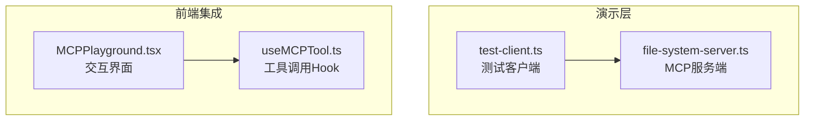
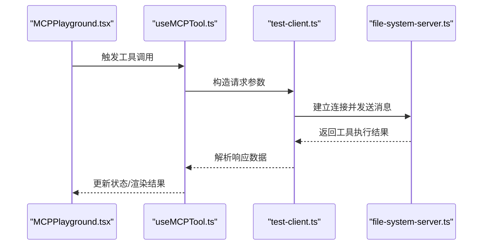
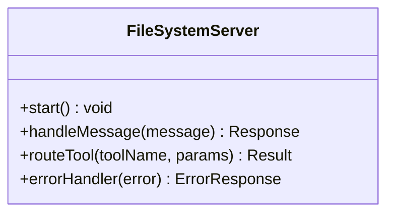
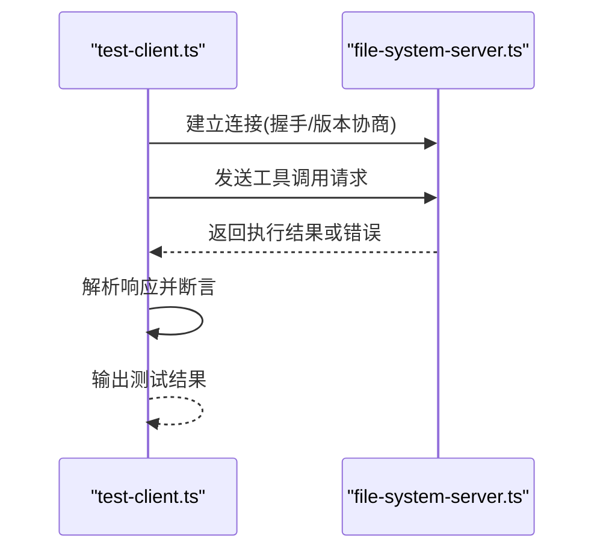

# MCP通信协议

<cite>
**本文引用的文件**
- [demos/day1-mcp/file-system-server.ts](file://demos/day1-mcp/file-system-server.ts)
- [demos/day1-mcp/test-client.ts](file://demos/day1-mcp/test-client.ts)
- [demos/day1-mcp/package.json](file://demos/day1-mcp/package.json)
- [src/hooks/useMCPTool.ts](file://src/hooks/useMCPTool.ts)
- [src/components/MCPPlayground.tsx](file://src/components/MCPPlayground.tsx)
- [README.md](file://README.md)
</cite>

## 目录
1. [简介](#简介)
2. [项目结构](#项目结构)
3. [核心组件](#核心组件)
4. [架构总览](#架构总览)
5. [详细组件分析](#详细组件分析)
6. [依赖分析](#依赖分析)
7. [性能考虑](#性能考虑)
8. [故障排查指南](#故障排查指南)
9. [结论](#结论)
10. [附录](#附录)

## 简介
本文件为“MCP通信协议”的完整技术文档，聚焦于客户端与服务器之间的通信机制、消息格式、版本兼容性与错误处理；并详细说明测试客户端的实现方式，如何模拟和验证MCP工具的调用流程。同时记录网络传输的安全考虑、超时处理和重试机制，并提供协议使用的具体示例与调试方法。

## 项目结构
本项目包含一个演示用的MCP服务端与测试客户端，以及前端集成示例：
- demos/day1-mcp：MCP工具演示（文件系统服务）与测试客户端
- src/hooks/useMCPTool.ts：前端封装的MCP工具调用Hook
- src/components/MCPPlayground.tsx：用于交互式体验MCP工具的前端组件
- README.md：项目说明

图表来源
- [demos/day1-mcp/test-client.ts](file://demos/day1-mcp/test-client.ts)
- [demos/day1-mcp/file-system-server.ts](file://demos/day1-mcp/file-system-server.ts)
- [src/hooks/useMCPTool.ts](file://src/hooks/useMCPTool.ts)
- [src/components/MCPPlayground.tsx](file://src/components/MCPPlayground.tsx)

章节来源
- [README.md](file://README.md)
- [demos/day1-mcp/package.json](file://demos/day1-mcp/package.json)

## 核心组件
- MCP服务端（file-system-server.ts）：实现MCP协议的服务端逻辑，暴露文件系统相关工具能力，接收并响应客户端请求。
- 测试客户端（test-client.ts）：模拟MCP客户端行为，发起工具调用、解析响应、验证结果，便于本地联调与回归测试。
- 前端Hook（useMCPTool.ts）：在前端环境中封装MCP工具调用，提供统一的调用接口与状态管理。
- 前端组件（MCPPlayground.tsx）：可视化展示MCP工具调用过程与结果，支持用户交互触发。

章节来源
- [demos/day1-mcp/file-system-server.ts](file://demos/day1-mcp/file-system-server.ts)
- [demos/day1-mcp/test-client.ts](file://demos/day1-mcp/test-client.ts)
- [src/hooks/useMCPTool.ts](file://src/hooks/useMCPTool.ts)
- [src/components/MCPPlayground.tsx](file://src/components/MCPPlayground.tsx)

## 架构总览
下图展示了从前端到MCP服务端的整体调用链路，包括连接建立、消息交换与响应处理。

图表来源
- [src/components/MCPPlayground.tsx](file://src/components/MCPPlayground.tsx)
- [src/hooks/useMCPTool.ts](file://src/hooks/useMCPTool.ts)
- [demos/day1-mcp/test-client.ts](file://demos/day1-mcp/test-client.ts)
- [demos/day1-mcp/file-system-server.ts](file://demos/day1-mcp/file-system-server.ts)

## 详细组件分析

### 服务端：file-system-server.ts
- 职责
  - 实现MCP协议的消息处理：解析请求、路由到对应工具、组装响应。
  - 暴露文件系统相关能力（如读取、列出、写入等），作为MCP工具集对外提供服务。
- 关键流程
  - 启动监听端口，接受客户端连接。
  - 接收消息后校验协议版本与字段完整性。
  - 根据工具名分发到具体处理器，执行业务逻辑。
  - 将执行结果包装为标准响应消息返回。
- 错误处理
  - 对非法请求、权限不足、IO异常等进行统一捕获与错误码映射。
  - 保证错误响应符合MCP协议规范，便于客户端识别与重试。

章节来源
- [demos/day1-mcp/file-system-server.ts](file://demos/day1-mcp/file-system-server.ts)

#### 服务端类图（概念映射）

图表来源
- [demos/day1-mcp/file-system-server.ts](file://demos/day1-mcp/file-system-server.ts)

### 测试客户端：test-client.ts
- 职责
  - 模拟真实MCP客户端，向服务端发起工具调用，验证协议一致性与业务正确性。
  - 提供可复用的测试用例，覆盖正常路径与异常路径。
- 关键流程
  - 初始化连接参数（地址、端口、协议版本）。
  - 构造请求消息（工具名、参数、上下文）。
  - 发送请求并等待响应，解析响应体与状态。
  - 断言结果是否符合预期，输出测试报告。
- 重试与超时
  - 在连接失败或响应超时时进行有限次重试，避免瞬时网络抖动导致误判。
  - 配置合理的超时阈值，确保长时间阻塞不会卡死测试进程。

章节来源
- [demos/day1-mcp/test-client.ts](file://demos/day1-mcp/test-client.ts)

#### 测试客户端序列图（调用流程）

图表来源
- [demos/day1-mcp/test-client.ts](file://demos/day1-mcp/test-client.ts)
- [demos/day1-mcp/file-system-server.ts](file://demos/day1-mcp/file-system-server.ts)

### 前端Hook：useMCPTool.ts
- 职责
  - 封装MCP工具调用，提供简洁的API供React组件使用。
  - 管理调用状态（加载中、成功、失败）、错误提示与重试控制。
- 关键特性
  - 支持取消请求与防抖，减少重复调用。
  - 统一错误处理与用户提示。
  - 与MCPPlayground组件协作，驱动UI更新。

章节来源
- [src/hooks/useMCPTool.ts](file://src/hooks/useMCPTool.ts)

### 前端组件：MCPPlayground.tsx
- 职责
  - 提供可视化的MCP工具调用入口，支持选择工具、输入参数、查看结果。
  - 通过useMCPTool.ts驱动调用流程，展示加载态与错误信息。
- 用户体验
  - 清晰的表单与反馈，帮助快速验证工具行为。
  - 支持批量操作与结果导出（若实现）。

章节来源
- [src/components/MCPPlayground.tsx](file://src/components/MCPPlayground.tsx)

## 依赖分析
- 模块耦合
  - test-client.ts 与 file-system-server.ts 强耦合于MCP协议消息格式与工具定义。
  - useMCPTool.ts 与 MCPPlayground.tsx 松耦合，通过Hook接口解耦UI与调用逻辑。
- 外部依赖
  - Node.js运行时与网络库（HTTP/WebSocket等，取决于实现）。
  - TypeScript编译与包管理（package.json）。

图表来源
- [demos/day1-mcp/test-client.ts](file://demos/day1-mcp/test-client.ts)
- [demos/day1-mcp/file-system-server.ts](file://demos/day1-mcp/file-system-server.ts)
- [src/hooks/useMCPTool.ts](file://src/hooks/useMCPTool.ts)
- [src/components/MCPPlayground.tsx](file://src/components/MCPPlayground.tsx)

章节来源
- [demos/day1-mcp/package.json](file://demos/day1-mcp/package.json)

## 性能考虑
- 连接复用
  - 建议复用长连接以减少握手开销，尤其在高频调用场景。
- 批处理与合并
  - 对多个小请求进行批处理，降低网络往返次数。
- 超时与限流
  - 合理设置超时时间，避免资源长期占用。
  - 对服务端进行限流保护，防止恶意或突发流量影响稳定性。
- 缓存策略
  - 对读多写少的工具结果进行缓存，提升响应速度。

[本节为通用指导，不直接分析具体文件]

## 故障排查指南
- 常见问题
  - 连接失败：检查服务端是否启动、端口是否正确、防火墙规则。
  - 协议不兼容：确认客户端与服务端版本匹配，必要时进行降级或升级。
  - 工具未找到：核对工具名称与参数是否与定义一致。
  - 超时与重试：观察日志中的重试次数与间隔，调整超时阈值。
- 调试方法
  - 启用详细日志，记录请求与响应报文。
  - 使用抓包工具（如Wireshark）分析网络层问题。
  - 在测试客户端中逐步缩小范围，定位是客户端构造问题还是服务端处理问题。

章节来源
- [demos/day1-mcp/test-client.ts](file://demos/day1-mcp/test-client.ts)
- [demos/day1-mcp/file-system-server.ts](file://demos/day1-mcp/file-system-server.ts)

## 结论
本仓库提供了MCP协议的端到端演示：服务端暴露文件系统工具，测试客户端验证调用流程，前端通过Hook与组件实现交互体验。通过明确的连接建立、消息格式、版本兼容与错误处理机制，确保了协议的一致性与可维护性。建议在后续迭代中完善安全加固、性能优化与更丰富的工具集。

[本节为总结性内容，不直接分析具体文件]

## 附录

### 协议版本兼容性
- 客户端与服务端需在握手阶段协商协议版本，选择不支持的版本时应回退或拒绝连接。
- 新增字段需向后兼容，旧客户端应忽略未知字段。

章节来源
- [demos/day1-mcp/test-client.ts](file://demos/day1-mcp/test-client.ts)
- [demos/day1-mcp/file-system-server.ts](file://demos/day1-mcp/file-system-server.ts)

### 网络传输安全
- 建议使用HTTPS或WSS加密通道，避免明文传输敏感数据。
- 对请求进行鉴权与授权校验，限制工具访问范围。
- 对输入参数进行严格校验，防止注入与越权访问。

章节来源
- [demos/day1-mcp/file-system-server.ts](file://demos/day1-mcp/file-system-server.ts)

### 超时处理与重试机制
- 客户端应在连接与请求层面设置超时，并在失败时进行有限次重试。
- 重试策略可采用指数退避，避免雪崩效应。
- 服务端应对慢请求进行监控与告警。

章节来源
- [demos/day1-mcp/test-client.ts](file://demos/day1-mcp/test-client.ts)

### 协议使用示例
- 基本调用：选择工具名、传入必要参数、获取执行结果。
- 批量调用：组合多个工具调用，按顺序或并行执行。
- 错误处理：捕获并展示错误信息，提供重试或回退方案。

章节来源
- [src/components/MCPPlayground.tsx](file://src/components/MCPPlayground.tsx)
- [src/hooks/useMCPTool.ts](file://src/hooks/useMCPTool.ts)
- [demos/day1-mcp/test-client.ts](file://demos/day1-mcp/test-client.ts)