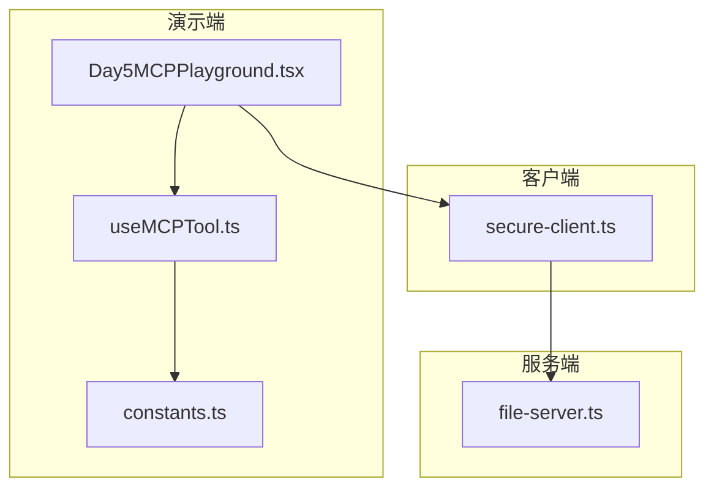
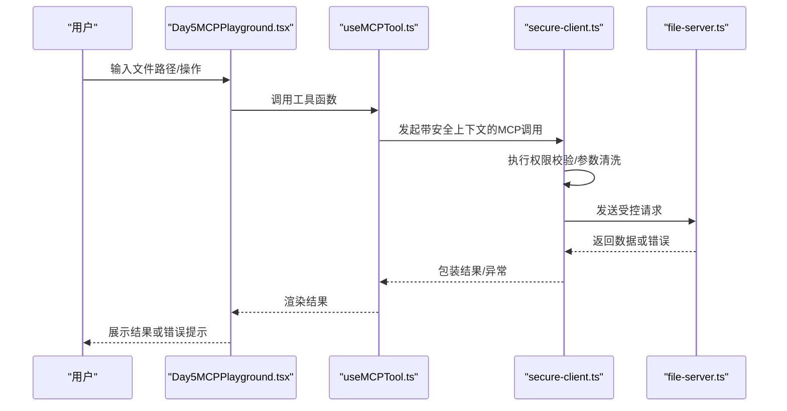
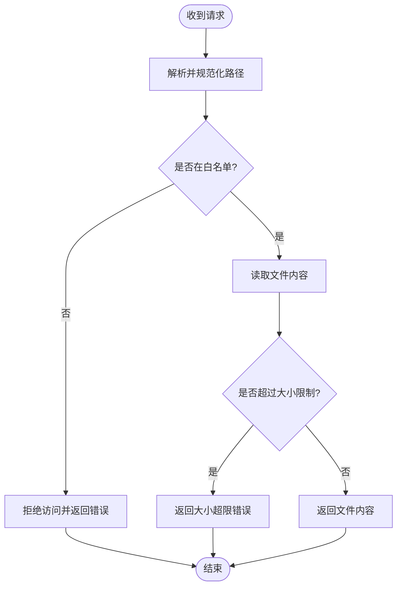
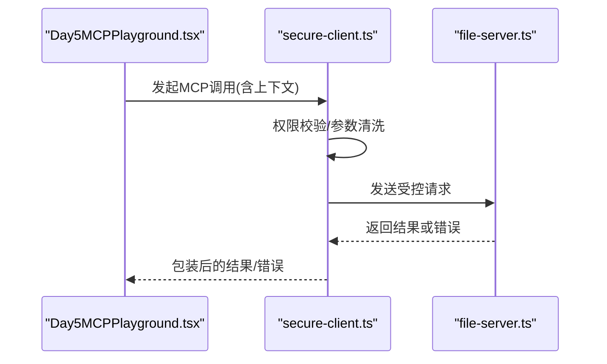
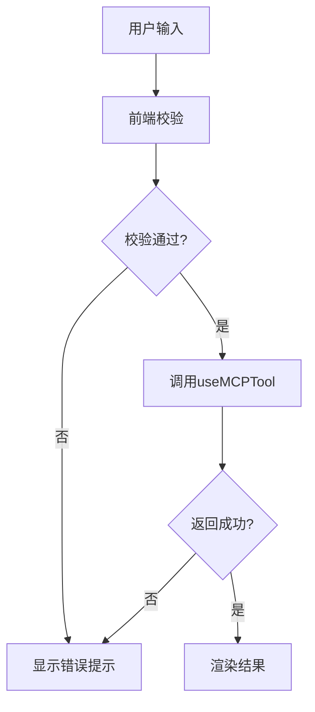
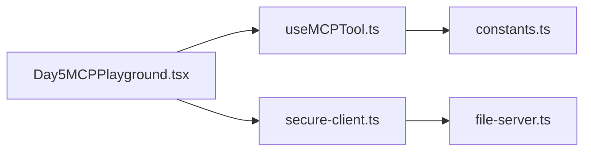

# Day5 MCP安全模型交互模拟器

<cite>
**本文引用的文件**
- [demos/day5-security/file-server.ts](file://demos/day5-security/file-server.ts)
- [demos/day5-security/secure-client.ts](file://demos/day5-security/secure-client.ts)
- [demos/day5-security/package.json](file://demos/day5-security/package.json)
- [src/components/Day5MCPPlayground.tsx](file://src/components/Day5MCPPlayground.tsx)
- [src/hooks/useMCPTool.ts](file://src/hooks/useMCPTool.ts)
- [src/lib/constants.ts](file://src/lib/constants.ts)
- [src/app/day/[dayNum]/page.tsx](file://src/app/day/[dayNum]/page.tsx)
- [README.md](file://README.md)
</cite>

## 目录
1. [简介](#简介)
2. [项目结构](#项目结构)
3. [核心组件](#核心组件)
4. [架构总览](#架构总览)
5. [详细组件分析](#详细组件分析)
6. [依赖分析](#依赖分析)
7. [性能考虑](#性能考虑)
8. [故障排查指南](#故障排查指南)
9. [结论](#结论)
10. [附录](#附录)

## 简介
本仓库围绕“MCP（Model Context Protocol）”的每日示例展开，其中 Day5 聚焦于“安全模型交互”。该模块通过一个本地文件服务器与一个具备权限校验能力的客户端，演示如何在 MCP 调用链中引入安全策略（如路径白名单、最小权限访问），并配合前端可交互界面进行可视化验证。

## 项目结构
Day5 相关代码主要分布在以下位置：
- 后端服务：demos/day5-security/file-server.ts
- 安全客户端：demos/day5-security/secure-client.ts
- 前端演示：src/components/Day5MCPPlayground.tsx
- 工具与常量：src/hooks/useMCPTool.ts、src/lib/constants.ts
- 路由入口：src/app/day/[dayNum]/page.tsx

图表来源
- [src/components/Day5MCPPlayground.tsx](file://src/components/Day5MCPPlayground.tsx)
- [src/hooks/useMCPTool.ts](file://src/hooks/useMCPTool.ts)
- [src/lib/constants.ts](file://src/lib/constants.ts)
- [demos/day5-security/secure-client.ts](file://demos/day5-security/secure-client.ts)
- [demos/day5-security/file-server.ts](file://demos/day5-security/file-server.ts)

章节来源
- [README.md](file://README.md)
- [src/app/day/[dayNum]/page.tsx](file://src/app/day/[dayNum]/page.tsx)

## 核心组件
- 文件服务器（file-server.ts）
  - 职责：提供受控的文件读取接口；对请求路径进行合法性校验与白名单过滤；返回标准化响应。
  - 关键点：路径规范化、越权访问拦截、错误码与消息统一。
- 安全客户端（secure-client.ts）
  - 职责：封装 MCP 调用前的安全策略执行（如权限检查、参数清洗）、调用文件服务器、处理结果与异常。
  - 关键点：最小权限原则、失败重试与降级、日志记录。
- 前端演示（Day5MCPPlayground.tsx）
  - 职责：提供用户输入、触发安全调用、展示结果与错误信息。
  - 关键点：表单校验、状态管理、错误提示。
- 工具与常量（useMCPTool.ts、constants.ts）
  - 职责：抽象通用 MCP 调用流程、定义安全策略常量（如允许的路径前缀、最大文件大小等）。
  - 关键点：配置集中化、复用性高。

章节来源
- [demos/day5-security/file-server.ts](file://demos/day5-security/file-server.ts)
- [demos/day5-security/secure-client.ts](file://demos/day5-security/secure-client.ts)
- [src/components/Day5MCPPlayground.tsx](file://src/components/Day5MCPPlayground.tsx)
- [src/hooks/useMCPTool.ts](file://src/hooks/useMCPTool.ts)
- [src/lib/constants.ts](file://src/lib/constants.ts)

## 架构总览
整体交互遵循“前端触发 -> 安全客户端校验 -> 文件服务器受控访问 -> 结果回传”的链路，强调在每次 MCP 调用前后注入安全检查点。

图表来源
- [src/components/Day5MCPPlayground.tsx](file://src/components/Day5MCPPlayground.tsx)
- [src/hooks/useMCPTool.ts](file://src/hooks/useMCPTool.ts)
- [demos/day5-security/secure-client.ts](file://demos/day5-security/secure-client.ts)
- [demos/day5-security/file-server.ts](file://demos/day5-security/file-server.ts)

## 详细组件分析

### 文件服务器（file-server.ts）
- 设计要点
  - 路径白名单：仅允许访问预定义的安全目录或文件前缀。
  - 路径规范化：防止路径穿越攻击（如 ../）。
  - 资源限制：限制最大读取大小、超时控制。
  - 统一响应：成功/失败的结构化响应体。
- 关键流程
  - 接收请求 -> 解析路径 -> 白名单校验 -> 读取文件 -> 返回数据或错误。

图表来源
- [demos/day5-security/file-server.ts](file://demos/day5-security/file-server.ts)

章节来源
- [demos/day5-security/file-server.ts](file://demos/day5-security/file-server.ts)

### 安全客户端（secure-client.ts）
- 设计要点
  - 前置校验：校验调用方身份、目标资源、操作类型。
  - 参数清洗：去除非法字符、限制长度。
  - 最小权限：按角色/上下文授予最小必要权限。
  - 错误处理：区分网络错误、权限错误、业务错误。
- 调用序列

图表来源
- [src/components/Day5MCPPlayground.tsx](file://src/components/Day5MCPPlayground.tsx)
- [demos/day5-security/secure-client.ts](file://demos/day5-security/secure-client.ts)
- [demos/day5-security/file-server.ts](file://demos/day5-security/file-server.ts)

章节来源
- [demos/day5-security/secure-client.ts](file://demos/day5-security/secure-client.ts)

### 前端演示（Day5MCPPlayground.tsx）
- 设计要点
  - 输入校验：必填项、格式校验、长度限制。
  - 状态管理：加载中、成功、失败状态切换。
  - 错误呈现：友好提示与可操作建议。
- 交互流程

图表来源
- [src/components/Day5MCPPlayground.tsx](file://src/components/Day5MCPPlayground.tsx)
- [src/hooks/useMCPTool.ts](file://src/hooks/useMCPTool.ts)

章节来源
- [src/components/Day5MCPPlayground.tsx](file://src/components/Day5MCPPlayground.tsx)
- [src/hooks/useMCPTool.ts](file://src/hooks/useMCPTool.ts)

### 工具与常量（useMCPTool.ts、constants.ts）
- useMCPTool.ts
  - 职责：封装通用的 MCP 调用生命周期（初始化、重试、超时、错误处理）。
  - 关键点：可配置的超时、重试次数、错误分类。
- constants.ts
  - 职责：集中管理安全策略常量（如允许的前缀、最大文件大小、超时阈值）。
  - 关键点：便于统一调整与审计。

章节来源
- [src/hooks/useMCPTool.ts](file://src/hooks/useMCPTool.ts)
- [src/lib/constants.ts](file://src/lib/constants.ts)

## 依赖分析
- 运行时依赖
  - Node.js 环境运行 demos 下的 TypeScript 脚本。
  - Next.js 应用承载前端演示页面。
- 模块耦合
  - 前端通过 hooks 与常量解耦具体实现，降低耦合度。
  - 客户端与服务端通过明确的协议与错误码通信，边界清晰。

图表来源
- [src/components/Day5MCPPlayground.tsx](file://src/components/Day5MCPPlayground.tsx)
- [src/hooks/useMCPTool.ts](file://src/hooks/useMCPTool.ts)
- [src/lib/constants.ts](file://src/lib/constants.ts)
- [demos/day5-security/secure-client.ts](file://demos/day5-security/secure-client.ts)
- [demos/day5-security/file-server.ts](file://demos/day5-security/file-server.ts)

章节来源
- [demos/day5-security/package.json](file://demos/day5-security/package.json)

## 性能考虑
- 服务端
  - 路径白名单与规范化应在内存中快速完成，避免不必要的 I/O。
  - 对大文件读取设置合理上限与超时，防止资源耗尽。
- 客户端
  - 合理设置重试次数与退避策略，避免雪崩。
  - 对频繁调用的结果做短期缓存（注意一致性）。
- 前端
  - 防抖/节流减少重复请求。
  - 错误提示及时且简洁，提升用户体验。

## 故障排查指南
- 常见问题
  - 路径被拒绝：检查白名单配置与路径规范化逻辑。
  - 权限不足：确认客户端传入的上下文与角色是否正确。
  - 超时/过大：检查服务端大小限制与客户端超时配置。
- 定位步骤
  - 查看服务端日志输出，确认请求路径与校验结果。
  - 检查客户端错误分类与重试策略。
  - 在前端控制台观察请求与响应结构。

章节来源
- [demos/day5-security/file-server.ts](file://demos/day5-security/file-server.ts)
- [demos/day5-security/secure-client.ts](file://demos/day5-security/secure-client.ts)
- [src/components/Day5MCPPlayground.tsx](file://src/components/Day5MCPPlayground.tsx)

## 结论
Day5 通过“安全客户端 + 受控文件服务器”的组合，展示了在 MCP 调用链中嵌入安全策略的实践方式。借助前端演示与工具层抽象，开发者可以快速验证不同安全策略的效果，并为后续扩展（如多租户、细粒度权限）奠定基础。

## 附录
- 运行说明
  - 启动前端：使用 Next.js 开发服务器加载演示页面。
  - 启动服务端：运行 file-server.ts 以提供受控文件访问。
  - 运行客户端：执行 secure-client.ts 以模拟 MCP 调用与安全校验。
- 配置建议
  - 将敏感常量（如白名单、超时）外置为环境变量，便于不同环境部署。
  - 在服务端启用结构化日志，便于问题追踪。