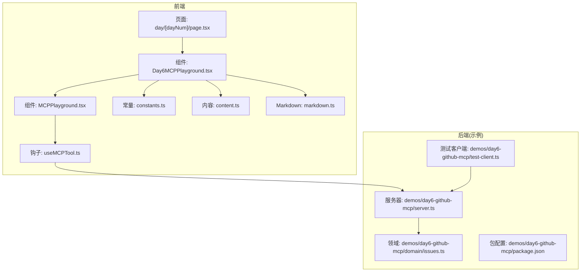
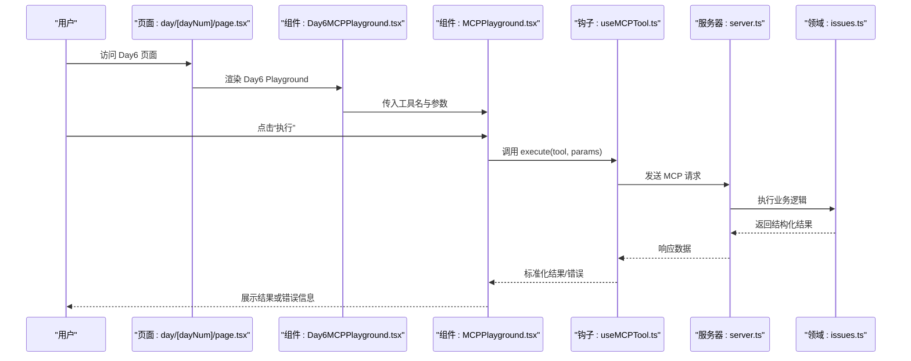
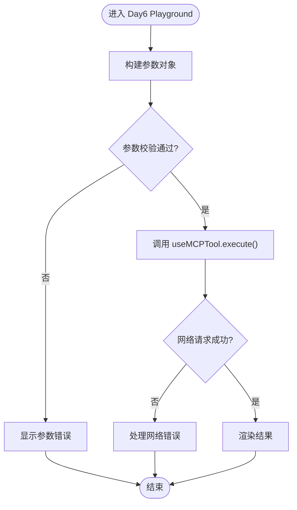
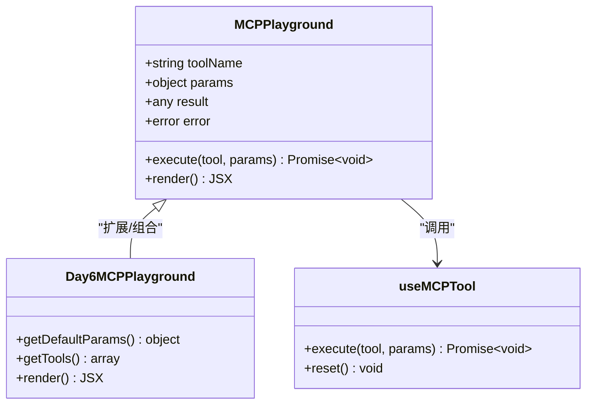
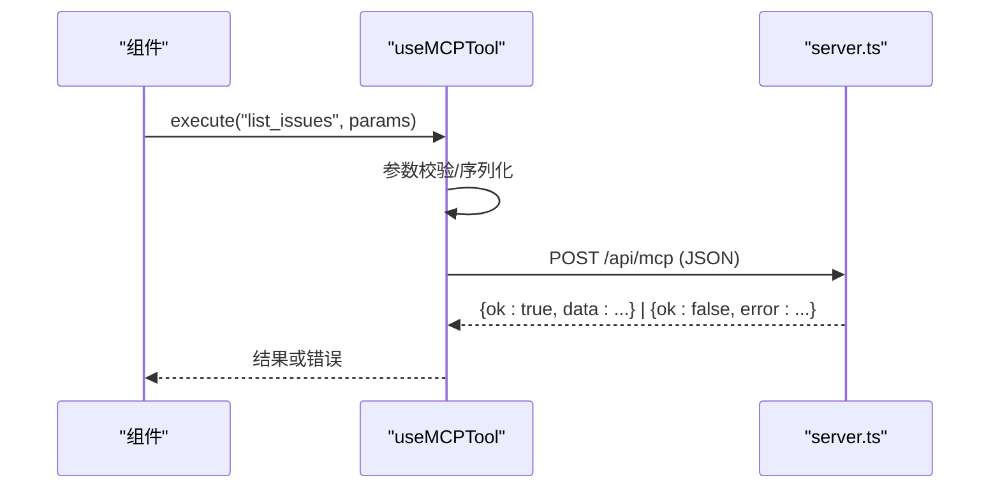
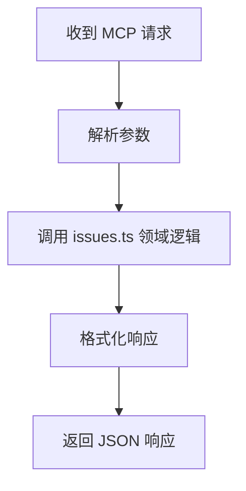
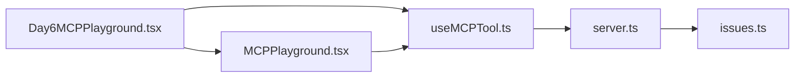

# Day6 MCP Playground 组件

<cite>
**本文引用的文件**
- [Day6MCPPlayground.tsx](file://src/components/Day6MCPPlayground.tsx)
- [MCPPlayground.tsx](file://src/components/MCPPlayground.tsx)
- [useMCPTool.ts](file://src/hooks/useMCPTool.ts)
- [constants.ts](file://src/lib/constants.ts)
- [content.ts](file://src/lib/content.ts)
- [markdown.ts](file://src/lib/markdown.ts)
- [page.tsx](file://src/app/day/[dayNum]/page.tsx)
- [layout.tsx](file://src/app/layout.tsx)
- [server.ts](file://demos/day6-github-mcp/server.ts)
- [test-client.ts](file://demos/day6-github-mcp/test-client.ts)
- [issues.ts](file://demos/day6-github-mcp/domain/issues.ts)
- [package.json](file://demos/day6-github-mcp/package.json)
</cite>

## 目录
1. [简介](#简介)
2. [项目结构](#项目结构)
3. [核心组件](#核心组件)
4. [架构总览](#架构总览)
5. [详细组件分析](#详细组件分析)
6. [依赖关系分析](#依赖关系分析)
7. [性能考量](#性能考量)
8. [故障排查指南](#故障排查指南)
9. [结论](#结论)
10. [附录](#附录)

## 简介
本章节聚焦于“Day6 MCP Playground”组件，该组件用于在 Next.js 前端中交互式演示与调用 GitHub MCP Server 的模型上下文协议（MCP）工具。它通过统一的 Playground 容器、可复用的 Hook 以及后端示例服务，形成从 UI 到工具的完整链路，便于开发者快速验证与调试 MCP 能力。

## 项目结构
围绕 Day6 的前端实现主要包含以下部分：
- 页面路由：按天组织，Day6 页面承载对应 Playground。
- 组件层：Day6MCPPlayground 作为具体业务入口；MCPPlayground 提供通用交互外壳。
- 钩子层：useMCPTool 封装与 MCP 服务的通信细节。
- 资源层：常量、内容、Markdown 解析等基础库。
- 示例后端：GitHub MCP Server 及测试客户端，用于联调与演示。

图表来源
- [page.tsx:1-200](file://src/app/day/[dayNum]/page.tsx#L1-L200)
- [Day6MCPPlayground.tsx:1-200](file://src/components/Day6MCPPlayground.tsx#L1-L200)
- [MCPPlayground.tsx:1-200](file://src/components/MCPPlayground.tsx#L1-L200)
- [useMCPTool.ts:1-200](file://src/hooks/useMCPTool.ts#L1-L200)
- [server.ts:1-200](file://demos/day6-github-mcp/server.ts#L1-L200)
- [test-client.ts:1-200](file://demos/day6-github-mcp/test-client.ts#L1-L200)
- [issues.ts:1-200](file://demos/day6-github-mcp/domain/issues.ts#L1-L200)
- [package.json:1-200](file://demos/day6-github-mcp/package.json#L1-L200)

章节来源
- [page.tsx:1-200](file://src/app/day/[dayNum]/page.tsx#L1-L200)
- [Day6MCPPlayground.tsx:1-200](file://src/components/Day6MCPPlayground.tsx#L1-L200)
- [MCPPlayground.tsx:1-200](file://src/components/MCPPlayground.tsx#L1-L200)
- [useMCPTool.ts:1-200](file://src/hooks/useMCPTool.ts#L1-L200)
- [server.ts:1-200](file://demos/day6-github-mcp/server.ts#L1-L200)
- [test-client.ts:1-200](file://demos/day6-github-mcp/test-client.ts#L1-L200)
- [issues.ts:1-200](file://demos/day6-github-mcp/domain/issues.ts#L1-L200)
- [package.json:1-200](file://demos/day6-github-mcp/package.json#L1-L200)

## 核心组件
- Day6MCPPlayground：面向 GitHub MCP 场景的具体实现，负责渲染界面、组装参数、触发工具调用并展示结果。
- MCPPlayground：通用 Playground 外壳，提供输入表单、调用状态、错误处理与结果展示的统一体验。
- useMCPTool：封装与 MCP 服务端通信的 Hook，统一请求构造、重试、错误捕获与结果归一化。

章节来源
- [Day6MCPPlayground.tsx:1-200](file://src/components/Day6MCPPlayground.tsx#L1-L200)
- [MCPPlayground.tsx:1-200](file://src/components/MCPPlayground.tsx#L1-L200)
- [useMCPTool.ts:1-200](file://src/hooks/useMCPTool.ts#L1-L200)

## 架构总览
下图展示了从用户操作到 MCP 工具执行的端到端流程，包括前端组件、Hook 与后端示例服务的交互。

图表来源
- [page.tsx:1-200](file://src/app/day/[dayNum]/page.tsx#L1-L200)
- [Day6MCPPlayground.tsx:1-200](file://src/components/Day6MCPPlayground.tsx#L1-L200)
- [MCPPlayground.tsx:1-200](file://src/components/MCPPlayground.tsx#L1-L200)
- [useMCPTool.ts:1-200](file://src/hooks/useMCPTool.ts#L1-L200)
- [server.ts:1-200](file://demos/day6-github-mcp/server.ts#L1-L200)
- [issues.ts:1-200](file://demos/day6-github-mcp/domain/issues.ts#L1-L200)

## 详细组件分析

### Day6MCPPlayground 组件
- 职责
  - 定义 Day6 专属的工具列表与默认参数。
  - 将用户输入映射为 MCP 工具调用所需的参数对象。
  - 调用通用 Playground 进行渲染与交互。
- 关键交互
  - 与 MCPPlayground 组合使用，传递工具名称、参数 schema 与回调。
  - 与 useMCPTool 协作，完成实际的网络请求与结果处理。
- 错误与边界
  - 对空参数、非法值进行前置校验。
  - 捕获网络异常与服务端错误，并提供友好提示。

图表来源
- [Day6MCPPlayground.tsx:1-200](file://src/components/Day6MCPPlayground.tsx#L1-L200)
- [useMCPTool.ts:1-200](file://src/hooks/useMCPTool.ts#L1-L200)

章节来源
- [Day6MCPPlayground.tsx:1-200](file://src/components/Day6MCPPlayground.tsx#L1-L200)

### MCPPlayground 通用外壳
- 职责
  - 提供统一的输入表单、执行按钮、加载态、错误态与结果展示区。
  - 管理本地状态（如当前工具、参数、结果、错误）。
  - 暴露 execute 方法供上层组件调用。
- 设计要点
  - 解耦具体工具实现，仅关注交互与状态。
  - 支持多工具切换与动态参数表单。
  - 与 useMCPTool 约定一致的入参与返回值结构。

图表来源
- [MCPPlayground.tsx:1-200](file://src/components/MCPPlayground.tsx#L1-L200)
- [Day6MCPPlayground.tsx:1-200](file://src/components/Day6MCPPlayground.tsx#L1-L200)
- [useMCPTool.ts:1-200](file://src/hooks/useMCPTool.ts#L1-L200)

章节来源
- [MCPPlayground.tsx:1-200](file://src/components/MCPPlayground.tsx#L1-L200)

### useMCPTool 钩子
- 职责
  - 封装与 MCP 服务器的通信细节（URL、方法、头、超时、重试）。
  - 统一错误分类（网络错误、业务错误、超时等）。
  - 提供结果归一化与缓存策略（可选）。
- 关键点
  - 与后端 server.ts 的路径与方法保持一致。
  - 对并发请求进行防抖或节流控制（按需）。
  - 暴露 reset 方法以清理状态。

图表来源
- [useMCPTool.ts:1-200](file://src/hooks/useMCPTool.ts#L1-L200)
- [server.ts:1-200](file://demos/day6-github-mcp/server.ts#L1-L200)

章节来源
- [useMCPTool.ts:1-200](file://src/hooks/useMCPTool.ts#L1-L200)

### 后端示例：GitHub MCP Server
- 职责
  - 暴露 MCP 接口，接收前端请求并调用 GitHub 相关能力（如 Issue 查询）。
  - 基于 domain/issues.ts 实现领域逻辑，返回标准格式的数据。
- 集成点
  - 与前端 useMCPTool 约定的路径、方法与数据结构一致。
  - 可通过 test-client.ts 独立验证接口可用性。

图表来源
- [server.ts:1-200](file://demos/day6-github-mcp/server.ts#L1-L200)
- [issues.ts:1-200](file://demos/day6-github-mcp/domain/issues.ts#L1-L200)

章节来源
- [server.ts:1-200](file://demos/day6-github-mcp/server.ts#L1-L200)
- [issues.ts:1-200](file://demos/day6-github-mcp/domain/issues.ts#L1-L200)
- [test-client.ts:1-200](file://demos/day6-github-mcp/test-client.ts#L1-L200)
- [package.json:1-200](file://demos/day6-github-mcp/package.json#L1-L200)

## 依赖关系分析
- 组件耦合
  - Day6MCPPlayground 强依赖 MCPPlayground 提供的交互能力。
  - 两者均依赖 useMCPTool 进行网络通信。
- 外部依赖
  - 后端 server.ts 依赖 GitHub 相关 SDK/HTTP 客户端（由 package.json 声明）。
  - 前端可能依赖 Next.js 路由与样式系统。
- 潜在循环
  - 当前分层清晰，未见循环依赖迹象。

图表来源
- [Day6MCPPlayground.tsx:1-200](file://src/components/Day6MCPPlayground.tsx#L1-L200)
- [MCPPlayground.tsx:1-200](file://src/components/MCPPlayground.tsx#L1-L200)
- [useMCPTool.ts:1-200](file://src/hooks/useMCPTool.ts#L1-L200)
- [server.ts:1-200](file://demos/day6-github-mcp/server.ts#L1-L200)
- [issues.ts:1-200](file://demos/day6-github-mcp/domain/issues.ts#L1-L200)

章节来源
- [Day6MCPPlayground.tsx:1-200](file://src/components/Day6MCPPlayground.tsx#L1-L200)
- [MCPPlayground.tsx:1-200](file://src/components/MCPPlayground.tsx#L1-L200)
- [useMCPTool.ts:1-200](file://src/hooks/useMCPTool.ts#L1-L200)
- [server.ts:1-200](file://demos/day6-github-mcp/server.ts#L1-L200)
- [issues.ts:1-200](file://demos/day6-github-mcp/domain/issues.ts#L1-L200)

## 性能考量
- 请求优化
  - 合理设置超时与重试次数，避免雪崩。
  - 对频繁触发的工具调用增加防抖/节流。
- 渲染优化
  - 大结果集分页或虚拟滚动展示。
  - 结果缓存减少重复请求。
- 资源体积
  - 按需引入第三方库，减小包体。
  - 静态资源与代码分离。

[本节为通用指导，不直接分析具体文件]

## 故障排查指南
- 常见问题
  - 网络错误：检查 CORS、代理、后端地址与端口。
  - 参数错误：确认前端参数结构与后端期望一致。
  - 权限问题：GitHub Token 是否有效且具备所需权限。
- 定位步骤
  - 使用浏览器开发者工具查看网络请求与响应。
  - 通过 test-client.ts 独立验证后端接口。
  - 在服务端日志中检索错误堆栈与请求详情。
- 恢复建议
  - 重置 useMCPTool 状态后重试。
  - 降级功能（如关闭重试、降低并发）以定位问题。

章节来源
- [useMCPTool.ts:1-200](file://src/hooks/useMCPTool.ts#L1-L200)
- [test-client.ts:1-200](file://demos/day6-github-mcp/test-client.ts#L1-L200)
- [server.ts:1-200](file://demos/day6-github-mcp/server.ts#L1-L200)

## 结论
Day6 MCP Playground 通过清晰的组件分层与可复用的 Hook，实现了与 GitHub MCP Server 的便捷联调与演示。其设计强调解耦与可扩展性，便于后续接入更多 MCP 工具与场景。配合后端示例与测试客户端，能够快速验证端到端流程并定位问题。

[本节为总结性内容，不直接分析具体文件]

## 附录
- 运行与联调
  - 启动前端开发服务器，访问 Day6 页面。
  - 启动后端示例服务，确保端口与前端一致。
  - 使用 test-client.ts 进行接口自测。
- 扩展建议
  - 新增工具时，优先在 MCPPlayground 中注册，再在 Day6MCPPlayground 中配置参数。
  - 在 useMCPTool 中统一错误码与重试策略，保持行为一致。

[本节为补充说明，不直接分析具体文件]