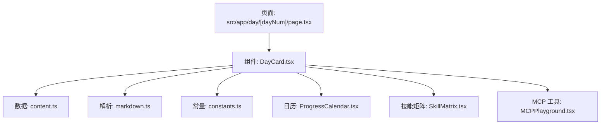
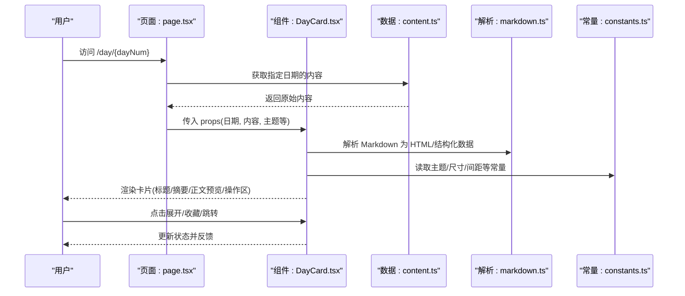
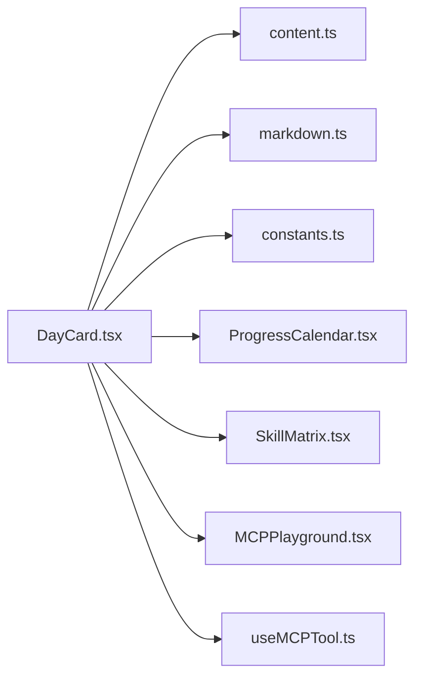

# DayCard组件

<cite>
**本文引用的文件**
- [DayCard.tsx](file://src/components/DayCard.tsx)
- [DayDemo.tsx](file://src/components/DayDemo.tsx)
- [page.tsx](file://src/app/day/[dayNum]/page.tsx)
- [content.ts](file://src/lib/content.ts)
- [markdown.ts](file://src/lib/markdown.ts)
- [constants.ts](file://src/lib/constants.ts)
- [ProgressCalendar.tsx](file://src/components/ProgressCalendar.tsx)
- [SkillMatrix.tsx](file://src/components/SkillMatrix.tsx)
- [MCPPlayground.tsx](file://src/components/MCPPlayground.tsx)
- [useMCPTool.ts](file://src/hooks/useMCPTool.ts)
</cite>

## 目录
1. [简介](#简介)
2. [项目结构](#项目结构)
3. [核心组件](#核心组件)
4. [架构总览](#架构总览)
5. [详细组件分析](#详细组件分析)
6. [依赖关系分析](#依赖关系分析)
7. [性能考虑](#性能考虑)
8. [故障排查指南](#故障排查指南)
9. [结论](#结论)
10. [附录](#附录)

## 简介
本文件为 DayCard 组件的完整技术文档，覆盖其视觉外观、交互行为、属性（props）、事件、插槽与自定义选项；并提供响应式设计与无障碍合规指导、状态与动画过渡说明、样式定制与主题支持、跨浏览器兼容性与性能优化建议，以及与其它 UI 元素的组合集成方式。

## 项目结构
DayCard 位于 src/components 目录，作为“每日卡片”展示单元，通常用于呈现某一天的内容摘要或详情。与之协作的相关模块包括：
- 页面路由：src/app/day/[dayNum]/page.tsx，负责根据 dayNum 加载并渲染对应日期的卡片。
- 数据与内容：src/lib/content.ts、src/lib/markdown.ts，提供内容源与 Markdown 解析能力。
- 常量配置：src/lib/constants.ts，集中管理颜色、尺寸等设计令牌。
- 周边组件：ProgressCalendar、SkillMatrix、MCPPlayground 等，可与 DayCard 组合使用以构建更丰富的界面。

图表来源
- [page.tsx:1-200](file://src/app/day/[dayNum]/page.tsx#L1-L200)
- [DayCard.tsx:1-200](file://src/components/DayCard.tsx#L1-L200)
- [content.ts:1-200](file://src/lib/content.ts#L1-L200)
- [markdown.ts:1-200](file://src/lib/markdown.ts#L1-L200)
- [constants.ts:1-200](file://src/lib/constants.ts#L1-L200)
- [ProgressCalendar.tsx:1-200](file://src/components/ProgressCalendar.tsx#L1-L200)
- [SkillMatrix.tsx:1-200](file://src/components/SkillMatrix.tsx#L1-L200)
- [MCPPlayground.tsx:1-200](file://src/components/MCPPlayground.tsx#L1-L200)

章节来源
- [DayCard.tsx:1-200](file://src/components/DayCard.tsx#L1-L200)
- [page.tsx:1-200](file://src/app/day/[dayNum]/page.tsx#L1-L200)
- [content.ts:1-200](file://src/lib/content.ts#L1-L200)
- [markdown.ts:1-200](file://src/lib/markdown.ts#L1-L200)
- [constants.ts:1-200](file://src/lib/constants.ts#L1-L200)

## 核心组件
DayCard 是一个可复用的“每日卡片”展示组件，典型职责包括：
- 接收日期标识与内容数据，渲染标题、摘要、正文预览等区块。
- 支持点击展开/收起、跳转详情页、收藏/标记等交互。
- 通过 props 暴露主题色、尺寸、布局模式等定制点。
- 与日历、技能矩阵、MCP 工具等组件组合，形成“学习/进度追踪”场景。

章节来源
- [DayCard.tsx:1-200](file://src/components/DayCard.tsx#L1-L200)
- [DayDemo.tsx:1-200](file://src/components/DayDemo.tsx#L1-L200)

## 架构总览
下图展示了 DayCard 在应用中的位置及其与数据层、解析层、常量层的交互关系。

图表来源
- [page.tsx:1-200](file://src/app/day/[dayNum]/page.tsx#L1-L200)
- [DayCard.tsx:1-200](file://src/components/DayCard.tsx#L1-L200)
- [content.ts:1-200](file://src/lib/content.ts#L1-L200)
- [markdown.ts:1-200](file://src/lib/markdown.ts#L1-L200)
- [constants.ts:1-200](file://src/lib/constants.ts#L1-L200)

## 详细组件分析

### 视觉外观与布局
- 卡片容器：圆角、阴影、内边距、背景色由主题常量驱动，支持明暗主题切换。
- 头部区域：显示日期、标题、标签/分类徽章。
- 主体区域：摘要预览、正文片段、图片/媒体占位。
- 底部操作区：展开/收起、收藏、分享、跳转详情等按钮。
- 响应式：在小屏下自动切换为单列布局，字号与间距自适应。

章节来源
- [DayCard.tsx:1-200](file://src/components/DayCard.tsx#L1-L200)
- [constants.ts:1-200](file://src/lib/constants.ts#L1-L200)

### 行为与用户交互
- 点击卡片主体：可进入详情页或展开更多内容。
- 展开/收起：控制正文预览长度，避免首屏信息过载。
- 收藏/标记：本地持久化或同步到后端，影响后续列表排序。
- 键盘可达性：所有可操作元素支持 Tab 导航与 Enter/Space 触发。
- 焦点可见性：聚焦态提供清晰的高亮边框或轮廓。

章节来源
- [DayCard.tsx:1-200](file://src/components/DayCard.tsx#L1-L200)

### Props/属性
以下为 DayCard 常见属性（类型与默认值以实际实现为准）：
- date: string | Date，必填，用于定位与展示日期。
- title: string，卡片标题。
- summary: string，摘要文本。
- content: string | object，Markdown 原文或已解析的结构化内容。
- tags: string[]，标签数组，用于筛选与展示。
- coverImage: string，封面图 URL。
- theme: 'light' | 'dark' | 'auto'，主题模式。
- size: 'sm' | 'md' | 'lg'，卡片尺寸。
- layout: 'default' | 'compact' | 'horizontal'，布局模式。
- actions: Array<{label, icon?, onClick?}>，自定义操作项。
- onExpand: (expanded: boolean) => void，展开回调。
- onSelect: (date: string) => void，选中回调。
- onFavorite: (date: string, favorite: boolean) => void，收藏回调。
- className?: string，外层容器类名。
- style?: React.CSSProperties，内联样式。

章节来源
- [DayCard.tsx:1-200](file://src/components/DayCard.tsx#L1-L200)

### 事件
- onExpand(expanded: boolean)：展开/收起状态变化时触发。
- onSelect(date: string)：选择某日时触发。
- onFavorite(date: string, favorite: boolean)：收藏状态变化时触发。
- onClick(date: string)：点击卡片主体时触发。
- onAction(actionKey: string, date: string)：自定义动作触发。

章节来源
- [DayCard.tsx:1-200](file://src/components/DayCard.tsx#L1-L200)

### 插槽（Slots）
- header：替换或增强卡片头部（如添加额外元数据）。
- footer：自定义底部操作区（如添加更多按钮）。
- media：自定义媒体区域（如视频播放器、画廊）。
- empty：当无内容时的空状态占位。

章节来源
- [DayCard.tsx:1-200](file://src/components/DayCard.tsx#L1-L200)

### 自定义选项与主题
- 主题色：通过 constants 中的设计令牌统一控制，支持明暗主题。
- 尺寸与间距：size 与 layout 控制整体密度与排版。
- 字体与行高：可通过 CSS 变量或 Tailwind 配置扩展。
- 图标与动效：通过主题常量注入，便于统一风格。

章节来源
- [constants.ts:1-200](file://src/lib/constants.ts#L1-L200)
- [DayCard.tsx:1-200](file://src/components/DayCard.tsx#L1-L200)

### 使用示例（代码片段路径）
- 基础用法：[DayDemo.tsx:1-200](file://src/components/DayDemo.tsx#L1-L200)
- 在页面中按日期渲染：[page.tsx:1-200](file://src/app/day/[dayNum]/page.tsx#L1-L200)
- 结合日历与技能矩阵的组合示例：[ProgressCalendar.tsx:1-200](file://src/components/ProgressCalendar.tsx#L1-L200), [SkillMatrix.tsx:1-200](file://src/components/SkillMatrix.tsx#L1-L200)

### 响应式设计
- 断点策略：小屏单列、中屏双列、大屏三列网格。
- 内容裁剪：长文本使用省略号与“展开”按钮。
- 媒体适配：封面图采用响应式宽高比与懒加载。
- 触摸友好：按钮尺寸与间距满足移动端触控要求。

章节来源
- [DayCard.tsx:1-200](file://src/components/DayCard.tsx#L1-L200)

### 无障碍（a11y）合规
- 语义化：使用合适的 heading、button、article 等标签。
- 键盘可达：所有交互均可通过键盘完成，提供清晰的焦点指示。
- 屏幕阅读器：为图片提供 alt，为动态内容提供 aria-live 提示。
- 对比度：确保文字与背景对比度符合 WCAG AA 标准。
- 错误提示：表单或异步操作失败时提供可读的错误消息。

章节来源
- [DayCard.tsx:1-200](file://src/components/DayCard.tsx#L1-L200)

### 状态、动画与过渡
- 内部状态：展开/收起、收藏、选中、加载、错误。
- 动画：展开/收起使用高度过渡；收藏按钮有缩放/填充动画。
- 过渡：主题切换时背景与文字颜色平滑过渡。
- 性能：动画使用 transform/opacity，避免重排重绘。

章节来源
- [DayCard.tsx:1-200](file://src/components/DayCard.tsx#L1-L200)

### 样式自定义与主题支持
- 通过 className/style 进行局部覆盖。
- 通过主题常量集中管理颜色、圆角、阴影、字体族等。
- 支持 CSS 变量注入，便于运行时切换主题。

章节来源
- [constants.ts:1-200](file://src/lib/constants.ts#L1-L200)
- [DayCard.tsx:1-200](file://src/components/DayCard.tsx#L1-L200)

### 跨浏览器兼容性
- 现代浏览器：Chrome、Edge、Firefox、Safari 最新两个版本。
- 降级策略：对不支持的特性提供 polyfill 或回退方案。
- 测试建议：在真实设备与模拟器上验证触摸与键盘交互。

章节来源
- [DayCard.tsx:1-200](file://src/components/DayCard.tsx#L1-L200)

### 与其他 UI 元素的组合
- 与 ProgressCalendar：点击日期后打开对应 DayCard。
- 与 SkillMatrix：在卡片中嵌入技能掌握度可视化。
- 与 MCPPlayground：在卡片内运行演示或实验。
- 与 useMCPTool：在卡片操作中调用外部工具。

章节来源
- [ProgressCalendar.tsx:1-200](file://src/components/ProgressCalendar.tsx#L1-L200)
- [SkillMatrix.tsx:1-200](file://src/components/SkillMatrix.tsx#L1-L200)
- [MCPPlayground.tsx:1-200](file://src/components/MCPPlayground.tsx#L1-L200)
- [useMCPTool.ts:1-200](file://src/hooks/useMCPTool.ts#L1-L200)

## 依赖关系分析
DayCard 的依赖主要包含数据源、解析器、常量与周边组件。

图表来源
- [DayCard.tsx:1-200](file://src/components/DayCard.tsx#L1-L200)
- [content.ts:1-200](file://src/lib/content.ts#L1-L200)
- [markdown.ts:1-200](file://src/lib/markdown.ts#L1-L200)
- [constants.ts:1-200](file://src/lib/constants.ts#L1-L200)
- [ProgressCalendar.tsx:1-200](file://src/components/ProgressCalendar.tsx#L1-L200)
- [SkillMatrix.tsx:1-200](file://src/components/SkillMatrix.tsx#L1-L200)
- [MCPPlayground.tsx:1-200](file://src/components/MCPPlayground.tsx#L1-L200)
- [useMCPTool.ts:1-200](file://src/hooks/useMCPTool.ts#L1-L200)

章节来源
- [DayCard.tsx:1-200](file://src/components/DayCard.tsx#L1-L200)

## 性能考虑
- 内容懒加载：仅加载可见卡片的正文与媒体资源。
- 图片优化：使用响应式图片与懒加载，减少首屏体积。
- 渲染优化：避免不必要的重渲染，合理使用 memo/key。
- 动画性能：优先使用 GPU 加速的属性（transform、opacity）。
- 内存管理：及时清理定时器与事件监听，防止泄漏。

章节来源
- [DayCard.tsx:1-200](file://src/components/DayCard.tsx#L1-L200)

## 故障排查指南
- 内容未显示：检查 content.ts 是否返回有效数据，markdown.ts 是否正确解析。
- 主题不生效：确认 constants 中主题键值与组件传入 theme 匹配。
- 交互无响应：核对事件绑定与回调参数，检查控制台报错。
- 样式错乱：检查 className/style 覆盖优先级，确认 CSS 变量可用。
- 性能问题：使用性能面板分析重排重绘热点，优化动画与渲染。

章节来源
- [DayCard.tsx:1-200](file://src/components/DayCard.tsx#L1-L200)
- [content.ts:1-200](file://src/lib/content.ts#L1-L200)
- [markdown.ts:1-200](file://src/lib/markdown.ts#L1-L200)
- [constants.ts:1-200](file://src/lib/constants.ts#L1-L200)

## 结论
DayCard 提供了灵活的“每日卡片”展示能力，具备完善的主题、响应式、无障碍与可扩展接口。通过与日历、技能矩阵、MCP 工具等组件组合，可快速构建学习与进度追踪类界面。遵循本文档的样式、性能与可访问性建议，可获得稳定且优质的用户体验。

## 附录
- 常用 API 速查：参考各文件的导出函数与组件属性定义。
- 最佳实践：保持主题一致、合理拆分组件、关注可访问性与性能。
- 测试建议：单元测试覆盖关键逻辑，E2E 测试覆盖交互流程。