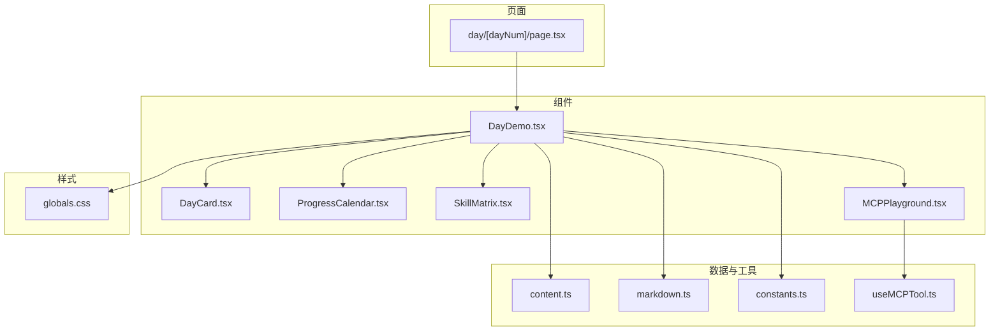
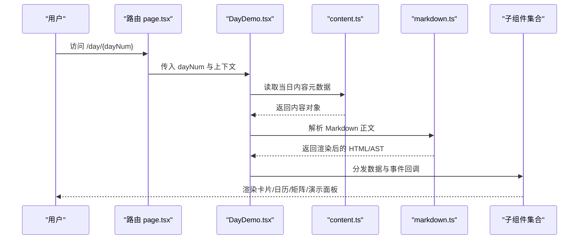
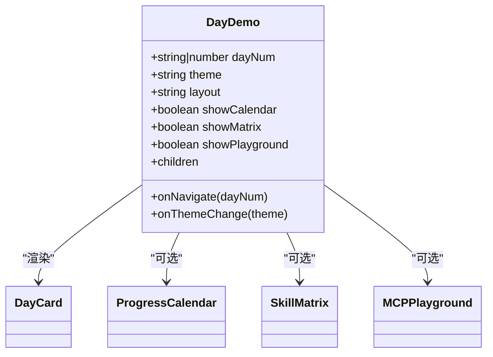
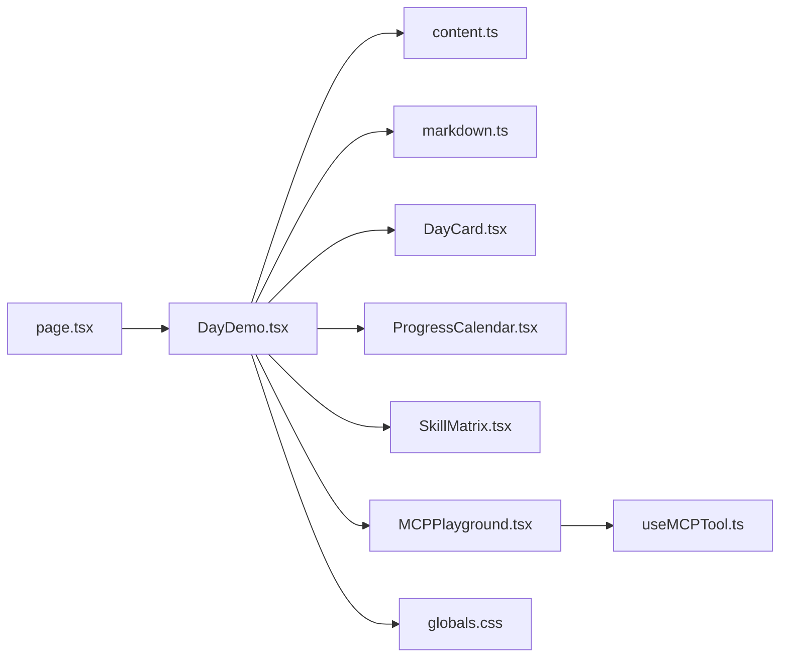

# DayDemo组件

<cite>
**本文档引用的文件**
- [DayDemo.tsx](file://src/components/DayDemo.tsx)
- [DayCard.tsx](file://src/components/DayCard.tsx)
- [page.tsx](file://src/app/day/[dayNum]/page.tsx)
- [content.ts](file://src/lib/content.ts)
- [markdown.ts](file://src/lib/markdown.ts)
- [constants.ts](file://src/lib/constants.ts)
- [ProgressCalendar.tsx](file://src/components/ProgressCalendar.tsx)
- [SkillMatrix.tsx](file://src/components/SkillMatrix.tsx)
- [MCPPlayground.tsx](file://src/components/MCPPlayground.tsx)
- [useMCPTool.ts](file://src/hooks/useMCPTool.ts)
- [layout.tsx](file://src/app/layout.tsx)
- [globals.css](file://src/app/globals.css)
</cite>

## 目录
1. [简介](#简介)
2. [项目结构](#项目结构)
3. [核心组件](#核心组件)
4. [架构总览](#架构总览)
5. [详细组件分析](#详细组件分析)
6. [依赖关系分析](#依赖关系分析)
7. [性能考虑](#性能考虑)
8. [故障排查指南](#故障排查指南)
9. [结论](#结论)
10. [附录](#附录)

## 简介
本文件为 DayDemo 组件的完整技术文档，面向开发者与内容运营人员。该组件用于按“天”维度展示学习或实践内容，支持从 Markdown 内容源渲染、卡片式布局、进度日历联动、技能矩阵展示以及 MCP 工具演示等能力。文档涵盖视觉外观、交互行为、属性（props）、事件、插槽、响应式与无障碍设计、状态与动画、样式与主题、跨浏览器兼容性与性能优化，以及与周边组件的组合集成方式。

## 项目结构
- 页面路由：通过 Next.js 动态路由 day/[dayNum] 加载指定日期的内容并渲染 DayDemo。
- 组件层：DayDemo 作为容器，组合 DayCard、ProgressCalendar、SkillMatrix、MCPPlayground 等子组件。
- 数据层：content.ts 提供每日内容元数据；markdown.ts 负责 Markdown 解析与处理；constants.ts 提供常量配置。
- 样式层：全局样式在 globals.css 中定义，组件内可使用 CSS Modules 或 Tailwind（若启用）。
- 钩子层：useMCPTool 封装 MCP 工具调用逻辑，供演示组件使用。

图表来源
- [page.tsx:1-200](file://src/app/day/[dayNum]/page.tsx#L1-L200)
- [DayDemo.tsx:1-200](file://src/components/DayDemo.tsx#L1-L200)
- [content.ts:1-200](file://src/lib/content.ts#L1-L200)
- [markdown.ts:1-200](file://src/lib/markdown.ts#L1-L200)
- [constants.ts:1-200](file://src/lib/constants.ts#L1-L200)
- [ProgressCalendar.tsx:1-200](file://src/components/ProgressCalendar.tsx#L1-L200)
- [SkillMatrix.tsx:1-200](file://src/components/SkillMatrix.tsx#L1-L200)
- [MCPPlayground.tsx:1-200](file://src/components/MCPPlayground.tsx#L1-L200)
- [useMCPTool.ts:1-200](file://src/hooks/useMCPTool.ts#L1-L200)
- [globals.css:1-200](file://src/app/globals.css#L1-L200)

章节来源
- [page.tsx:1-200](file://src/app/day/[dayNum]/page.tsx#L1-L200)
- [DayDemo.tsx:1-200](file://src/components/DayDemo.tsx#L1-L200)
- [content.ts:1-200](file://src/lib/content.ts#L1-L200)
- [markdown.ts:1-200](file://src/lib/markdown.ts#L1-L200)
- [constants.ts:1-200](file://src/lib/constants.ts#L1-L200)
- [ProgressCalendar.tsx:1-200](file://src/components/ProgressCalendar.tsx#L1-L200)
- [SkillMatrix.tsx:1-200](file://src/components/SkillMatrix.tsx#L1-L200)
- [MCPPlayground.tsx:1-200](file://src/components/MCPPlayground.tsx#L1-L200)
- [useMCPTool.ts:1-200](file://src/hooks/useMCPTool.ts#L1-L200)
- [globals.css:1-200](file://src/app/globals.css#L1-L200)

## 核心组件
- DayDemo：日期内容的主容器，负责数据获取、布局编排、主题与样式注入、可访问性增强、与子组件协作。
- DayCard：单条内容的卡片呈现，支持标题、摘要、正文、标签、操作按钮等。
- ProgressCalendar：进度日历，标记完成/进行中的日期，支持点击跳转。
- SkillMatrix：技能矩阵，可视化技能掌握度或练习次数。
- MCPPlayground：MCP 工具演示面板，提供工具列表、参数输入与结果输出。
- useMCPTool：封装 MCP 工具调用的自定义 Hook，管理请求、错误与缓存。

章节来源
- [DayDemo.tsx:1-200](file://src/components/DayDemo.tsx#L1-L200)
- [DayCard.tsx:1-200](file://src/components/DayCard.tsx#L1-L200)
- [ProgressCalendar.tsx:1-200](file://src/components/ProgressCalendar.tsx#L1-L200)
- [SkillMatrix.tsx:1-200](file://src/components/SkillMatrix.tsx#L1-L200)
- [MCPPlayground.tsx:1-200](file://src/components/MCPPlayground.tsx#L1-L200)
- [useMCPTool.ts:1-200](file://src/hooks/useMCPTool.ts#L1-L200)

## 架构总览
DayDemo 采用“容器 + 展示”的分层模式：
- 容器职责：根据路由参数 dayNum 拉取 content.ts 中的条目，结合 markdown.ts 渲染正文；将数据分发给 DayCard、ProgressCalendar、SkillMatrix、MCPPlayground。
- 展示职责：各子组件专注 UI 呈现与局部交互，通过 props 接收数据，通过回调事件向父级上报。
- 数据流：路由 -> DayDemo -> 子组件；异步数据通过 Hook 或组件内部状态管理。
- 样式与主题：全局变量与 CSS 类名集中管理，支持暗色模式与主题切换。

图表来源
- [page.tsx:1-200](file://src/app/day/[dayNum]/page.tsx#L1-L200)
- [DayDemo.tsx:1-200](file://src/components/DayDemo.tsx#L1-L200)
- [content.ts:1-200](file://src/lib/content.ts#L1-L200)
- [markdown.ts:1-200](file://src/lib/markdown.ts#L1-L200)

## 详细组件分析

### DayDemo 组件
- 视觉外观
  - 顶部导航/面包屑：显示当前日期与返回入口。
  - 主内容区：DayCard 列表或单条详情视图。
  - 侧边栏（可选）：ProgressCalendar、SkillMatrix、MCPPlayground。
  - 主题：支持明/暗模式切换，颜色变量来自全局样式。
- 行为与交互
  - 根据 dayNum 动态加载内容，支持前后翻页。
  - 点击日历日期跳转到对应日期页面。
  - 技能矩阵支持筛选与排序。
  - MCP 演示支持参数编辑、执行与结果展示。
- Props（属性）
  - dayNum: string | number，当前日期标识。
  - theme: "light" | "dark"，主题模式。
  - layout: "single" | "split"，布局模式。
  - showCalendar: boolean，是否显示进度日历。
  - showMatrix: boolean，是否显示技能矩阵。
  - showPlayground: boolean，是否显示 MCP 演示。
  - onNavigate(dayNum): void，日期跳转回调。
  - onThemeChange(theme): void，主题切换回调。
  - children?: ReactNode，插槽内容扩展。
- 事件
  - onNavigate：日期变更时触发。
  - onThemeChange：主题切换时触发。
  - 子组件事件透传：如卡片操作、矩阵筛选、演示执行等。
- 插槽
  - header：自定义头部区域。
  - sidebar：自定义侧边栏区域。
  - footer：自定义底部区域。
- 状态
  - loading：内容加载中。
  - error：加载失败或解析异常。
  - currentContent：当前内容对象。
  - theme：当前主题。
  - layout：当前布局。
- 动画与过渡
  - 内容切换使用淡入淡出过渡。
  - 主题切换平滑过渡。
  - 卡片入场使用轻微上移与透明度变化。
- 样式与主题
  - 通过 CSS 变量控制主色、背景、文字色、边框色等。
  - 支持媒体查询实现响应式布局。
- 可访问性
  - 语义化标签与 ARIA 属性。
  - 键盘导航支持 Tab/Enter/方向键。
  - 高对比度模式适配。
- 示例用法（路径引用）
  - 页面中使用：[page.tsx:1-200](file://src/app/day/[dayNum]/page.tsx#L1-L200)
  - 组件内使用：[DayDemo.tsx:1-200](file://src/components/DayDemo.tsx#L1-L200)

图表来源
- [DayDemo.tsx:1-200](file://src/components/DayDemo.tsx#L1-L200)
- [DayCard.tsx:1-200](file://src/components/DayCard.tsx#L1-L200)
- [ProgressCalendar.tsx:1-200](file://src/components/ProgressCalendar.tsx#L1-L200)
- [SkillMatrix.tsx:1-200](file://src/components/SkillMatrix.tsx#L1-L200)
- [MCPPlayground.tsx:1-200](file://src/components/MCPPlayground.tsx#L1-L200)

章节来源
- [DayDemo.tsx:1-200](file://src/components/DayDemo.tsx#L1-L200)
- [page.tsx:1-200](file://src/app/day/[dayNum]/page.tsx#L1-L200)

### DayCard 组件
- 视觉外观：标题、摘要、正文、标签、操作按钮（收藏、分享、复制等）。
- 行为与交互：点击展开/收起、复制文本到剪贴板、分享链接。
- Props：title, summary, content, tags, actions, onClick, onAction(action)。
- 事件：onAction 回调，传递动作类型与数据。
- 插槽：actions 插槽用于自定义操作按钮。
- 状态：expanded, copied, hovered。
- 动画：展开收起使用高度过渡；复制成功提示淡入淡出。
- 可访问性：按钮具备 aria-label；内容区域使用 role="article"。
- 示例用法（路径引用）：[DayCard.tsx:1-200](file://src/components/DayCard.tsx#L1-L200)

章节来源
- [DayCard.tsx:1-200](file://src/components/DayCard.tsx#L1-L200)

### ProgressCalendar 组件
- 视觉外观：网格日历，标记完成/进行中/未开始状态。
- 行为与交互：点击日期跳转；悬停显示详情。
- Props：data, onSelect(date), mode, locale。
- 事件：onSelect 回调。
- 状态：selectedDate, hoverDate。
- 动画：选中态缩放与阴影过渡。
- 可访问性：键盘导航、ARIA 描述。
- 示例用法（路径引用）：[ProgressCalendar.tsx:1-200](file://src/components/ProgressCalendar.tsx#L1-L200)

章节来源
- [ProgressCalendar.tsx:1-200](file://src/components/ProgressCalendar.tsx#L1-L200)

### SkillMatrix 组件
- 视觉外观：二维矩阵，行表示技能项，列表示维度（如频率、难度），单元格填充程度表示掌握度。
- 行为与交互：筛选、排序、悬停显示详情。
- Props：items, filters, sort, onFilterChange, onSortChange。
- 事件：onFilterChange, onSortChange。
- 状态：filters, sort, selected。
- 动画：筛选结果更新时的重新排列过渡。
- 可访问性：表格语义、键盘操作、ARIA 标签。
- 示例用法（路径引用）：[SkillMatrix.tsx:1-200](file://src/components/SkillMatrix.tsx#L1-L200)

章节来源
- [SkillMatrix.tsx:1-200](file://src/components/SkillMatrix.tsx#L1-L200)

### MCPPlayground 组件
- 视觉外观：左侧工具列表，右侧参数表单与结果输出区。
- 行为与交互：选择工具、填写参数、执行、查看结果、错误提示。
- Props：tools, defaultTool, onExecute(tool, params), onError(error)。
- 事件：onExecute, onError。
- 状态：selectedTool, params, result, error。
- 动画：结果加载骨架屏与淡入。
- 可访问性：表单字段标签、错误信息朗读。
- 示例用法（路径引用）：[MCPPlayground.tsx:1-200](file://src/components/MCPPlayground.tsx#L1-L200)

章节来源
- [MCPPlayground.tsx:1-200](file://src/components/MCPPlayground.tsx#L1-L200)

### useMCPTool 钩子
- 功能：封装 MCP 工具调用，管理请求、错误、缓存与重试。
- 接口：execute(tool, params), cancel(), reset()。
- 状态：loading, data, error, cache。
- 错误处理：网络错误、参数校验错误、业务错误分类。
- 示例用法（路径引用）：[useMCPTool.ts:1-200](file://src/hooks/useMCPTool.ts#L1-L200)

章节来源
- [useMCPTool.ts:1-200](file://src/hooks/useMCPTool.ts#L1-L200)

## 依赖关系分析
- 页面依赖 DayDemo，DayDemo 依赖 content.ts 与 markdown.ts。
- 子组件之间松耦合，通过 DayDemo 协调数据与事件。
- 样式依赖全局变量，避免硬编码颜色。
- 无循环依赖，层级清晰。

图表来源
- [page.tsx:1-200](file://src/app/day/[dayNum]/page.tsx#L1-L200)
- [DayDemo.tsx:1-200](file://src/components/DayDemo.tsx#L1-L200)
- [content.ts:1-200](file://src/lib/content.ts#L1-L200)
- [markdown.ts:1-200](file://src/lib/markdown.ts#L1-L200)
- [DayCard.tsx:1-200](file://src/components/DayCard.tsx#L1-L200)
- [ProgressCalendar.tsx:1-200](file://src/components/ProgressCalendar.tsx#L1-L200)
- [SkillMatrix.tsx:1-200](file://src/components/SkillMatrix.tsx#L1-L200)
- [MCPPlayground.tsx:1-200](file://src/components/MCPPlayground.tsx#L1-L200)
- [useMCPTool.ts:1-200](file://src/hooks/useMCPTool.ts#L1-L200)
- [globals.css:1-200](file://src/app/globals.css#L1-L200)

章节来源
- [page.tsx:1-200](file://src/app/day/[dayNum]/page.tsx#L1-L200)
- [DayDemo.tsx:1-200](file://src/components/DayDemo.tsx#L1-L200)
- [content.ts:1-200](file://src/lib/content.ts#L1-L200)
- [markdown.ts:1-200](file://src/lib/markdown.ts#L1-L200)
- [globals.css:1-200](file://src/app/globals.css#L1-L200)

## 性能考虑
- 内容懒加载：仅加载当前日期内容，历史与未来内容按需预取。
- 渲染优化：长列表使用虚拟滚动；卡片内容增量渲染。
- 图片与资源：延迟加载与占位图；压缩与 CDN。
- 主题切换：CSS 变量切换，避免重排重绘。
- 网络请求：缓存策略与去抖防抖；错误重试与降级。
- 可访问性：减少不必要的焦点移动；确保键盘可达。

## 故障排查指南
- 内容加载失败
  - 检查 content.ts 数据结构与 dayNum 匹配。
  - 检查 markdown.ts 解析器配置与异常捕获。
- 主题不生效
  - 检查全局样式变量是否正确注入。
  - 检查组件内主题类名切换逻辑。
- 日历跳转无效
  - 检查路由参数 dayNum 格式与转换。
  - 检查 onNavigate 回调是否被正确绑定。
- MCP 演示报错
  - 检查 useMCPTool 的错误分支与日志。
  - 检查参数校验与后端接口可用性。

章节来源
- [content.ts:1-200](file://src/lib/content.ts#L1-L200)
- [markdown.ts:1-200](file://src/lib/markdown.ts#L1-L200)
- [globals.css:1-200](file://src/app/globals.css#L1-L200)
- [useMCPTool.ts:1-200](file://src/hooks/useMCPTool.ts#L1-L200)

## 结论
DayDemo 以清晰的容器-展示分层、模块化子组件与统一的数据/样式管理，提供了可扩展的“按天展示”能力。通过响应式与无障碍设计、主题与动画、性能优化与错误处理，能够稳定支撑多场景的内容展示与交互需求。建议在实际使用中遵循本文档的属性与事件约定，并结合项目规范进行样式与主题定制。

## 附录
- 响应式设计指导原则
  - 使用媒体查询与弹性布局，保证小屏可读性与操作便捷性。
  - 字体大小、间距与触控目标尺寸符合移动端标准。
- 无障碍合规性
  - 语义化标签与 ARIA 属性；键盘导航与屏幕阅读器友好。
  - 色彩对比度与高对比度模式支持。
- 跨浏览器兼容性
  - 优先使用现代 Web API 并提供降级方案。
  - 针对 Safari/Chrome/Firefox 的差异进行适配测试。
- 组合模式与集成
  - DayDemo 作为聚合组件，可通过插槽与 props 灵活组合子组件。
  - 与路由、状态管理、国际化等系统解耦集成。