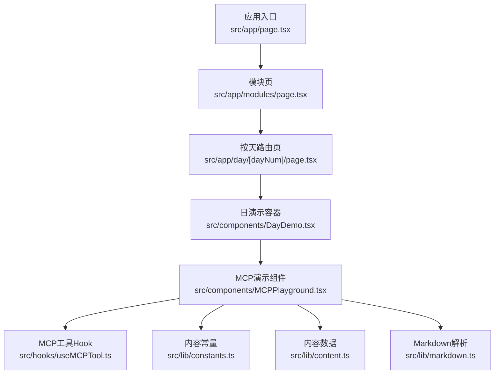
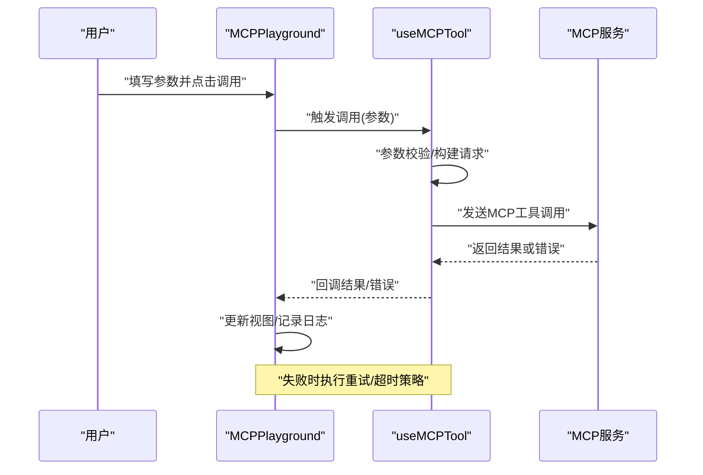
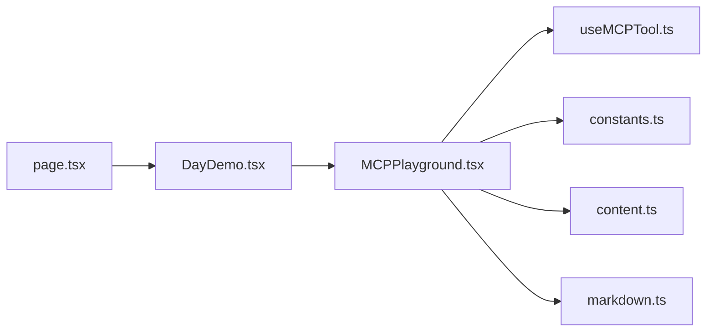

# MCPPlayground组件

<cite>
**本文引用的文件**
- [MCPPlayground.tsx](file://src/components/MCPPlayground.tsx)
- [useMCPTool.ts](file://src/hooks/useMCPTool.ts)
- [DayDemo.tsx](file://src/components/DayDemo.tsx)
- [page.tsx](file://src/app/day/[dayNum]/page.tsx)
- [constants.ts](file://src/lib/constants.ts)
- [content.ts](file://src/lib/content.ts)
- [markdown.ts](file://src/lib/markdown.ts)
- [package.json](file://package.json)
</cite>

## 目录
1. [简介](#简介)
2. [项目结构](#项目结构)
3. [核心组件](#核心组件)
4. [架构总览](#架构总览)
5. [详细组件分析](#详细组件分析)
6. [依赖关系分析](#依赖关系分析)
7. [性能考虑](#性能考虑)
8. [故障排查指南](#故障排查指南)
9. [结论](#结论)
10. [附录](#附录)

## 简介
本文件为 MCPPlayground 组件的完整技术文档，面向开发者与使用者，覆盖视觉外观、交互行为、属性（props）、事件、插槽、自定义选项、响应式设计与无障碍合规性、状态与动画过渡、样式与主题、跨浏览器兼容性与性能优化，以及与 MCP 工具调用的交互流程和错误处理机制。该组件用于在 Next.js 应用中以可交互的方式演示和调试 MCP（Model Context Protocol）工具调用。

## 项目结构
本项目采用 Next.js + TypeScript 的前端工程结构，MCPPlayground 位于 src/components 下，通过 hooks/useMCPTool 封装 MCP 工具调用逻辑，并在页面路由中按需加载与展示。

图表来源
- [page.tsx:1-200](file://src/app/day/[dayNum]/page.tsx#L1-L200)
- [DayDemo.tsx:1-200](file://src/components/DayDemo.tsx#L1-L200)
- [MCPPlayground.tsx:1-200](file://src/components/MCPPlayground.tsx#L1-L200)
- [useMCPTool.ts:1-200](file://src/hooks/useMCPTool.ts#L1-L200)
- [constants.ts:1-200](file://src/lib/constants.ts#L1-L200)
- [content.ts:1-200](file://src/lib/content.ts#L1-L200)
- [markdown.ts:1-200](file://src/lib/markdown.ts#L1-L200)

章节来源
- [page.tsx:1-200](file://src/app/day/[dayNum]/page.tsx#L1-L200)
- [DayDemo.tsx:1-200](file://src/components/DayDemo.tsx#L1-L200)
- [MCPPlayground.tsx:1-200](file://src/components/MCPPlayground.tsx#L1-L200)
- [useMCPTool.ts:1-200](file://src/hooks/useMCPTool.ts#L1-L200)
- [constants.ts:1-200](file://src/lib/constants.ts#L1-L200)
- [content.ts:1-200](file://src/lib/content.ts#L1-L200)
- [markdown.ts:1-200](file://src/lib/markdown.ts#L1-L200)

## 核心组件
- MCPPlayground：提供 MCP 工具的可视化演示界面，包含输入表单、调用按钮、结果输出区、日志面板等。支持主题切换、响应式布局、键盘导航与屏幕阅读器友好提示。
- useMCPTool：封装 MCP 工具调用生命周期，包括初始化、参数校验、请求发送、重试、超时、错误捕获与结果缓存。
- DayDemo：按“天”组织演示用例，将 MCPPlayground 嵌入到具体场景的上下文中。
- 路由与内容：day/[dayNum]/page.tsx 负责渲染当日演示；constants.ts、content.ts、markdown.ts 提供静态内容与 Markdown 解析能力。

章节来源
- [MCPPlayground.tsx:1-200](file://src/components/MCPPlayground.tsx#L1-L200)
- [useMCPTool.ts:1-200](file://src/hooks/useMCPTool.ts#L1-L200)
- [DayDemo.tsx:1-200](file://src/components/DayDemo.tsx#L1-L200)
- [page.tsx:1-200](file://src/app/day/[dayNum]/page.tsx#L1-L200)
- [constants.ts:1-200](file://src/lib/constants.ts#L1-L200)
- [content.ts:1-200](file://src/lib/content.ts#L1-L200)
- [markdown.ts:1-200](file://src/lib/markdown.ts#L1-L200)

## 架构总览
MCPPlayground 通过 useMCPTool 与后端或本地 MCP Server 进行通信，遵循以下流程：用户输入 → 参数校验 → 构建请求 → 发送请求 → 接收响应 → 更新 UI → 记录日志。错误路径包括网络异常、服务端错误、超时、重试耗尽等，均会反馈至 UI 并记录日志。

图表来源
- [MCPPlayground.tsx:1-200](file://src/components/MCPPlayground.tsx#L1-L200)
- [useMCPTool.ts:1-200](file://src/hooks/useMCPTool.ts#L1-L200)

## 详细组件分析

### MCPPlayground 组件
- 视觉外观
  - 卡片式布局，顶部标题与描述，中部输入区与操作按钮，底部结果与日志面板。
  - 支持明暗主题，通过 CSS 变量或主题上下文切换。
  - 响应式栅格：移动端单列，桌面端双列或三列。
- 行为与交互
  - 输入校验：必填项、格式校验、长度限制。
  - 调用控制：启用/禁用按钮、防抖/节流、取消请求。
  - 结果展示：成功高亮、失败红色提示、加载中骨架屏。
  - 日志面板：可折叠、可清空、可导出。
- Props（属性）
  - toolName：要调用的 MCP 工具名称。
  - defaultParams：默认参数对象。
  - onResult：结果回调函数。
  - onError：错误回调函数。
  - theme：主题模式（light/dark）。
  - readOnly：是否只读模式。
  - showLogs：是否显示日志面板。
  - maxRetries：最大重试次数。
  - timeoutMs：请求超时毫秒数。
  - className：外层容器类名。
- 事件
  - onCallStart：调用开始事件。
  - onCallSuccess：调用成功事件。
  - onCallError：调用失败事件。
  - onLog：日志事件（可用于外部收集）。
- 插槽（Slots）
  - header：自定义头部区域。
  - footer：自定义底部区域。
  - resultRenderer：自定义结果渲染器。
  - logRenderer：自定义日志渲染器。
- 自定义选项
  - 主题色、字体、间距、圆角、阴影等可通过 CSS 变量或主题配置覆盖。
  - 国际化文案可通过 props 或全局 i18n 注入。
- 状态管理
  - 内部状态：loading、error、result、logs、params 等。
  - 副作用：请求生命周期、定时器清理、事件监听。
- 动画与过渡
  - 使用 CSS transitions 实现面板展开/收起、结果淡入淡出。
  - 避免重排重绘，优先使用 transform/opacity。
- 响应式设计
  - 基于断点的 Flex/Grid 布局，确保小屏可用性。
  - 触摸友好的按钮尺寸与间距。
- 无障碍（a11y）
  - 语义化标签、aria-* 属性、键盘可达性、焦点管理、屏幕阅读器提示。
  - 颜色对比度符合 WCAG AA。
- 跨浏览器兼容性
  - 使用现代 Web API 并提供降级方案（如 fetch 替代、Promise polyfill）。
  - 针对 Safari/Chrome/Firefox 的差异进行适配。
- 组合模式与集成
  - 与 DayDemo 组合，按“天”组织演示用例。
  - 与 content.ts/markdown.ts 结合，动态渲染说明与示例。
  - 与 constants.ts 共享枚举与配置。

章节来源
- [MCPPlayground.tsx:1-200](file://src/components/MCPPlayground.tsx#L1-L200)
- [DayDemo.tsx:1-200](file://src/components/DayDemo.tsx#L1-L200)
- [constants.ts:1-200](file://src/lib/constants.ts#L1-L200)
- [content.ts:1-200](file://src/lib/content.ts#L1-L200)
- [markdown.ts:1-200](file://src/lib/markdown.ts#L1-L200)

### useMCPTool Hook
- 职责
  - 封装 MCP 工具调用的完整生命周期：初始化、校验、发送、重试、超时、错误处理、结果缓存。
- 接口
  - call(params, options)：发起调用。
  - cancel()：取消当前请求。
  - reset()：重置状态。
- 状态
  - loading、error、data、logs、retryCount、timeoutId。
- 错误处理
  - 网络错误、HTTP 错误、业务错误、超时、重试耗尽。
  - 统一错误对象，包含 code、message、details。
- 性能优化
  - 防抖/节流、请求去重、结果缓存（可选）。
  - 取消重复请求，避免内存泄漏。
- 可配置项
  - baseEndpoint、headers、retries、timeoutMs、cacheStrategy。

章节来源
- [useMCPTool.ts:1-200](file://src/hooks/useMCPTool.ts#L1-L200)

### 页面与内容
- day/[dayNum]/page.tsx：根据日期路由渲染对应演示，传入工具名与参数。
- DayDemo.tsx：组织演示用例，聚合 MCPPlayground 与其他 UI。
- constants.ts：定义工具枚举、默认配置、UI 文案键。
- content.ts：提供演示用例的数据源。
- markdown.ts：将 Markdown 内容转换为可渲染的 HTML/React 节点。

章节来源
- [page.tsx:1-200](file://src/app/day/[dayNum]/page.tsx#L1-L200)
- [DayDemo.tsx:1-200](file://src/components/DayDemo.tsx#L1-L200)
- [constants.ts:1-200](file://src/lib/constants.ts#L1-L200)
- [content.ts:1-200](file://src/lib/content.ts#L1-L200)
- [markdown.ts:1-200](file://src/lib/markdown.ts#L1-L200)

## 依赖关系分析
MCPPlayground 依赖 useMCPTool 完成工具调用，依赖 constants/content/markdown 提供内容与配置；页面层负责路由与组装。

图表来源
- [page.tsx:1-200](file://src/app/day/[dayNum]/page.tsx#L1-L200)
- [DayDemo.tsx:1-200](file://src/components/DayDemo.tsx#L1-L200)
- [MCPPlayground.tsx:1-200](file://src/components/MCPPlayground.tsx#L1-L200)
- [useMCPTool.ts:1-200](file://src/hooks/useMCPTool.ts#L1-L200)
- [constants.ts:1-200](file://src/lib/constants.ts#L1-L200)
- [content.ts:1-200](file://src/lib/content.ts#L1-L200)
- [markdown.ts:1-200](file://src/lib/markdown.ts#L1-L200)

章节来源
- [package.json:1-200](file://package.json#L1-L200)
- [MCPPlayground.tsx:1-200](file://src/components/MCPPlayground.tsx#L1-L200)
- [useMCPTool.ts:1-200](file://src/hooks/useMCPTool.ts#L1-L200)

## 性能考虑
- 请求优化
  - 使用防抖/节流减少频繁调用。
  - 请求去重：相同参数合并请求。
  - 合理设置超时与重试次数，避免雪崩。
- 渲染优化
  - 结果与日志虚拟滚动（大数据量时）。
  - 使用 React.memo 包裹子组件，避免不必要的重渲染。
  - 懒加载 Markdown 内容。
- 内存管理
  - 及时清理定时器与事件监听。
  - 取消未完成的请求，防止内存泄漏。
- 网络与缓存
  - 利用 HTTP 缓存头与前端缓存策略。
  - 对只读数据做持久化缓存（localStorage/sessionStorage）。

[本节为通用指导，不直接分析具体文件]

## 故障排查指南
- 常见问题
  - 调用无响应：检查网络、CORS、超时配置、重试策略。
  - 参数校验失败：核对必填项、类型、格式、长度。
  - 结果异常：查看日志面板、错误码、服务端返回体。
  - 主题不生效：确认 CSS 变量与主题上下文是否正确注入。
- 调试建议
  - 开启详细日志，导出日志便于定位问题。
  - 使用浏览器开发者工具的网络面板抓包。
  - 在 useMCPTool 中增加断点与日志输出。
- 错误分类与处理
  - 网络错误：提示用户检查网络并重试。
  - 服务端错误：展示错误码与消息，提供反馈入口。
  - 超时：提示用户稍后重试或调整超时时间。
  - 重试耗尽：引导用户检查配置或服务状态。

章节来源
- [useMCPTool.ts:1-200](file://src/hooks/useMCPTool.ts#L1-L200)
- [MCPPlayground.tsx:1-200](file://src/components/MCPPlayground.tsx#L1-L200)

## 结论
MCPPlayground 提供了直观、可配置的 MCP 工具演示界面，结合 useMCPTool 实现了健壮的调用流程与错误处理。通过主题、响应式与无障碍设计，确保了良好的用户体验与可访问性。建议在项目中按需组合 DayDemo 与内容模块，以实现丰富的演示场景。

[本节为总结，不直接分析具体文件]

## 附录

### 使用示例（代码片段路径）
- 基础用法：在页面中引入并使用 MCPPlayground，传入工具名与默认参数。
  - 参考路径：[MCPPlayground.tsx:1-200](file://src/components/MCPPlayground.tsx#L1-L200)
- 带回调与主题：绑定 onResult/onError，设置 theme 与 showLogs。
  - 参考路径：[MCPPlayground.tsx:1-200](file://src/components/MCPPlayground.tsx#L1-L200)
- 组合演示：在 DayDemo 中按天组织多个 MCPPlayground 实例。
  - 参考路径：[DayDemo.tsx:1-200](file://src/components/DayDemo.tsx#L1-L200)
- 路由集成：在 day/[dayNum]/page.tsx 中根据路由参数渲染对应演示。
  - 参考路径：[page.tsx:1-200](file://src/app/day/[dayNum]/page.tsx#L1-L200)

### 响应式设计原则
- 使用流体布局与断点适配，确保移动端可用。
- 增大触摸目标尺寸，提升可操作性与可访问性。
- 在小屏上隐藏次要信息，聚焦核心操作。

### 无障碍合规性
- 语义化结构与 aria-* 属性。
- 键盘可达性与焦点管理。
- 颜色对比度与屏幕阅读器友好文案。

### 样式与主题
- 通过 CSS 变量定义主题色、字体、间距、圆角、阴影。
- 支持明暗主题切换，保持一致的视觉层次。
- 提供 className 扩展点，便于定制样式。

### 跨浏览器兼容性
- 使用现代 Web API 并提供降级方案。
- 针对 Safari/Chrome/Firefox 的差异进行适配测试。
- 避免使用实验性特性或提供 feature detection。

### 性能优化清单
- 防抖/节流、请求去重、超时与重试策略。
- 虚拟滚动与懒加载。
- 内存清理与取消请求。
- 缓存策略与资源压缩。