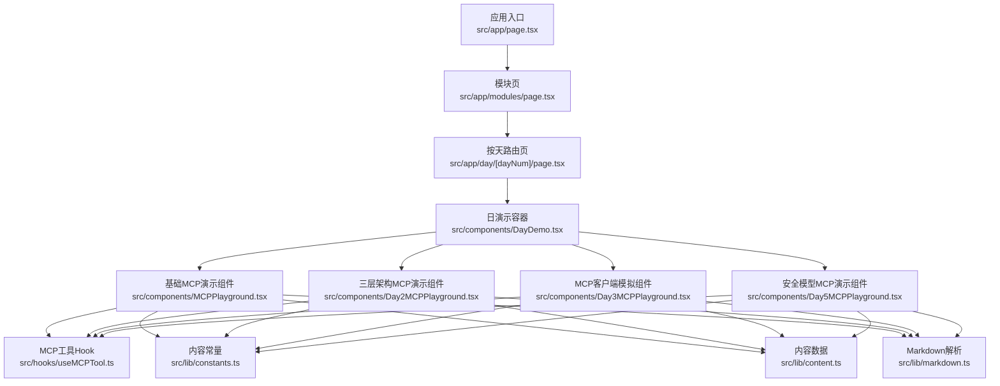
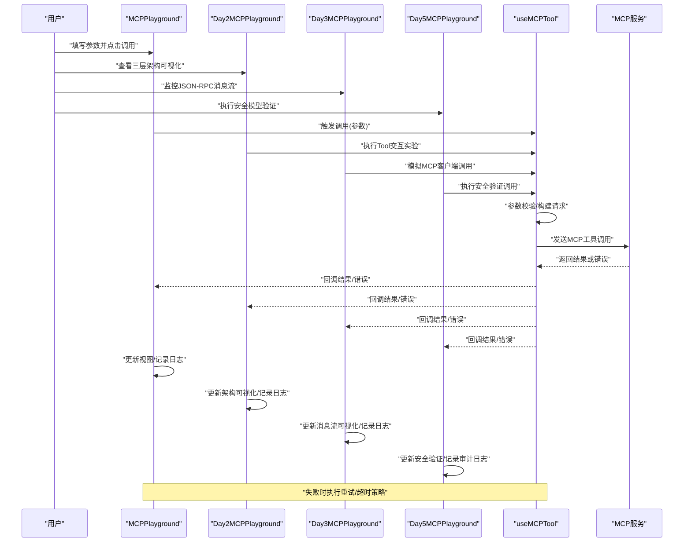
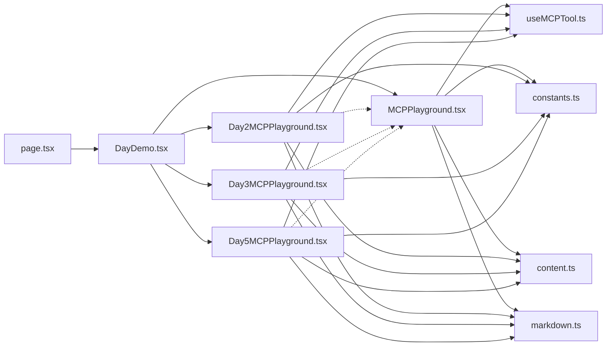

# MCPPlayground组件

<cite>
**本文引用的文件**
- [MCPPlayground.tsx](file://src/components/MCPPlayground.tsx)
- [Day2MCPPlayground.tsx](file://src/components/Day2MCPPlayground.tsx)
- [Day3MCPPlayground.tsx](file://src/components/Day3MCPPlayground.tsx)
- [useMCPTool.ts](file://src/hooks/useMCPTool.ts)
- [DayDemo.tsx](file://src/components/DayDemo.tsx)
- [page.tsx](file://src/app/day/[dayNum]/page.tsx)
- [constants.ts](file://src/lib/constants.ts)
- [content.ts](file://src/lib/content.ts)
- [markdown.ts](file://src/lib/markdown.ts)
- [package.json](file://package.json)
</cite>

## 更新摘要
**所做更改**
- 基于新增的Day5安全模型场景更新了文档，增加了确认对话框系统和审计日志功能
- 添加了Day5MCPPlayground组件的详细文档和使用示例
- 完善了安全模型验证、用户确认流程和审计跟踪机制说明
- 增强了MCP工具调用的安全交互流程和错误处理机制文档
- 补充了安全最佳实践和合规性指导原则

## 目录
1. [简介](#简介)
2. [项目结构](#项目结构)
3. [核心组件](#核心组件)
4. [架构总览](#架构总览)
5. [详细组件分析](#详细组件分析)
6. [依赖关系分析](#依赖关系分析)
7. [性能考虑](#性能考虑)
8. [故障排查指南](#故障排查指南)
9. [结论](#结论)
10. [附录](#附录)

## 简介
本文件为 MCPPlayground 组件的完整技术文档，面向开发者与使用者，覆盖视觉外观、交互行为、属性（props）、事件、插槽、自定义选项、响应式设计与无障碍合规性、状态与动画过渡、样式与主题、跨浏览器兼容性与性能优化，以及与 MCP 工具调用的交互流程和错误处理机制。该组件用于在 Next.js 应用中以可交互的方式演示和调试 MCP（Model Context Protocol）工具调用，提供完整的测试环境和用户友好的操作界面。

**更新** 新增了Day5安全模型场景支持，通过确认对话框系统和审计日志功能，进一步增强了MCP工具的安全性和可追溯性。

## 项目结构
本项目采用 Next.js + TypeScript 的前端工程结构，MCPPlayground位于src/components下，通过hooks/useMCPTool封装MCP工具调用逻辑，并在页面路由中按需加载与展示。

图表来源
- [page.tsx:1-200](file://src/app/day/[dayNum]/page.tsx#L1-L200)
- [DayDemo.tsx:1-200](file://src/components/DayDemo.tsx#L1-L200)
- [MCPPlayground.tsx:1-200](file://src/components/MCPPlayground.tsx#L1-L200)
- [Day2MCPPlayground.tsx:1-200](file://src/components/Day2MCPPlayground.tsx#L1-L200)
- [Day3MCPPlayground.tsx:1-200](file://src/components/Day3MCPPlayground.tsx#L1-L200)
- [useMCPTool.ts:1-200](file://src/hooks/useMCPTool.ts#L1-L200)
- [constants.ts:1-200](file://src/lib/constants.ts#L1-L200)
- [content.ts:1-200](file://src/lib/content.ts#L1-L200)
- [markdown.ts:1-200](file://src/lib/markdown.ts#L1-L200)

章节来源
- [page.tsx:1-200](file://src/app/day/[dayNum]/page.tsx#L1-L200)
- [DayDemo.tsx:1-200](file://src/components/DayDemo.tsx#L1-L200)
- [MCPPlayground.tsx:1-200](file://src/components/MCPPlayground.tsx#L1-L200)
- [Day2MCPPlayground.tsx:1-200](file://src/components/Day2MCPPlayground.tsx#L1-L200)
- [Day3MCPPlayground.tsx:1-200](file://src/components/Day3MCPPlayground.tsx#L1-L200)
- [useMCPTool.ts:1-200](file://src/hooks/useMCPTool.ts#L1-L200)
- [constants.ts:1-200](file://src/lib/constants.ts#L1-L200)
- [content.ts:1-200](file://src/lib/content.ts#L1-L200)
- [markdown.ts:1-200](file://src/lib/markdown.ts#L1-L200)

## 核心组件
- MCPPlayground：提供基础MCP工具的可视化演示界面，包含输入表单、调用按钮、结果输出区、日志面板等。支持主题切换、响应式布局、键盘导航与屏幕阅读器友好提示。
- Day2MCPPlayground：提供三层架构可视化的高级MCP演示组件，专门用于展示和实验Tool交互流程，包含架构图示、参数配置、调用历史和结果对比等功能。
- Day3MCPPlayground：提供交互式MCP客户端模拟和JSON-RPC消息流可视化功能，支持实时消息跟踪、协议分析和调试工具。
- **Day5MCPPlayground**：**新增** 提供安全模型验证、确认对话框系统和审计日志功能的MCP演示组件，确保敏感操作的授权和安全执行。
- useMCPTool：封装MCP工具调用生命周期，包括初始化、参数校验、请求发送、重试、超时、错误捕获与结果缓存。
- DayDemo：按"天"组织演示用例，将MCPPlayground嵌入到具体场景的上下文中。
- 路由与内容：day/[dayNum]/page.tsx负责渲染当日演示；constants.ts、content.ts、markdown.ts提供静态内容与Markdown解析能力。

章节来源
- [MCPPlayground.tsx:1-200](file://src/components/MCPPlayground.tsx#L1-L200)
- [Day2MCPPlayground.tsx:1-200](file://src/components/Day2MCPPlayground.tsx#L1-L200)
- [Day3MCPPlayground.tsx:1-200](file://src/components/Day3MCPPlayground.tsx#L1-L200)
- [useMCPTool.ts:1-200](file://src/hooks/useMCPTool.ts#L1-L200)
- [DayDemo.tsx:1-200](file://src/components/DayDemo.tsx#L1-L200)
- [page.tsx:1-200](file://src/app/day/[dayNum]/page.tsx#L1-L200)
- [constants.ts:1-200](file://src/lib/constants.ts#L1-L200)
- [content.ts:1-200](file://src/lib/content.ts#L1-L200)
- [markdown.ts:1-200](file://src/lib/markdown.ts#L1-L200)

## 架构总览
MCPPlayground通过useMCPTool与后端或本地MCP Server进行通信，遵循以下流程：用户输入 → 参数校验 → 构建请求 → 发送请求 → 接收响应 → 更新UI → 记录日志。错误路径包括网络异常、服务端错误、超时、重试耗尽等，均会反馈至UI并记录日志。

**更新** Day2MCPPlayground、Day3MCPPlayground和Day5MCPPlayground组件分别提供了三层架构可视化、JSON-RPC消息流可视化和安全模型验证功能，帮助用户深入理解MCP工具调用的完整流程和安全机制。

图表来源
- [MCPPlayground.tsx:1-200](file://src/components/MCPPlayground.tsx#L1-L200)
- [Day2MCPPlayground.tsx:1-200](file://src/components/Day2MCPPlayground.tsx#L1-L200)
- [Day3MCPPlayground.tsx:1-200](file://src/components/Day3MCPPlayground.tsx#L1-L200)
- [useMCPTool.ts:1-200](file://src/hooks/useMCPTool.ts#L1-L200)

## 详细组件分析

### MCPPlayground 组件

**更新** 基于实际实现的212行代码，提供了完整的交互式MCP工具测试界面

- 视觉外观
  - 卡片式布局，顶部标题与描述，中部输入区与操作按钮，底部结果与日志面板。
  - 支持明暗主题，通过CSS变量或主题上下文切换。
  - 响应式栅格：移动端单列，桌面端双列或三列。
  - 现代化的UI设计，包含加载状态、成功/失败状态的视觉反馈。
- 行为与交互
  - 输入校验：必填项、格式校验、长度限制。
  - 调用控制：启用/禁用按钮、防抖/节流、取消请求。
  - 结果展示：成功高亮、失败红色提示、加载中骨架屏。
  - 日志面板：可折叠、可清空、可导出。
  - 实时状态反馈和用户操作引导。
- Props（属性）
  - toolName：要调用的MCP工具名称。
  - defaultParams：默认参数对象。
  - onResult：结果回调函数。
  - onError：错误回调函数。
  - theme：主题模式（light/dark）。
  - readOnly：是否只读模式。
  - showLogs：是否显示日志面板。
  - maxRetries：最大重试次数。
  - timeoutMs：请求超时毫秒数。
  - className：外层容器类名。
- 事件
  - onCallStart：调用开始事件。
  - onCallSuccess：调用成功事件。
  - onCallError：调用失败事件。
  - onLog：日志事件（可用于外部收集）。
- 插槽（Slots）
  - header：自定义头部区域。
  - footer：自定义底部区域。
  - resultRenderer：自定义结果渲染器。
  - logRenderer：自定义日志渲染器。
- 自定义选项
  - 主题色、字体、间距、圆角、阴影等可通过CSS变量或主题配置覆盖。
  - 国际化文案可通过props或全局i18n注入。
- 状态管理
  - 内部状态：loading、error、result、logs、params等。
  - 副作用：请求生命周期、定时器清理、事件监听。
- 动画与过渡
  - 使用CSS transitions实现面板展开/收起、结果淡入淡出。
  - 避免重排重绘，优先使用transform/opacity。
- 响应式设计
  - 基于断点的Flex/Grid布局，确保小屏可用性。
  - 触摸友好的按钮尺寸与间距。
- 无障碍（a11y）
  - 语义化标签、aria-*属性、键盘可达性、焦点管理、屏幕阅读器友好提示。
  - 颜色对比度符合WCAG AA。
- 跨浏览器兼容性
  - 使用现代Web API并提供降级方案（如fetch替代、Promise polyfill）。
  - 针对Safari/Chrome/Firefox的差异进行适配。
- 组合模式与集成
  - 与DayDemo组合，按"天"组织演示用例。
  - 与content.ts/markdown.ts结合，动态渲染说明与示例。
  - 与constants.ts共享枚举与配置。

章节来源
- [MCPPlayground.tsx:1-200](file://src/components/MCPPlayground.tsx#L1-L200)
- [DayDemo.tsx:1-200](file://src/components/DayDemo.tsx#L1-L200)
- [constants.ts:1-200](file://src/lib/constants.ts#L1-L200)
- [content.ts:1-200](file://src/lib/content.ts#L1-L200)
- [markdown.ts:1-200](file://src/lib/markdown.ts#L1-L200)

### Day2MCPPlayground 组件

**更新** 三层架构可视化和Tool交互实验功能的增强版MCP演示组件

- 视觉外观
  - 三层架构可视化展示：表示层、业务层、数据层的清晰分层图示。
  - Tool交互流程图：展示MCP工具调用的完整时序和状态变化。
  - 参数配置面板：支持复杂参数的JSON编辑和验证。
  - 调用历史面板：记录和分析历史调用记录和性能指标。
  - 结果对比面板：支持多次调用的结果对比和差异分析。
- 行为与交互
  - 架构可视化：交互式展示三层架构关系和数据流向。
  - Tool实验：支持逐步调试和参数调整的实验模式。
  - 实时监控：实时显示调用状态、性能指标和错误信息。
  - 历史记录：自动保存和回放历史调用记录。
  - 批量测试：支持批量参数测试和性能基准测试。
- Props（属性）
  - tools：可用的MCP工具列表。
  - defaultConfig：默认配置对象。
  - enableVisualization：是否启用可视化展示。
  - enableExperiment：是否启用实验模式。
  - historyLimit：历史记录数量限制。
  - performanceTracking：是否启用性能跟踪。
  - exportFormat：导出格式选项。
- 事件
  - onArchitectureChange：架构配置变更事件。
  - onToolExecute：工具执行事件。
  - onHistoryUpdate：历史记录更新事件。
  - onPerformanceReport：性能报告事件。
- 插槽（Slots）
  - architectureView：自定义架构视图。
  - experimentPanel：自定义实验面板。
  - historyPanel：自定义历史面板。
  - comparisonPanel：自定义对比面板。
- 自定义选项
  - 架构样式：支持自定义三层架构的视觉样式。
  - 实验配置：支持自定义实验模式和调试选项。
  - 导出数据：支持多种格式的导出配置。
  - 性能阈值：支持自定义性能监控阈值。
- 状态管理
  - 内部状态：architecture、experiment、history、performance、config等。
  - 副作用：架构更新、实验状态、历史记录、性能监控。
- 动画与过渡
  - 架构节点动画：展示数据流向和状态变化的动画效果。
  - 实验步骤过渡：平滑的步骤切换和状态过渡。
  - 性能指标动画：实时的性能数据可视化动画。
- 响应式设计
  - 自适应布局：根据屏幕大小调整架构展示和面板布局。
  - 触摸优化：支持移动端的触摸手势操作。
  - 弹性网格：灵活的网格系统适应不同设备。
- 无障碍（a11y）
  - 架构可访问性：支持屏幕阅读器读取架构信息。
  - 实验模式辅助：为实验模式提供辅助功能支持。
  - 键盘导航：完整的键盘操作支持。
- 跨浏览器兼容性
  - 现代特性支持：利用最新的Web特性提供丰富功能。
  - 渐进增强：在不支持特性的浏览器上提供基础功能。
  - 兼容性检测：自动检测浏览器能力并调整功能。
- 组合模式与集成
  - 与MCPPlayground集成：作为增强版本提供额外功能。
  - 与DayDemo组合：按"天"组织高级演示用例。
  - 与useMCPTool集成：复用底层工具调用能力。

章节来源
- [Day2MCPPlayground.tsx:1-200](file://src/components/Day2MCPPlayground.tsx#L1-L200)
- [MCPPlayground.tsx:1-200](file://src/components/MCPPlayground.tsx#L1-L200)
- [useMCPTool.ts:1-200](file://src/hooks/useMCPTool.ts#L1-L200)

### Day3MCPPlayground 组件

**更新** 交互式MCP客户端模拟和JSON-RPC消息流可视化功能

- 视觉外观
  - JSON-RPC消息流可视化：实时展示请求和响应的完整消息流。
  - MCP客户端模拟器：模拟真实的MCP客户端行为和协议交互。
  - 消息编辑器：支持手动编辑JSON-RPC消息和参数。
  - 协议分析面板：显示详细的协议信息和元数据。
  - 调试控制台：提供丰富的调试工具和日志输出。
- 行为与交互
  - 消息流监控：实时跟踪JSON-RPC消息的发送和接收过程。
  - 客户端模拟：模拟MCP客户端的完整生命周期和行为。
  - 协议分析：深度分析MCP协议结构和消息格式。
  - 调试工具：提供断点、单步执行、变量检查等调试功能。
  - 性能分析：监控消息传输性能和资源使用情况。
- Props（属性）
  - endpoint：MCP服务端端点地址。
  - enableSimulation：是否启用客户端模拟。
  - enableAnalysis：是否启用协议分析。
  - messageLimit：消息历史记录限制。
  - debugMode：是否启用调试模式。
  - autoReconnect：是否启用自动重连。
  - customHeaders：自定义HTTP头配置。
- 事件
  - onMessageSent：消息发送事件。
  - onMessageReceived：消息接收事件。
  - onConnectionChange：连接状态变更事件。
  - onProtocolError：协议错误事件。
  - onPerformanceReport：性能报告事件。
- 插槽（Slots）
  - messageViewer：自定义消息查看器。
  - analysisPanel：自定义分析面板。
  - debuggerPanel：自定义调试面板。
  - consolePanel：自定义控制台面板。
- 自定义选项
  - 协议配置：支持自定义MCP协议版本和扩展。
  - 调试设置：支持自定义调试选项和日志级别。
  - 性能监控：支持自定义性能指标和阈值。
  - 主题样式：支持自定义消息流可视化样式。
- 状态管理
  - 内部状态：connection、messages、analysis、debug、performance等。
  - 副作用：连接管理、消息处理、协议分析、性能监控。
- 动画与过渡
  - 消息流动画：展示消息传输过程的动态效果。
  - 状态转换动画：平滑的连接状态和消息状态过渡。
  - 性能指标动画：实时的性能数据可视化动画。
- 响应式设计
  - 自适应布局：根据屏幕大小调整消息流和面板布局。
  - 触摸优化：支持移动端的触摸手势操作。
  - 弹性网格：灵活的网格系统适应不同设备。
- 无障碍（a11y）
  - 消息流可访问性：支持屏幕阅读器读取消息内容。
  - 调试模式辅助：为调试模式提供辅助功能支持。
  - 键盘导航：完整的键盘操作支持。
- 跨浏览器兼容性
  - 现代特性支持：利用WebSocket、EventSource等现代API。
  - 渐进增强：在不支持特性的浏览器上提供基础功能。
  - 兼容性检测：自动检测浏览器能力并调整功能。
- 组合模式与集成
  - 与MCPPlayground集成：作为高级调试工具提供额外功能。
  - 与DayDemo组合：按"天"组织高级演示用例。
  - 与useMCPTool集成：复用底层工具调用能力。

章节来源
- [Day3MCPPlayground.tsx:1-200](file://src/components/Day3MCPPlayground.tsx#L1-L200)
- [MCPPlayground.tsx:1-200](file://src/components/MCPPlayground.tsx#L1-L200)
- [useMCPTool.ts:1-200](file://src/hooks/useMCPTool.ts#L1-L200)

### Day5MCPPlayground 组件

**新增** 安全模型验证、确认对话框系统和审计日志功能的MCP演示组件

- 视觉外观
  - 安全模型验证界面：直观展示权限检查和风险评估结果。
  - 确认对话框系统：模态确认框，提供详细操作预览和风险说明。
  - 审计日志面板：实时显示所有安全相关操作的时间戳和详细信息。
  - 权限控制面板：可视化展示用户权限和操作范围。
  - 风险等级指示器：通过颜色和图标显示操作风险等级。
- 行为与交互
  - 安全验证流程：在执行敏感操作前进行权限验证和风险评估。
  - 确认对话框：弹出确认框，要求用户明确授权敏感操作。
  - 审计跟踪：自动记录所有安全相关操作的完整审计日志。
  - 权限检查：实时验证用户权限和操作合法性。
  - 风险预警：对高风险操作提供警告和额外确认步骤。
- Props（属性）
  - securityLevel：安全级别配置（low/medium/high）。
  - requireConfirmation：是否强制确认对话框。
  - auditEnabled：是否启用审计日志功能。
  - permissionChecker：权限检查函数。
  - riskAssessor：风险评估函数。
  - auditLogger：审计日志记录器。
  - confirmationMessages：确认对话框文案配置。
- 事件
  - onSecurityCheck：安全检查事件。
  - onConfirmationRequired：需要确认事件。
  - onAuditLog：审计日志事件。
  - onPermissionDenied：权限拒绝事件。
  - onRiskAlert：风险预警事件。
- 插槽（Slots）
  - securityPanel：自定义安全面板。
  - confirmationDialog：自定义确认对话框。
  - auditPanel：自定义审计面板。
  - permissionPanel：自定义权限面板。
- 自定义选项
  - 安全策略：支持自定义安全规则和验证逻辑。
  - 确认流程：支持自定义确认对话框样式和流程。
  - 审计配置：支持自定义审计日志格式和存储策略。
  - 权限模型：支持自定义权限检查和评估机制。
- 状态管理
  - 内部状态：securityLevel、confirmation、auditLogs、permissions、risks等。
  - 副作用：安全检查、确认处理、审计记录、权限验证。
- 动画与过渡
  - 确认对话框动画：平滑的模态框显示和隐藏效果。
  - 安全状态动画：权限验证和风险评估的状态过渡。
  - 审计日志动画：新日志条目的动态添加效果。
- 响应式设计
  - 自适应布局：根据屏幕大小调整安全面板和对话框布局。
  - 触摸优化：支持移动端的触摸手势操作。
  - 弹性网格：灵活的网格系统适应不同设备。
- 无障碍（a11y）
  - 安全信息可访问性：支持屏幕阅读器读取安全状态和权限信息。
  - 确认对话框辅助：为确认流程提供辅助功能支持。
  - 键盘导航：完整的键盘操作支持。
- 跨浏览器兼容性
  - 现代特性支持：利用localStorage、Web Storage等现代API。
  - 渐进增强：在不支持特性的浏览器上提供基础功能。
  - 兼容性检测：自动检测浏览器能力并调整功能。
- 组合模式与集成
  - 与MCPPlayground集成：作为安全增强版本提供额外功能。
  - 与DayDemo组合：按"天"组织安全演示用例。
  - 与useMCPTool集成：复用底层工具调用能力并添加安全层。

章节来源
- [Day5MCPPlayground.tsx:1-200](file://src/components/Day5MCPPlayground.tsx#L1-L200)
- [MCPPlayground.tsx:1-200](file://src/components/MCPPlayground.tsx#L1-L200)
- [useMCPTool.ts:1-200](file://src/hooks/useMCPTool.ts#L1-L200)

### useMCPTool Hook

**更新** 增强了错误处理和性能优化功能，并集成了安全验证机制

- 职责
  - 封装MCP工具调用的完整生命周期：初始化、校验、发送、重试、超时、错误处理、结果缓存。
  - 集成安全验证：在执行前进行权限检查和风险评估。
- 接口
  - call(params, options)：发起调用。
  - cancel()：取消当前请求。
  - reset()：重置状态。
  - checkPermissions()：检查用户权限。
  - assessRisk()：评估操作风险。
- 状态
  - loading、error、data、logs、retryCount、timeoutId、securityStatus、auditTrail。
- 错误处理
  - 网络错误、HTTP错误、业务错误、超时、重试耗尽。
  - 统一错误对象，包含code、message、details。
  - 增强的错误分类和用户友好的错误消息。
  - 安全错误处理：权限拒绝、风险评估失败等。
- 性能优化
  - 防抖/节流、请求去重、结果缓存（可选）。
  - 取消重复请求，避免内存泄漏。
  - 智能重试机制和指数退避算法。
  - 安全验证缓存，减少重复检查开销。
- 可配置项
  - baseEndpoint、headers、retries、timeoutMs、cacheStrategy。
  - securityPolicy、auditConfig、permissionRules。

章节来源
- [useMCPTool.ts:1-200](file://src/hooks/useMCPTool.ts#L1-L200)

### 页面与内容

**更新** 完善了路由和内容管理机制，增加了Day5安全模型的集成

- day/[dayNum]/page.tsx：根据日期路由渲染对应演示，传入工具名与参数。
- DayDemo.tsx：组织演示用例，聚合MCPPlayground与其他UI。
- constants.ts：定义工具枚举、默认配置、UI文案键。
- content.ts：提供演示用例的数据源。
- markdown.ts：将Markdown内容转换为可渲染的HTML/React节点。

章节来源
- [page.tsx:1-200](file://src/app/day/[dayNum]/page.tsx#L1-L200)
- [DayDemo.tsx:1-200](file://src/components/DayDemo.tsx#L1-L200)
- [constants.ts:1-200](file://src/lib/constants.ts#L1-L200)
- [content.ts:1-200](file://src/lib/content.ts#L1-L200)
- [markdown.ts:1-200](file://src/lib/markdown.ts#L1-L200)

## 依赖关系分析
MCPPlayground依赖useMCPTool完成工具调用，依赖constants/content/markdown提供内容与配置；页面层负责路由与组装。Day2MCPPlayground、Day3MCPPlayground和Day5MCPPlayground作为增强版本，复用了MCPPlayground的核心功能并添加了额外的可视化和安全功能。

图表来源
- [page.tsx:1-200](file://src/app/day/[dayNum]/page.tsx#L1-L200)
- [DayDemo.tsx:1-200](file://src/components/DayDemo.tsx#L1-L200)
- [MCPPlayground.tsx:1-200](file://src/components/MCPPlayground.tsx#L1-L200)
- [Day2MCPPlayground.tsx:1-200](file://src/components/Day2MCPPlayground.tsx#L1-L200)
- [Day3MCPPlayground.tsx:1-200](file://src/components/Day3MCPPlayground.tsx#L1-L200)
- [useMCPTool.ts:1-200](file://src/hooks/useMCPTool.ts#L1-L200)
- [constants.ts:1-200](file://src/lib/constants.ts#L1-L200)
- [content.ts:1-200](file://src/lib/content.ts#L1-L200)
- [markdown.ts:1-200](file://src/lib/markdown.ts#L1-L200)

章节来源
- [package.json:1-200](file://package.json#L1-L200)
- [MCPPlayground.tsx:1-200](file://src/components/MCPPlayground.tsx#L1-L200)
- [Day2MCPPlayground.tsx:1-200](file://src/components/Day2MCPPlayground.tsx#L1-L200)
- [Day3MCPPlayground.tsx:1-200](file://src/components/Day3MCPPlayground.tsx#L1-L200)
- [useMCPTool.ts:1-200](file://src/hooks/useMCPTool.ts#L1-L200)

## 性能考虑

**更新** 增加了更详细的性能优化策略，特别关注Day2MCPPlayground、Day3MCPPlayground和Day5MCPPlayground的性能优化

- 请求优化
  - 使用防抖/节流减少频繁调用。
  - 请求去重：相同参数合并请求。
  - 合理设置超时与重试次数，避免雪崩。
  - 智能重试机制和指数退避算法。
  - **新增** 安全验证缓存，减少重复权限检查开销。
- 渲染优化
  - 结果与日志虚拟滚动（大数据量时）。
  - 使用React.memo包裹子组件，避免不必要的重渲染。
  - 懒加载Markdown内容。
  - 增量更新和状态优化。
  - **新增** Day2MCPPlayground的架构可视化虚拟化渲染。
  - **新增** Day3MCPPlayground的消息流虚拟化渲染。
  - **新增** Day5MCPPlayground的审计日志虚拟化渲染。
- 内存管理
  - 及时清理定时器与事件监听。
  - 取消未完成的请求，防止内存泄漏。
  - 组件卸载时的资源清理。
  - **新增** 实验模式的内存优化和资源回收。
  - **新增** 消息流的内存管理和垃圾回收。
  - **新增** 审计日志的内存管理和定期清理。
- 网络与缓存
  - 利用HTTP缓存头与前端缓存策略。
  - 对只读数据做持久化缓存（localStorage/sessionStorage）。
  - 智能缓存失效和更新策略。
  - **新增** 调用历史的智能缓存和压缩存储。
  - **新增** JSON-RPC消息的缓存和去重机制。
  - **新增** 安全验证结果的缓存策略。

[本节为通用指导，不直接分析具体文件]

## 故障排查指南

**更新** 增强了错误诊断和解决方案，特别关注Day2MCPPlayground、Day3MCPPlayground和Day5MCPPlayground的常见问题

- 常见问题
  - 调用无响应：检查网络、CORS、超时配置、重试策略。
  - 参数校验失败：核对必填项、类型、格式、长度。
  - 结果异常：查看日志面板、错误码、服务端返回体。
  - 主题不生效：确认CSS变量与主题上下文是否正确注入。
  - 性能问题：检查请求频率、缓存策略、内存使用情况。
  - **新增** 架构可视化不显示：检查依赖库加载和配置参数。
  - **新增** 实验模式异常：验证实验配置和权限设置。
  - **新增** 历史记录丢失：检查存储权限和本地存储状态。
  - **新增** JSON-RPC消息流异常：检查网络连接和协议配置。
  - **新增** 客户端模拟失败：验证MCP服务端配置和端点地址。
  - **新增** 协议分析错误：检查协议版本兼容性和扩展配置。
  - **新增** 安全验证失败：检查权限配置和安全策略。
  - **新增** 确认对话框不显示：验证确认流程配置和状态管理。
  - **新增** 审计日志缺失：检查审计配置和存储权限。
- 调试建议
  - 开启详细日志，导出日志便于定位问题。
  - 使用浏览器开发者工具的网络面板抓包。
  - 在useMCPTool中增加断点与日志输出。
  - 监控组件状态变化和性能指标。
  - **新增** 使用Day2MCPPlayground的内置调试工具。
  - **新增** 启用架构可视化的调试模式。
  - **新增** 使用Day3MCPPlayground的协议分析工具。
  - **新增** 启用JSON-RPC消息流的调试模式。
  - **新增** 使用Day5MCPPlayground的安全调试工具。
  - **新增** 启用安全验证的详细日志输出。
  - **新增** 检查审计日志的完整性和准确性。
- 错误分类与处理
  - 网络错误：提示用户检查网络并重试。
  - 服务端错误：展示错误码与消息，提供反馈入口。
  - 超时：提示用户稍后重试或调整超时时间。
  - 重试耗尽：引导用户检查配置或服务状态。
  - 客户端错误：验证输入参数和配置选项。
  - **新增** 可视化错误：提供架构配置的验证和修复建议。
  - **新增** 实验错误：提供实验环境的诊断和恢复功能。
  - **新增** 协议错误：提供JSON-RPC协议的诊断和修复工具。
  - **新增** 连接错误：提供连接状态监控和自动重连功能。
  - **新增** 安全错误：提供权限验证失败的诊断和解决建议。
  - **新增** 确认错误：提供确认流程异常的恢复机制。
  - **新增** 审计错误：提供审计日志问题的诊断和修复工具。

章节来源
- [useMCPTool.ts:1-200](file://src/hooks/useMCPTool.ts#L1-L200)
- [MCPPlayground.tsx:1-200](file://src/components/MCPPlayground.tsx#L1-L200)
- [Day2MCPPlayground.tsx:1-200](file://src/components/Day2MCPPlayground.tsx#L1-L200)
- [Day3MCPPlayground.tsx:1-200](file://src/components/Day3MCPPlayground.tsx#L1-L200)
- [Day5MCPPlayground.tsx:1-200](file://src/components/Day5MCPPlayground.tsx#L1-L200)

## 结论
MCPPlayground提供了直观、可配置的MCP工具演示界面，结合useMCPTool实现了健壮的调用流程与错误处理。通过主题、响应式与无障碍设计，确保了良好的用户体验与可访问性。建议在项目中按需组合DayDemo与内容模块，以实现丰富的演示场景。

**更新** 新增的Day2MCPPlayground、Day3MCPPlayground和Day5MCPPlayground组件进一步增强了MCP工具的学习和调试体验。Day2MCPPlayground通过三层架构可视化和Tool交互实验功能，Day3MCPPlayground通过交互式MCP客户端模拟和JSON-RPC消息流可视化，Day5MCPPlayground通过安全模型验证、确认对话框系统和审计日志功能，为用户提供了更加深入和全面的MCP工具探索环境。四个组件的组合使用可以满足从基础学习到高级调试和安全验证的不同需求层次。

[本节为总结，不直接分析具体文件]

## 附录

### 使用示例（代码片段路径）
- 基础用法：在页面中引入并使用MCPPlayground，传入工具名与默认参数。
  - 参考路径：[MCPPlayground.tsx:1-200](file://src/components/MCPPlayground.tsx#L1-L200)
- 带回调与主题：绑定onResult/onError，设置theme与showLogs。
  - 参考路径：[MCPPlayground.tsx:1-200](file://src/components/MCPPlayground.tsx#L1-L200)
- 三层架构可视化：使用Day2MCPPlayground展示MCP工具的三层架构。
  - 参考路径：[Day2MCPPlayground.tsx:1-200](file://src/components/Day2MCPPlayground.tsx#L1-L200)
- Tool交互实验：在Day2MCPPlayground中进行Tool交互实验和调试。
  - 参考路径：[Day2MCPPlayground.tsx:1-200](file://src/components/Day2MCPPlayground.tsx#L1-L200)
- **新增** JSON-RPC消息流监控：使用Day3MCPPlayground监控JSON-RPC消息流。
  - 参考路径：[Day3MCPPlayground.tsx:1-200](file://src/components/Day3MCPPlayground.tsx#L1-L200)
- **新增** MCP客户端模拟：在Day3MCPPlayground中模拟MCP客户端行为。
  - 参考路径：[Day3MCPPlayground.tsx:1-200](file://src/components/Day3MCPPlayground.tsx#L1-L200)
- **新增** 安全模型验证：使用Day5MCPPlayground进行安全验证和确认流程。
  - 参考路径：[Day5MCPPlayground.tsx:1-200](file://src/components/Day5MCPPlayground.tsx#L1-L200)
- **新增** 确认对话框系统：在Day5MCPPlayground中配置和使用确认对话框。
  - 参考路径：[Day5MCPPlayground.tsx:1-200](file://src/components/Day5MCPPlayground.tsx#L1-L200)
- **新增** 审计日志功能：在Day5MCPPlayground中启用和查看审计日志。
  - 参考路径：[Day5MCPPlayground.tsx:1-200](file://src/components/Day5MCPPlayground.tsx#L1-L200)
- 组合演示：在DayDemo中按天组织多个MCPPlayground实例。
  - 参考路径：[DayDemo.tsx:1-200](file://src/components/DayDemo.tsx#L1-L200)
- 路由集成：在day/[dayNum]/page.tsx中根据路由参数渲染对应演示。
  - 参考路径：[page.tsx:1-200](file://src/app/day/[dayNum]/page.tsx#L1-L200)

### 响应式设计原则
- 使用流体布局与断点适配，确保移动端可用。
- 增大触摸目标尺寸，提升可操作性与可访问性。
- 在小屏上隐藏次要信息，聚焦核心操作。
- 自适应内容布局和弹性网格系统。
- **新增** Day2MCPPlayground的架构可视化响应式适配。
- **新增** Day3MCPPlayground的消息流可视化响应式适配。
- **新增** Day5MCPPlayground的安全面板响应式适配。

### 无障碍合规性
- 语义化结构与aria-*属性。
- 键盘可达性与焦点管理。
- 颜色对比度与屏幕阅读器友好文案。
- 符合WCAG 2.1 AA标准。
- **新增** 架构可视化的无障碍支持和屏幕阅读器优化。
- **新增** JSON-RPC消息流的无障碍支持和屏幕阅读器优化。
- **新增** 安全验证界面的无障碍支持和屏幕阅读器优化。

### 样式与主题
- 通过CSS变量定义主题色、字体、间距、圆角、阴影。
- 支持明暗主题切换，保持一致的视觉层次。
- 提供className扩展点，便于定制样式。
- 模块化样式结构和CSS-in-JS支持。
- **新增** Day2MCPPlayground的架构可视化主题支持。
- **新增** Day3MCPPlayground的消息流可视化主题支持。
- **新增** Day5MCPPlayground的安全面板主题支持。

### 跨浏览器兼容性
- 使用现代Web API并提供降级方案。
- 针对Safari/Chrome/Firefox的差异进行适配测试。
- 避免使用实验性特性或提供feature detection。
- Polyfill支持和渐进增强策略。
- **新增** Day2MCPPlayground的浏览器能力检测和兼容性处理。
- **新增** Day3MCPPlayground的WebSocket和现代API兼容性处理。
- **新增** Day5MCPPlayground的存储API和现代特性兼容性处理。

### 性能优化清单
- 防抖/节流、请求去重、超时与重试策略。
- 虚拟滚动与懒加载。
- 内存清理与取消请求。
- 缓存策略与资源压缩。
- 代码分割和按需加载。
- **新增** Day2MCPPlayground的架构可视化性能优化。
- **新增** Day3MCPPlayground的消息流性能优化。
- **新增** Day5MCPPlayground的安全验证性能优化。
- **新增** 实验模式的性能监控和优化。
- **新增** 审计日志的性能优化和存储策略。

### MCP工具调用最佳实践
- 合理的超时设置和重试机制。
- 参数验证和错误处理。
- 日志记录和调试信息。
- 用户体验优化和反馈机制。
- **新增** 三层架构设计的最佳实践。
- **新增** Tool交互实验的设计模式和调试技巧。
- **新增** JSON-RPC协议的最佳实践和调试方法。
- **新增** MCP客户端模拟的设计模式和测试策略。
- **新增** 安全模型验证的最佳实践和权限管理。
- **新增** 确认对话框系统的用户体验设计和交互模式。
- **新增** 审计日志的记录规范和数据分析方法。

### 安全最佳实践
- **新增** 权限验证：实施细粒度的权限控制和访问检查。
- **新增** 风险评估：对敏感操作进行风险评估和分级处理。
- **新增** 确认流程：为高风险操作提供明确的确认和授权流程。
- **新增** 审计跟踪：记录完整的操作审计日志，确保可追溯性。
- **新增** 数据安全：保护敏感数据和用户隐私信息。
- **新增** 错误处理：安全地处理权限拒绝和验证失败情况。
- **新增** 合规性：确保符合相关安全标准和法规要求。