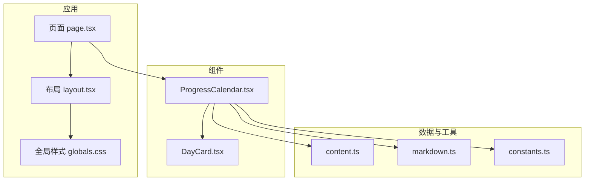
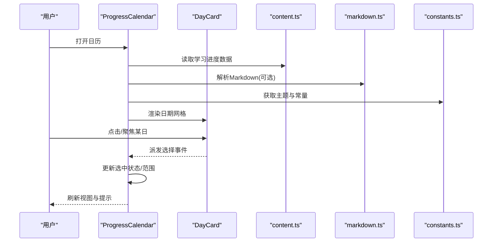
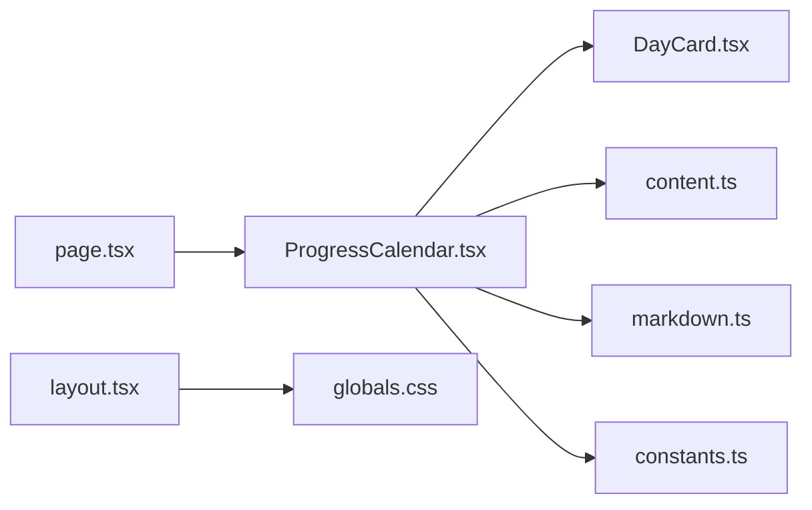

# ProgressCalendar组件

<cite>
**本文引用的文件**
- [ProgressCalendar.tsx](file://src/components/ProgressCalendar.tsx)
- [DayCard.tsx](file://src/components/DayCard.tsx)
- [content.ts](file://src/lib/content.ts)
- [markdown.ts](file://src/lib/markdown.ts)
- [constants.ts](file://src/lib/constants.ts)
- [page.tsx](file://src/app/page.tsx)
- [layout.tsx](file://src/app/layout.tsx)
- [globals.css](file://src/app/globals.css)
</cite>

## 目录
1. [简介](#简介)
2. [项目结构](#项目结构)
3. [核心组件](#核心组件)
4. [架构总览](#架构总览)
5. [详细组件分析](#详细组件分析)
6. [依赖关系分析](#依赖关系分析)
7. [性能考虑](#性能考虑)
8. [故障排查指南](#故障排查指南)
9. [结论](#结论)
10. [附录](#附录)

## 简介
ProgressCalendar 是一个用于可视化学习进度的日历组件。它通过日期网格展示每日的学习状态，支持点击选择、键盘导航、无障碍提示与主题化样式。该组件将“日历数据”（如是否完成、学习时长等）映射到视觉标记上，帮助用户直观了解学习进度与连续性。

## 项目结构
本项目采用 Next.js + TypeScript 的模块化组织方式：
- 组件层：ProgressCalendar 作为主日历组件，DayCard 作为单格卡片组件
- 数据层：content.ts 提供示例数据，markdown.ts 负责 Markdown 内容解析，constants.ts 提供常量配置
- 页面层：app/page.tsx 集成并渲染 ProgressCalendar，layout.tsx 提供全局布局与样式入口
- 样式层：globals.css 定义全局样式变量与主题色

图表来源
- [page.tsx:1-200](file://src/app/page.tsx#L1-L200)
- [layout.tsx:1-200](file://src/app/layout.tsx#L1-L200)
- [ProgressCalendar.tsx:1-200](file://src/components/ProgressCalendar.tsx#L1-L200)
- [DayCard.tsx:1-200](file://src/components/DayCard.tsx#L1-L200)
- [content.ts:1-200](file://src/lib/content.ts#L1-L200)
- [markdown.ts:1-200](file://src/lib/markdown.ts#L1-L200)
- [constants.ts:1-200](file://src/lib/constants.ts#L1-L200)

章节来源
- [page.tsx:1-200](file://src/app/page.tsx#L1-L200)
- [layout.tsx:1-200](file://src/app/layout.tsx#L1-L200)
- [ProgressCalendar.tsx:1-200](file://src/components/ProgressCalendar.tsx#L1-L200)
- [DayCard.tsx:1-200](file://src/components/DayCard.tsx#L1-L200)
- [content.ts:1-200](file://src/lib/content.ts#L1-L200)
- [markdown.ts:1-200](file://src/lib/markdown.ts#L1-L200)
- [constants.ts:1-200](file://src/lib/constants.ts#L1-L200)
- [globals.css:1-200](file://src/app/globals.css#L1-L200)

## 核心组件
- ProgressCalendar：日历容器，负责月份切换、日期网格渲染、选中状态管理、键盘与鼠标交互、无障碍属性注入、主题样式应用。
- DayCard：单格卡片，负责显示日期、状态标记（如已完成/未完成）、悬停与焦点态、点击事件派发。

章节来源
- [ProgressCalendar.tsx:1-200](file://src/components/ProgressCalendar.tsx#L1-L200)
- [DayCard.tsx:1-200](file://src/components/DayCard.tsx#L1-L200)

## 架构总览
ProgressCalendar 的数据流遵循“数据驱动视图”的模式：
- 数据源：content.ts 提供日期与学习进度数据；markdown.ts 可解析 Markdown 内容以生成更丰富的描述或统计信息；constants.ts 提供主题与行为常量
- 组件层：ProgressCalendar 订阅数据变化，计算当月日期矩阵与状态，渲染 DayCard 列表
- 交互层：用户点击或键盘操作触发状态更新，组件内部维护选中日期与可选范围，必要时回调父级进行持久化
- 样式层：通过 CSS 变量与类名实现主题切换与响应式适配

图表来源
- [ProgressCalendar.tsx:1-200](file://src/components/ProgressCalendar.tsx#L1-L200)
- [DayCard.tsx:1-200](file://src/components/DayCard.tsx#L1-L200)
- [content.ts:1-200](file://src/lib/content.ts#L1-L200)
- [markdown.ts:1-200](file://src/lib/markdown.ts#L1-L200)
- [constants.ts:1-200](file://src/lib/constants.ts#L1-L200)

## 详细组件分析

### ProgressCalendar 组件
- 视觉外观
  - 顶部包含月份标题与切换按钮，主体为 7 列的日期网格
  - 每个单元格显示日期数字与状态标记（如圆点、进度条或图标）
  - 当前月、非当前月、已选日期、禁用日期使用不同样式区分
- 行为与交互
  - 支持鼠标点击选择日期，支持键盘 Tab/方向键导航与回车确认
  - 支持范围选择（开始-结束），自动处理跨月边界
  - 支持只读模式与禁用某些日期
  - 提供无障碍标签与角色，确保屏幕阅读器可读
- Props/属性（建议）
  - data：日期与学习进度数据数组
  - selected：当前选中日期或范围
  - mode：单选/多选/范围选择
  - disabledDates：禁用的日期集合
  - readOnly：是否只读
  - locale：本地化配置（语言、周起始日）
  - theme：主题名称或自定义样式对象
  - onChange：选中变化回调
  - onMonthChange：月份切换回调
  - renderCell：自定义单元格渲染函数
  - accessibility：无障碍文案与提示配置
- 事件
  - onSelect：选中日期变化时触发
  - onRangeSelect：范围选择完成时触发
  - onMonthChange：月份切换时触发
  - onKeyDown/onKeyUp：键盘事件透传
- 插槽/自定义
  - cell：替换单元格内容（例如显示学习时长、完成率）
  - header：自定义月份标题区域
  - footer：自定义底部说明或统计
- 状态与动画
  - 内部维护当前月份、选中状态、焦点位置
  - 切换月份时提供淡入/滑动过渡
  - 选中状态变化提供缩放或高亮过渡
- 样式与主题
  - 基于 CSS 变量定义颜色、尺寸、圆角、阴影
  - 支持明暗主题切换
  - 响应式：小屏下减少列数或隐藏次要信息
- 无障碍合规
  - 使用 aria-* 属性标注角色、状态、名称
  - 键盘可达性与焦点可见性
  - 语义化 HTML 结构与可朗读文本

章节来源
- [ProgressCalendar.tsx:1-200](file://src/components/ProgressCalendar.tsx#L1-L200)

### DayCard 组件
- 视觉外观
  - 显示日期数字与状态标记（如已完成、进行中、未开始）
  - 悬停与焦点态提供视觉反馈
- 行为与交互
  - 点击触发选择事件
  - 键盘 Enter/Space 确认选择
  - 支持禁用态与只读态
- Props/属性（建议）
  - date：日期对象
  - status：状态枚举
  - disabled：是否禁用
  - selected：是否选中
  - onClick：点击回调
  - onKeyDown：键盘回调
  - title：无障碍标题
- 无障碍
  - role="button" 或原生 button
  - aria-selected、aria-disabled、aria-label
- 动画与过渡
  - 选中态切换时的缩放或边框高亮

章节来源
- [DayCard.tsx:1-200](file://src/components/DayCard.tsx#L1-L200)

### 数据与工具模块
- content.ts
  - 提供示例学习进度数据（日期、是否完成、学习时长、备注等）
  - 可作为初始数据源或测试数据
- markdown.ts
  - 解析 Markdown 内容，提取关键信息（如标题、摘要、统计数据）
  - 可与日历结合展示每日学习总结
- constants.ts
  - 定义主题色、默认配置、本地化文案等常量
  - 便于统一管理与扩展

章节来源
- [content.ts:1-200](file://src/lib/content.ts#L1-L200)
- [markdown.ts:1-200](file://src/lib/markdown.ts#L1-L200)
- [constants.ts:1-200](file://src/lib/constants.ts#L1-L200)

### 页面集成
- app/page.tsx
  - 引入 ProgressCalendar，绑定数据与事件
  - 演示基本用法与常见配置
- app/layout.tsx
  - 提供全局布局与元信息
  - 引入全局样式与字体

章节来源
- [page.tsx:1-200](file://src/app/page.tsx#L1-L200)
- [layout.tsx:1-200](file://src/app/layout.tsx#L1-L200)

## 依赖关系分析
- 组件耦合
  - ProgressCalendar 依赖 DayCard 进行单元格渲染
  - 两者均依赖 content.ts 的数据结构与 markdown.ts 的内容解析
  - 通过 constants.ts 共享主题与行为常量
- 外部依赖
  - Next.js/React 运行时
  - 可能的日期库（如 dayjs/date-fns，若使用则需关注版本兼容性）
- 潜在循环依赖
  - 组件与数据模块之间单向依赖，避免循环引用

图表来源
- [ProgressCalendar.tsx:1-200](file://src/components/ProgressCalendar.tsx#L1-L200)
- [DayCard.tsx:1-200](file://src/components/DayCard.tsx#L1-L200)
- [content.ts:1-200](file://src/lib/content.ts#L1-L200)
- [markdown.ts:1-200](file://src/lib/markdown.ts#L1-L200)
- [constants.ts:1-200](file://src/lib/constants.ts#L1-L200)
- [page.tsx:1-200](file://src/app/page.tsx#L1-L200)
- [layout.tsx:1-200](file://src/app/layout.tsx#L1-L200)
- [globals.css:1-200](file://src/app/globals.css#L1-L200)

章节来源
- [ProgressCalendar.tsx:1-200](file://src/components/ProgressCalendar.tsx#L1-L200)
- [DayCard.tsx:1-200](file://src/components/DayCard.tsx#L1-L200)
- [content.ts:1-200](file://src/lib/content.ts#L1-L200)
- [markdown.ts:1-200](file://src/lib/markdown.ts#L1-L200)
- [constants.ts:1-200](file://src/lib/constants.ts#L1-L200)
- [page.tsx:1-200](file://src/app/page.tsx#L1-L200)
- [layout.tsx:1-200](file://src/app/layout.tsx#L1-L200)
- [globals.css:1-200](file://src/app/globals.css#L1-L200)

## 性能考虑
- 虚拟滚动或分页加载：当数据量较大时，仅渲染可视区域的日期单元格
- 记忆化：对计算结果（如当月日期矩阵、状态映射）使用缓存，避免重复计算
- 事件节流/防抖：对频繁交互（如快速切换月份）进行节流，降低重渲染压力
- 样式优化：使用 CSS 变量与类名切换，避免内联样式导致的样式抖动
- 资源加载：按需加载 Markdown 内容与图片，减少首屏体积
- 浏览器兼容：针对旧版浏览器降级处理（如不支持 CSS Grid 时回退至 Flex 布局）

[本节为通用指导，不直接分析具体文件]

## 故障排查指南
- 常见问题
  - 日期格式不一致：确保传入数据使用标准日期格式（如 ISO 字符串或 Date 对象）
  - 月份切换异常：检查本地化配置与周起始日设置是否正确
  - 选中状态丢失：确认受控模式下父组件正确维护 selected 状态
  - 键盘不可用：检查 tabIndex、role 与 aria-* 属性是否正确设置
  - 主题不生效：确认 CSS 变量与主题类名已正确引入
- 调试建议
  - 在控制台输出选中日期与状态映射，验证数据流
  - 使用浏览器开发者工具的无障碍面板检查语义与可读性
  - 逐步缩小问题范围：先最小化复现用例，再逐步添加功能

章节来源
- [ProgressCalendar.tsx:1-200](file://src/components/ProgressCalendar.tsx#L1-L200)
- [DayCard.tsx:1-200](file://src/components/DayCard.tsx#L1-L200)
- [content.ts:1-200](file://src/lib/content.ts#L1-L200)
- [markdown.ts:1-200](file://src/lib/markdown.ts#L1-L200)
- [constants.ts:1-200](file://src/lib/constants.ts#L1-L200)

## 结论
ProgressCalendar 通过清晰的数据驱动架构与良好的交互设计，提供了直观的学习进度可视化能力。配合 DayCard 的细粒度控制、content/markdown 的数据与内容解析、以及 constants/globals 的主题与样式管理，能够在多端与多主题环境下保持一致体验。建议在大规模数据场景下引入虚拟化与缓存策略，并持续完善无障碍与跨浏览器兼容性。

[本节为总结性内容，不直接分析具体文件]

## 附录

### 使用示例（路径参考）
- 基础用法：在页面中引入 ProgressCalendar，绑定数据与选中状态，监听选择事件
  - 参考路径：[page.tsx:1-200](file://src/app/page.tsx#L1-L200)
- 范围选择：启用范围模式，设置开始与结束日期，处理跨月逻辑
  - 参考路径：[ProgressCalendar.tsx:1-200](file://src/components/ProgressCalendar.tsx#L1-L200)
- 自定义单元格：使用 renderCell 或 cell 插槽显示学习时长与完成率
  - 参考路径：[ProgressCalendar.tsx:1-200](file://src/components/ProgressCalendar.tsx#L1-L200)
- 主题切换：通过 constants 与 CSS 变量切换明暗主题
  - 参考路径：[constants.ts:1-200](file://src/lib/constants.ts#L1-L200), [globals.css:1-200](file://src/app/globals.css#L1-L200)

### 响应式设计原则
- 小屏设备：减少每行显示的日期数量，隐藏次要信息，增大触控区域
- 中等屏幕：保持完整网格，优化间距与字号
- 大屏设备：增加信息密度，展示更多统计与详情

### 无障碍合规要点
- 语义化：使用正确的 HTML 元素与角色
- 键盘可达：Tab 顺序合理，Enter/Space 可用，Esc 取消
- 屏幕阅读器：提供清晰的名称、状态与提示信息
- 对比度：确保文字与背景对比度符合 WCAG 标准

### 与其他 UI 元素的集成
- 与统计面板：联动显示月度学习时长、完成率趋势
- 与笔记系统：点击日期跳转至对应 Markdown 笔记
- 与任务清单：将每日任务与日历状态关联，实时更新

[本节为概念性内容，不直接分析具体文件]