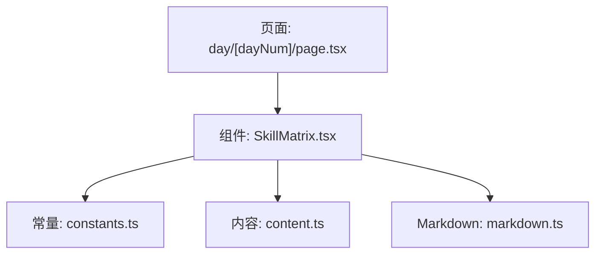
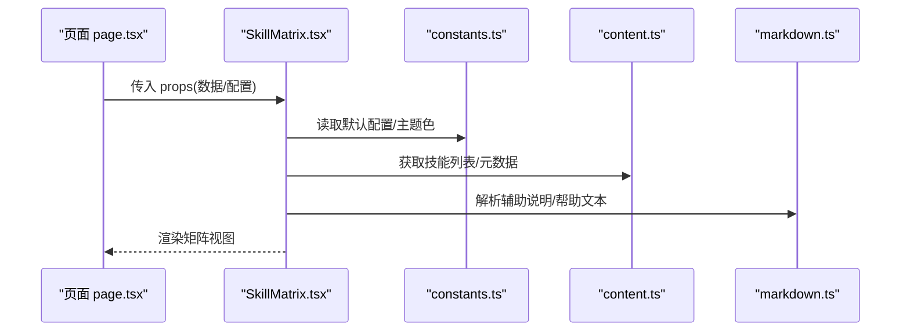
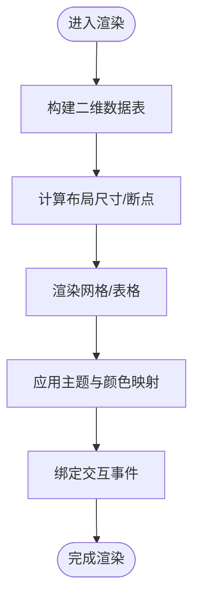
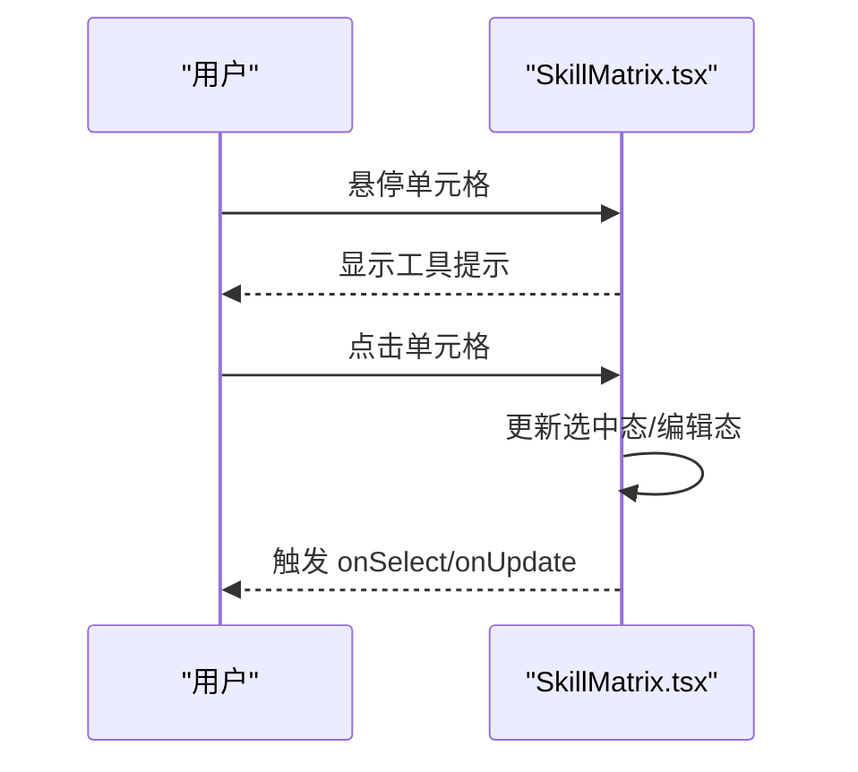
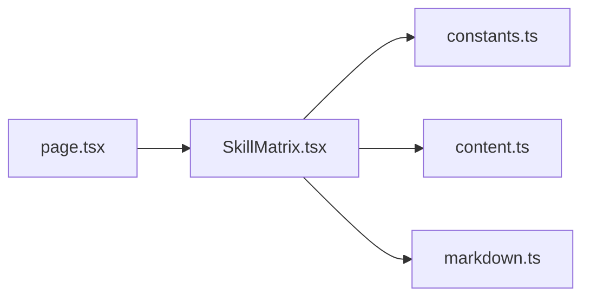

# SkillMatrix组件

<cite>
**本文引用的文件**
- [SkillMatrix.tsx](file://src/components/SkillMatrix.tsx)
- [page.tsx](file://src/app/day/[dayNum]/page.tsx)
- [constants.ts](file://src/lib/constants.ts)
- [content.ts](file://src/lib/content.ts)
- [markdown.ts](file://src/lib/markdown.ts)
</cite>

## 目录
1. [简介](#简介)
2. [项目结构](#项目结构)
3. [核心组件](#核心组件)
4. [架构总览](#架构总览)
5. [详细组件分析](#详细组件分析)
6. [依赖关系分析](#依赖关系分析)
7. [性能考虑](#性能考虑)
8. [故障排查指南](#故障排查指南)
9. [结论](#结论)
10. [附录](#附录)

## 简介
本文件为 SkillMatrix 组件的完整技术文档，聚焦其视觉外观、行为与用户交互模式；记录 props/属性、事件、插槽与自定义选项；提供使用示例路径、响应式设计与无障碍合规指导；说明组件状态、动画与过渡效果；涵盖样式自定义与主题支持；并给出跨浏览器兼容性与性能优化建议。重点围绕技能矩阵的数据结构、可视化渲染与用户交互逻辑展开。

## 项目结构
SkillMatrix 位于 src/components 下，作为可复用 UI 组件被页面引用。数据层通过 lib 目录中的常量与内容模块提供，Markdown 解析由 markdown.ts 负责。页面入口在 app/day/[dayNum]/page.tsx 中引入并使用该组件。

图表来源
- [page.tsx:1-200](file://src/app/day/[dayNum]/page.tsx#L1-L200)
- [SkillMatrix.tsx:1-200](file://src/components/SkillMatrix.tsx#L1-L200)
- [constants.ts:1-200](file://src/lib/constants.ts#L1-L200)
- [content.ts:1-200](file://src/lib/content.ts#L1-L200)
- [markdown.ts:1-200](file://src/lib/markdown.ts#L1-L200)

章节来源
- [page.tsx:1-200](file://src/app/day/[dayNum]/page.tsx#L1-L200)
- [SkillMatrix.tsx:1-200](file://src/components/SkillMatrix.tsx#L1-L200)

## 核心组件
- 组件职责：以矩阵形式展示“技能维度 × 日期/阶段”的掌握程度或进度，支持筛选、排序、悬停提示、点击交互等。
- 数据模型：二维网格（行=技能项，列=时间切片），单元格包含等级/状态、颜色映射、工具提示文案、可访问性标签等。
- 交互行为：悬停显示详情、点击切换选中态或编辑态、键盘可达、ARIA 语义标注。
- 渲染策略：基于数据驱动渲染表格/网格，结合 CSS Grid/Flex 实现响应式布局；必要时使用虚拟滚动优化大数据量场景。

章节来源
- [SkillMatrix.tsx:1-200](file://src/components/SkillMatrix.tsx#L1-L200)

## 架构总览
SkillMatrix 从常量与内容模块获取基础配置与数据，按需解析 Markdown 片段用于描述或帮助文本，最终在页面中渲染矩阵视图。

图表来源
- [page.tsx:1-200](file://src/app/day/[dayNum]/page.tsx#L1-L200)
- [SkillMatrix.tsx:1-200](file://src/components/SkillMatrix.tsx#L1-L200)
- [constants.ts:1-200](file://src/lib/constants.ts#L1-L200)
- [content.ts:1-200](file://src/lib/content.ts#L1-L200)
- [markdown.ts:1-200](file://src/lib/markdown.ts#L1-L200)

## 详细组件分析

### 数据结构与可视化渲染
- 数据结构
  - 行：技能项（名称、分类、图标、描述、权重等）
  - 列：时间切片（日期、周、里程碑等）
  - 单元格：等级/状态、颜色映射、工具提示、可访问性信息、是否可编辑
- 渲染流程
  - 计算行列尺寸与间距
  - 生成网格/表格 DOM
  - 根据等级映射颜色与样式
  - 绑定交互事件（悬停、点击、键盘）
  - 应用响应式断点与主题变量

图表来源
- [SkillMatrix.tsx:1-200](file://src/components/SkillMatrix.tsx#L1-L200)

章节来源
- [SkillMatrix.tsx:1-200](file://src/components/SkillMatrix.tsx#L1-L200)

### 用户交互与事件
- 悬停：显示技能详情、等级说明、时间范围等
- 点击：选中/取消选中、进入编辑态、触发回调
- 键盘：Tab 导航、方向键移动、Enter/Space 确认、Esc 退出
- 事件：onSelect、onUpdate、onHover、onExport 等（具体以组件接口为准）

图表来源
- [SkillMatrix.tsx:1-200](file://src/components/SkillMatrix.tsx#L1-L200)

章节来源
- [SkillMatrix.tsx:1-200](file://src/components/SkillMatrix.tsx#L1-L200)

### Props/属性、插槽与自定义选项
- 属性（props）
  - data：二维矩阵数据（行×列×单元格）
  - columns：列定义（时间粒度、格式化函数）
  - rows：行定义（技能元数据）
  - theme：主题对象（颜色、字体、间距）
  - responsive：响应式配置（断点、列宽策略）
  - accessibility：无障碍配置（语言、屏幕阅读器提示）
  - events：回调集合（选择、更新、导出等）
- 插槽（slots）
  - cell：自定义单元格渲染
  - header：自定义行列头
  - tooltip：自定义提示内容
- 自定义选项
  - 颜色映射规则、动画时长、过渡曲线、导出格式、缓存策略

章节来源
- [SkillMatrix.tsx:1-200](file://src/components/SkillMatrix.tsx#L1-L200)

### 状态、动画与过渡
- 状态管理
  - 选中态、编辑态、加载态、错误态
  - 过滤/排序后的视图状态
- 动画与过渡
  - 单元格高亮、选中态切换、列宽变化
  - 使用 CSS transitions/animations 或轻量动画库
  - 控制动画时长与缓动函数以提升体验

章节来源
- [SkillMatrix.tsx:1-200](file://src/components/SkillMatrix.tsx#L1-L200)

### 样式自定义与主题支持
- 主题变量
  - 主色、辅色、背景、文字、边框、阴影
  - 断点与栅格参数
- 覆盖方式
  - 通过 props.theme 注入
  - 通过 CSS 变量或类名覆盖
  - 支持暗色/高对比度模式

章节来源
- [SkillMatrix.tsx:1-200](file://src/components/SkillMatrix.tsx#L1-L200)
- [constants.ts:1-200](file://src/lib/constants.ts#L1-L200)

### 使用示例（路径指引）
- 页面中使用组件
  - 参考：[page.tsx:1-200](file://src/app/day/[dayNum]/page.tsx#L1-L200)
- 数据准备与常量
  - 参考：[constants.ts:1-200](file://src/lib/constants.ts#L1-L200)、[content.ts:1-200](file://src/lib/content.ts#L1-L200)
- 辅助文本解析
  - 参考：[markdown.ts:1-200](file://src/lib/markdown.ts#L1-L200)

章节来源
- [page.tsx:1-200](file://src/app/day/[dayNum]/page.tsx#L1-L200)
- [constants.ts:1-200](file://src/lib/constants.ts#L1-L200)
- [content.ts:1-200](file://src/lib/content.ts#L1-L200)
- [markdown.ts:1-200](file://src/lib/markdown.ts#L1-L200)

## 依赖关系分析
- 内部依赖
  - SkillMatrix.tsx 依赖 constants.ts（默认主题/配置）、content.ts（技能元数据）、markdown.ts（辅助文本）
- 外部依赖
  - React/Next.js 生态、CSS 框架（如 Tailwind 或自定义样式）
  - 可选：动画库、无障碍工具库

图表来源
- [SkillMatrix.tsx:1-200](file://src/components/SkillMatrix.tsx#L1-L200)
- [constants.ts:1-200](file://src/lib/constants.ts#L1-L200)
- [content.ts:1-200](file://src/lib/content.ts#L1-L200)
- [markdown.ts:1-200](file://src/lib/markdown.ts#L1-L200)
- [page.tsx:1-200](file://src/app/day/[dayNum]/page.tsx#L1-L200)

章节来源
- [SkillMatrix.tsx:1-200](file://src/components/SkillMatrix.tsx#L1-L200)
- [page.tsx:1-200](file://src/app/day/[dayNum]/page.tsx#L1-L200)

## 性能考虑
- 大数据集
  - 虚拟滚动/分页加载
  - 增量渲染与 memoization
- 渲染优化
  - 避免不必要的重渲染（React.memo/useMemo/useCallback）
  - 将计算密集型逻辑移至 Web Worker（如需）
- 资源加载
  - 懒加载图片/图标
  - 预取主题与常用数据
- 内存与 GC
  - 及时解绑事件监听
  - 避免闭包持有大对象引用

## 故障排查指南
- 常见问题
  - 数据为空或缺字段：检查 content.ts 与 props.data 结构
  - 主题未生效：确认 theme 变量注入顺序与优先级
  - 交互无响应：检查事件绑定与键盘焦点管理
  - 移动端错位：验证响应式断点与容器宽度
- 调试步骤
  - 打印数据流与状态变更
  - 使用浏览器开发者工具检查 ARIA 属性与焦点顺序
  - 逐步禁用样式/动画定位问题

章节来源
- [SkillMatrix.tsx:1-200](file://src/components/SkillMatrix.tsx#L1-L200)

## 结论
SkillMatrix 以数据驱动的矩阵形式呈现技能掌握情况，具备完善的交互、主题与无障碍支持。通过合理的响应式与性能优化策略，可在多端设备上提供一致且流畅的体验。建议在集成时严格遵循数据结构约定与主题变量规范，确保可扩展性与可维护性。

## 附录
- 响应式设计原则
  - 使用相对单位与弹性布局
  - 按断点调整列数与字号
  - 保证触控目标尺寸与间距
- 无障碍合规
  - 语义化标签与 ARIA 属性
  - 键盘可达与焦点可见
  - 色彩对比度与屏幕阅读器友好
- 跨浏览器兼容性
  - 优先使用标准 CSS/JS 特性
  - 针对旧浏览器提供降级方案
  - 测试主流浏览器与移动端内核
- 组合模式与集成
  - 与筛选器、搜索框、导出按钮组合
  - 与表单/编辑器联动编辑单元格
  - 与图表/仪表盘集成展示趋势