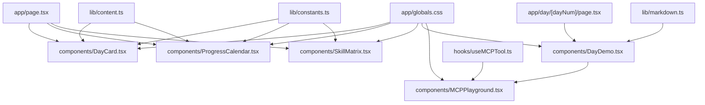
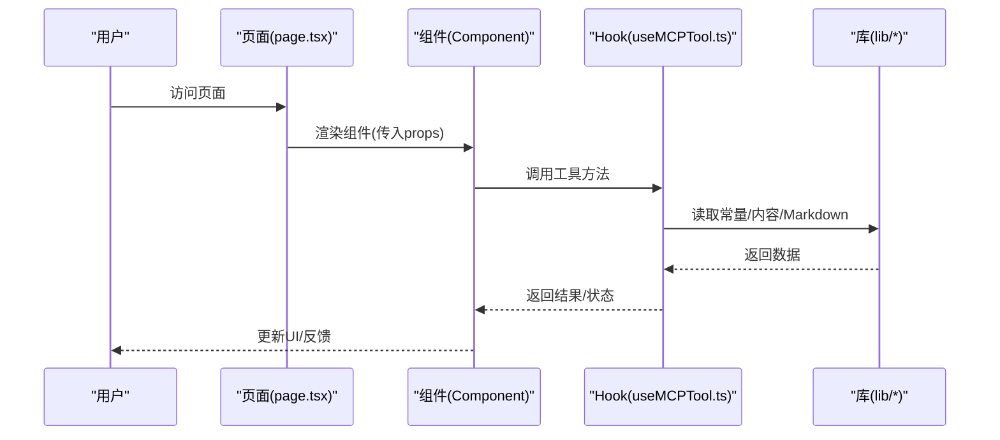
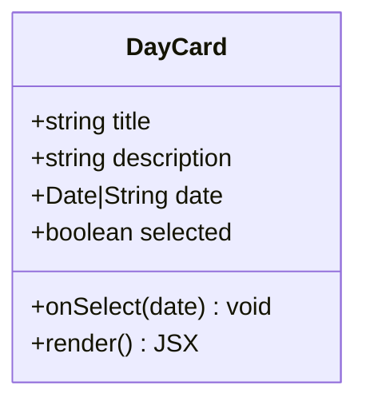
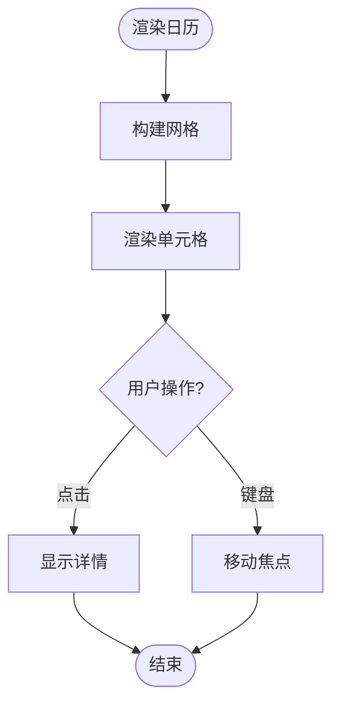
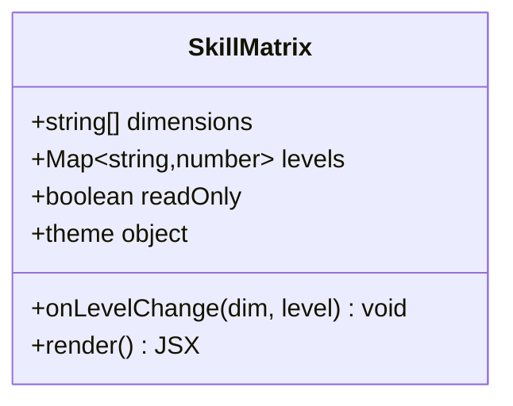
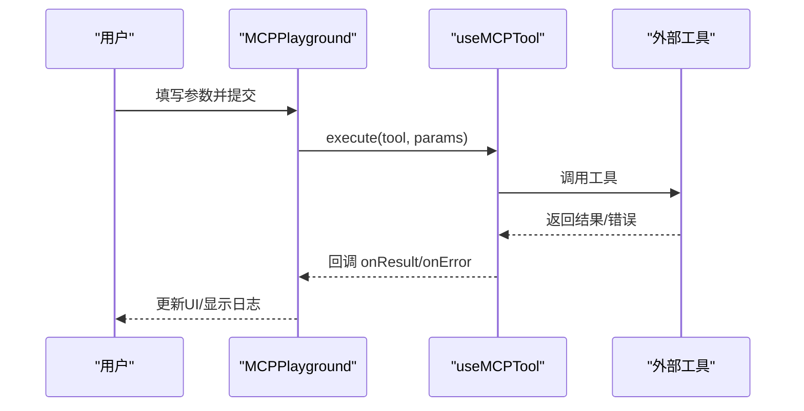
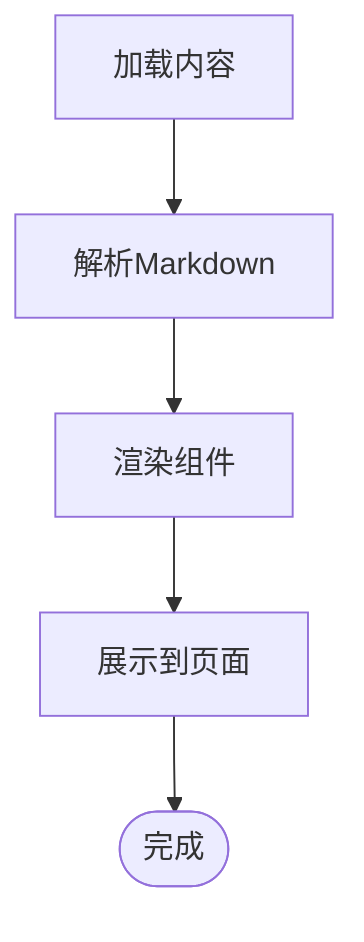
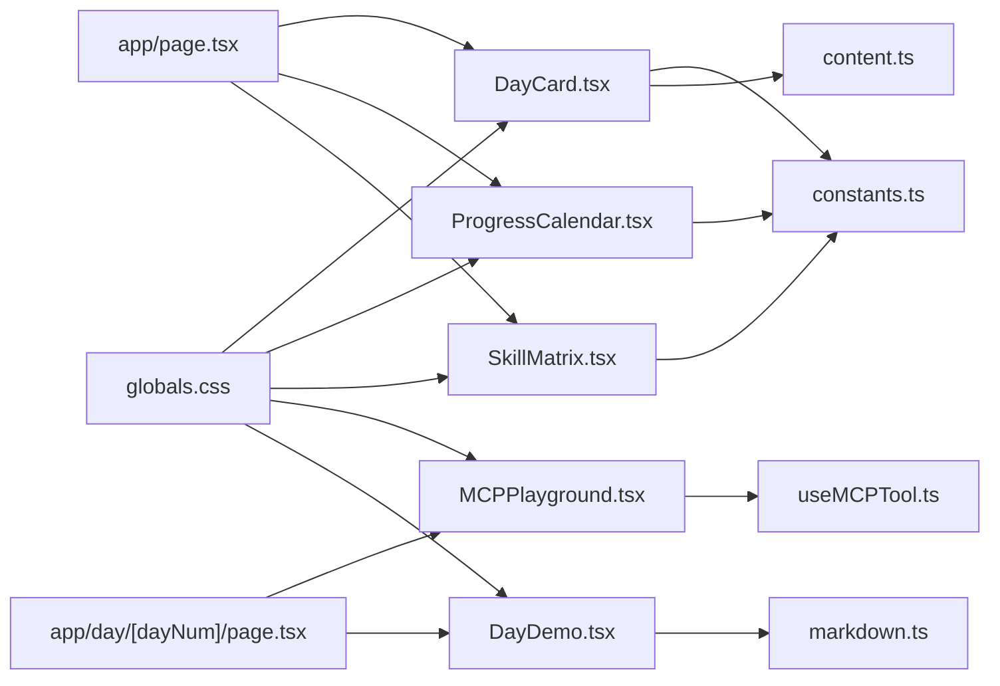

# UI组件

<cite>
**本文引用的文件**
- [DayCard.tsx](file://src/components/DayCard.tsx)
- [DayDemo.tsx](file://src/components/DayDemo.tsx)
- [MCPPlayground.tsx](file://src/components/MCPPlayground.tsx)
- [ProgressCalendar.tsx](file://src/components/ProgressCalendar.tsx)
- [SkillMatrix.tsx](file://src/components/SkillMatrix.tsx)
- [useMCPTool.ts](file://src/hooks/useMCPTool.ts)
- [constants.ts](file://src/lib/constants.ts)
- [content.ts](file://src/lib/content.ts)
- [markdown.ts](file://src/lib/markdown.ts)
- [page.tsx](file://src/app/day/[dayNum]/page.tsx)
- [page.tsx](file://src/app/modules/page.tsx)
- [layout.tsx](file://src/app/layout.tsx)
- [page.tsx](file://src/app/page.tsx)
- [globals.css](file://src/app/globals.css)
- [package.json](file://package.json)
</cite>

## 目录
1. [简介](#简介)
2. [项目结构](#项目结构)
3. [核心组件](#核心组件)
4. [架构总览](#架构总览)
5. [详细组件分析](#详细组件分析)
6. [依赖分析](#依赖分析)
7. [性能考虑](#性能考虑)
8. [故障排查指南](#故障排查指南)
9. [结论](#结论)
10. [附录](#附录)

## 简介
本仓库是一个基于 Next.js 的演示型前端项目，重点展示了多个可复用的 UI 组件与页面集成方式。组件涵盖卡片展示、进度日历、技能矩阵、MCP 工具交互等场景。文档旨在为开发者提供组件的视觉外观、行为模式、用户交互、属性（props）、事件、插槽（children/slots）和自定义选项的完整说明；同时给出响应式设计与无障碍合规建议、状态与动画过渡记录、样式与主题定制方法、跨浏览器兼容性与性能优化策略，以及组件组合与集成的最佳实践。

## 项目结构
- 应用入口与路由
  - src/app/page.tsx：首页入口
  - src/app/layout.tsx：全局布局与元信息
  - src/app/day/[dayNum]/page.tsx：按天展示的页面
  - src/app/modules/page.tsx：模块聚合页
- 组件层
  - src/components/DayCard.tsx：日期卡片
  - src/components/DayDemo.tsx：每日演示容器
  - src/components/MCPPlayground.tsx：MCP 工具交互沙箱
  - src/components/ProgressCalendar.tsx：进度日历
  - src/components/SkillMatrix.tsx：技能矩阵
- 数据与工具
  - src/lib/constants.ts：常量定义
  - src/lib/content.ts：内容数据源
  - src/lib/markdown.ts：Markdown 处理
  - src/hooks/useMCPTool.ts：MCP 工具 Hook
- 样式
  - src/app/globals.css：全局样式与主题变量

图表来源
- [page.tsx:1-200](file://src/app/page.tsx#L1-L200)
- [page.tsx:1-200](file://src/app/day/[dayNum]/page.tsx#L1-L200)
- [DayCard.tsx:1-200](file://src/components/DayCard.tsx#L1-L200)
- [DayDemo.tsx:1-200](file://src/components/DayDemo.tsx#L1-L200)
- [MCPPlayground.tsx:1-200](file://src/components/MCPPlayground.tsx#L1-L200)
- [ProgressCalendar.tsx:1-200](file://src/components/ProgressCalendar.tsx#L1-L200)
- [SkillMatrix.tsx:1-200](file://src/components/SkillMatrix.tsx#L1-L200)
- [useMCPTool.ts:1-200](file://src/hooks/useMCPTool.ts#L1-L200)
- [constants.ts:1-200](file://src/lib/constants.ts#L1-L200)
- [content.ts:1-200](file://src/lib/content.ts#L1-L200)
- [markdown.ts:1-200](file://src/lib/markdown.ts#L1-L200)
- [globals.css:1-200](file://src/app/globals.css#L1-L200)

章节来源
- [page.tsx:1-200](file://src/app/page.tsx#L1-L200)
- [layout.tsx:1-200](file://src/app/layout.tsx#L1-L200)
- [page.tsx:1-200](file://src/app/day/[dayNum]/page.tsx#L1-L200)
- [page.tsx:1-200](file://src/app/modules/page.tsx#L1-L200)

## 核心组件
本节概述各组件的职责、主要 props、事件、插槽与交互模式，并给出使用示例路径与注意事项。

- DayCard（日期卡片）
  - 职责：以卡片形式展示某一天的关键信息与摘要
  - 典型 props：标题、描述、日期、状态、是否选中、点击回调
  - 事件：onSelect/onClick、键盘回车/空格触发选择
  - 插槽：头部图标、尾部操作按钮、内容区域
  - 交互：悬停高亮、聚焦可见焦点环、点击切换选中态
  - 响应式：在小屏下堆叠显示，在大屏下网格排列
  - 无障碍：aria-selected、role="button"、tabIndex、键盘导航
  - 示例路径：[src/app/page.tsx](file://src/app/page.tsx)
  - 参考实现位置：[DayCard.tsx](file://src/components/DayCard.tsx)

- ProgressCalendar（进度日历）
  - 职责：可视化展示一段时间内的完成进度或打卡情况
  - 典型 props：数据数组（日期+状态）、最小/最大日期、主题色、提示文案
  - 事件：点击日期弹出详情、键盘左右移动焦点
  - 插槽：单元格内容、月份标题、底部图例
  - 交互：悬停显示 tooltip、点击展开详情面板
  - 响应式：移动端单列滚动，桌面端多列网格
  - 无障碍：aria-label 标注日期、键盘可达、屏幕阅读器友好
  - 示例路径：[src/app/page.tsx](file://src/app/page.tsx)
  - 参考实现位置：[ProgressCalendar.tsx](file://src/components/ProgressCalendar.tsx)

- SkillMatrix（技能矩阵）
  - 职责：以二维矩阵形式展示技能维度与熟练度等级
  - 典型 props：维度列表、等级映射、颜色主题、是否只读
  - 事件：点击单元格切换等级、长按或右键打开编辑菜单
  - 插槽：表头、行标签、单元格内容
  - 交互：键盘上下左右移动焦点、Enter/Space 切换
  - 响应式：小屏横向滚动表格，大屏自适应宽度
  - 无障碍：表格语义化、aria-rowcount/colcount、键盘导航
  - 示例路径：[src/app/page.tsx](file://src/app/page.tsx)
  - 参考实现位置：[SkillMatrix.tsx](file://src/components/SkillMatrix.tsx)

- MCPPlayground（MCP 工具交互沙箱）
  - 职责：提供调用 MCP 工具的界面与反馈展示
  - 典型 props：工具列表、默认参数、回调函数
  - 事件：onExecute、onResult、onError
  - 插槽：输入表单、结果输出区、日志面板
  - 交互：表单提交、异步加载、错误重试
  - 响应式：表单与结果分栏布局，移动端堆叠
  - 无障碍：表单标签关联、错误消息 aria-live、焦点管理
  - 示例路径：[src/app/day/[dayNum]/page.tsx](file://src/app/day/[dayNum]/page.tsx)
  - 参考实现位置：[MCPPlayground.tsx](file://src/components/MCPPlayground.tsx)、[useMCPTool.ts](file://src/hooks/useMCPTool.ts)

- DayDemo（每日演示容器）
  - 职责：组织当日演示内容，渲染 Markdown 与交互组件
  - 典型 props：日期、内容数据、主题配置
  - 事件：内容加载完成回调、错误回调
  - 插槽：顶部标题、底部说明、自定义区块
  - 交互：Markdown 渲染、组件嵌入、懒加载
  - 响应式：内容流式排版，图片自适应
  - 无障碍：标题层级正确、图片 alt、链接可访问
  - 示例路径：[src/app/day/[dayNum]/page.tsx](file://src/app/day/[dayNum]/page.tsx)
  - 参考实现位置：[DayDemo.tsx](file://src/components/DayDemo.tsx)、[markdown.ts](file://src/lib/markdown.ts)

章节来源
- [DayCard.tsx:1-200](file://src/components/DayCard.tsx#L1-L200)
- [ProgressCalendar.tsx:1-200](file://src/components/ProgressCalendar.tsx#L1-L200)
- [SkillMatrix.tsx:1-200](file://src/components/SkillMatrix.tsx#L1-L200)
- [MCPPlayground.tsx:1-200](file://src/components/MCPPlayground.tsx#L1-L200)
- [useMCPTool.ts:1-200](file://src/hooks/useMCPTool.ts#L1-L200)
- [DayDemo.tsx:1-200](file://src/components/DayDemo.tsx#L1-L200)
- [markdown.ts:1-200](file://src/lib/markdown.ts#L1-L200)
- [page.tsx:1-200](file://src/app/page.tsx#L1-L200)
- [page.tsx:1-200](file://src/app/day/[dayNum]/page.tsx#L1-L200)

## 架构总览
整体采用“页面-组件-数据/Hook”的分层架构：
- 页面层负责路由与组装组件
- 组件层封装 UI 逻辑与交互
- 数据与 Hook 层提供数据获取、状态管理与工具能力
- 样式层通过 CSS 变量与全局样式统一主题

图表来源
- [page.tsx:1-200](file://src/app/page.tsx#L1-L200)
- [MCPPlayground.tsx:1-200](file://src/components/MCPPlayground.tsx#L1-L200)
- [useMCPTool.ts:1-200](file://src/hooks/useMCPTool.ts#L1-L200)
- [constants.ts:1-200](file://src/lib/constants.ts#L1-L200)
- [content.ts:1-200](file://src/lib/content.ts#L1-L200)
- [markdown.ts:1-200](file://src/lib/markdown.ts#L1-L200)

## 详细组件分析

### DayCard（日期卡片）
- 视觉外观
  - 卡片容器、标题、描述、状态指示器、可选操作按钮
  - 悬停阴影、选中边框高亮、焦点可见环
- 行为与交互
  - 点击切换选中态，支持键盘 Enter/Space
  - 可组合图标与尾部操作
- Props（示例）
  - title: string
  - description: string
  - date: Date | string
  - selected: boolean
  - onSelect: (date) => void
- 事件
  - onSelect/onClick
- 插槽
  - header、footer、actions
- 响应式
  - 小屏单列，大屏网格
- 无障碍
  - role="button"、aria-selected、tabIndex、键盘可达
- 状态与动画
  - 选中态切换、悬停过渡
- 样式与主题
  - 通过 CSS 变量控制主色、圆角、阴影
- 示例路径
  - [src/app/page.tsx](file://src/app/page.tsx)
- 参考实现
  - [DayCard.tsx](file://src/components/DayCard.tsx)

图表来源
- [DayCard.tsx:1-200](file://src/components/DayCard.tsx#L1-L200)

章节来源
- [DayCard.tsx:1-200](file://src/components/DayCard.tsx#L1-L200)
- [page.tsx:1-200](file://src/app/page.tsx#L1-L200)

### ProgressCalendar（进度日历）
- 视觉外观
  - 网格日历、单元格状态色、月份标题、图例
- 行为与交互
  - 点击单元格显示详情、键盘左右移动焦点
- Props（示例）
  - data: Array<{date, status}>
  - minDate/maxDate: Date
  - themeColor: string
  - onCellClick: (date) => void
- 事件
  - onCellClick
- 插槽
  - monthHeader、cellContent、legend
- 响应式
  - 移动端滚动、桌面端网格
- 无障碍
  - aria-label 日期、键盘导航、屏幕阅读器友好
- 状态与动画
  - 单元格选中、tooltip 显示/隐藏
- 样式与主题
  - 通过 CSS 变量与主题色覆盖
- 示例路径
  - [src/app/page.tsx](file://src/app/page.tsx)
- 参考实现
  - [ProgressCalendar.tsx](file://src/components/ProgressCalendar.tsx)

图表来源
- [ProgressCalendar.tsx:1-200](file://src/components/ProgressCalendar.tsx#L1-L200)

章节来源
- [ProgressCalendar.tsx:1-200](file://src/components/ProgressCalendar.tsx#L1-L200)
- [page.tsx:1-200](file://src/app/page.tsx#L1-L200)

### SkillMatrix（技能矩阵）
- 视觉外观
  - 二维表格、行列标签、等级颜色条
- 行为与交互
  - 点击切换等级、键盘导航、只读模式
- Props（示例）
  - dimensions: string[]
  - levels: Map<string, number>
  - readOnly: boolean
  - theme: object
- 事件
  - onLevelChange
- 插槽
  - rowLabel、cellContent
- 响应式
  - 小屏横向滚动、大屏自适应
- 无障碍
  - 表格语义、aria-rowcount/colcount、键盘可达
- 状态与动画
  - 等级切换过渡
- 样式与主题
  - 主题色、等级映射、单元格样式
- 示例路径
  - [src/app/page.tsx](file://src/app/page.tsx)
- 参考实现
  - [SkillMatrix.tsx](file://src/components/SkillMatrix.tsx)

图表来源
- [SkillMatrix.tsx:1-200](file://src/components/SkillMatrix.tsx#L1-L200)

章节来源
- [SkillMatrix.tsx:1-200](file://src/components/SkillMatrix.tsx#L1-L200)
- [page.tsx:1-200](file://src/app/page.tsx#L1-L200)

### MCPPlayground（MCP 工具交互沙箱）
- 视觉外观
  - 表单输入区、结果展示区、日志面板
- 行为与交互
  - 表单提交、异步执行、错误重试、结果刷新
- Props（示例）
  - tools: Array
  - defaultParams: object
  - onExecute: (tool, params) => Promise
  - onResult: (result) => void
  - onError: (error) => void
- 事件
  - onExecute、onResult、onError
- 插槽
  - form、output、log
- 响应式
  - 表单与结果分栏，移动端堆叠
- 无障碍
  - 表单标签关联、错误消息 aria-live、焦点管理
- 状态与动画
  - 加载中、成功/失败状态、过渡效果
- 样式与主题
  - 主题色、日志高亮、错误样式
- 示例路径
  - [src/app/day/[dayNum]/page.tsx](file://src/app/day/[dayNum]/page.tsx)
- 参考实现
  - [MCPPlayground.tsx](file://src/components/MCPPlayground.tsx)
  - [useMCPTool.ts](file://src/hooks/useMCPTool.ts)

图表来源
- [MCPPlayground.tsx:1-200](file://src/components/MCPPlayground.tsx#L1-L200)
- [useMCPTool.ts:1-200](file://src/hooks/useMCPTool.ts#L1-L200)

章节来源
- [MCPPlayground.tsx:1-200](file://src/components/MCPPlayground.tsx#L1-L200)
- [useMCPTool.ts:1-200](file://src/hooks/useMCPTool.ts#L1-L200)
- [page.tsx:1-200](file://src/app/day/[dayNum]/page.tsx#L1-L200)

### DayDemo（每日演示容器）
- 视觉外观
  - 标题、内容区、底部说明
- 行为与交互
  - 渲染 Markdown、嵌入组件、懒加载
- Props（示例）
  - day: string
  - content: object
  - theme: object
- 事件
  - onLoad、onError
- 插槽
  - header、footer、customBlock
- 响应式
  - 内容流式排版、图片自适应
- 无障碍
  - 标题层级、图片 alt、链接可访问
- 状态与动画
  - 加载骨架屏、错误占位
- 样式与主题
  - 主题变量、排版样式
- 示例路径
  - [src/app/day/[dayNum]/page.tsx](file://src/app/day/[dayNum]/page.tsx)
- 参考实现
  - [DayDemo.tsx](file://src/components/DayDemo.tsx)
  - [markdown.ts](file://src/lib/markdown.ts)

图表来源
- [DayDemo.tsx:1-200](file://src/components/DayDemo.tsx#L1-L200)
- [markdown.ts:1-200](file://src/lib/markdown.ts#L1-L200)

章节来源
- [DayDemo.tsx:1-200](file://src/components/DayDemo.tsx#L1-L200)
- [markdown.ts:1-200](file://src/lib/markdown.ts#L1-L200)
- [page.tsx:1-200](file://src/app/day/[dayNum]/page.tsx#L1-L200)

## 依赖分析
- 组件依赖
  - DayCard、ProgressCalendar、SkillMatrix 依赖 constants 与 content 提供数据与主题
  - MCPPlayground 依赖 useMCPTool 进行工具调用
  - DayDemo 依赖 markdown 进行内容渲染
- 页面依赖
  - 首页与详情页分别引入对应组件进行组合
- 样式依赖
  - 全局样式 globals.css 提供主题变量与基础样式

图表来源
- [DayCard.tsx:1-200](file://src/components/DayCard.tsx#L1-L200)
- [ProgressCalendar.tsx:1-200](file://src/components/ProgressCalendar.tsx#L1-L200)
- [SkillMatrix.tsx:1-200](file://src/components/SkillMatrix.tsx#L1-L200)
- [MCPPlayground.tsx:1-200](file://src/components/MCPPlayground.tsx#L1-L200)
- [DayDemo.tsx:1-200](file://src/components/DayDemo.tsx#L1-L200)
- [useMCPTool.ts:1-200](file://src/hooks/useMCPTool.ts#L1-L200)
- [constants.ts:1-200](file://src/lib/constants.ts#L1-L200)
- [content.ts:1-200](file://src/lib/content.ts#L1-L200)
- [markdown.ts:1-200](file://src/lib/markdown.ts#L1-L200)
- [page.tsx:1-200](file://src/app/page.tsx#L1-L200)
- [page.tsx:1-200](file://src/app/day/[dayNum]/page.tsx#L1-L200)
- [globals.css:1-200](file://src/app/globals.css#L1-L200)

章节来源
- [package.json:1-200](file://package.json#L1-L200)
- [page.tsx:1-200](file://src/app/page.tsx#L1-L200)
- [page.tsx:1-200](file://src/app/day/[dayNum]/page.tsx#L1-L200)

## 性能考虑
- 渲染优化
  - 使用 React.memo 包裹纯展示组件以减少重渲染
  - 列表项添加稳定 key，避免不必要的重建
- 数据加载
  - 对大体积内容使用懒加载与分页
  - 对网络请求做缓存与去抖
- 样式与主题
  - 通过 CSS 变量集中管理主题，减少重复计算
  - 避免过度嵌套与复杂选择器
- 无障碍与可访问性
  - 确保键盘可达、焦点可见、语义化标签
- 跨浏览器兼容
  - 使用现代特性时提供降级方案
  - 测试主流浏览器与移动端

## 故障排查指南
- 常见问题
  - 组件未渲染：检查 props 传递与条件渲染逻辑
  - 事件不触发：确认事件绑定与冒泡处理
  - 样式异常：检查全局样式冲突与主题变量覆盖
  - 网络错误：查看 Hook 的错误回调与日志面板
- 调试建议
  - 使用浏览器开发者工具检查 DOM 与事件
  - 在 Hook 中添加日志与断点
  - 验证无障碍属性是否正确设置
- 参考位置
  - [MCPPlayground.tsx](file://src/components/MCPPlayground.tsx)
  - [useMCPTool.ts](file://src/hooks/useMCPTool.ts)
  - [globals.css](file://src/app/globals.css)

章节来源
- [MCPPlayground.tsx:1-200](file://src/components/MCPPlayground.tsx#L1-L200)
- [useMCPTool.ts:1-200](file://src/hooks/useMCPTool.ts#L1-L200)
- [globals.css:1-200](file://src/app/globals.css#L1-L200)

## 结论
本项目提供了结构清晰、职责明确的 UI 组件集合，配合统一的样式与数据层，便于快速构建演示与生产级界面。遵循本文档的响应式与无障碍指导原则，可有效提升用户体验与兼容性。建议在扩展组件时保持 props 与事件契约一致，并通过主题变量实现一致的视觉风格。

## 附录
- 使用示例路径
  - 首页组合示例：[src/app/page.tsx](file://src/app/page.tsx)
  - 每日演示示例：[src/app/day/[dayNum]/page.tsx](file://src/app/day/[dayNum]/page.tsx)
- 主题与样式
  - 全局样式与变量：[src/app/globals.css](file://src/app/globals.css)
- 数据与工具
  - 常量与内容：[src/lib/constants.ts](file://src/lib/constants.ts)、[src/lib/content.ts](file://src/lib/content.ts)
  - Markdown 处理：[src/lib/markdown.ts](file://src/lib/markdown.ts)
  - MCP 工具 Hook：[src/hooks/useMCPTool.ts](file://src/hooks/useMCPTool.ts)