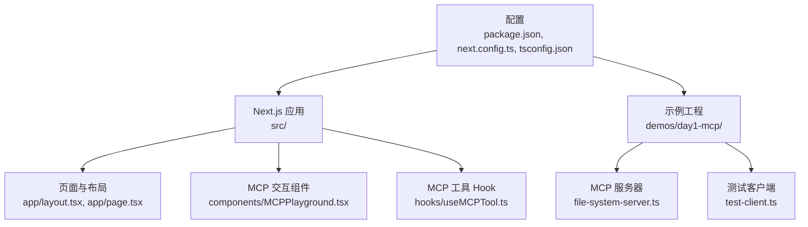
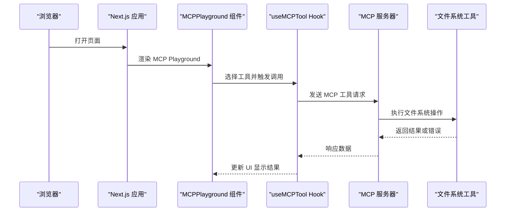
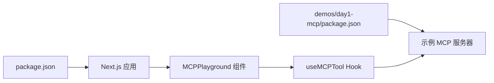

# 快速开始

<cite>
**本文引用的文件**
- [README.md](file://README.md)
- [package.json](file://package.json)
- [next.config.ts](file://next.config.ts)
- [tsconfig.json](file://tsconfig.json)
- [demos/day1-mcp/package.json](file://demos/day1-mcp/package.json)
- [demos/day1-mcp/file-system-server.ts](file://demos/day1-mcp/file-system-server.ts)
- [demos/day1-mcp/test-client.ts](file://demos/day1-mcp/test-client.ts)
- [src/app/layout.tsx](file://src/app/layout.tsx)
- [src/app/page.tsx](file://src/app/page.tsx)
- [src/components/MCPPlayground.tsx](file://src/components/MCPPlayground.tsx)
- [src/hooks/useMCPTool.ts](file://src/hooks/useMCPTool.ts)
</cite>

## 目录
1. [简介](#简介)
2. [项目结构](#项目结构)
3. [核心组件](#核心组件)
4. [架构总览](#架构总览)
5. [详细组件分析](#详细组件分析)
6. [依赖关系分析](#依赖关系分析)
7. [性能注意事项](#性能注意事项)
8. [故障排除指南](#故障排除指南)
9. [结论](#结论)
10. [附录](#附录)

## 简介
本指南面向初学者与有经验的开发者，帮助你快速设置并运行 MCP（Model Context Protocol）学习项目。你将完成以下目标：
- 安装依赖与环境配置
- 启动 Next.js 应用与示例 MCP 服务器
- 实现第一个 MCP 服务器（文件系统访问）
- 使用客户端测试 MCP 工具调用
- 在 Web 界面中体验 MCP Playground

本项目采用 Next.js 作为前端与文档站点，同时在 demos/day1-mcp 下提供基于 TypeScript 的 MCP 服务器与客户端示例，便于从零开始理解 MCP 的工作流。

## 项目结构
- 根目录为 Next.js 应用，包含页面、组件、Hook 与配置文件
- demos/day1-mcp 为独立的 MCP 示例工程，包含一个文件系统 MCP 服务器与测试客户端
- content 与 public 用于静态内容与资源
- src 为应用源码，包含路由、组件与业务 Hook

图表来源
- [src/app/layout.tsx:1-200](file://src/app/layout.tsx#L1-L200)
- [src/app/page.tsx:1-200](file://src/app/page.tsx#L1-L200)
- [src/components/MCPPlayground.tsx:1-200](file://src/components/MCPPlayground.tsx#L1-L200)
- [src/hooks/useMCPTool.ts:1-200](file://src/hooks/useMCPTool.ts#L1-L200)
- [demos/day1-mcp/file-system-server.ts:1-200](file://demos/day1-mcp/file-system-server.ts#L1-L200)
- [demos/day1-mcp/test-client.ts:1-200](file://demos/day1-mcp/test-client.ts#L1-L200)
- [package.json:1-200](file://package.json#L1-L200)
- [next.config.ts:1-200](file://next.config.ts#L1-L200)
- [tsconfig.json:1-200](file://tsconfig.json#L1-L200)

章节来源
- [README.md:1-200](file://README.md#L1-L200)
- [package.json:1-200](file://package.json#L1-L200)
- [next.config.ts:1-200](file://next.config.ts#L1-L200)
- [tsconfig.json:1-200](file://tsconfig.json#L1-L200)

## 核心组件
- 页面与布局：Next.js 应用入口，负责渲染主页面与全局样式
- MCP Playground 组件：提供可视化界面以选择、执行 MCP 工具并展示结果
- useMCPTool Hook：封装与 MCP 服务器的通信逻辑，统一处理请求、错误与状态
- 示例 MCP 服务器：暴露文件系统相关工具，供客户端调用
- 测试客户端：演示如何连接 MCP 服务器并调用工具

章节来源
- [src/app/layout.tsx:1-200](file://src/app/layout.tsx#L1-L200)
- [src/app/page.tsx:1-200](file://src/app/page.tsx#L1-L200)
- [src/components/MCPPlayground.tsx:1-200](file://src/components/MCPPlayground.tsx#L1-L200)
- [src/hooks/useMCPTool.ts:1-200](file://src/hooks/useMCPTool.ts#L1-L200)
- [demos/day1-mcp/file-system-server.ts:1-200](file://demos/day1-mcp/file-system-server.ts#L1-L200)
- [demos/day1-mcp/test-client.ts:1-200](file://demos/day1-mcp/test-client.ts#L1-L200)

## 架构总览
下图展示了从浏览器到 MCP 服务器的完整调用链路，包括 Next.js 页面、MCP Playground 组件、useMCPTool Hook、示例 MCP 服务器与文件系统工具。

图表来源
- [src/app/page.tsx:1-200](file://src/app/page.tsx#L1-L200)
- [src/components/MCPPlayground.tsx:1-200](file://src/components/MCPPlayground.tsx#L1-L200)
- [src/hooks/useMCPTool.ts:1-200](file://src/hooks/useMCPTool.ts#L1-L200)
- [demos/day1-mcp/file-system-server.ts:1-200](file://demos/day1-mcp/file-system-server.ts#L1-L200)
- [demos/day1-mcp/test-client.ts:1-200](file://demos/day1-mcp/test-client.ts#L1-L200)

## 详细组件分析

### 环境准备与安装
- 确保已安装 Node.js 与包管理器（npm/yarn/pnpm）
- 克隆仓库后，进入项目根目录安装依赖
- 可选：进入 demos/day1-mcp 安装示例工程依赖

步骤要点
- 安装根项目依赖
- 安装示例工程依赖
- 确认 TypeScript 与 Next.js 配置正确

章节来源
- [package.json:1-200](file://package.json#L1-L200)
- [demos/day1-mcp/package.json:1-200](file://demos/day1-mcp/package.json#L1-L200)
- [tsconfig.json:1-200](file://tsconfig.json#L1-L200)

### 启动 Next.js 应用
- 在根目录启动开发服务器
- 访问本地地址查看主页与 MCP Playground

注意
- 若端口冲突，可修改端口或关闭占用进程
- 首次构建可能较慢，等待完成后刷新页面

章节来源
- [package.json:1-200](file://package.json#L1-L200)
- [next.config.ts:1-200](file://next.config.ts#L1-L200)
- [src/app/layout.tsx:1-200](file://src/app/layout.tsx#L1-L200)
- [src/app/page.tsx:1-200](file://src/app/page.tsx#L1-L200)

### 启动示例 MCP 服务器
- 进入 demos/day1-mcp 目录
- 启动文件系统 MCP 服务器
- 记录服务器监听地址与端口，供客户端或 Playground 使用

提示
- 服务器启动成功后会输出监听信息
- 如遇权限问题，检查对目标文件系统的访问权限

章节来源
- [demos/day1-mcp/file-system-server.ts:1-200](file://demos/day1-mcp/file-system-server.ts#L1-L200)
- [demos/day1-mcp/package.json:1-200](file://demos/day1-mcp/package.json#L1-L200)

### 第一个 MCP 服务器：文件系统工具
- 服务器暴露文件系统相关工具（如读取、列出目录等）
- 工具参数与返回值遵循 MCP 协议约定
- 错误处理应返回明确的错误码与消息

实现要点
- 注册工具名称与描述
- 解析输入参数并进行校验
- 执行文件系统操作并返回结果或错误

章节来源
- [demos/day1-mcp/file-system-server.ts:1-200](file://demos/day1-mcp/file-system-server.ts#L1-L200)

### 客户端测试：命令行调用
- 使用测试客户端连接 MCP 服务器
- 选择并调用文件系统工具
- 查看返回结果与错误信息

流程说明
- 初始化客户端并连接服务器
- 列举可用工具
- 调用指定工具并打印结果

章节来源
- [demos/day1-mcp/test-client.ts:1-200](file://demos/day1-mcp/test-client.ts#L1-L200)

### Web 端集成：MCP Playground
- 在页面中嵌入 MCP Playground 组件
- 通过 Hook 与 MCP 服务器通信
- 支持工具选择、参数输入与结果展示

交互流程
- 用户选择工具并填写参数
- Hook 发起请求至服务器
- 服务器执行工具并返回结果
- Playground 更新 UI 显示

章节来源
- [src/components/MCPPlayground.tsx:1-200](file://src/components/MCPPlayground.tsx#L1-L200)
- [src/hooks/useMCPTool.ts:1-200](file://src/hooks/useMCPTool.ts#L1-L200)
- [src/app/page.tsx:1-200](file://src/app/page.tsx#L1-L200)

## 依赖关系分析
- Next.js 应用依赖 React、TypeScript 与相关插件
- 示例工程依赖 MCP 客户端/服务端库（由 package.json 声明）
- 组件与 Hook 之间通过函数与事件进行松耦合通信

图表来源
- [package.json:1-200](file://package.json#L1-L200)
- [demos/day1-mcp/package.json:1-200](file://demos/day1-mcp/package.json#L1-L200)
- [src/components/MCPPlayground.tsx:1-200](file://src/components/MCPPlayground.tsx#L1-L200)
- [src/hooks/useMCPTool.ts:1-200](file://src/hooks/useMCPTool.ts#L1-L200)
- [demos/day1-mcp/file-system-server.ts:1-200](file://demos/day1-mcp/file-system-server.ts#L1-L200)

章节来源
- [package.json:1-200](file://package.json#L1-L200)
- [demos/day1-mcp/package.json:1-200](file://demos/day1-mcp/package.json#L1-L200)

## 性能注意事项
- 首次构建与冷启动较慢属正常现象，可使用增量构建
- 避免在 Hook 中执行重型同步计算，必要时拆分任务或使用 Web Worker
- 对文件系统 I/O 进行缓存与节流，减少重复请求
- 合理设置超时与重试策略，提升用户体验

[本节为通用指导，不直接分析具体文件]

## 故障排除指南
常见问题与解决思路
- 端口被占用：更换端口或释放占用进程
- 依赖安装失败：清理缓存并重新安装；检查网络与镜像源
- 服务器无法启动：检查日志输出、权限与路径配置
- 客户端连接失败：确认服务器地址与端口；检查防火墙与安全组
- 工具调用报错：核对参数类型与必填项；查看服务器返回的错误码与消息

建议调试步骤
- 先启动 MCP 服务器，验证其独立可用性
- 再启动 Next.js 应用，确认页面能加载 Playground
- 使用命令行客户端测试工具，逐步定位问题范围

章节来源
- [demos/day1-mcp/file-system-server.ts:1-200](file://demos/day1-mcp/file-system-server.ts#L1-L200)
- [demos/day1-mcp/test-client.ts:1-200](file://demos/day1-mcp/test-client.ts#L1-L200)
- [src/hooks/useMCPTool.ts:1-200](file://src/hooks/useMCPTool.ts#L1-L200)

## 结论
通过本指南，你已完成 MCP 学习项目的安装、配置与运行，实现了第一个文件系统 MCP 服务器，并使用命令行与 Web 端进行了测试。建议在此基础上扩展更多工具，结合业务场景深化对 MCP 协议的理解与实践。

[本节为总结性内容，不直接分析具体文件]

## 附录
- 推荐实践
  - 将工具按领域拆分，保持单一职责
  - 为每个工具编写清晰的描述与参数校验
  - 在 Playground 中增加帮助信息与示例参数
  - 使用环境变量管理敏感配置（如路径、密钥）

- 参考文件
  - 应用配置与脚本：[package.json](file://package.json)
  - 示例工程配置与脚本：[demos/day1-mcp/package.json](file://demos/day1-mcp/package.json)
  - 服务器与客户端实现：[file-system-server.ts](file://demos/day1-mcp/file-system-server.ts), [test-client.ts](file://demos/day1-mcp/test-client.ts)
  - 前端集成：[MCPPlayground.tsx](file://src/components/MCPPlayground.tsx), [useMCPTool.ts](file://src/hooks/useMCPTool.ts)

[本节为补充信息，不直接分析具体文件]