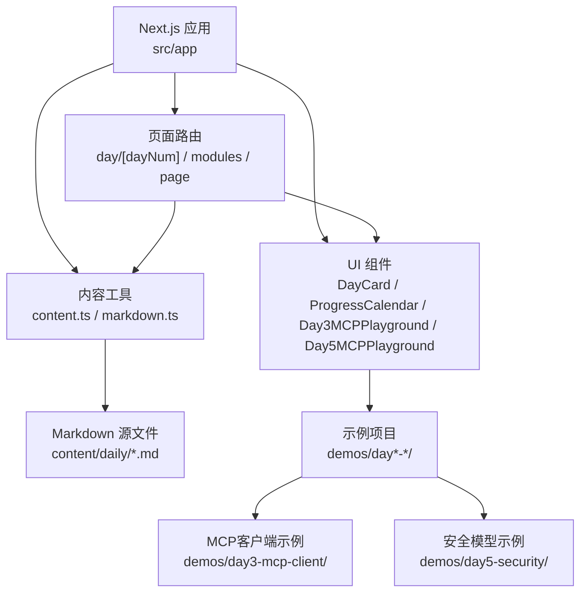
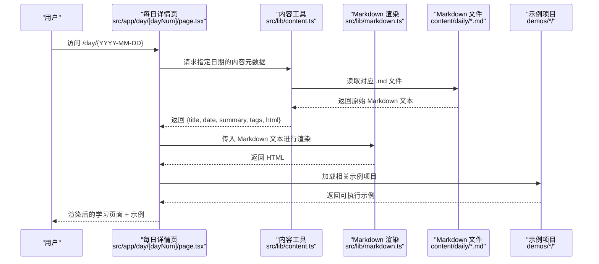
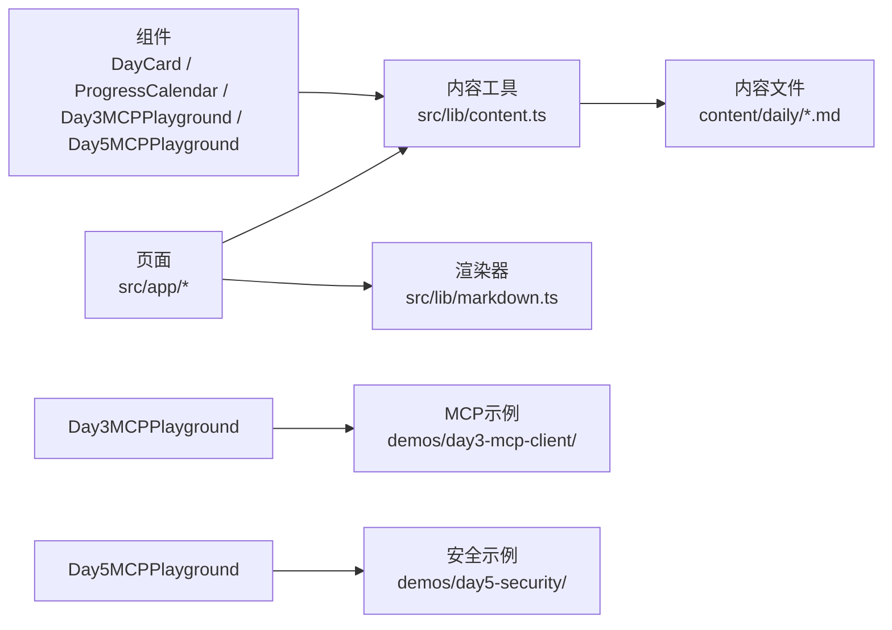
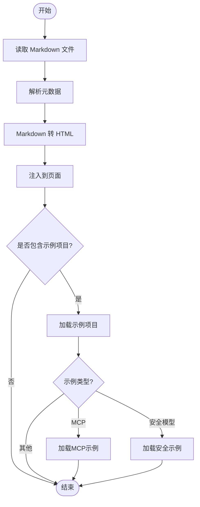

# 每日学习内容

<cite>
**本文引用的文件**
- [README.md](file://README.md)
- [package.json](file://package.json)
- [next.config.ts](file://next.config.ts)
- [src/app/layout.tsx](file://src/app/layout.tsx)
- [src/app/page.tsx](file://src/app/page.tsx)
- [src/app/day/[dayNum]/page.tsx](file://src/app/day/[dayNum]/page.tsx)
- [src/app/modules/page.tsx](file://src/app/modules/page.tsx)
- [src/components/DayCard.tsx](file://src/components/DayCard.tsx)
- [src/components/ProgressCalendar.tsx](file://src/components/ProgressCalendar.tsx)
- [src/components/Day3MCPPlayground.tsx](file://src/components/Day3MCPPlayground.tsx)
- [src/components/Day5MCPPlayground.tsx](file://src/components/Day5MCPPlayground.tsx)
- [src/lib/content.ts](file://src/lib/content.ts)
- [src/lib/markdown.ts](file://src/lib/markdown.ts)
- [content/daily/2026-04-23.md](file://content/daily/2026-04-23.md)
- [demos/day3-mcp-client/package.json](file://demos/day3-mcp-client/package.json)
- [demos/day5-security/file-server.ts](file://demos/day5-security/file-server.ts)
- [demos/day5-security/secure-client.ts](file://demos/day5-security/secure-client.ts)
</cite>

## 更新摘要
**变更内容**
- 新增第5天安全模型演示模块，包含完整的安全概念和实践示例
- 添加Day5MCPPlayground组件用于安全模型交互式演示
- 扩展内容管理系统以支持安全模型示例项目
- 完善学习路径规划，增加安全模型技术栈的学习序列
- 集成文件服务器和客户端的安全通信示例

## 目录
1. [简介](#简介)
2. [项目结构](#项目结构)
3. [核心组件](#核心组件)
4. [架构总览](#架构总览)
5. [详细组件分析](#详细组件分析)
6. [依赖关系分析](#依赖关系分析)
7. [性能考虑](#性能考虑)
8. [故障排查指南](#故障排查指南)
9. [结论](#结论)
10. [附录](#附录)

## 简介
本模块围绕"每日学习内容"展开，提供内容的组织、管理、展示与进度跟踪能力。内容以 Markdown 形式按日期存放，前端通过 Next.js 应用进行渲染与导航；同时提供日历视图与卡片式浏览，支持学习路径规划与进度可视化。**最新更新**：新增了第5天安全模型学习模块，包含完整的安全概念讲解和交互式游乐场实现，为学习者提供安全模型开发的实践环境。本文档面向内容作者与开发者，说明如何添加新内容、格式要求、渲染流程以及最佳实践。

## 项目结构
仓库采用 Next.js App Router 结构，内容数据与前端代码分离：
- 内容层：content/daily 下按 YYYY-MM-DD.md 命名存放每日学习材料。
- 前端层：src/app 为页面路由，src/components 为可复用 UI 组件，src/lib 为内容与渲染工具。
- 配置层：next.config.ts、package.json 等用于构建与运行环境。
- **新增**：demos 目录下包含各天的示例项目，包括MCP客户端、服务器和安全模型等完整实现。

**图表来源**
- [src/app/day/[dayNum]/page.tsx](file://src/app/day/[dayNum]/page.tsx)
- [src/app/modules/page.tsx](file://src/app/modules/page.tsx)
- [src/components/DayCard.tsx](file://src/components/DayCard.tsx)
- [src/components/ProgressCalendar.tsx](file://src/components/ProgressCalendar.tsx)
- [src/components/Day3MCPPlayground.tsx](file://src/components/Day3MCPPlayground.tsx)
- [src/components/Day5MCPPlayground.tsx](file://src/components/Day5MCPPlayground.tsx)
- [src/lib/content.ts](file://src/lib/content.ts)
- [src/lib/markdown.ts](file://src/lib/markdown.ts)

**章节来源**
- [README.md:1-200](file://README.md#L1-L200)
- [package.json:1-200](file://package.json#L1-L200)
- [next.config.ts:1-200](file://next.config.ts#L1-L200)

## 核心组件
- 内容读取与解析
  - 内容清单与元信息：负责扫描 content/daily 下的 Markdown 文件，提取标题、日期、摘要、标签等元数据，供列表与搜索使用。
  - Markdown 渲染：将 Markdown 文本转换为 HTML，并注入到页面中。
- 展示与交互
  - 日卡片（DayCard）：展示单日的标题、摘要、日期与跳转入口。
  - 进度日历（ProgressCalendar）：以日历形式标记已完成的学习日，支持点击跳转到对应页面。
  - MCP客户端游乐场（Day3MCPPlayground）：提供MCP客户端的交互式学习环境，支持实时测试和调试。
  - **新增**：安全模型游乐场（Day5MCPPlayground）：提供安全模型的交互式学习环境，支持安全通信和权限控制演示。
- 页面路由
  - 每日详情页：根据 URL 中的 dayNum 参数加载对应日期的 Markdown 并渲染。
  - 模块页：聚合展示所有学习日或按主题分类的条目。

**章节来源**
- [src/lib/content.ts:1-200](file://src/lib/content.ts#L1-L200)
- [src/lib/markdown.ts:1-200](file://src/lib/markdown.ts#L1-L200)
- [src/components/DayCard.tsx:1-200](file://src/components/DayCard.tsx#L1-L200)
- [src/components/ProgressCalendar.tsx:1-200](file://src/components/ProgressCalendar.tsx#L1-L200)
- [src/components/Day3MCPPlayground.tsx:1-200](file://src/components/Day3MCPPlayground.tsx#L1-L200)
- [src/components/Day5MCPPlayground.tsx:1-200](file://src/components/Day5MCPPlayground.tsx#L1-L200)
- [src/app/day/[dayNum]/page.tsx:1-200](file://src/app/day/[dayNum]/page.tsx#L1-L200)
- [src/app/modules/page.tsx:1-200](file://src/app/modules/page.tsx#L1-L200)

## 架构总览
整体数据流从内容层到展示层的顺序如下：
- 内容层：Markdown 文件作为单一事实源，文件名即日期键。
- 解析层：content.ts 读取并解析元数据；markdown.ts 将 Markdown 转为 HTML。
- 展示层：页面组件调用解析结果，渲染卡片、日历与详情。
- **新增**：示例集成层：通过demos目录提供完整的MCP客户端、服务器和安全模型等示例项目，支持理论与实践结合的学习模式。

**图表来源**
- [src/app/day/[dayNum]/page.tsx:1-200](file://src/app/day/[dayNum]/page.tsx#L1-L200)
- [src/lib/content.ts:1-200](file://src/lib/content.ts#L1-L200)
- [src/lib/markdown.ts:1-200](file://src/lib/markdown.ts#L1-L200)

## 详细组件分析

### 内容管理与解析（content.ts）
- 职责
  - 扫描 content/daily 目录，收集所有 .md 文件。
  - 解析每个文件的元数据（如标题、日期、摘要、标签）。
  - 提供按日期排序、过滤、检索的能力。
- 数据结构
  - 条目对象包含：唯一标识（日期）、标题、摘要、标签、HTML 内容等。
- 复杂度
  - 扫描与解析时间复杂度近似 O(N)，N 为 Markdown 文件数量。
  - 可通过缓存减少重复 IO。
- 优化建议
  - 对大仓库引入增量扫描与内存缓存。
  - 对元数据解析增加容错与日志。

**章节来源**
- [src/lib/content.ts:1-200](file://src/lib/content.ts#L1-L200)

### Markdown 渲染（markdown.ts）
- 职责
  - 将 Markdown 文本转换为 HTML。
  - 可选：语法高亮、表格处理、图片懒加载等。
- 错误处理
  - 捕获解析异常并返回降级 HTML。
- 性能
  - 对长文档进行分块渲染或延迟渲染以提升首屏速度。

**章节来源**
- [src/lib/markdown.ts:1-200](file://src/lib/markdown.ts#L1-L200)

### 每日详情页（src/app/day/[dayNum]/page.tsx）
- 职责
  - 根据 URL 中的日期参数获取对应内容并渲染。
  - 处理缺失文件或解析失败的情况。
- 交互
  - 提供返回上一页、分享链接等扩展点。
- 错误边界
  - 当文件不存在时显示友好提示。

**章节来源**
- [src/app/day/[dayNum]/page.tsx:1-200](file://src/app/day/[dayNum]/page.tsx#L1-L200)

### 模块页（src/app/modules/page.tsx）
- 职责
  - 聚合展示所有学习日，支持按标签或主题筛选。
  - 提供快速导航至具体日期。
- 可扩展性
  - 可按主题维度新增分组逻辑。

**章节来源**
- [src/app/modules/page.tsx:1-200](file://src/app/modules/page.tsx#L1-L200)

### 日卡片（DayCard.tsx）
- 职责
  - 展示单条学习内容的摘要、日期与跳转按钮。
- 样式与可访问性
  - 确保键盘可达与屏幕阅读器友好。

**章节来源**
- [src/components/DayCard.tsx:1-200](file://src/components/DayCard.tsx#L1-L200)

### 进度日历（ProgressCalendar.tsx）
- 职责
  - 以月视图展示学习进度，标记已完成日期。
  - 支持点击跳转至对应学习日。
- 状态管理
  - 本地存储记录完成状态，便于跨会话保持。

**章节来源**
- [src/components/ProgressCalendar.tsx:1-200](file://src/components/ProgressCalendar.tsx#L1-L200)

### MCP客户端游乐场（Day3MCPPlayground.tsx）
- **新增功能**：专为第3天MCP客户端学习设计的交互式游乐场
- 职责
  - 提供MCP客户端的实时测试环境
  - 支持MCP协议消息的发送与接收演示
  - 集成MCP客户端示例项目的运行环境
- 特性
  - 实时控制台输出
  - 消息格式验证
  - 错误调试与日志查看
  - 与理论内容的无缝衔接

**章节来源**
- [src/components/Day3MCPPlayground.tsx:1-200](file://src/components/Day3MCPPlayground.tsx#L1-L200)

### 安全模型游乐场（Day5MCPPlayground.tsx）
- **新增功能**：专为第5天安全模型学习设计的交互式游乐场
- 职责
  - 提供安全模型的实时测试环境
  - 支持安全通信和权限控制的演示
  - 集成安全模型示例项目的运行环境
- 特性
  - 文件服务器安全通信演示
  - 客户端权限验证机制
  - 安全漏洞防护示例
  - 实时安全事件监控
  - 与理论内容的无缝衔接

**章节来源**
- [src/components/Day5MCPPlayground.tsx:1-200](file://src/components/Day5MCPPlayground.tsx#L1-L200)

## 依赖关系分析
- 组件依赖
  - 页面组件依赖 content.ts 与 markdown.ts。
  - DayCard 与 ProgressCalendar 依赖 content.ts 提供的条目数据。
  - Day3MCPPlayground 依赖MCP客户端示例项目和相关的工具函数。
  - **新增**：Day5MCPPlayground 依赖安全模型示例项目和相关的工具函数。
- 外部依赖
  - Next.js 路由与静态资源服务。
  - Markdown 渲染库（由 markdown.ts 封装）。
  - MCP客户端运行时环境和示例项目依赖。
  - **新增**：安全模型运行时环境和示例项目依赖。

**图表来源**
- [src/app/day/[dayNum]/page.tsx:1-200](file://src/app/day/[dayNum]/page.tsx#L1-L200)
- [src/app/modules/page.tsx:1-200](file://src/app/modules/page.tsx#L1-L200)
- [src/components/DayCard.tsx:1-200](file://src/components/DayCard.tsx#L1-L200)
- [src/components/ProgressCalendar.tsx:1-200](file://src/components/ProgressCalendar.tsx#L1-L200)
- [src/components/Day3MCPPlayground.tsx:1-200](file://src/components/Day3MCPPlayground.tsx#L1-L200)
- [src/components/Day5MCPPlayground.tsx:1-200](file://src/components/Day5MCPPlayground.tsx#L1-L200)
- [src/lib/content.ts:1-200](file://src/lib/content.ts#L1-L200)
- [src/lib/markdown.ts:1-200](file://src/lib/markdown.ts#L1-L200)

## 性能考虑
- 首屏优化
  - 仅按需加载当前页面的 Markdown 内容。
  - 对列表页使用分页或虚拟滚动。
- 缓存策略
  - 对已解析的 Markdown 与元数据进行内存缓存。
  - 利用浏览器缓存静态资源。
- 渲染优化
  - 对长文档启用分段渲染或懒加载。
  - 图片与代码块按需加载。
- **新增**：MCP游乐场优化
  - 示例项目按需加载，避免影响主应用性能
  - 异步初始化MCP客户端环境
  - 资源隔离防止内存泄漏
- **新增**：安全模型游乐场优化
  - 安全示例项目按需加载，避免影响主应用性能
  - 异步初始化安全通信环境
  - 资源隔离防止内存泄漏
  - 安全事件监听优化

## 故障排查指南
- 常见问题
  - 无法找到指定日期的内容：检查文件名是否为 YYYY-MM-DD.md 且位于 content/daily。
  - 渲染空白或报错：确认 Markdown 语法正确，检查 markdown.ts 的错误处理分支。
  - 进度未保存：检查本地存储权限与名称一致性。
  - MCP游乐场无法启动：检查Node.js版本兼容性，确认依赖安装完整。
  - **新增**：安全模型游乐场无法启动：检查Node.js版本兼容性，确认依赖安装完整，验证安全证书配置。
- 定位方法
  - 在浏览器控制台查看网络请求与错误堆栈。
  - 在 content.ts 中添加日志输出，确认文件扫描与解析过程。
  - 检查MCP客户端示例项目的package.json依赖版本。
  - **新增**：检查安全模型示例项目的package.json依赖版本，验证安全通信配置。
- 恢复步骤
  - 修正文件名或路径后重新构建。
  - 清理缓存并重启开发服务器。
  - 重新安装MCP示例项目的依赖包。
  - **新增**：重新安装安全模型示例项目的依赖包，重置安全证书配置。

**章节来源**
- [src/lib/content.ts:1-200](file://src/lib/content.ts#L1-L200)
- [src/lib/markdown.ts:1-200](file://src/lib/markdown.ts#L1-L200)
- [src/app/day/[dayNum]/page.tsx:1-200](file://src/app/day/[dayNum]/page.tsx#L1-L200)

## 结论
本模块以"内容即数据"的方式组织每日学习材料，通过清晰的解析与渲染管线实现高效的内容管理与展示。配合进度日历与卡片化浏览，既满足内容作者的轻量写作需求，也提供良好的学习者体验。**最新增强**：通过新增的第3天MCP客户端学习模块和第5天安全模型学习模块，以及相应的交互式游乐场，为学习者提供了完整的技术栈学习路径，实现了从理论到实践的无缝衔接。建议在后续迭代中引入主题分类、搜索增强与离线缓存，进一步提升可用性与性能。

## 附录

### 如何添加新的学习内容
- 创建文件
  - 在 content/daily 目录下新建 YYYY-MM-DD.md。
- 编写内容
  - 使用标准 Markdown 语法，包含标题、正文、图片与代码块。
  - 可在文件头部添加元数据（如标题、摘要、标签），以便 content.ts 解析。
- 验证
  - 启动开发服务器，访问 /day/YYYY-MM-DD 预览效果。
  - 在模块页确认条目出现并可点击。
- 提交
  - 提交变更并推送至仓库。
- **新增**：对于复杂的技术主题（如MCP和安全模型），建议同时在demos目录下创建对应的示例项目，提供实践环境。

**章节来源**
- [content/daily/2026-04-23.md:1-200](file://content/daily/2026-04-23.md#L1-L200)
- [src/lib/content.ts:1-200](file://src/lib/content.ts#L1-L200)
- [src/lib/markdown.ts:1-200](file://src/lib/markdown.ts#L1-L200)
- [src/app/day/[dayNum]/page.tsx:1-200](file://src/app/day/[dayNum]/page.tsx#L1-L200)

### 格式化要求
- 文件命名
  - 严格使用 YYYY-MM-DD.md。
- 元数据
  - 建议使用 YAML front matter 或文件头注释定义 title、summary、tags。
- 内容规范
  - 一级标题为文章标题；二级标题划分小节；合理使用列表与表格。
  - 图片路径相对 content/daily 目录；代码块标注语言以便高亮。
- 可访问性
  - 为图片提供 alt 文本；避免纯颜色传达信息。
- **新增**：示例项目规范
  - demos目录下的示例项目应包含完整的package.json和依赖说明
  - 每个示例项目应有独立的README说明使用方法
  - 确保示例项目与主应用版本兼容
  - 安全模型示例需包含完整的安全配置和证书管理

**章节来源**
- [content/daily/2026-04-23.md:1-200](file://content/daily/2026-04-23.md#L1-L200)
- [src/lib/markdown.ts:1-200](file://src/lib/markdown.ts#L1-L200)

### 渲染流程

**图表来源**
- [src/lib/content.ts:1-200](file://src/lib/content.ts#L1-L200)
- [src/lib/markdown.ts:1-200](file://src/lib/markdown.ts#L1-L200)
- [src/app/day/[dayNum]/page.tsx:1-200](file://src/app/day/[dayNum]/page.tsx#L1-L200)

### 内容分类、进度跟踪与学习路径
- 内容分类
  - 通过 tags 字段对内容进行标签化管理，模块页可按标签筛选。
- 进度跟踪
  - 使用 ProgressCalendar 记录已完成日期，支持本地持久化。
- 学习路径规划
  - 在模块页中按主题或难度组织条目，形成推荐学习序列。
  - 结合标签与摘要，生成个性化学习路线。
  - **新增**：技术栈学习路径：从基础概念到客户端开发，再到安全模型集成，形成完整的学习序列。

**章节来源**
- [src/lib/content.ts:1-200](file://src/lib/content.ts#L1-L200)
- [src/components/ProgressCalendar.tsx:1-200](file://src/components/ProgressCalendar.tsx#L1-L200)
- [src/app/modules/page.tsx:1-200](file://src/app/modules/page.tsx#L1-L200)

### 实际示例与最佳实践
- 示例
  - 参考 content/daily/2026-04-23.md 的结构与写法。
  - **新增**：第3天MCP客户端示例展示了完整的MCP客户端实现，包括连接管理、消息处理和错误处理。
  - **新增**：第5天安全模型示例展示了完整的安全通信实现，包括文件服务器、客户端权限验证和安全防护机制。
- 最佳实践
  - 保持每篇内容聚焦一个主题，长度适中。
  - 使用清晰的小节标题与列表，提升可读性。
  - 代码块附带必要注释，图片提供替代文本。
  - 定期回顾与更新旧内容，确保准确性。
  - **新增**：对于复杂技术主题，提供渐进式的示例项目，从简单到复杂逐步深入。
  - **新增**：安全模型示例应包含完整的安全配置和错误处理机制。

**章节来源**
- [content/daily/2026-04-23.md:1-200](file://content/daily/2026-04-23.md#L1-L200)