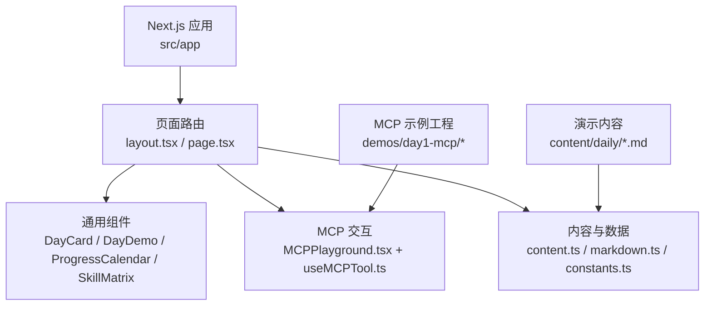
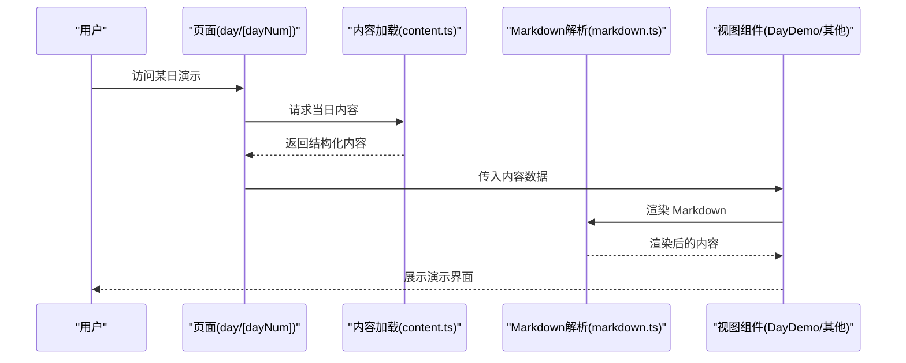
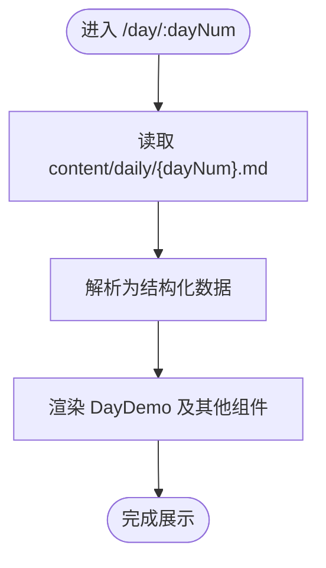
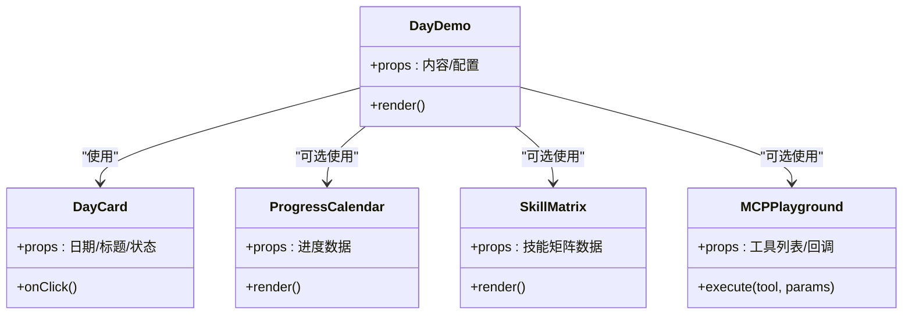
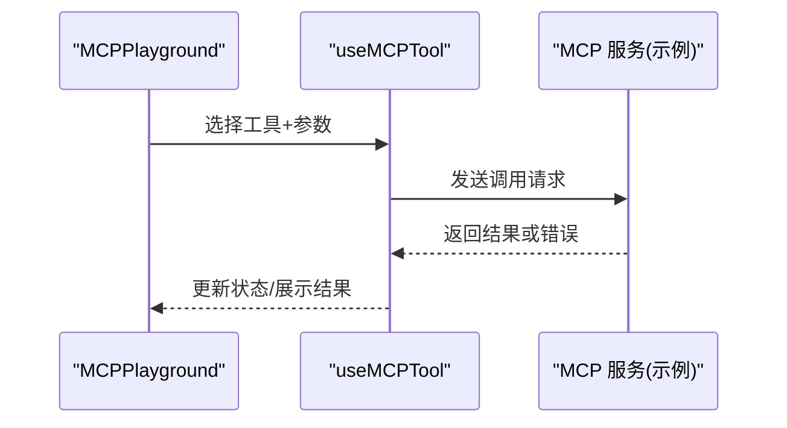
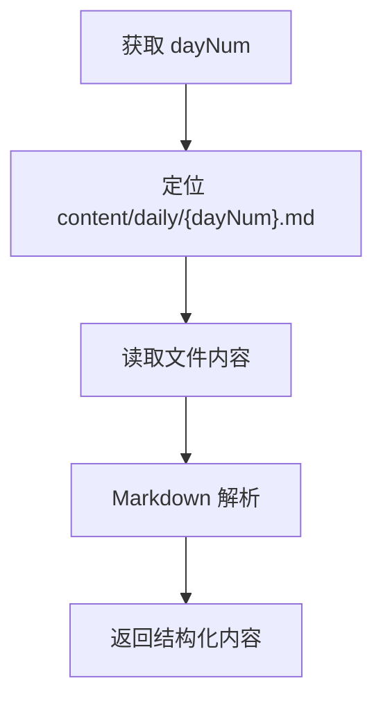
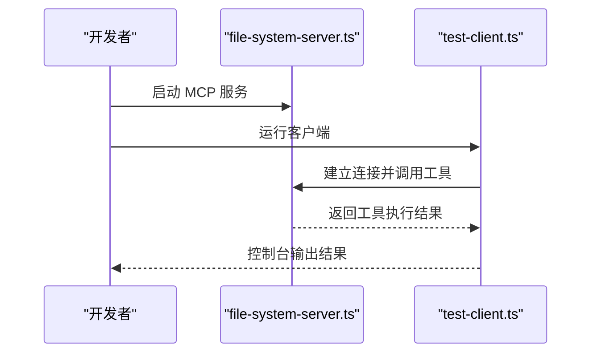
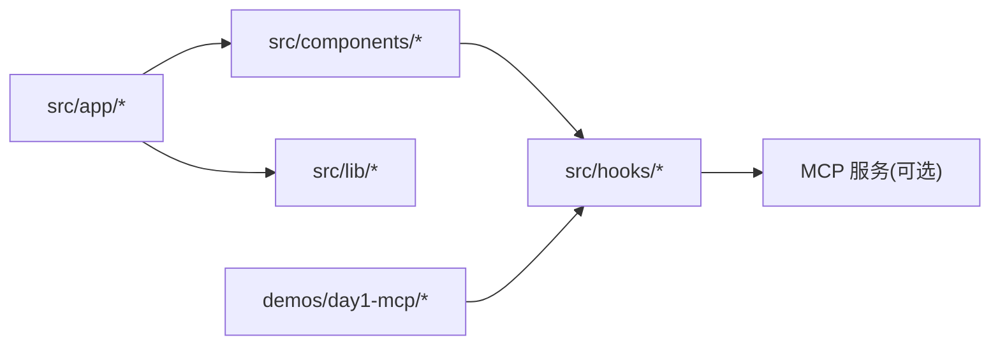

# 演示和示例

<cite>
**本文引用的文件**
- [README.md](file://README.md)
- [package.json](file://package.json)
- [next.config.ts](file://next.config.ts)
- [src/app/layout.tsx](file://src/app/layout.tsx)
- [src/app/page.tsx](file://src/app/page.tsx)
- [src/app/day/[dayNum]/page.tsx](file://src/app/day/[dayNum]/page.tsx)
- [src/app/modules/page.tsx](file://src/app/modules/page.tsx)
- [src/components/DayCard.tsx](file://src/components/DayCard.tsx)
- [src/components/DayDemo.tsx](file://src/components/DayDemo.tsx)
- [src/components/MCPPlayground.tsx](file://src/components/MCPPlayground.tsx)
- [src/components/ProgressCalendar.tsx](file://src/components/ProgressCalendar.tsx)
- [src/components/SkillMatrix.tsx](file://src/components/SkillMatrix.tsx)
- [src/hooks/useMCPTool.ts](file://src/hooks/useMCPTool.ts)
- [src/lib/constants.ts](file://src/lib/constants.ts)
- [src/lib/content.ts](file://src/lib/content.ts)
- [src/lib/markdown.ts](file://src/lib/markdown.ts)
- [demos/day1-mcp/package.json](file://demos/day1-mcp/package.json)
- [demos/day1-mcp/file-system-server.ts](file://demos/day1-mcp/file-system-server.ts)
- [demos/day1-mcp/test-client.ts](file://demos/day1-mcp/test-client.ts)
</cite>

## 目录
1. [简介](#简介)
2. [项目结构](#项目结构)
3. [核心组件](#核心组件)
4. [架构总览](#架构总览)
5. [详细组件分析](#详细组件分析)
6. [依赖关系分析](#依赖关系分析)
7. [性能考虑](#性能考虑)
8. [故障排查指南](#故障排查指南)
9. [结论](#结论)
10. [附录：配置与参数、返回值说明](#附录配置与参数返回值说明)

## 简介
本仓库是一个以“每日学习/演示”为主题的 Next.js 应用，结合 MCP（Model Context Protocol）演示与前端可视化能力，提供：
- 按天组织的演示页面与内容展示
- MCP 工具调用与交互的 Playground
- 进度日历与技能矩阵等可视化组件
- 独立的 day1-mcp 示例工程，用于演示 MCP 服务端与客户端的交互

该文档面向初学者与有经验的开发者，既提供入门式的使用说明，也包含实现细节、调用关系、接口契约、领域模型与常见问题解决方案。

## 项目结构
整体采用 Next.js App Router 组织页面，业务逻辑下沉到 components、hooks、lib 三层；演示内容通过 Markdown 驱动；独立 demos 目录提供可运行的 MCP 示例。

图表来源
- [src/app/layout.tsx:1-200](file://src/app/layout.tsx#L1-L200)
- [src/app/page.tsx:1-200](file://src/app/page.tsx#L1-L200)
- [src/components/MCPPlayground.tsx:1-200](file://src/components/MCPPlayground.tsx#L1-L200)
- [src/hooks/useMCPTool.ts:1-200](file://src/hooks/useMCPTool.ts#L1-L200)
- [src/lib/content.ts:1-200](file://src/lib/content.ts#L1-L200)
- [src/lib/markdown.ts:1-200](file://src/lib/markdown.ts#L1-L200)
- [demos/day1-mcp/file-system-server.ts:1-200](file://demos/day1-mcp/file-system-server.ts#L1-L200)
- [demos/day1-mcp/test-client.ts:1-200](file://demos/day1-mcp/test-client.ts#L1-L200)

章节来源
- [README.md:1-200](file://README.md#L1-L200)
- [package.json:1-200](file://package.json#L1-L200)
- [next.config.ts:1-200](file://next.config.ts#L1-L200)

## 核心组件
- 页面与布局
  - 根布局与全局样式注入
  - 首页入口与模块导航
  - 按天路由页面，承载当日演示内容
- 演示与可视化组件
  - 日卡片：展示每日主题与状态
  - 日演示：渲染当日演示内容（Markdown/代码片段/交互）
  - 进度日历：可视化学习进度
  - 技能矩阵：展示技能维度与掌握程度
  - MCP Playground：交互式调用 MCP 工具并展示结果
- 数据与工具
  - 内容加载器：读取 content/daily 下的 Markdown 并解析为结构化数据
  - Markdown 解析器：将 Markdown 转换为可渲染内容
  - 常量定义：主题、路由、UI 文案等
  - MCP Hook：封装 MCP 工具调用的异步流程与错误处理

章节来源
- [src/app/layout.tsx:1-200](file://src/app/layout.tsx#L1-L200)
- [src/app/page.tsx:1-200](file://src/app/page.tsx#L1-L200)
- [src/app/day/[dayNum]/page.tsx:1-200](file://src/app/day/[dayNum]/page.tsx#L1-L200)
- [src/components/DayCard.tsx:1-200](file://src/components/DayCard.tsx#L1-L200)
- [src/components/DayDemo.tsx:1-200](file://src/components/DayDemo.tsx#L1-L200)
- [src/components/ProgressCalendar.tsx:1-200](file://src/components/ProgressCalendar.tsx#L1-L200)
- [src/components/SkillMatrix.tsx:1-200](file://src/components/SkillMatrix.tsx#L1-L200)
- [src/components/MCPPlayground.tsx:1-200](file://src/components/MCPPlayground.tsx#L1-L200)
- [src/hooks/useMCPTool.ts:1-200](file://src/hooks/useMCPTool.ts#L1-L200)
- [src/lib/content.ts:1-200](file://src/lib/content.ts#L1-L200)
- [src/lib/markdown.ts:1-200](file://src/lib/markdown.ts#L1-L200)
- [src/lib/constants.ts:1-200](file://src/lib/constants.ts#L1-L200)

## 架构总览
应用遵循“页面 -> 组件 -> 数据/工具”的分层模式：
- 页面层负责路由与组装 UI
- 组件层负责展示与交互
- 数据层负责读取与转换内容
- 外部集成通过 hooks 与独立示例工程对接（如 MCP）

图表来源
- [src/app/day/[dayNum]/page.tsx:1-200](file://src/app/day/[dayNum]/page.tsx#L1-L200)
- [src/lib/content.ts:1-200](file://src/lib/content.ts#L1-L200)
- [src/lib/markdown.ts:1-200](file://src/lib/markdown.ts#L1-L200)
- [src/components/DayDemo.tsx:1-200](file://src/components/DayDemo.tsx#L1-L200)

## 详细组件分析

### 页面与路由
- 根布局：统一注入样式、元信息与基础 UI 壳
- 首页：聚合导航到模块与每日演示
- 按天页面：根据 URL 中的 dayNum 动态加载对应内容并渲染

图表来源
- [src/app/day/[dayNum]/page.tsx:1-200](file://src/app/day/[dayNum]/page.tsx#L1-L200)
- [src/lib/content.ts:1-200](file://src/lib/content.ts#L1-L200)
- [src/lib/markdown.ts:1-200](file://src/lib/markdown.ts#L1-L200)

章节来源
- [src/app/layout.tsx:1-200](file://src/app/layout.tsx#L1-L200)
- [src/app/page.tsx:1-200](file://src/app/page.tsx#L1-L200)
- [src/app/day/[dayNum]/page.tsx:1-200](file://src/app/day/[dayNum]/page.tsx#L1-L200)

### 演示与可视化组件
- DayCard：展示日期、标题、状态；支持点击跳转
- DayDemo：组合 Markdown 渲染、代码高亮、交互控件
- ProgressCalendar：基于日期集合渲染进度网格
- SkillMatrix：二维矩阵展示技能维度与等级
- MCPPlayground：提供工具选择、参数输入、执行与结果展示

图表来源
- [src/components/DayCard.tsx:1-200](file://src/components/DayCard.tsx#L1-L200)
- [src/components/DayDemo.tsx:1-200](file://src/components/DayDemo.tsx#L1-L200)
- [src/components/ProgressCalendar.tsx:1-200](file://src/components/ProgressCalendar.tsx#L1-L200)
- [src/components/SkillMatrix.tsx:1-200](file://src/components/SkillMatrix.tsx#L1-L200)
- [src/components/MCPPlayground.tsx:1-200](file://src/components/MCPPlayground.tsx#L1-L200)

章节来源
- [src/components/DayCard.tsx:1-200](file://src/components/DayCard.tsx#L1-L200)
- [src/components/DayDemo.tsx:1-200](file://src/components/DayDemo.tsx#L1-L200)
- [src/components/ProgressCalendar.tsx:1-200](file://src/components/ProgressCalendar.tsx#L1-L200)
- [src/components/SkillMatrix.tsx:1-200](file://src/components/SkillMatrix.tsx#L1-L200)
- [src/components/MCPPlayground.tsx:1-200](file://src/components/MCPPlayground.tsx#L1-L200)

### MCP 工具调用 Hook
- 职责：封装工具选择、参数校验、远程调用、结果缓存与错误处理
- 典型流程：选择工具 -> 构建参数 -> 发起调用 -> 更新 UI 状态 -> 捕获异常

图表来源
- [src/hooks/useMCPTool.ts:1-200](file://src/hooks/useMCPTool.ts#L1-L200)
- [src/components/MCPPlayground.tsx:1-200](file://src/components/MCPPlayground.tsx#L1-L200)
- [demos/day1-mcp/file-system-server.ts:1-200](file://demos/day1-mcp/file-system-server.ts#L1-L200)
- [demos/day1-mcp/test-client.ts:1-200](file://demos/day1-mcp/test-client.ts#L1-L200)

章节来源
- [src/hooks/useMCPTool.ts:1-200](file://src/hooks/useMCPTool.ts#L1-L200)
- [src/components/MCPPlayground.tsx:1-200](file://src/components/MCPPlayground.tsx#L1-L200)
- [demos/day1-mcp/file-system-server.ts:1-200](file://demos/day1-mcp/file-system-server.ts#L1-L200)
- [demos/day1-mcp/test-client.ts:1-200](file://demos/day1-mcp/test-client.ts#L1-L200)

### 内容与 Markdown 解析
- 内容加载：从 content/daily 下按文件名匹配当日内容，返回结构化对象
- Markdown 解析：将原始文本转换为可渲染的 HTML/AST（由具体解析库决定）
- 常量：提供主题、路由、文案等集中管理

图表来源
- [src/lib/content.ts:1-200](file://src/lib/content.ts#L1-L200)
- [src/lib/markdown.ts:1-200](file://src/lib/markdown.ts#L1-L200)
- [src/lib/constants.ts:1-200](file://src/lib/constants.ts#L1-L200)

章节来源
- [src/lib/content.ts:1-200](file://src/lib/content.ts#L1-L200)
- [src/lib/markdown.ts:1-200](file://src/lib/markdown.ts#L1-L200)
- [src/lib/constants.ts:1-200](file://src/lib/constants.ts#L1-L200)

### 独立 MCP 示例工程（demos/day1-mcp）
- 服务端：实现文件系统相关 MCP 工具（如列出目录、读取文件）
- 客户端：连接服务端并调用工具，打印结果
- 运行方式：先启动服务端，再运行客户端进行交互测试

图表来源
- [demos/day1-mcp/file-system-server.ts:1-200](file://demos/day1-mcp/file-system-server.ts#L1-L200)
- [demos/day1-mcp/test-client.ts:1-200](file://demos/day1-mcp/test-client.ts#L1-L200)
- [demos/day1-mcp/package.json:1-200](file://demos/day1-mcp/package.json#L1-L200)

章节来源
- [demos/day1-mcp/package.json:1-200](file://demos/day1-mcp/package.json#L1-L200)
- [demos/day1-mcp/file-system-server.ts:1-200](file://demos/day1-mcp/file-system-server.ts#L1-L200)
- [demos/day1-mcp/test-client.ts:1-200](file://demos/day1-mcp/test-client.ts#L1-L200)

## 依赖关系分析
- 运行时依赖：Next.js、React、TypeScript、Markdown 解析库、MCP 相关 SDK（若使用）
- 内部依赖：页面依赖组件与 lib；组件依赖 hooks；hooks 可能依赖外部 MCP 服务
- 外部依赖：demos 中的 MCP 服务端作为可选的外部服务

图表来源
- [src/app/layout.tsx:1-200](file://src/app/layout.tsx#L1-L200)
- [src/components/MCPPlayground.tsx:1-200](file://src/components/MCPPlayground.tsx#L1-L200)
- [src/hooks/useMCPTool.ts:1-200](file://src/hooks/useMCPTool.ts#L1-L200)
- [demos/day1-mcp/file-system-server.ts:1-200](file://demos/day1-mcp/file-system-server.ts#L1-L200)

章节来源
- [package.json:1-200](file://package.json#L1-L200)
- [next.config.ts:1-200](file://next.config.ts#L1-L200)

## 性能考虑
- 内容加载：对 Markdown 内容进行按需加载与缓存，避免重复 IO
- 渲染优化：大段 Markdown 可使用虚拟滚动或分页渲染
- 网络调用：对 MCP 工具调用增加重试与超时控制，减少阻塞
- 资源体积：按需引入依赖，拆分路由与组件，减小首屏体积

[本节为通用指导，不直接分析具体文件]

## 故障排查指南
- 无法加载某日内容
  - 检查 content/daily 目录下是否存在对应日期的 Markdown 文件
  - 确认文件名与 URL 中的 dayNum 一致
  - 查看内容加载器的错误日志与路径拼接逻辑
- Markdown 渲染异常
  - 检查 Markdown 语法是否合法
  - 确认解析库版本兼容性与配置项
- MCP 调用失败
  - 确认 MCP 服务已启动且端口可达
  - 检查客户端与服务端的协议版本与工具名是否一致
  - 查看网络请求与错误响应，定位是连接问题还是参数问题
- 页面空白或报错
  - 检查浏览器控制台是否有 JS 错误
  - 核对环境变量与 Next.js 配置是否正确

章节来源
- [src/lib/content.ts:1-200](file://src/lib/content.ts#L1-L200)
- [src/lib/markdown.ts:1-200](file://src/lib/markdown.ts#L1-L200)
- [src/hooks/useMCPTool.ts:1-200](file://src/hooks/useMCPTool.ts#L1-L200)
- [demos/day1-mcp/test-client.ts:1-200](file://demos/day1-mcp/test-client.ts#L1-L200)

## 结论
本项目以“每日演示”为主线，结合 Next.js 的现代化前端能力与 MCP 的工具生态，提供了可扩展的内容展示与交互范式。通过清晰的层次划分与模块化设计，既便于初学者上手，也为进阶开发者提供了足够的扩展空间。建议在生产环境中完善错误处理、监控与性能优化策略，确保稳定与可维护性。

[本节为总结性内容，不直接分析具体文件]

## 附录：配置与参数、返回值说明
- 页面路由
  - /day/:dayNum：按日展示演示内容，dayNum 需与 content/daily 下的文件名一致
- 内容数据模型（概念）
  - 标题、正文、标签、状态等字段，由内容加载器与 Markdown 解析器共同生成
- MCP 工具调用（概念）
  - 入参：工具名称、参数对象
  - 出参：成功结果或错误信息
  - 行为：支持重试、超时、取消与结果缓存
- 组件 Props（概念）
  - DayCard：日期、标题、状态、点击回调
  - DayDemo：内容数据、渲染配置
  - ProgressCalendar：进度数据集
  - SkillMatrix：技能矩阵数据
  - MCPPlayground：工具列表、执行回调、显示配置
- 环境变量与构建配置
  - 可在 next.config.ts 中调整构建选项与代理设置
  - 在 package.json 中管理脚本与依赖版本

[本节为概念性说明，不直接分析具体文件]