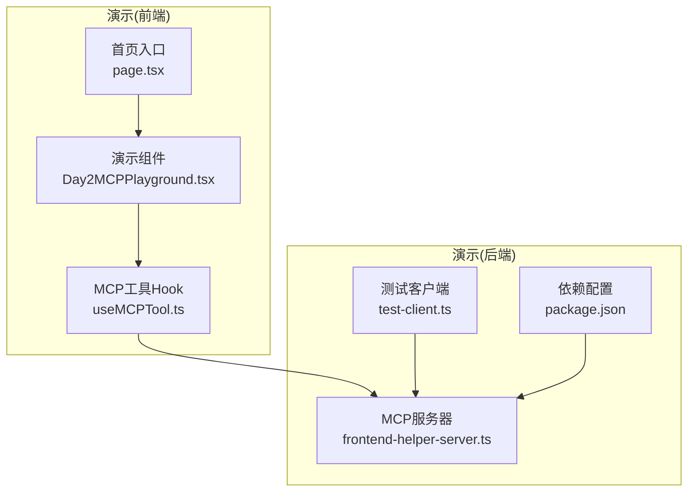
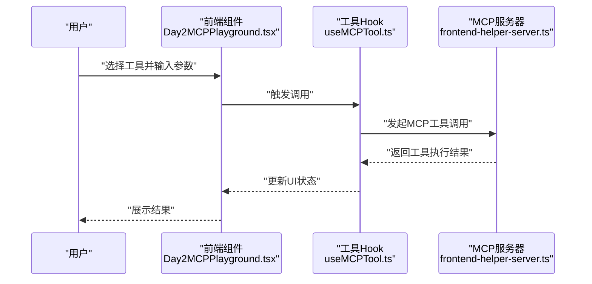
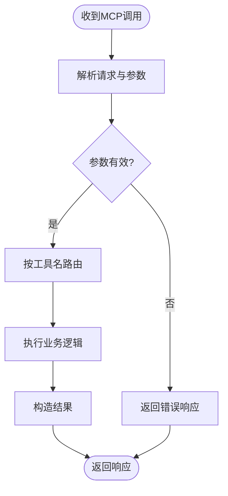
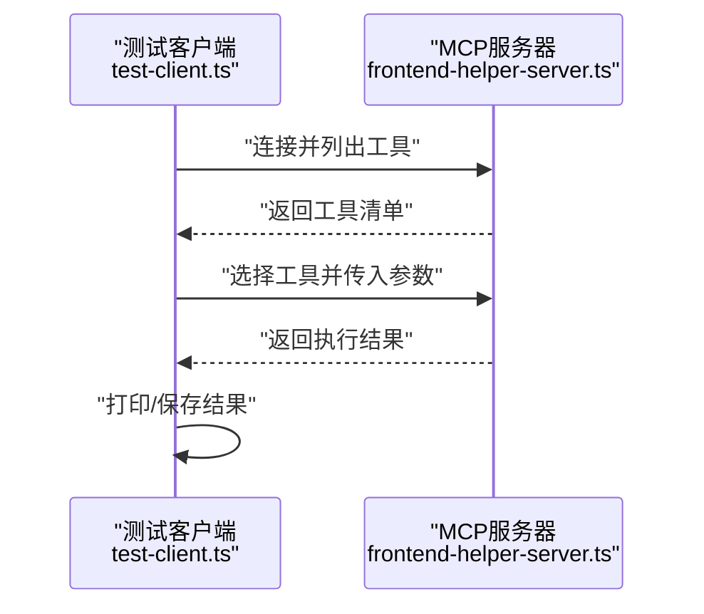
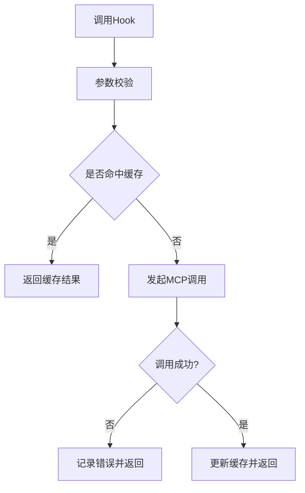
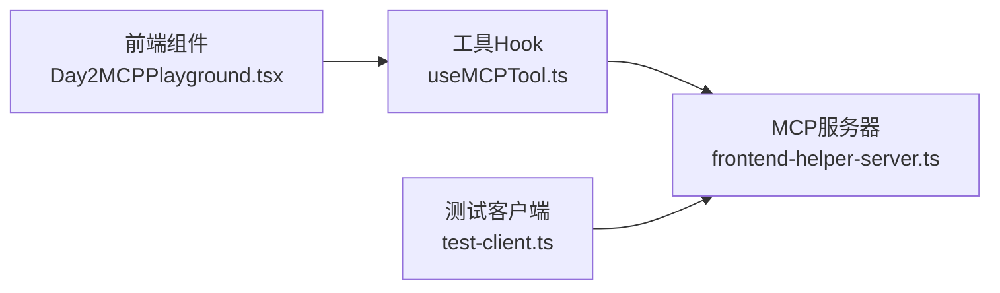

# Day2 MCP服务器演示

<cite>
**本文引用的文件**
- [demos/day2-mcp-server/frontend-helper-server.ts](file://demos/day2-mcp-server/frontend-helper-server.ts)
- [demos/day2-mcp-server/test-client.ts](file://demos/day2-mcp-server/test-client.ts)
- [demos/day2-mcp-server/package.json](file://demos/day2-mcp-server/package.json)
- [src/components/Day2MCPPlayground.tsx](file://src/components/Day2MCPPlayground.tsx)
- [src/hooks/useMCPTool.ts](file://src/hooks/useMCPTool.ts)
- [src/app/page.tsx](file://src/app/page.tsx)
- [README.md](file://README.md)
</cite>

## 目录
1. [简介](#简介)
2. [项目结构](#项目结构)
3. [核心组件](#核心组件)
4. [架构总览](#架构总览)
5. [详细组件分析](#详细组件分析)
6. [依赖关系分析](#依赖关系分析)
7. [性能考虑](#性能考虑)
8. [故障排查指南](#故障排查指南)
9. [结论](#结论)
10. [附录](#附录)

## 简介
本仓库包含一个“Day2 MCP服务器演示”，用于展示如何使用MCP（Model Context Protocol）构建并调用前端辅助服务。该演示由两部分组成：
- 服务端：基于TypeScript的MCP服务器，提供若干工具能力供客户端调用。
- 客户端：独立的测试客户端与Next.js前端集成示例，用于演示如何发现、调用和展示MCP工具结果。

整体目标是帮助读者快速理解MCP的基本用法、前后端协作方式以及在实际项目中集成MCP的思路。

## 项目结构
本项目采用分层组织：
- demos/day2-mcp-server：MCP服务器与测试客户端的实现。
- src：Next.js应用，包含演示页面、组件与Hook，用于在浏览器中体验MCP工具调用。
- content、public等：静态内容与资源。



图表来源
- [demos/day2-mcp-server/frontend-helper-server.ts](file://demos/day2-mcp-server/frontend-helper-server.ts)
- [demos/day2-mcp-server/test-client.ts](file://demos/day2-mcp-server/test-client.ts)
- [demos/day2-mcp-server/package.json](file://demos/day2-mcp-server/package.json)
- [src/app/page.tsx](file://src/app/page.tsx)
- [src/components/Day2MCPPlayground.tsx](file://src/components/Day2MCPPlayground.tsx)
- [src/hooks/useMCPTool.ts](file://src/hooks/useMCPTool.ts)

章节来源
- [README.md](file://README.md)
- [demos/day2-mcp-server/package.json](file://demos/day2-mcp-server/package.json)

## 核心组件
- MCP服务器（frontend-helper-server.ts）：实现MCP协议的服务端逻辑，暴露工具列表与具体执行逻辑，供客户端通过标准协议进行调用。
- 测试客户端（test-client.ts）：独立运行的Node脚本，演示如何连接MCP服务器、列举工具并执行调用。
- 前端演示组件（Day2MCPPlayground.tsx）：在Next.js应用中提供交互界面，用于选择并调用MCP工具，展示返回结果。
- MCP工具Hook（useMCPTool.ts）：封装对MCP工具的调用流程，统一处理参数校验、请求发送与结果渲染。
- 应用入口（page.tsx）：挂载演示组件，作为用户进入演示页面的入口。

章节来源
- [demos/day2-mcp-server/frontend-helper-server.ts](file://demos/day2-mcp-server/frontend-helper-server.ts)
- [demos/day2-mcp-server/test-client.ts](file://demos/day2-mcp-server/test-client.ts)
- [src/components/Day2MCPPlayground.tsx](file://src/components/Day2MCPPlayground.tsx)
- [src/hooks/useMCPTool.ts](file://src/hooks/useMCPTool.ts)
- [src/app/page.tsx](file://src/app/page.tsx)

## 架构总览
下图展示了从前端到MCP服务器的完整调用链路，包括工具发现与执行过程。



图表来源
- [src/components/Day2MCPPlayground.tsx](file://src/components/Day2MCPPlayground.tsx)
- [src/hooks/useMCPTool.ts](file://src/hooks/useMCPTool.ts)
- [demos/day2-mcp-server/frontend-helper-server.ts](file://demos/day2-mcp-server/frontend-helper-server.ts)

## 详细组件分析

### MCP服务器（frontend-helper-server.ts）
- 职责：实现MCP协议的服务端，注册工具、处理参数校验、执行业务逻辑并返回结构化结果。
- 关键点：
  - 工具注册：集中声明可用工具及其元数据（名称、描述、参数Schema）。
  - 参数校验：依据Schema对入参进行校验，确保安全性与一致性。
  - 业务执行：根据工具名路由到对应处理函数，完成计算或数据处理。
  - 错误处理：统一捕获异常并返回标准化错误信息。
- 复杂度：工具数量线性增长时，路由与校验逻辑保持O(n)；单次调用时间取决于具体工具实现。



图表来源
- [demos/day2-mcp-server/frontend-helper-server.ts](file://demos/day2-mcp-server/frontend-helper-server.ts)

章节来源
- [demos/day2-mcp-server/frontend-helper-server.ts](file://demos/day2-mcp-server/frontend-helper-server.ts)

### 测试客户端（test-client.ts）
- 职责：独立脚本，演示如何连接MCP服务器、列举工具并执行调用，便于本地验证与服务端调试。
- 关键点：
  - 连接管理：建立与MCP服务器的通信通道。
  - 工具枚举：获取可用工具列表，打印或保存以便后续调用。
  - 调用执行：按工具名与参数发起调用，输出结果与错误信息。
  - 退出清理：确保连接关闭与资源释放。



图表来源
- [demos/day2-mcp-server/test-client.ts](file://demos/day2-mcp-server/test-client.ts)
- [demos/day2-mcp-server/frontend-helper-server.ts](file://demos/day2-mcp-server/frontend-helper-server.ts)

章节来源
- [demos/day2-mcp-server/test-client.ts](file://demos/day2-mcp-server/test-client.ts)

### 前端演示组件（Day2MCPPlayground.tsx）
- 职责：提供可视化界面，让用户选择工具、填写参数并查看结果。
- 关键点：
  - 工具展示：动态渲染可用工具及说明。
  - 表单控制：参数输入、校验与提交。
  - 状态管理：维护加载、成功、失败等状态。
  - 结果展示：格式化输出工具返回的数据。

```mermaid
classDiagram
class Day2MCPPlayground {
+render()
+onSubmit(params)
+handleError(err)
-state : {tools, selected, params, result, status}
}
```

图表来源
- [src/components/Day2MCPPlayground.tsx](file://src/components/Day2MCPPlayground.tsx)

章节来源
- [src/components/Day2MCPPlayground.tsx](file://src/components/Day2MCPPlayground.tsx)

### MCP工具Hook（useMCPTool.ts）
- 职责：封装对MCP工具的调用流程，向上层组件提供简洁的API。
- 关键点：
  - 调用封装：统一处理请求发送、重试与超时。
  - 错误处理：将网络与协议错误转换为可展示的提示。
  - 缓存策略：可选地对相同参数调用结果进行短期缓存。
  - 类型安全：为参数与返回值提供类型约束。



图表来源
- [src/hooks/useMCPTool.ts](file://src/hooks/useMCPTool.ts)

章节来源
- [src/hooks/useMCPTool.ts](file://src/hooks/useMCPTool.ts)

### 应用入口（page.tsx）
- 职责：挂载演示组件，作为用户访问的入口页。
- 关键点：
  - 布局与样式：提供基础布局与主题。
  - 组件装配：引入并渲染演示组件。
  - 路由上下文：确保在正确的路由下提供服务端配置（如MCP地址）。

章节来源
- [src/app/page.tsx](file://src/app/page.tsx)

## 依赖关系分析
- 运行时依赖：
  - MCP服务器依赖MCP协议库与Node运行时环境。
  - 前端依赖React/Next.js生态与浏览器环境。
- 模块耦合：
  - 前端通过Hook与服务器解耦，仅依赖协议契约。
  - 测试客户端直接依赖服务器接口，便于独立验证。
- 外部集成点：
  - 服务器可能对接文件系统、数据库或其他内部服务（由具体工具实现决定）。
  - 前端可通过环境变量配置MCP服务器地址。



图表来源
- [src/components/Day2MCPPlayground.tsx](file://src/components/Day2MCPPlayground.tsx)
- [src/hooks/useMCPTool.ts](file://src/hooks/useMCPTool.ts)
- [demos/day2-mcp-server/frontend-helper-server.ts](file://demos/day2-mcp-server/frontend-helper-server.ts)
- [demos/day2-mcp-server/test-client.ts](file://demos/day2-mcp-server/test-client.ts)

章节来源
- [demos/day2-mcp-server/package.json](file://demos/day2-mcp-server/package.json)

## 性能考虑
- 服务器端：
  - 工具执行应尽量无阻塞，必要时使用异步与并发控制。
  - 对重复参数调用启用缓存，减少重复计算。
  - 合理设置超时与限流，防止恶意或异常请求拖垮服务。
- 前端端：
  - 避免频繁重发请求，增加防抖与节流。
  - 对大结果集进行分页或懒加载。
  - 错误边界与降级策略，保证用户体验。

[本节为通用指导，不直接分析具体文件]

## 故障排查指南
- 常见问题：
  - 无法连接MCP服务器：检查网络、端口与CORS配置。
  - 工具未列出：确认服务器已正确注册工具且协议版本兼容。
  - 参数校验失败：核对前端表单字段与服务器Schema定义。
  - 调用超时：检查服务器负载与网络延迟，适当调整超时阈值。
- 定位方法：
  - 使用测试客户端复现问题，观察服务端日志。
  - 在前端控制台查看网络请求与错误堆栈。
  - 逐步缩小范围：先验证工具枚举，再验证具体调用。

章节来源
- [demos/day2-mcp-server/test-client.ts](file://demos/day2-mcp-server/test-client.ts)
- [src/hooks/useMCPTool.ts](file://src/hooks/useMCPTool.ts)

## 结论
本演示通过MCP协议实现了前后端解耦的工具调用模式。服务器端聚焦于工具实现与协议处理，前端通过Hook统一封装调用细节，测试客户端则提供了便捷的本地验证手段。按照此模式，可以逐步扩展更多工具，并在实际项目中以一致的方式集成与治理。

[本节为总结性内容，不直接分析具体文件]

## 附录
- 运行建议：
  - 启动MCP服务器后，再运行测试客户端进行验证。
  - 在Next.js环境中配置MCP服务器地址，确保前端能正确访问。
- 扩展方向：
  - 增加更多工具类型（如数据分析、文件操作、搜索等）。
  - 引入鉴权与审计，提升安全性与可观测性。
  - 完善错误码体系与监控告警。

[本节为补充信息，不直接分析具体文件]