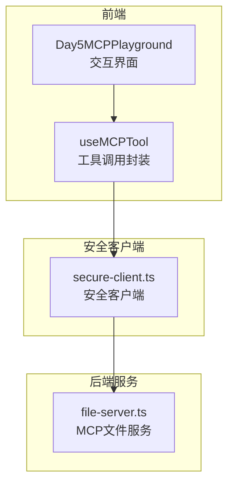
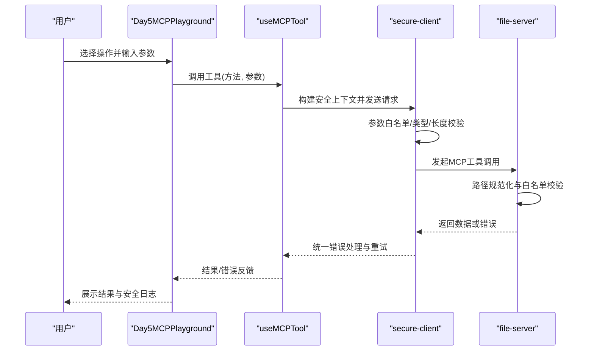
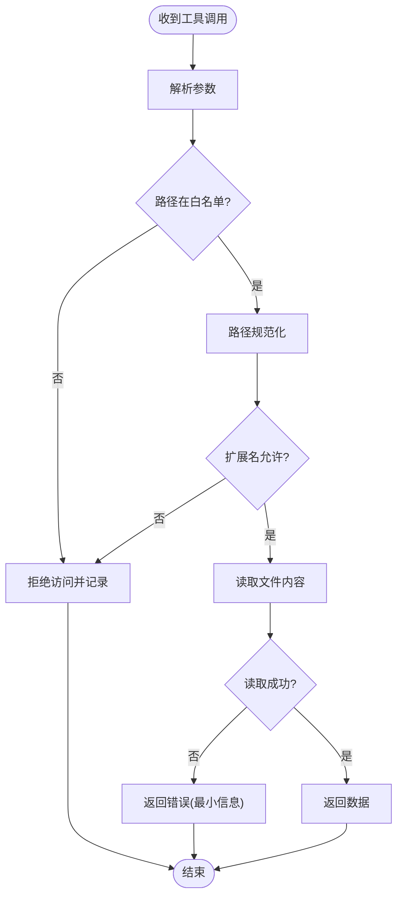
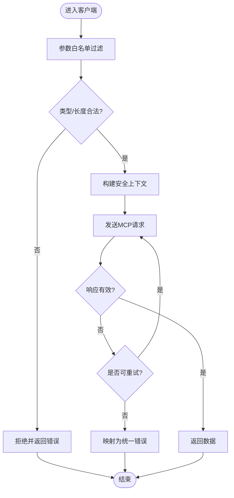
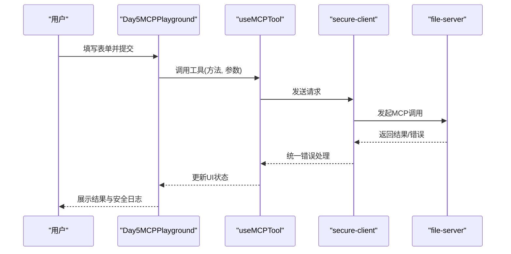
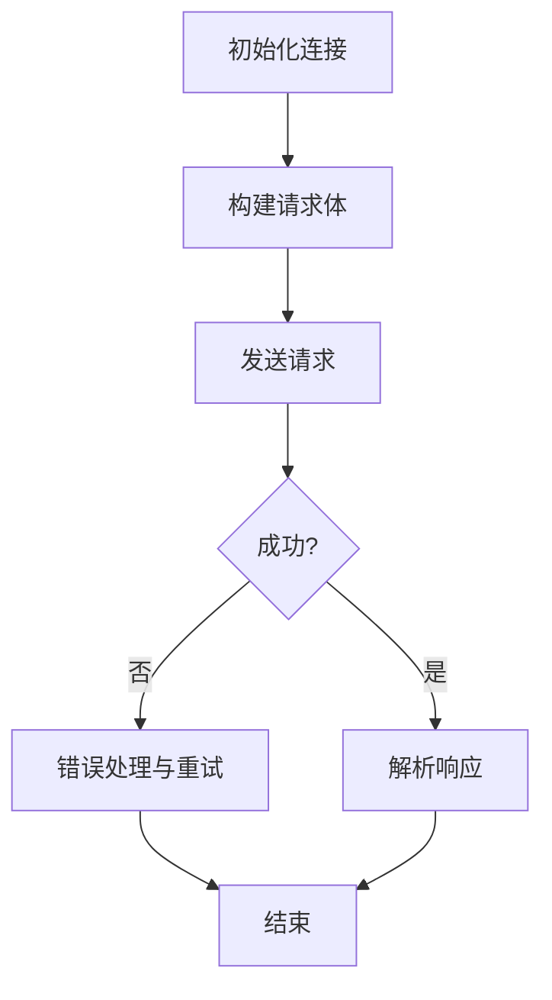
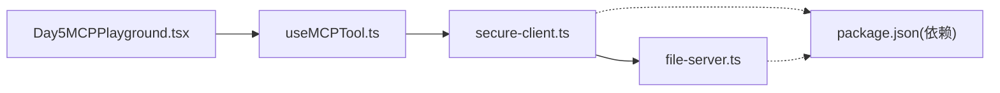

# Day5 MCP安全模型演示

<cite>
**本文引用的文件**
- [demos/day5-security/file-server.ts](file://demos/day5-security/file-server.ts)
- [demos/day5-security/secure-client.ts](file://demos/day5-security/secure-client.ts)
- [demos/day5-security/package.json](file://demos/day5-security/package.json)
- [src/components/Day5MCPPlayground.tsx](file://src/components/Day5MCPPlayground.tsx)
- [src/hooks/useMCPTool.ts](file://src/hooks/useMCPTool.ts)
- [README.md](file://README.md)
</cite>

## 目录
1. [简介](#简介)
2. [项目结构](#项目结构)
3. [核心组件](#核心组件)
4. [架构总览](#架构总览)
5. [详细组件分析](#详细组件分析)
6. [依赖关系分析](#依赖关系分析)
7. [性能考虑](#性能考虑)
8. [故障排查指南](#故障排查指南)
9. [结论](#结论)
10. [附录](#附录)

## 简介
本演示聚焦于“Day5：MCP安全模型”，通过一个受控的文件服务器与一个安全客户端，展示如何在MCP（Model Context Protocol）场景下实现最小权限、白名单校验、输入验证与错误隔离等关键安全能力。前端集成部分提供交互式界面，便于观察工具调用过程与安全策略生效情况。

## 项目结构
围绕Day5的演示主要包含以下部分：
- 服务端：提供受限的文件访问能力，并内置路径白名单与权限控制
- 客户端：发起工具调用前进行参数校验与上下文注入，确保仅允许的操作被执行
- 前端集成：在Next.js应用中嵌入Day5 Playground，用于可视化演示与交互

图表来源
- [src/components/Day5MCPPlayground.tsx:1-200](file://src/components/Day5MCPPlayground.tsx#L1-L200)
- [src/hooks/useMCPTool.ts:1-200](file://src/hooks/useMCPTool.ts#L1-L200)
- [demos/day5-security/secure-client.ts:1-200](file://demos/day5-security/secure-client.ts#L1-L200)
- [demos/day5-security/file-server.ts:1-200](file://demos/day5-security/file-server.ts#L1-L200)

章节来源
- [README.md:1-200](file://README.md#L1-L200)

## 核心组件
- 文件服务器（file-server.ts）
  - 职责：暴露MCP文件相关工具，限制可访问目录，执行路径白名单校验，返回结构化结果或错误
  - 关键点：只读访问、路径规范化、扩展名过滤、错误分类与最小信息泄露
- 安全客户端（secure-client.ts）
  - 职责：在调用前对参数进行白名单校验、类型检查、长度限制；构造安全的请求上下文；统一错误处理
  - 关键点：最小权限原则、输入净化、重试与超时控制
- 前端Playground（Day5MCPPlayground.tsx）
  - 职责：渲染操作表单、展示调用历史与安全日志、触发工具调用
  - 关键点：用户输入到安全客户端的参数映射、错误提示与状态管理
- 工具钩子（useMCPTool.ts）
  - 职责：封装MCP工具调用的通用逻辑（连接、序列化、重试、错误归一化）
  - 关键点：跨组件复用、错误边界、可观测性埋点

章节来源
- [demos/day5-security/file-server.ts:1-200](file://demos/day5-security/file-server.ts#L1-L200)
- [demos/day5-security/secure-client.ts:1-200](file://demos/day5-security/secure-client.ts#L1-L200)
- [src/components/Day5MCPPlayground.tsx:1-200](file://src/components/Day5MCPPlayground.tsx#L1-L200)
- [src/hooks/useMCPTool.ts:1-200](file://src/hooks/useMCPTool.ts#L1-L200)

## 架构总览
下图展示了从前端到后端的完整调用链路，以及安全策略在各层的作用点。

图表来源
- [src/components/Day5MCPPlayground.tsx:1-200](file://src/components/Day5MCPPlayground.tsx#L1-L200)
- [src/hooks/useMCPTool.ts:1-200](file://src/hooks/useMCPTool.ts#L1-L200)
- [demos/day5-security/secure-client.ts:1-200](file://demos/day5-security/secure-client.ts#L1-L200)
- [demos/day5-security/file-server.ts:1-200](file://demos/day5-security/file-server.ts#L1-L200)

## 详细组件分析

### 文件服务器（file-server.ts）
- 设计要点
  - 只读模式：禁止写入与删除，降低破坏性风险
  - 路径白名单：仅允许访问预定义的安全目录
  - 路径规范化：防止路径穿越与符号链接滥用
  - 扩展名过滤：仅允许读取特定类型的文件
  - 错误分类：区分未授权、不存在、系统错误等，避免敏感信息泄露
- 典型流程
  - 接收工具调用 -> 解析参数 -> 校验路径与权限 -> 读取内容 -> 返回结果或错误

图表来源
- [demos/day5-security/file-server.ts:1-200](file://demos/day5-security/file-server.ts#L1-L200)

章节来源
- [demos/day5-security/file-server.ts:1-200](file://demos/day5-security/file-server.ts#L1-L200)

### 安全客户端（secure-client.ts）
- 设计要点
  - 参数白名单：仅允许已声明字段，丢弃未知字段
  - 类型与长度校验：防止过大负载与非法类型
  - 上下文注入：附加会话/租户/审计ID，便于追踪
  - 重试与超时：提升鲁棒性，避免长时间阻塞
  - 错误归一化：将底层异常转换为统一结构
- 典型流程
  - 接收调用 -> 参数校验 -> 构造安全上下文 -> 发送请求 -> 处理响应/错误

图表来源
- [demos/day5-security/secure-client.ts:1-200](file://demos/day5-security/secure-client.ts#L1-L200)

章节来源
- [demos/day5-security/secure-client.ts:1-200](file://demos/day5-security/secure-client.ts#L1-L200)

### 前端Playground（Day5MCPPlayground.tsx）
- 设计要点
  - 表单驱动：将用户输入映射为安全客户端所需参数
  - 状态管理：维护调用历史、错误消息与加载状态
  - 安全日志：展示白名单校验、错误分类等关键事件
- 交互流程
  - 用户输入 -> 参数映射 -> 调用useMCPTool -> 显示结果/错误

图表来源
- [src/components/Day5MCPPlayground.tsx:1-200](file://src/components/Day5MCPPlayground.tsx#L1-L200)
- [src/hooks/useMCPTool.ts:1-200](file://src/hooks/useMCPTool.ts#L1-L200)
- [demos/day5-security/secure-client.ts:1-200](file://demos/day5-security/secure-client.ts#L1-L200)
- [demos/day5-security/file-server.ts:1-200](file://demos/day5-security/file-server.ts#L1-L200)

章节来源
- [src/components/Day5MCPPlayground.tsx:1-200](file://src/components/Day5MCPPlayground.tsx#L1-L200)

### 工具钩子（useMCPTool.ts）
- 设计要点
  - 统一封装：连接管理、序列化、重试、错误归一化
  - 可观测性：埋点记录调用耗时、失败原因
  - 可配置：支持超时、重试次数、最大负载等策略
- 典型流程
  - 初始化 -> 构建请求 -> 发送 -> 处理响应/错误 -> 清理资源

图表来源
- [src/hooks/useMCPTool.ts:1-200](file://src/hooks/useMCPTool.ts#L1-L200)

章节来源
- [src/hooks/useMCPTool.ts:1-200](file://src/hooks/useMCPTool.ts#L1-L200)

## 依赖关系分析
- 模块耦合
  - Playground依赖useMCPTool进行工具调用
  - useMCPTool依赖secure-client进行安全通信
  - secure-client依赖file-server提供的MCP接口
- 外部依赖
  - 包管理器与运行时由package.json声明
  - 网络库与序列化库由客户端与服务端各自引入

图表来源
- [src/components/Day5MCPPlayground.tsx:1-200](file://src/components/Day5MCPPlayground.tsx#L1-L200)
- [src/hooks/useMCPTool.ts:1-200](file://src/hooks/useMCPTool.ts#L1-L200)
- [demos/day5-security/secure-client.ts:1-200](file://demos/day5-security/secure-client.ts#L1-L200)
- [demos/day5-security/file-server.ts:1-200](file://demos/day5-security/file-server.ts#L1-L200)
- [demos/day5-security/package.json:1-200](file://demos/day5-security/package.json#L1-L200)

章节来源
- [demos/day5-security/package.json:1-200](file://demos/day5-security/package.json#L1-L200)

## 性能考虑
- 客户端侧
  - 合理设置超时与重试次数，避免雪崩
  - 批量与去重：合并重复请求，减少无效往返
  - 缓存策略：对只读且稳定的数据做短期缓存
- 服务端侧
  - 路径白名单与扩展名过滤尽早短路，减少IO
  - 流式读取大文件，限制并发与内存占用
  - 错误快速失败，避免长尾请求拖垮服务

## 故障排查指南
- 常见问题
  - 参数未通过白名单：检查客户端参数映射与字段命名
  - 路径被拒绝：确认目标路径在服务端白名单内
  - 扩展名不允许：调整允许的扩展名列表
  - 超时或重试过多：调整客户端超时与重试策略
- 定位步骤
  - 查看前端安全日志，确认参数校验阶段
  - 检查客户端错误映射，定位底层异常类型
  - 在服务端日志中搜索对应请求的审计ID，追踪处理链路

章节来源
- [demos/day5-security/secure-client.ts:1-200](file://demos/day5-security/secure-client.ts#L1-L200)
- [demos/day5-security/file-server.ts:1-200](file://demos/day5-security/file-server.ts#L1-L200)
- [src/components/Day5MCPPlayground.tsx:1-200](file://src/components/Day5MCPPlayground.tsx#L1-L200)

## 结论
本演示通过“最小权限+白名单+输入校验”的组合策略，在MCP场景中实现了可控的文件访问能力。前端Playground提供了直观的交互与可观测性，便于理解安全策略如何贯穿整个调用链路。建议在真实环境中进一步结合审计、速率限制与动态策略，以增强整体安全性与可运维性。

## 附录
- 运行与测试
  - 安装依赖：参考[demos/day5-security/package.json:1-200](file://demos/day5-security/package.json#L1-L200)中的脚本
  - 启动服务：先启动file-server，再运行secure-client进行测试
  - 前端集成：在Next.js项目中启用Day5MCPPlayground进行交互演示
- 扩展建议
  - 增加多租户隔离与动态白名单
  - 引入更细粒度的权限模型（如按目录/文件级）
  - 加强审计与告警，完善错误分类与上报