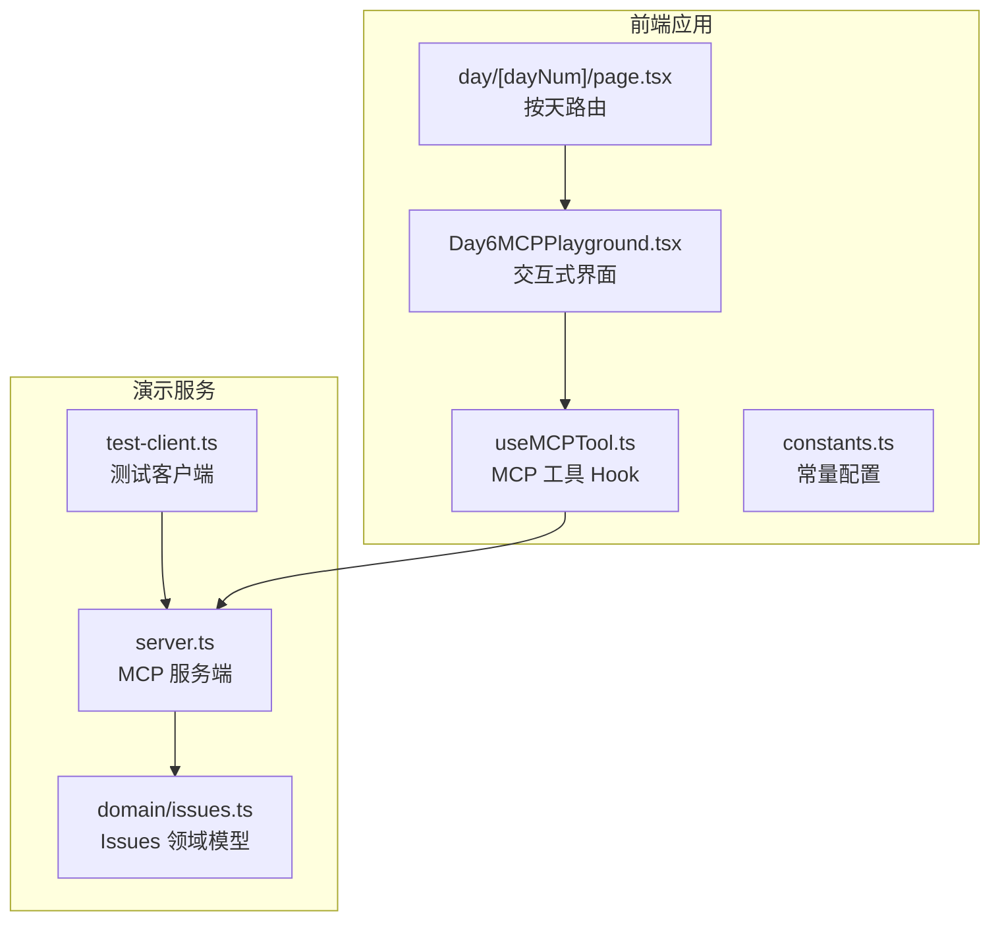
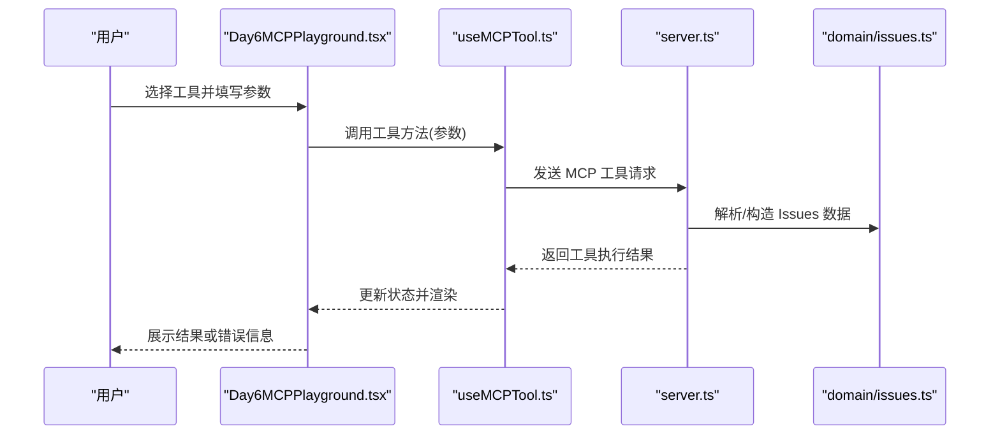
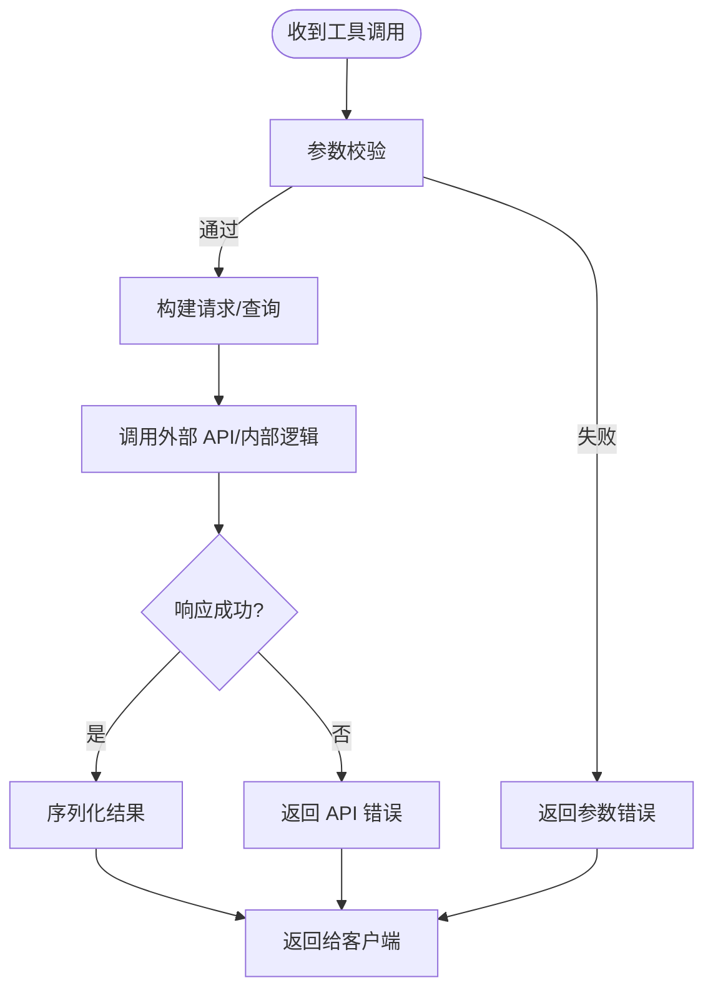
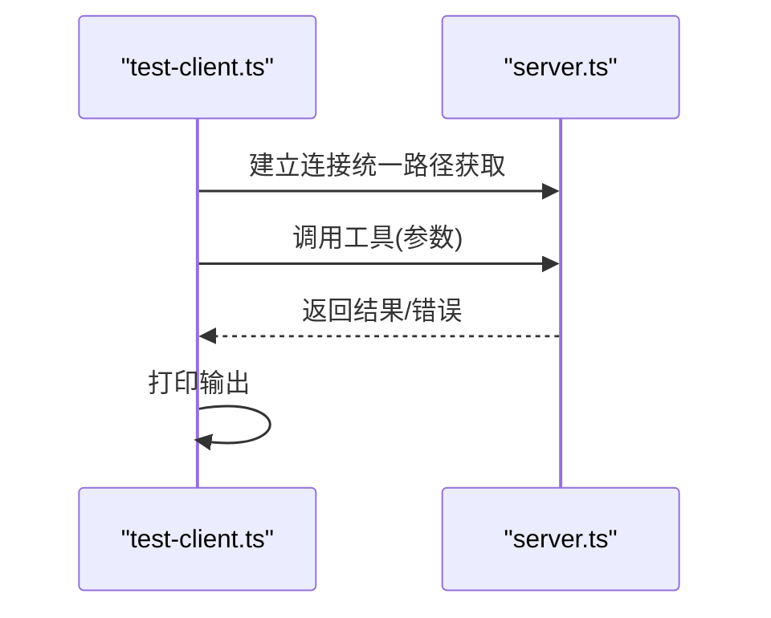
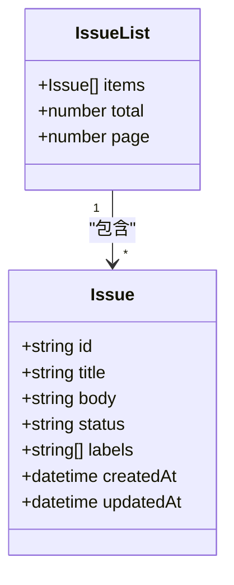
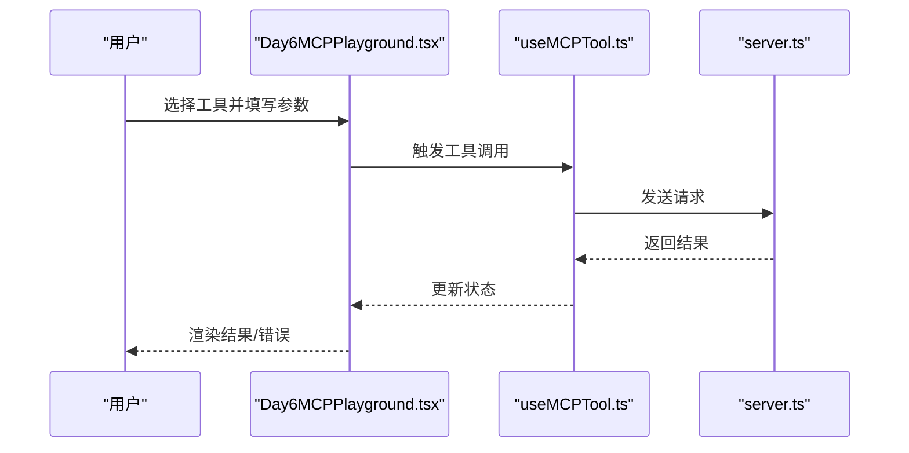
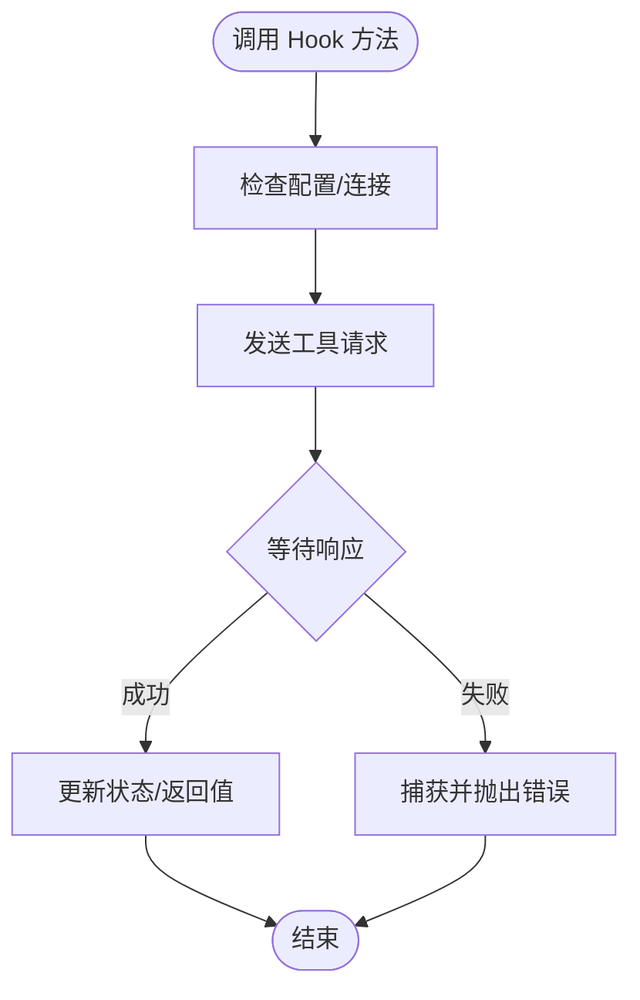
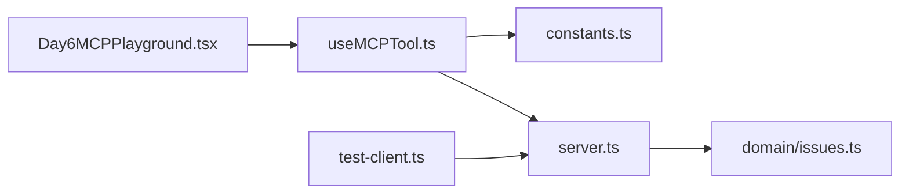

# Day6 GitHub MCP 演示

<cite>
**本文引用的文件**
- [README.md](file://README.md)
- [package.json](file://package.json)
- [demos/day6-github-mcp/server.ts](file://demos/day6-github-mcp/server.ts)
- [demos/day6-github-mcp/test-client.ts](file://demos/day6-github-mcp/test-client.ts)
- [demos/day6-github-mcp/domain/issues.ts](file://demos/day6-github-mcp/domain/issues.ts)
- [src/components/Day6MCPPlayground.tsx](file://src/components/Day6MCPPlayground.tsx)
- [src/hooks/useMCPTool.ts](file://src/hooks/useMCPTool.ts)
- [src/lib/constants.ts](file://src/lib/constants.ts)
- [src/app/day/[dayNum]/page.tsx](file://src/app/day/[dayNum]/page.tsx)
</cite>

## 更新摘要
**变更内容**
- 更新了测试客户端创建流程，实现了统一的服务端路径获取
- 增强了传输层创建的注释说明
- 改进了客户端创建步骤的文档说明
- 澄清了客户端与服务端之间的连接过程

## 目录
1. [简介](#简介)
2. [项目结构](#项目结构)
3. [核心组件](#核心组件)
4. [架构总览](#架构总览)
5. [详细组件分析](#详细组件分析)
6. [依赖关系分析](#依赖关系分析)
7. [性能考虑](#性能考虑)
8. [故障排查指南](#故障排查指南)
9. [结论](#结论)
10. [附录](#附录)

## 简介
本仓库是一个以"每日主题"形式组织的学习与演示集合，其中 Day6 聚焦于使用 MCP（Model Context Protocol）对接 GitHub，提供 Issues 相关的工具能力。该演示包含：
- 一个 MCP 服务端，暴露与 GitHub Issues 交互的工具；
- 一个测试客户端，用于调用这些工具；
- 前端可交互的 Playground，便于在浏览器中体验 MCP 工具；
- 统一的 Next.js 应用入口，按天展示不同演示。

## 项目结构
本项目采用分层组织方式：
- demos：各日期的独立演示，Day6 位于 demos/day6-github-mcp，内含服务端、测试客户端与领域模型；
- src：Next.js 前端应用，包含页面、组件、hooks 与常量配置；
- content：学习内容与笔记；
- 根级配置文件：包管理、构建与 ESLint 等。

图表来源
- [demos/day6-github-mcp/server.ts](file://demos/day6-github-mcp/server.ts)
- [demos/day6-github-mcp/test-client.ts](file://demos/day6-github-mcp/test-client.ts)
- [demos/day6-github-mcp/domain/issues.ts](file://demos/day6-github-mcp/domain/issues.ts)
- [src/components/Day6MCPPlayground.tsx](file://src/components/Day6MCPPlayground.tsx)
- [src/hooks/useMCPTool.ts](file://src/hooks/useMCPTool.ts)
- [src/lib/constants.ts](file://src/lib/constants.ts)
- [src/app/day/[dayNum]/page.tsx](file://src/app/day/[dayNum]/page.tsx)

章节来源
- [README.md](file://README.md)
- [package.json](file://package.json)

## 核心组件
- MCP 服务端（server.ts）：注册并实现与 GitHub Issues 相关的工具，处理请求、参数校验、调用外部 API、返回结果与错误。
- 测试客户端（test-client.ts）：作为 MCP 客户端示例，连接服务端并调用工具，打印结果以便验证。
- 领域模型（domain/issues.ts）：定义 Issues 相关的数据结构与类型约束，确保前后端数据一致性。
- 前端 Playground（Day6MCPPlayground.tsx）：提供可视化界面，让用户选择工具、输入参数并查看结果。
- MCP 工具 Hook（useMCPTool.ts）：封装与 MCP 服务端的通信逻辑，供组件复用。
- 常量配置（constants.ts）：集中管理环境变量、API 地址、默认值等。
- 按天路由（day/[dayNum]/page.tsx）：根据 dayNum 动态加载对应演示页面。

章节来源
- [demos/day6-github-mcp/server.ts](file://demos/day6-github-mcp/server.ts)
- [demos/day6-github-mcp/test-client.ts](file://demos/day6-github-mcp/test-client.ts)
- [demos/day6-github-mcp/domain/issues.ts](file://demos/day6-github-mcp/domain/issues.ts)
- [src/components/Day6MCPPlayground.tsx](file://src/components/Day6MCPPlayground.tsx)
- [src/hooks/useMCPTool.ts](file://src/hooks/useMCPTool.ts)
- [src/lib/constants.ts](file://src/lib/constants.ts)
- [src/app/day/[dayNum]/page.tsx](file://src/app/day/[dayNum]/page.tsx)

## 架构总览
整体架构遵循"前端 UI -> Hook 通信 -> MCP 服务端 -> 领域模型/外部 API"的分层模式。前端通过 Hook 发起工具调用，服务端负责业务编排与外部集成，领域模型保证数据结构一致。

图表来源
- [src/components/Day6MCPPlayground.tsx](file://src/components/Day6MCPPlayground.tsx)
- [src/hooks/useMCPTool.ts](file://src/hooks/useMCPTool.ts)
- [demos/day6-github-mcp/server.ts](file://demos/day6-github-mcp/server.ts)
- [demos/day6-github-mcp/domain/issues.ts](file://demos/day6-github-mcp/domain/issues.ts)

## 详细组件分析

### MCP 服务端（server.ts）
职责与流程：
- 初始化 MCP 服务，注册工具列表与处理器；
- 接收来自客户端的工具调用请求；
- 对入参进行校验与转换；
- 调用 GitHub 相关接口或内部逻辑；
- 将结果序列化后返回给客户端；
- 统一错误处理与日志记录。

图表来源
- [demos/day6-github-mcp/server.ts](file://demos/day6-github-mcp/server.ts)

章节来源
- [demos/day6-github-mcp/server.ts](file://demos/day6-github-mcp/server.ts)

### 测试客户端（test-client.ts）
职责与流程：
- 连接 MCP 服务端；
- 选择并调用具体工具；
- 打印输出结果或错误；
- 用于本地快速验证工具行为。

**更新** 优化了客户端创建流程，实现了统一的服务端路径获取机制，增强了传输层创建的注释说明，改进了客户端创建步骤的文档说明，并澄清了客户端与服务端之间的连接过程。

图表来源
- [demos/day6-github-mcp/test-client.ts](file://demos/day6-github-mcp/test-client.ts)
- [demos/day6-github-mcp/server.ts](file://demos/day6-github-mcp/server.ts)

章节来源
- [demos/day6-github-mcp/test-client.ts](file://demos/day6-github-mcp/test-client.ts)

### 领域模型（domain/issues.ts）
职责与内容：
- 定义 Issues 相关的数据结构（如标题、描述、状态、标签等）；
- 提供类型约束与可选字段说明；
- 为服务端与前端提供一致的数据契约。

图表来源
- [demos/day6-github-mcp/domain/issues.ts](file://demos/day6-github-mcp/domain/issues.ts)

章节来源
- [demos/day6-github-mcp/domain/issues.ts](file://demos/day6-github-mcp/domain/issues.ts)

### 前端 Playground（Day6MCPPlayground.tsx）
职责与交互：
- 提供工具选择器与参数表单；
- 调用 useMCPTool 执行工具；
- 展示结果、加载状态与错误提示；
- 支持清空、重试等操作。

图表来源
- [src/components/Day6MCPPlayground.tsx](file://src/components/Day6MCPPlayground.tsx)
- [src/hooks/useMCPTool.ts](file://src/hooks/useMCPTool.ts)
- [demos/day6-github-mcp/server.ts](file://demos/day6-github-mcp/server.ts)

章节来源
- [src/components/Day6MCPPlayground.tsx](file://src/components/Day6MCPPlayground.tsx)

### MCP 工具 Hook（useMCPTool.ts）
职责与特性：
- 封装与 MCP 服务端的通信细节；
- 提供统一的调用接口与错误处理；
- 管理加载状态与缓存策略（如有）。

图表来源
- [src/hooks/useMCPTool.ts](file://src/hooks/useMCPTool.ts)

章节来源
- [src/hooks/useMCPTool.ts](file://src/hooks/useMCPTool.ts)

### 常量配置（constants.ts）
职责与内容：
- 集中管理 MCP 服务端地址、超时时间、默认分页大小等；
- 便于环境切换与统一维护。

章节来源
- [src/lib/constants.ts](file://src/lib/constants.ts)

### 按天路由（day/[dayNum]/page.tsx）
职责与内容：
- 根据 dayNum 动态加载对应演示页面；
- 与 Day6MCPPlayground 组合，形成完整体验。

章节来源
- [src/app/day/[dayNum]/page.tsx](file://src/app/day/[dayNum]/page.tsx)

## 依赖关系分析
- 前端依赖 Hook 与常量，Hook 依赖 MCP 服务端；
- 服务端依赖领域模型与外部 GitHub API；
- 测试客户端直接依赖服务端，用于验证。

图表来源
- [src/components/Day6MCPPlayground.tsx](file://src/components/Day6MCPPlayground.tsx)
- [src/hooks/useMCPTool.ts](file://src/hooks/useMCPTool.ts)
- [src/lib/constants.ts](file://src/lib/constants.ts)
- [demos/day6-github-mcp/server.ts](file://demos/day6-github-mcp/server.ts)
- [demos/day6-github-mcp/domain/issues.ts](file://demos/day6-github-mcp/domain/issues.ts)
- [demos/day6-github-mcp/test-client.ts](file://demos/day6-github-mcp/test-client.ts)

章节来源
- [package.json](file://package.json)

## 性能考虑
- 网络请求优化：合理设置超时与重试策略，避免频繁重复请求；
- 前端状态管理：减少不必要的重渲染，必要时引入缓存；
- 服务端处理：对复杂查询进行分页与过滤，降低负载；
- 错误快速失败：尽早校验参数，减少无效调用。

[本节为通用指导，不直接分析具体文件]

## 故障排查指南
常见问题与定位思路：
- 连接失败：检查 MCP 服务端是否启动、端口与地址是否正确；
- 参数错误：核对前端表单与服务端参数校验规则；
- 外部 API 异常：查看服务端日志与错误码，确认权限与配额；
- 前端无响应：检查 Hook 的错误处理与状态更新路径。

章节来源
- [demos/day6-github-mcp/server.ts](file://demos/day6-github-mcp/server.ts)
- [src/hooks/useMCPTool.ts](file://src/hooks/useMCPTool.ts)
- [src/components/Day6MCPPlayground.tsx](file://src/components/Day6MCPPlayground.tsx)

## 结论
Day6 演示通过 MCP 将 GitHub Issues 能力以工具化方式暴露给前端与测试客户端，实现了清晰的分层与良好的可扩展性。测试客户端的优化进一步提升了连接稳定性和代码可读性。建议后续完善错误分类、增加单元测试与覆盖率，并补充更丰富的工具与交互体验。

[本节为总结，不直接分析具体文件]

## 附录
- 运行与调试：参考各演示子目录的 package.json 脚本；
- 环境变量：在常量配置中统一管理；
- 扩展方向：新增工具时，在服务端注册并在前端 Playground 中暴露。

[本节为补充说明，不直接分析具体文件]