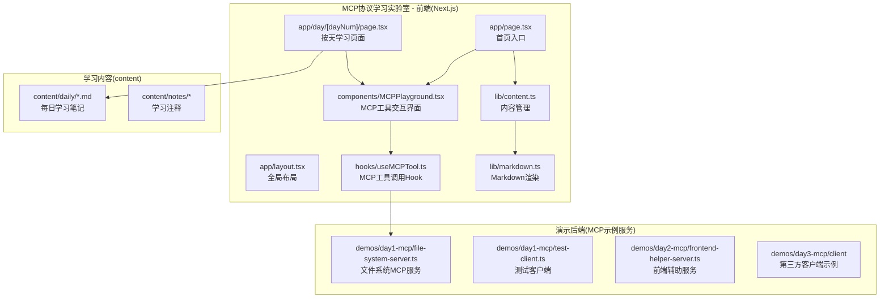
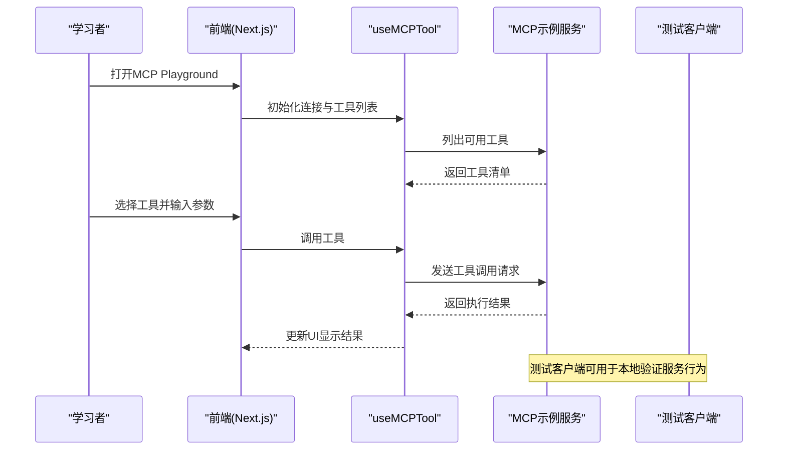
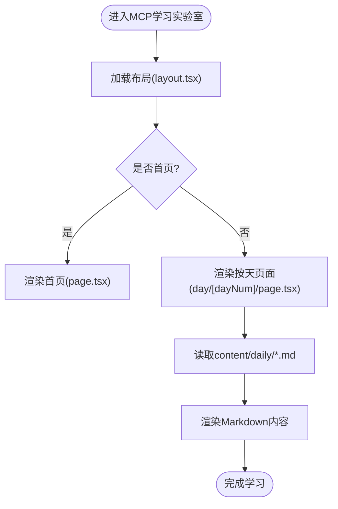
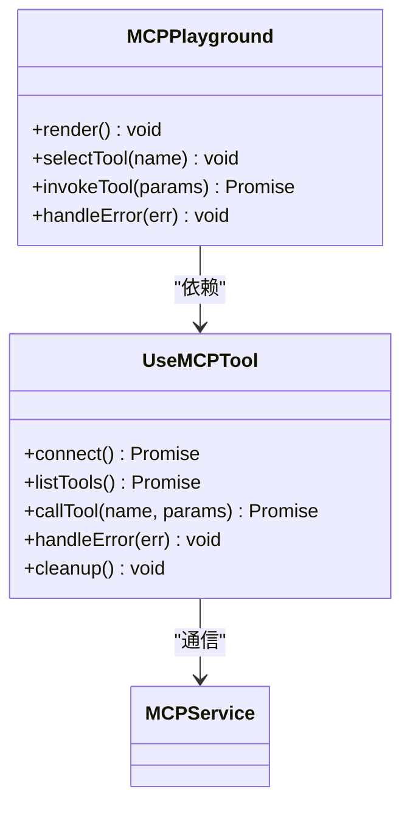
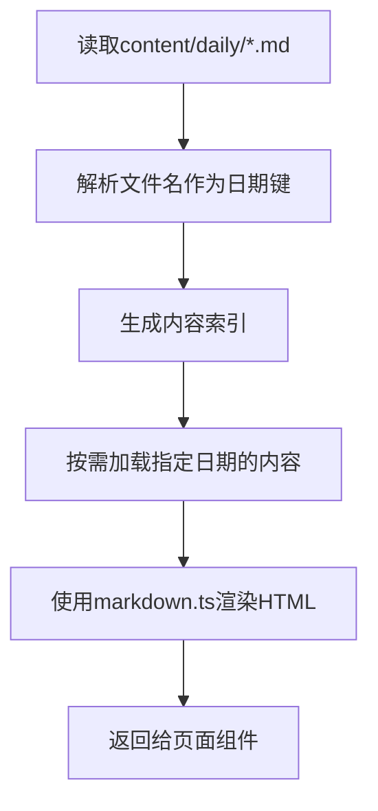
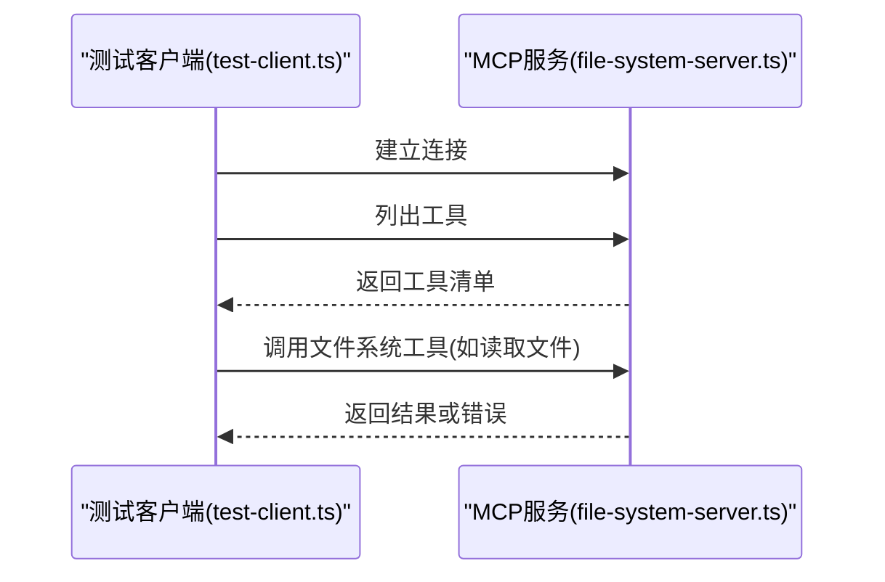
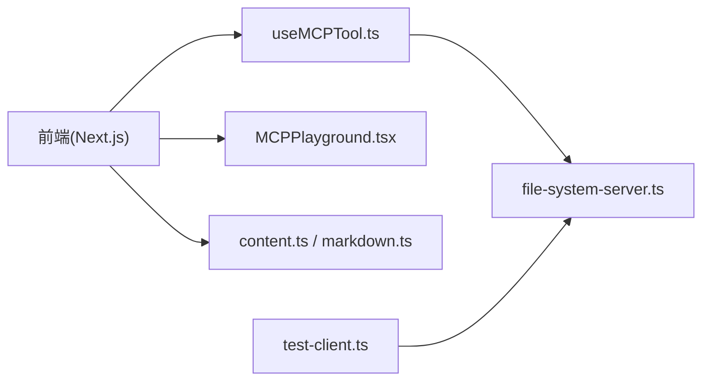

# 项目概览

<cite>
**本文引用的文件**
- [README.md](file://README.md)
- [package.json](file://package.json)
- [next.config.ts](file://next.config.ts)
- [tsconfig.json](file://tsconfig.json)
- [src/app/layout.tsx](file://src/app/layout.tsx)
- [src/app/page.tsx](file://src/app/page.tsx)
- [src/app/day/[dayNum]/page.tsx](file://src/app/day/[dayNum]/page.tsx)
- [src/app/modules/page.tsx](file://src/app/modules/page.tsx)
- [src/components/MCPPlayground.tsx](file://src/components/MCPPlayground.tsx)
- [src/components/DayCard.tsx](file://src/components/DayCard.tsx)
- [src/components/DayDemo.tsx](file://src/components/DayDemo.tsx)
- [src/components/ProgressCalendar.tsx](file://src/components/ProgressCalendar.tsx)
- [src/components/SkillMatrix.tsx](file://src/components/SkillMatrix.tsx)
- [src/hooks/useMCPTool.ts](file://src/hooks/useMCPTool.ts)
- [src/lib/constants.ts](file://src/lib/constants.ts)
- [src/lib/content.ts](file://src/lib/content.ts)
- [src/lib/markdown.ts](file://src/lib/markdown.ts)
- [demos/day1-mcp/file-system-server.ts](file://demos/day1-mcp/file-system-server.ts)
- [demos/day1-mcp/test-client.ts](file://demos/day1-mcp/test-client.ts)
- [demos/day1-mcp/package.json](file://demos/day1-mcp/package.json)
</cite>

## 更新摘要
**所做更改**
- 更新了项目定位描述，从"AI前端每日学习计划仓库"重新定位为"MCP协议学习实验室"
- 强化了MCP协议学习的核心主题和架构说明
- 更新了项目结构分析以反映新的组织重点
- 增强了MCP工具调用和演示部分的详细说明

## 目录
1. [简介](#简介)
2. [项目结构](#项目结构)
3. [核心组件](#核心组件)
4. [架构总览](#架构总览)
5. [详细组件分析](#详细组件分析)
6. [依赖关系分析](#依赖关系分析)
7. [性能考量](#性能考量)
8. [故障排查指南](#故障排查指南)
9. [结论](#结论)
10. [附录](#附录)

## 简介
本项目是一个专注于 Model Context Protocol（MCP）协议的学习与实验平台，现已重新定位为"MCP协议学习实验室"。项目采用 Next.js 构建现代化前端学习界面，并通过独立的 MCP 示例服务展示如何以 MCP 协议暴露工具、资源与提示词。

**更新后的项目目标：**
- 为学习者提供系统化的 MCP 协议学习路径，涵盖工具、资源、提示词等核心概念
- 为开发者提供可运行的最小实现与集成模式，支持快速原型开发
- 通过"按天"组织的渐进式学习内容与交互式 Playground，帮助掌握 MCP 的实际应用

**项目关键特性：**
- 基于 Next.js App Router 的现代化前端架构，支持按日期查看学习内容
- 内置 MCP Playground 组件，用于在浏览器中直接体验 MCP 工具调用
- 独立 demos 目录包含完整的文件系统 MCP 服务端与测试客户端
- 使用 Markdown 内容管理每日学习笔记，提供灵活的解析与渲染能力

## 项目结构
项目采用前后端分离的组织方式，体现了"学习实验室"的定位：
- **前端层**：Next.js 应用，负责展示学习内容、交互式 Playground 与进度追踪
- **演示后端层**：demos 目录下的 MCP 示例服务，提供文件系统访问等实际工具
- **内容管理层**：content 目录存放按日期的 Markdown 笔记，供前端渲染展示

**图表来源**
- [src/app/layout.tsx:1-200](file://src/app/layout.tsx#L1-L200)
- [src/app/page.tsx:1-200](file://src/app/page.tsx#L1-L200)
- [src/app/day/[dayNum]/page.tsx:1-200](file://src/app/day/[dayNum]/page.tsx#L1-L200)
- [src/components/MCPPlayground.tsx:1-200](file://src/components/MCPPlayground.tsx#L1-L200)
- [src/hooks/useMCPTool.ts:1-200](file://src/hooks/useMCPTool.ts#L1-L200)
- [src/lib/content.ts:1-200](file://src/lib/content.ts#L1-L200)
- [src/lib/markdown.ts:1-200](file://src/lib/markdown.ts#L1-L200)
- [demos/day1-mcp/file-system-server.ts:1-200](file://demos/day1-mcp/file-system-server.ts#L1-L200)
- [demos/day1-mcp/test-client.ts:1-200](file://demos/day1-mcp/test-client.ts#L1-L200)

**章节来源**
- [README.md:1-200](file://README.md#L1-L200)
- [package.json:1-200](file://package.json#L1-L200)
- [next.config.ts:1-200](file://next.config.ts#L1-L200)
- [tsconfig.json:1-200](file://tsconfig.json#L1-L200)

## 核心组件
- **应用布局与路由系统**
  - layout.tsx：定义全局布局与样式入口，提供一致的用户体验
  - page.tsx：首页入口，聚合导航到模块学习与按天学习路径
  - day/[dayNum]/page.tsx：动态路由页，根据日期加载对应学习内容
  - modules/page.tsx：模块学习页面，提供结构化学习路径

- **MCP交互与演示组件**
  - MCPPlayground.tsx：提供 MCP 工具调用的可视化界面，支持选择工具、输入参数并查看结果
  - DayDemo.tsx：按天演示组件，集成特定日期的MCP功能展示
  - useMCPTool.ts：封装 MCP 工具调用逻辑，处理连接、请求与错误状态管理

- **内容与渲染引擎**
  - content.ts：读取与组织 content/daily 下的 Markdown 内容，提供内容索引
  - markdown.ts：Markdown 解析与渲染配置，支持丰富的内容格式

- **辅助学习组件**
  - DayCard.tsx：按天卡片展示，提供学习进度概览
  - ProgressCalendar.tsx：学习进度日历，可视化学习轨迹
  - SkillMatrix.tsx：技能矩阵视图，展示MCP相关技能掌握情况

**章节来源**
- [src/app/layout.tsx:1-200](file://src/app/layout.tsx#L1-L200)
- [src/app/page.tsx:1-200](file://src/app/page.tsx#L1-L200)
- [src/app/day/[dayNum]/page.tsx:1-200](file://src/app/day/[dayNum]/page.tsx#L1-L200)
- [src/app/modules/page.tsx:1-200](file://src/app/modules/page.tsx#L1-L200)
- [src/components/MCPPlayground.tsx:1-200](file://src/components/MCPPlayground.tsx#L1-L200)
- [src/components/DayDemo.tsx:1-200](file://src/components/DayDemo.tsx#L1-L200)
- [src/hooks/useMCPTool.ts:1-200](file://src/hooks/useMCPTool.ts#L1-L200)
- [src/lib/content.ts:1-200](file://src/lib/content.ts#L1-L200)
- [src/lib/markdown.ts:1-200](file://src/lib/markdown.ts#L1-L200)
- [src/components/DayCard.tsx:1-200](file://src/components/DayCard.tsx#L1-L200)
- [src/components/ProgressCalendar.tsx:1-200](file://src/components/ProgressCalendar.tsx#L1-L200)
- [src/components/SkillMatrix.tsx:1-200](file://src/components/SkillMatrix.tsx#L1-L200)

## 架构总览
整体架构分为三层，体现"学习实验室"的设计理念：
- **表现层（Next.js 前端）**：提供用户界面与交互，包括首页、按天学习页与 MCP Playground
- **业务层（Hook 与库）**：封装 MCP 工具调用、内容读取与 Markdown 渲染逻辑
- **数据与演示层（MCP 示例服务）**：提供文件系统访问等 MCP 工具，供前端 Playground 调用

**图表来源**
- [src/components/MCPPlayground.tsx:1-200](file://src/components/MCPPlayground.tsx#L1-L200)
- [src/hooks/useMCPTool.ts:1-200](file://src/hooks/useMCPTool.ts#L1-L200)
- [demos/day1-mcp/file-system-server.ts:1-200](file://demos/day1-mcp/file-system-server.ts#L1-L200)
- [demos/day1-mcp/test-client.ts:1-200](file://demos/day1-mcp/test-client.ts#L1-L200)

## 详细组件分析

### 前端应用与路由系统
- **布局与根页面**
  - layout.tsx：设置全局样式与基础结构，提供一致的视觉体验
  - page.tsx：提供导航入口，链接到模块学习与按天学习路径
- **动态路由系统**
  - day/[dayNum]/page.tsx：根据 URL 中的日期参数加载对应 Markdown 内容并渲染
  - modules/page.tsx：模块化学习路径，提供结构化的学习体验

**图表来源**
- [src/app/layout.tsx:1-200](file://src/app/layout.tsx#L1-L200)
- [src/app/page.tsx:1-200](file://src/app/page.tsx#L1-L200)
- [src/app/day/[dayNum]/page.tsx:1-200](file://src/app/day/[dayNum]/page.tsx#L1-L200)
- [src/lib/content.ts:1-200](file://src/lib/content.ts#L1-L200)
- [src/lib/markdown.ts:1-200](file://src/lib/markdown.ts#L1-L200)

**章节来源**
- [src/app/layout.tsx:1-200](file://src/app/layout.tsx#L1-L200)
- [src/app/page.tsx:1-200](file://src/app/page.tsx#L1-L200)
- [src/app/day/[dayNum]/page.tsx:1-200](file://src/app/day/[dayNum]/page.tsx#L1-L200)

### MCP Playground与工具调用系统
- **MCPPlayground.tsx**：提供工具选择、参数输入与结果展示的完整界面
- **useMCPTool.ts**：封装 MCP 客户端连接、工具枚举与调用流程，处理错误与状态管理

**图表来源**
- [src/components/MCPPlayground.tsx:1-200](file://src/components/MCPPlayground.tsx#L1-L200)
- [src/hooks/useMCPTool.ts:1-200](file://src/hooks/useMCPTool.ts#L1-L200)

**章节来源**
- [src/components/MCPPlayground.tsx:1-200](file://src/components/MCPPlayground.tsx#L1-L200)
- [src/hooks/useMCPTool.ts:1-200](file://src/hooks/useMCPTool.ts#L1-L200)

### 内容管理与渲染系统
- **content.ts**：扫描 content/daily 目录，按日期组织内容元数据，提供内容索引
- **markdown.ts**：配置 Markdown 解析器与渲染选项，支持丰富的内容格式

**图表来源**
- [src/lib/content.ts:1-200](file://src/lib/content.ts#L1-L200)
- [src/lib/markdown.ts:1-200](file://src/lib/markdown.ts#L1-L200)

**章节来源**
- [src/lib/content.ts:1-200](file://src/lib/content.ts#L1-L200)
- [src/lib/markdown.ts:1-200](file://src/lib/markdown.ts#L1-L200)

### 演示服务与测试客户端
- **file-system-server.ts**：实现 MCP 文件系统工具，提供读/写/列目录等操作
- **test-client.ts**：本地测试客户端，用于连接服务并调用工具进行验证

**图表来源**
- [demos/day1-mcp/file-system-server.ts:1-200](file://demos/day1-mcp/file-system-server.ts#L1-L200)
- [demos/day1-mcp/test-client.ts:1-200](file://demos/day1-mcp/test-client.ts#L1-L200)

**章节来源**
- [demos/day1-mcp/file-system-server.ts:1-200](file://demos/day1-mcp/file-system-server.ts#L1-L200)
- [demos/day1-mcp/test-client.ts:1-200](file://demos/day1-mcp/test-client.ts#L1-L200)
- [demos/day1-mcp/package.json:1-200](file://demos/day1-mcp/package.json#L1-L200)

## 依赖关系分析
- **前端依赖**
  - Next.js 框架与 App Router，提供现代化的前端架构
  - 自定义 Hook（useMCPTool）与组件（MCPPlayground、DayCard、ProgressCalendar、SkillMatrix）
  - 内容库（content.ts、markdown.ts）用于读取与渲染 Markdown 内容
- **演示后端依赖**
  - Node/TypeScript 运行时环境
  - MCP 协议库（由示例服务引入，具体版本见包配置）

**图表来源**
- [src/hooks/useMCPTool.ts:1-200](file://src/hooks/useMCPTool.ts#L1-L200)
- [src/components/MCPPlayground.tsx:1-200](file://src/components/MCPPlayground.tsx#L1-L200)
- [src/lib/content.ts:1-200](file://src/lib/content.ts#L1-L200)
- [src/lib/markdown.ts:1-200](file://src/lib/markdown.ts#L1-L200)
- [demos/day1-mcp/file-system-server.ts:1-200](file://demos/day1-mcp/file-system-server.ts#L1-L200)
- [demos/day1-mcp/test-client.ts:1-200](file://demos/day1-mcp/test-client.ts#L1-L200)

**章节来源**
- [package.json:1-200](file://package.json#L1-L200)
- [demos/day1-mcp/package.json:1-200](file://demos/day1-mcp/package.json#L1-L200)

## 性能考量
- **内容加载优化**
  - 按日期懒加载 Markdown 内容，避免一次性加载全部笔记
  - 使用缓存策略减少重复解析开销（可在 markdown.ts 中扩展）
- **网络与连接优化**
  - 复用 MCP 客户端连接，避免频繁握手开销
  - 对工具调用进行超时与重试控制，提升稳定性
- **UI渲染优化**
  - 将复杂计算放入 Hook 或 Web Worker，避免阻塞主线程
  - 使用虚拟滚动或分页展示大量工具或历史记录

## 故障排查指南
- **常见问题诊断**
  - MCP 服务未启动或端口不可达：检查 file-system-server.ts 是否正常运行与监听端口
  - 工具调用失败：确认 useMCPTool.ts 的连接与错误处理逻辑是否正确
  - 内容无法渲染：检查 content/daily 目录下是否存在对应日期的 Markdown 文件，以及 markdown.ts 的配置
- **调试建议**
  - 使用浏览器开发者工具观察网络请求与错误日志
  - 在 test-client.ts 中手动调用工具，验证服务端行为
  - 在 Next.js 控制台查看构建与运行时错误

**章节来源**
- [src/hooks/useMCPTool.ts:1-200](file://src/hooks/useMCPTool.ts#L1-L200)
- [src/lib/markdown.ts:1-200](file://src/lib/markdown.ts#L1-L200)
- [demos/day1-mcp/test-client.ts:1-200](file://demos/day1-mcp/test-client.ts#L1-L200)

## 结论
本项目已重新定位为"MCP协议学习实验室"，提供了一个完整的 MCP 学习与实践环境：前端通过 Next.js 组织学习内容与交互界面，后端通过示例服务暴露 MCP 工具，配合测试客户端进行本地验证。对于初学者，可按天学习并直接在 Playground 中体验；对于有经验开发者，可基于现有 Hook 与组件快速集成新的 MCP 工具或服务。

## 附录
- **安装与运行**
  - 前端：安装依赖后启动 Next.js 开发服务器
  - 演示后端：进入 demos/day1-mcp，安装依赖并启动服务
- **配置项说明**
  - next.config.ts：Next.js 构建与运行时配置
  - tsconfig.json：TypeScript 编译选项
  - demos/day1-mcp/package.json：演示服务的依赖与脚本

**章节来源**
- [next.config.ts:1-200](file://next.config.ts#L1-L200)
- [tsconfig.json:1-200](file://tsconfig.json#L1-L200)
- [demos/day1-mcp/package.json:1-200](file://demos/day1-mcp/package.json#L1-L200)